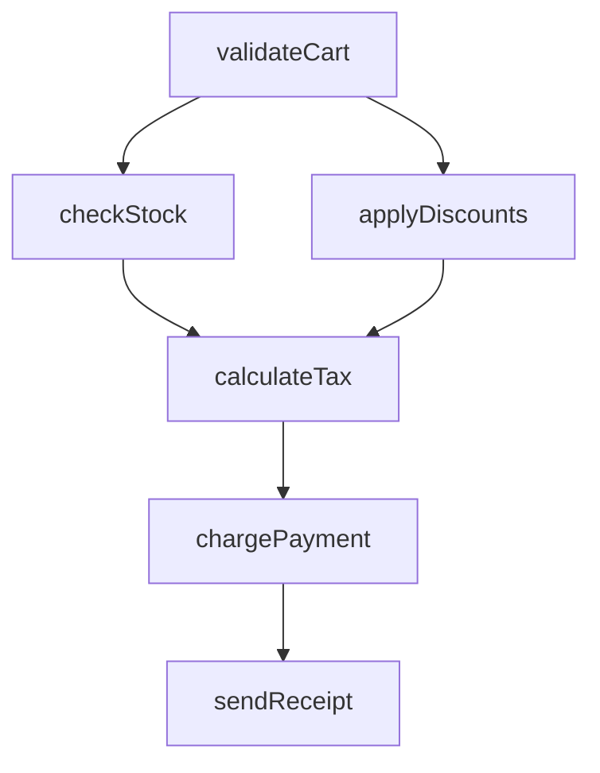

# 🔀 Flow Choreography

<div class="tip custom-block" style="padding: 12px 20px; border-left: 4px solid #f59e0b;">
Define complex multi-step workflows as a <strong>Directed Acyclic Graph (DAG)</strong>. The engine automatically parallelizes, sequences, and handles partial failures.
</div>

<ChoreographyAnimation />

## The Concept

Complex workflows like checkout, onboarding, or data pipelines involve multiple dependent steps. **Choreography** lets you declare the dependency graph and the engine handles the rest.

## Quick Start

```ts
import { choreograph } from "@asyncflowstate/core";

const checkoutFlow = choreograph({
  name: "checkout",
  steps: {
    validateCart: { action: validateCart },
    checkStock: { action: checkStock, dependsOn: ["validateCart"] },
    applyDiscounts: { action: applyDiscounts, dependsOn: ["validateCart"] },
    calculateTax: {
      action: calculateTax,
      dependsOn: ["checkStock", "applyDiscounts"],
    },
    chargePayment: { action: chargePayment, dependsOn: ["calculateTax"] },
    sendReceipt: { action: sendEmail, dependsOn: ["chargePayment"] },
  },
  onStepComplete: (step, result) => updateProgressUI(step),
  rollbackStrategy: "cascade",
});

await checkoutFlow.execute(cartData);
```

## Auto-Parallelization

The engine uses **Kahn's algorithm** (topological sort) to determine execution layers:



Steps in the same layer (e.g., `checkStock` and `applyDiscounts`) run **in parallel**.

## Progress Tracking

```ts
choreography.subscribe((state) => {
  console.log(`Progress: ${state.progress}%`);
  console.log("Step statuses:", state.steps);
  // { validateCart: { status: 'done' }, checkStock: { status: 'running' }, ... }
});
```

## Cascade Rollback

When `rollbackStrategy: 'cascade'` is set and a step fails, the engine walks the DAG backwards and calls compensating actions for all completed steps.

## Mermaid Export

```ts
const diagram = checkoutFlow.toMermaid();
// Outputs a valid Mermaid diagram of the DAG
```

## API Reference

### `choreograph(options)`

| Option             | Type                               | Description                  |
| ------------------ | ---------------------------------- | ---------------------------- |
| `name`             | `string`                           | Name for debugging           |
| `steps`            | `Record<string, ChoreographyStep>` | Step definitions             |
| `onStepComplete`   | `(name, result) => void`           | Per-step completion callback |
| `onStepError`      | `(name, error) => void`            | Per-step error callback      |
| `rollbackStrategy` | `'cascade' \| 'none'`              | What to do on failure        |

### `ChoreographyStep`

| Option      | Type         | Description                              |
| ----------- | ------------ | ---------------------------------------- |
| `action`    | `FlowAction` | The async action to execute              |
| `dependsOn` | `string[]`   | Steps that must complete first           |
| `optional`  | `boolean`    | If true, failure won't stop the pipeline |
| `timeout`   | `number`     | Timeout for this step (ms)               |
