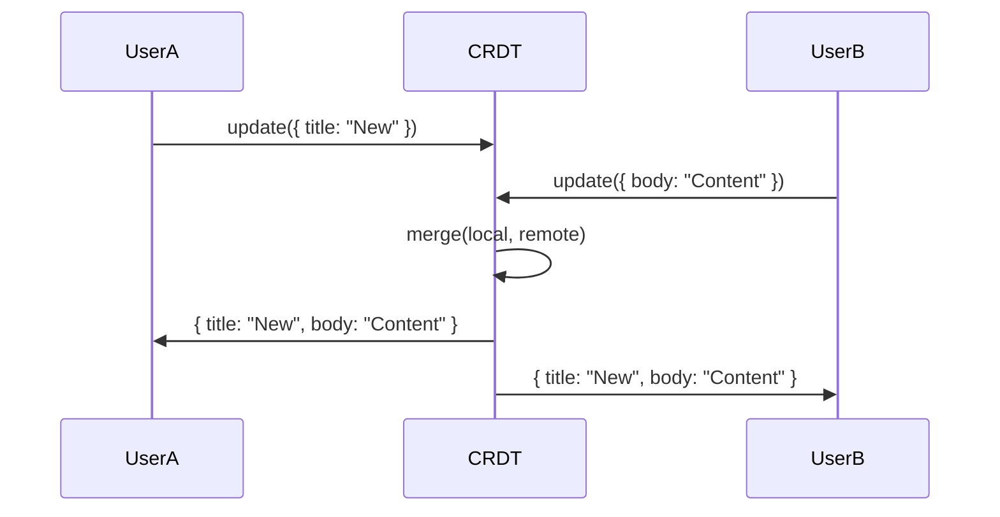

# 🤝 Collaborative Flows

<div class="tip custom-block" style="padding: 12px 20px; border-left: 4px solid #14b8a6;">
For real-time collaborative apps, flows use <strong>CRDT-based conflict resolution</strong> so multiple users can edit the same resource without "your changes were overwritten" errors.
</div>

<CollaborativeAnimation />

## The Concept

When User A edits a title and User B edits a body simultaneously, traditional apps either lose one user's changes or show a conflict dialog. **Collaborative Flows** use Last-Writer-Wins registers and custom merge strategies to resolve conflicts seamlessly.

## Quick Start

```ts
const { data, execute } = useFlow(updateDocument, {
  collaborative: {
    enabled: true,
    strategy: "merge",
    merge: (local, remote) => ({
      ...local,
      ...remote,
      updatedAt: Math.max(local.updatedAt, remote.updatedAt),
    }),
    presence: true,
    channel: "doc-123",
  },
});
```

## Conflict Resolution Strategies

| Strategy           | Behavior                   | Best For              |
| ------------------ | -------------------------- | --------------------- |
| `last-writer-wins` | Latest timestamp wins      | Simple key-value data |
| `merge`            | Deep merge local + remote  | Document editing      |
| `custom`           | Your custom merge function | Complex domain logic  |

## Presence Tracking

Track who is editing what in real-time:

```ts
import { CollaborativeState } from "@asyncflowstate/core";

const collab = new CollaborativeState({
  enabled: true,
  presence: true,
  channel: "doc-123",
});

// Update your presence
collab.updatePresence("user-alice", "title-field");

// Listen for all active editors
collab.onPresenceChange((entries) => {
  entries.forEach((entry) => {
    showCursorFor(entry.userId, entry.field);
  });
});
```

## How It Works



## API Reference

### `CollaborativeState`

```ts
import { CollaborativeState } from "@asyncflowstate/core";

const collab = new CollaborativeState({ enabled: true, channel: "my-doc" });

// Apply a local update (broadcasts to peers)
collab.update({ title: "New Title", body: "Content" });

// Listen for updates (local + remote)
collab.onUpdate((data, source) => {
  console.log(`Update from ${source}:`, data);
});

// Get current resolved value
const value = collab.getValue();

// Cleanup
collab.dispose();
```

### `LWWRegister`

A standalone Last-Writer-Wins register:

```ts
import { LWWRegister } from "@asyncflowstate/core";

const register = new LWWRegister<string>();
register.set("hello", Date.now());
register.set("world", Date.now() + 1); // Wins because timestamp is later
register.get(); // 'world'
```

## Configuration

| Option     | Type                        | Default              | Description                  |
| ---------- | --------------------------- | -------------------- | ---------------------------- |
| `enabled`  | `boolean`                   | `false`              | Enable collaborative mode    |
| `strategy` | `string`                    | `'last-writer-wins'` | Conflict resolution strategy |
| `merge`    | `(local, remote) => merged` | —                    | Custom merge function        |
| `presence` | `boolean`                   | `false`              | Track who is editing         |
| `channel`  | `string`                    | `'af-collab'`        | BroadcastChannel name        |
