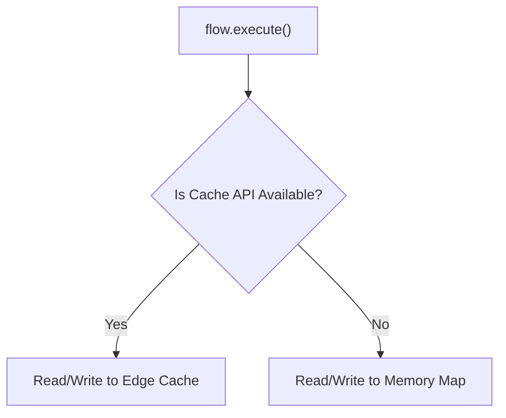

# 🛰️ Edge-First Flows

<div class="tip custom-block" style="padding: 12px 20px; border-left: 4px solid #3b82f6;">
Flows that are aware they might be running on the edge (Cloudflare, Vercel, Deno) and automatically adapt. They use <strong>edge-native caching</strong> and can split execution between edge and client.
</div>

<EdgeAnimation />

## The Concept

Modern frameworks run code both on the edge and in the browser. Traditional async libraries only optimize the browser. **Edge-First Flows** detect the runtime, utilize the Edge Cache API, and allow you to "split" heavy processing to the edge while keeping UI updates on the client.

## Quick Start

```ts
const { data, execute } = useFlow(getPersonalizedFeed, {
  edge: {
    enabled: true,
    runtime: "auto", // Detects Cloudflare, Vercel, Deno, or Browser
    cache: {
      strategy: "stale-while-revalidate",
      ttl: 60, // Edge cache TTL in seconds
    },
    split: {
      // Run heavy pre-processing on the edge
      edge: preprocessFeed,
      // Run light personalization on the client
      client: personalizeFeed,
    },
  },
});
```

## Runtime Detection

The engine automatically detects where the code is executing:

| Runtime      | Detection Logic                              |
| ------------ | -------------------------------------------- |
| `cloudflare` | `globalThis.caches` exists, no `HTMLElement` |
| `vercel`     | `globalThis.EdgeRuntime` exists              |
| `deno`       | `globalThis.Deno` exists                     |
| `browser`    | `window` and `document` exist                |
| `node`       | `process.versions.node` exists               |

## Split Execution

When `split` is configured:

1. **If on Edge:** Only the `edge` function runs. The result is returned to the client.
2. **If on Client:** The `client` function receives the result of the `edge` execution and enriches it before returning the final data to the UI.

This is perfect for Next.js API Routes, Nuxt Server Routes, or Cloudflare Workers.

## Unified Edge Cache

The `EdgeCache` utility provides a single interface that uses the `Cache API` when available (Edge + Browser), and falls back to a memory map when it isn't.



## API Reference

### `EdgeDetector`

```ts
import { EdgeDetector } from "@asyncflowstate/core";

EdgeDetector.detect(); // 'cloudflare', 'browser', etc.
EdgeDetector.isEdge(); // true if Cloudflare, Vercel, or Deno
EdgeDetector.isBrowser(); // true if browser
```

### `EdgeCache`

```ts
import { EdgeCache } from "@asyncflowstate/core";

const cache = new EdgeCache({ ttl: 60, strategy: "stale-while-revalidate" });

await cache.set("my-key", { foo: "bar" });
const data = await cache.get("my-key");
await cache.invalidate("my-key");
await cache.clear();
```

## Configuration

| Option    | Type      | Default  | Description                   |
| --------- | --------- | -------- | ----------------------------- |
| `enabled` | `boolean` | `false`  | Enable edge awareness         |
| `runtime` | `string`  | `'auto'` | Target runtime or auto-detect |
| `cache`   | `Object`  | —        | Edge cache configuration      |
| `split`   | `Object`  | —        | Functions for split execution |
