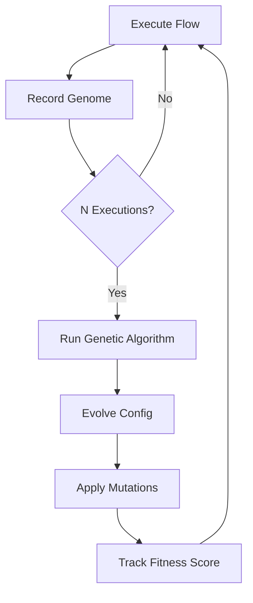

# 🧬 Flow DNA — Genetic Optimization

<div class="tip custom-block" style="padding: 12px 20px; border-left: 4px solid #7c3aed;">
Every flow execution leaves a "DNA fingerprint." Over hundreds of runs, the library <strong>evolves</strong> optimal retry, timeout, and caching configs using a micro genetic algorithm.
</div>

<FlowDnaAnimation />

## The Concept

Traditional async libraries require manual tuning of timeouts, retry counts, and cache durations. **Flow DNA** eliminates this by learning from production traffic.

After N executions, the engine:

- Analyzes P95 latency to suggest optimal **timeouts**
- Tracks success rates to evolve **retry counts**
- Monitors cache hit rates to tune **stale times**
- Adjusts **debounce** based on call frequency

## Quick Start

```ts
import { useFlow } from "@asyncflowstate/react";

const { data, execute } = useFlow(fetchUser, {
  evolution: {
    enabled: true,
    generations: 50, // Begin optimizing after 50 executions
    mutationRate: 0.1, // How aggressively to tweak params
    fitness: "latency", // Optimize for: 'latency' | 'reliability' | 'bandwidth'
  },
});
```

## How It Works



### Execution Genome

Each execution captures a performance fingerprint:

| Field         | Description                        |
| ------------- | ---------------------------------- |
| `latency`     | Total execution time in ms         |
| `retries`     | Number of retry attempts used      |
| `cacheHit`    | Whether the result came from cache |
| `success`     | Whether execution succeeded        |
| `payloadSize` | Response payload size in bytes     |

### Fitness Functions

| Mode          | Optimizes For          | Best When             |
| ------------- | ---------------------- | --------------------- |
| `latency`     | Fastest response times | User-facing API calls |
| `reliability` | Highest success rate   | Critical mutations    |
| `bandwidth`   | Smallest payloads      | Mobile-first apps     |

## Evolved Configuration

After enough generations, the engine suggests:

```ts
// The flow automatically adjusts:
// - timeout: 5000 → 3200ms (learned from P95 latency)
// - retry.maxAttempts: 3 → 2 (server recovers fast)
// - staleTime: 30000 → 45000ms (data rarely changes)
// - debounce: undefined → 150ms (rapid-fire calls detected)
```

## API Reference

### `FlowDNA`

```ts
import { FlowDNA } from "@asyncflowstate/core";

const dna = new FlowDNA("user-fetch", { enabled: true });

// Record execution telemetry
dna.record({
  latency: 230,
  retries: 0,
  cacheHit: false,
  success: true,
  payloadSize: 1024,
});

// Get evolved suggestions
const evolved = dna.getEvolved();
// { suggestedTimeout: 350, suggestedMaxRetries: 2, fitnessScore: 0.92, ... }
```

## Persistence

DNA telemetry is stored in `localStorage` with the key prefix `af_dna_`. It persists across sessions so flows continue evolving even after page refreshes.
