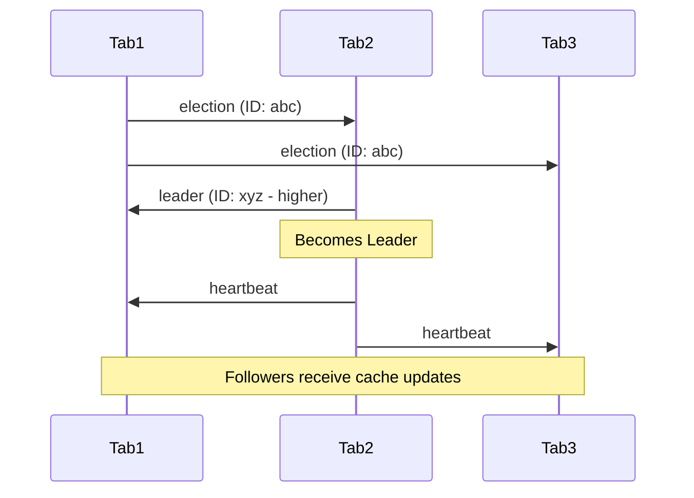

# 🕸️ Flow Mesh

<div class="tip custom-block" style="padding: 12px 20px; border-left: 4px solid #f97316;">
Flows across multiple browser tabs form a <strong>mesh network</strong>. They share cache, coordinate execution via leader election, and prevent duplicate API calls.
</div>

<MeshAnimation />

## The Concept

When a user has 20 tabs open, each tab making identical API calls is wasteful. **Flow Mesh** coordinates across tabs so that one tab fetches and all others receive the result instantly.

## Quick Start

```ts
const { data, execute } = useFlow(fetchDashboard, {
  mesh: {
    channel: "dashboard-mesh",
    strategy: "leader-follower",
    shareCache: true,
    shareErrors: true,
    heartbeat: 5000,
  },
});

// Tab 1: flow.execute() → fetches from server
// Tab 2: flow.execute() → gets Tab 1's cached result instantly
// Tab 1 closes → Tab 2 auto-promotes to leader
```

## Leader Election

The mesh uses a **Bully Algorithm** via `BroadcastChannel`:



## Shared Cache

When the leader tab fetches data successfully, it broadcasts the result to all followers. Followers can use this cached data without making their own API call.

## Error Propagation

Errors are shared across the mesh to prevent "retry storms" — if the server is down, all tabs learn simultaneously instead of each one retrying independently.

## API Reference

### `FlowMesh`

```ts
import { FlowMesh } from "@asyncflowstate/core";

const mesh = new FlowMesh({
  channel: "my-mesh",
  strategy: "leader-follower",
});

// Check if this tab is the leader
mesh.leader; // true | false

// Share a result across tabs
mesh.shareResult("user-123", { name: "John" });

// Check for cached results
const cached = mesh.getCached("user-123");

// Listen for updates
mesh.onCacheUpdate("user-123", (data) => {
  console.log("Received from another tab:", data);
});

// Cleanup
mesh.dispose();
```

## Configuration

| Option        | Type      | Default             | Description                    |
| ------------- | --------- | ------------------- | ------------------------------ |
| `channel`     | `string`  | —                   | BroadcastChannel name          |
| `strategy`    | `string`  | `'leader-follower'` | Coordination mode              |
| `shareCache`  | `boolean` | `true`              | Share results across tabs      |
| `shareErrors` | `boolean` | `true`              | Propagate errors               |
| `heartbeat`   | `number`  | `5000`              | Leader heartbeat interval (ms) |
