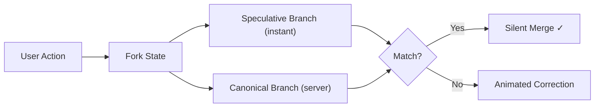

# 🪞 Speculative Execution

<div class="tip custom-block" style="padding: 12px 20px; border-left: 4px solid #06b6d4;">
Like CPU branch prediction, but for UI. Execute both the <strong>optimistic</strong> and <strong>real</strong> paths simultaneously. If the server disagrees, perform a smooth animated correction.
</div>

<SpeculativeAnimation />

## The Concept

Traditional optimistic updates show instant results, then **jarringly** rollback if the server disagrees. **Speculative Execution** runs both paths in parallel and applies a smooth morphing animation when corrections are needed.

## Quick Start

```ts
const { data, execute } = useFlow(updateProfile, {
  speculative: {
    enabled: true,
    optimisticBranch: (args) => ({
      ...currentProfile,
      ...args[0],
    }),
    correctionAnimation: "morph",
    correctionDuration: 300,
  },
});
```

## How It Works



1. **Fork:** On execution, state splits into speculative (instant) and canonical (server) branches
2. **Render:** The speculative branch renders immediately
3. **Compare:** When the server responds, a deep-diff is performed
4. **Resolve:** If identical → silent merge. If different → smooth CSS animation from speculative → canonical

## Animation Modes

| Mode    | Effect                                             |
| ------- | -------------------------------------------------- |
| `morph` | CSS transform-based smooth morphing                |
| `fade`  | Fade out old → fade in new                         |
| `slide` | Slide old content out, new content in              |
| `none`  | Instant replacement (same as traditional rollback) |

## Accuracy Tracking

The engine tracks speculation accuracy over time. If a flow consistently speculates correctly (>95%), the correction animation overhead is automatically removed.

## Configuration

| Option                | Type                 | Default   | Description                    |
| --------------------- | -------------------- | --------- | ------------------------------ |
| `enabled`             | `boolean`            | `false`   | Enable speculative execution   |
| `optimisticBranch`    | `(...args) => TData` | —         | Compute the speculative result |
| `correctionAnimation` | `string`             | `'morph'` | Animation type for corrections |
| `correctionDuration`  | `number`             | `300`     | Animation duration in ms       |
