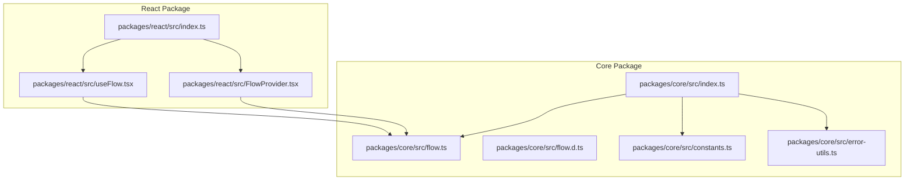
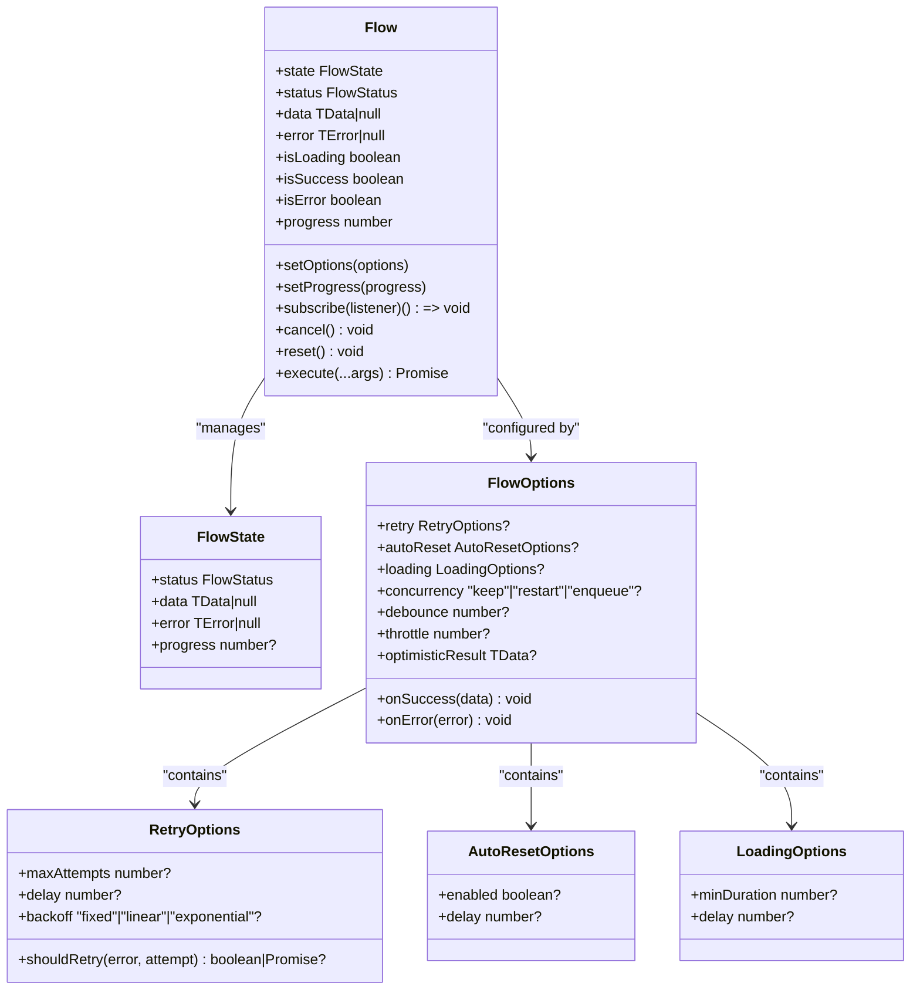
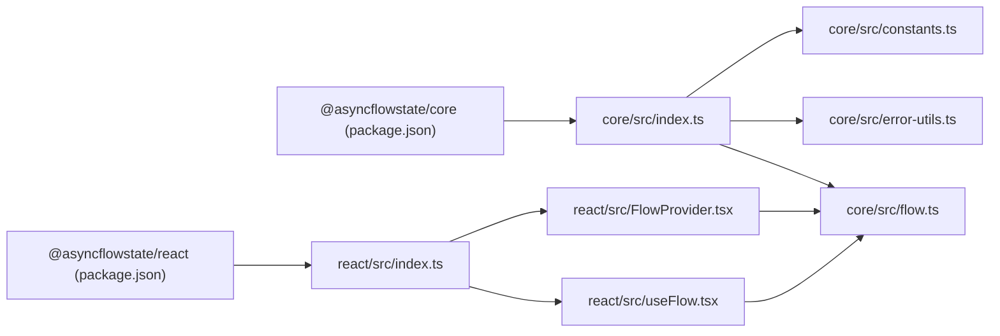

# API Reference

<cite>
**Referenced Files in This Document**
- [flow.ts](file://packages/core/src/flow.ts)
- [flow.d.ts](file://packages/core/src/flow.d.ts)
- [index.ts](file://packages/core/src/index.ts)
- [constants.ts](file://packages/core/src/constants.ts)
- [error-utils.ts](file://packages/core/src/error-utils.ts)
- [useFlow.tsx](file://packages/react/src/useFlow.tsx)
- [FlowProvider.tsx](file://packages/react/src/FlowProvider.tsx)
- [index.ts](file://packages/react/src/index.ts)
- [flow.test.ts](file://packages/core/src/flow.test.ts)
- [useFlow.test.tsx](file://packages/react/src/useFlow.test.tsx)
- [FlowProvider.test.tsx](file://packages/react/src/FlowProvider.test.tsx)
- [react-examples.tsx](file://examples/react/react-examples.tsx)
- [flow-provider-examples.tsx](file://examples/react/flow-provider-examples.tsx)
- [package.json (core)](file://packages/core/package.json)
- [package.json (react)](file://packages/react/package.json)
</cite>

## Table of Contents

1. [Introduction](#introduction)
2. [Project Structure](#project-structure)
3. [Core Components](#core-components)
4. [Architecture Overview](#architecture-overview)
5. [Detailed Component Analysis](#detailed-component-analysis)
6. [Dependency Analysis](#dependency-analysis)
7. [Performance Considerations](#performance-considerations)
8. [Troubleshooting Guide](#troubleshooting-guide)
9. [Conclusion](#conclusion)
10. [Appendices](#appendices)

## Introduction

This document provides a comprehensive API reference for AsyncFlowState, focusing on the Flow class and React integration. It covers the Flow class constructor, methods, properties, generics, and return types; the useFlow hook parameters, return value types, and helper functions; and FlowProvider configuration options and context behavior. It also documents error handling interfaces, state type definitions, and configuration option schemas, with usage guidance and examples.

## Project Structure

AsyncFlowState is organized into two packages:

- Core package (@asyncflowstate/core): Provides the Flow class and related types, constants, and error utilities.
- React package (@asyncflowstate/react): Provides React hooks and helpers built on top of the core Flow engine.

**Diagram sources**

- [index.ts](file://packages/core/src/index.ts#L1-L4)
- [flow.ts](file://packages/core/src/flow.ts#L1-L709)
- [flow.d.ts](file://packages/core/src/flow.d.ts#L1-L177)
- [constants.ts](file://packages/core/src/constants.ts#L1-L51)
- [error-utils.ts](file://packages/core/src/error-utils.ts#L1-L207)
- [index.ts](file://packages/react/src/index.ts#L1-L3)
- [useFlow.tsx](file://packages/react/src/useFlow.tsx#L1-L281)
- [FlowProvider.tsx](file://packages/react/src/FlowProvider.tsx#L1-L139)

**Section sources**

- [package.json (core)](file://packages/core/package.json#L1-L55)
- [package.json (react)](file://packages/react/package.json#L1-L67)

## Core Components

This section documents the core Flow class and supporting types.

- Flow class
  - Purpose: Orchestrates asynchronous actions and manages UI states (idle, loading, success, error), retries, concurrency, optimistic updates, and UX controls.
  - Generics:
    - TData: Type of data returned on success.
    - TError: Type of error object on failure.
    - TArgs: Tuple type of arguments passed to the action.
  - Constructor parameters:
    - action: Asynchronous function to manage.
    - options: FlowOptions<TData, TError>.
  - Key methods and properties:
    - setOptions(options): Updates runtime options.
    - state/status/data/error/getters: Snapshot and derived booleans isLoading, isSuccess, isError, progress.
    - setProgress(progress): Manually set progress during loading.
    - subscribe(listener): Subscribe to state changes; returns an unsubscribe function.
    - cancel(): Cancel current execution and reset to idle.
    - reset(): Reset state to idle.
    - execute(...args): Execute the action with debouncing/throttling/concurrency handling; returns Promise resolving to TData | undefined.
  - Configuration options (FlowOptions):
    - onSuccess(data: TData): Callback invoked on success.
    - onError(error: TError): Callback invoked on terminal error.
    - retry: RetryOptions
      - maxAttempts?: number
      - delay?: number
      - backoff?: "fixed" | "linear" | "exponential"
      - shouldRetry?: (error, attempt) => boolean | Promise<boolean>
    - autoReset: AutoResetOptions
      - enabled?: boolean
      - delay?: number
    - loading: LoadingOptions
      - minDuration?: number
      - delay?: number
    - concurrency?: "keep" | "restart" | "enqueue"
    - debounce?: number
    - throttle?: number
    - optimisticResult?: TData
  - State type (FlowState<TData, TError>):
    - status: "idle" | "loading" | "success" | "error"
    - data: TData | null
    - error: TError | null
    - progress?: number
  - Error handling:
    - FlowErrorType: Enumerated categories for errors.
    - FlowError<TError>: Enhanced error with type, message, originalError, isRetryable.
    - Utility functions: createFlowError, detectErrorType, isErrorRetryable, getErrorMessage, isFlowError.

**Section sources**

- [flow.ts](file://packages/core/src/flow.ts#L174-L709)
- [flow.d.ts](file://packages/core/src/flow.d.ts#L84-L177)
- [constants.ts](file://packages/core/src/constants.ts#L10-L51)
- [error-utils.ts](file://packages/core/src/error-utils.ts#L26-L207)

## Architecture Overview

The Flow engine is framework-agnostic and powers React integration via useFlow. FlowProvider supplies global defaults that useFlow merges with local options.

**Diagram sources**

- [flow.ts](file://packages/core/src/flow.ts#L174-L709)
- [flow.d.ts](file://packages/core/src/flow.d.ts#L84-L177)

## Detailed Component Analysis

### Flow Class API

- Constructor
  - Parameters:
    - action: FlowAction<TData, TArgs>
    - options?: FlowOptions<TData, TError>
  - Behavior: Initializes internal state, timers, and listeners; stores action and options.
- setOptions(options)
  - Description: Merges new options into existing configuration.
  - Return: void
- Getters
  - state: Shallow copy of internal FlowState.
  - status, data, error: Accessors returning current values.
  - isLoading: True when status is loading and not delaying.
  - isSuccess, isError: Boolean helpers.
  - progress: Current progress percentage.
- setProgress(progress)
  - Description: Sets progress during loading; clamped to [0, 100].
  - Return: void
- subscribe(listener)
  - Description: Registers a listener for state changes; returns an unsubscribe function.
  - Return: () => void
- cancel()
  - Description: Clears timers, aborts current execution if present, resets to idle.
  - Return: void
- reset()
  - Description: Resets state to idle with initial progress.
  - Return: void
- execute(...args)
  - Description: Orchestrates execution with optional debounce, throttle, and concurrency handling; returns Promise resolving to TData | undefined.
  - Return: Promise<TData | undefined>
- Internal execution and helpers
  - internalExecute(args): Core execution with concurrency strategies.
  - runAction(args, signal): Executes action with retry/backoff logic and UX minDuration.
  - handleDebounce(args, delay) and handleThrottle(args, delay): Debounce/throttle scheduling.
  - processEnqueuedTasks(): Executes queued tasks when safe.
  - evaluateRetry(error, attempt) and delayRetry(attempt): Retry policy and backoff.
  - waitMinDuration(): Ensures minimum loading duration.
  - scheduleAutoReset(): Schedules auto-reset after success.
  - setState(updates) and notify(): State mutation and listener notification.
  - finalizeLoading(), clearTimer(key), clearAllTimers(): Lifecycle cleanup.

Usage examples (descriptive):

- Basic usage: Instantiate Flow with an async action and subscribe to state changes; call execute with arguments.
- Retry configuration: Configure maxAttempts, delay, and backoff; optionally provide shouldRetry predicate.
- Optimistic UI: Provide optimisticResult to immediately reflect UI updates; real data replaces optimistic data upon success.

**Section sources**

- [flow.ts](file://packages/core/src/flow.ts#L220-L709)
- [flow.test.ts](file://packages/core/src/flow.test.ts#L1-L363)

### Flow Provider and useFlow Hook

#### FlowProvider

- Props
  - config?: FlowProviderConfig<TData, TError>
    - overrideMode?: "merge" | "replace"
    - Other FlowOptions fields inherited.
  - children: ReactNode
- Behavior
  - Provides global defaults via React Context.
  - mergeFlowOptions(globalConfig, localOptions) merges or replaces options depending on overrideMode.
- Context
  - useFlowContext(): Access global config or null.

Key behaviors validated by tests:

- Merging nested options (retry, autoReset, loading) while preserving precedence.
- Override mode behavior when local options are provided.
- Nested providers with different configurations.

**Section sources**

- [FlowProvider.tsx](file://packages/react/src/FlowProvider.tsx#L1-L139)
- [FlowProvider.test.tsx](file://packages/react/src/FlowProvider.test.tsx#L1-L184)

#### useFlow Hook

- Parameters
  - action: FlowAction<TData, TArgs>
  - options: ReactFlowOptions<TData, TError> = {}
    - Extends FlowOptions<TData, TError>
    - a11y?: A11yOptions<TData, TError>
- Return value (memoized object)
  - Snapshot fields: status, data, error, progress, loading (derived), success/error booleans, cancel, reset, setProgress, execute, button, form, errorRef, fieldErrors, LiveRegion.
- Helpers
  - button(props: ButtonHelperOptions): Returns props including disabled and aria-busy; if no onClick, clicking triggers execute with no args.
  - form(formProps): Returns props including aria-busy and onSubmit handling; supports extractFormData and validation; resets form on success when configured.
  - LiveRegion: ARIA live region component for announcements.
- Accessibility
  - Auto-focuses error element when error appears.
  - Announces success/error via LiveRegion based on a11y options.
- Integration
  - Persists action/options via refs to avoid recreating Flow unnecessarily.
  - Subscribes to Flow state and maintains a local snapshot.
  - Synchronizes options with Flow.setOptions on changes.

Usage examples (descriptive):

- Login form: Use execute with credentials; display status and error; use button() helper for submit.
- Optimistic UI: Provide optimisticResult for immediate UI feedback; real data replaces optimistic data on success.
- Form with validation: Use form() helper with extractFormData and validate; display fieldErrors; reset on success.
- Accessibility: Provide announceSuccess/announceError; include LiveRegion in the tree.

**Section sources**

- [useFlow.tsx](file://packages/react/src/useFlow.tsx#L77-L281)
- [useFlow.test.tsx](file://packages/react/src/useFlow.test.tsx#L1-L142)
- [react-examples.tsx](file://examples/react/react-examples.tsx#L1-L491)
- [flow-provider-examples.tsx](file://examples/react/flow-provider-examples.tsx#L1-L368)

### Error Handling Interfaces and Utilities

- FlowErrorType: Enumerated categories for error classification.
- FlowError<TError>: Enhanced error with type, message, originalError, isRetryable.
- Utility functions:
  - createFlowError(error, options?): Wraps any error with automatic type detection and default messaging.
  - detectErrorType(error): Heuristically detects error type from error object/message.
  - isErrorRetryable(errorType): Indicates if an error type is typically retryable.
  - getErrorMessage(error): Extracts a human-readable message from any error-like object.
  - isFlowError(error): Type guard to check if an error is a FlowError.

**Section sources**

- [error-utils.ts](file://packages/core/src/error-utils.ts#L26-L207)
- [flow.ts](file://packages/core/src/flow.ts#L32-L53)

### Configuration Option Schemas

- FlowOptions<TData, TError>
  - onSuccess?: (data: TData) => void
  - onError?: (error: TError) => void
  - retry?: RetryOptions
  - autoReset?: AutoResetOptions
  - loading?: LoadingOptions
  - concurrency?: "keep" | "restart" | "enqueue"
  - debounce?: number
  - throttle?: number
  - optimisticResult?: TData
- RetryOptions
  - maxAttempts?: number
  - delay?: number
  - backoff?: "fixed" | "linear" | "exponential"
  - shouldRetry?: (error, attempt) => boolean | Promise<boolean>
- AutoResetOptions
  - enabled?: boolean
  - delay?: number
- LoadingOptions
  - minDuration?: number
  - delay?: number
- FlowProviderConfig<TData, TError>
  - overrideMode?: "merge" | "replace"
  - Inherits FlowOptions fields

**Section sources**

- [flow.ts](file://packages/core/src/flow.ts#L99-L127)
- [FlowProvider.tsx](file://packages/react/src/FlowProvider.tsx#L7-L17)

## Dependency Analysis

- Core package exports:
  - Re-exports Flow, constants, and error utilities from index.
- React package dependencies:
  - Imports Flow, FlowAction, FlowOptions, FlowState from @asyncflowstate/core.
  - Uses FlowProvider context and mergeFlowOptions.
- Build and peer dependencies:
  - Core: Node >= 16; no side effects.
  - React: Peer dependencies on React and React DOM; depends on @asyncflowstate/core.

**Diagram sources**

- [package.json (core)](file://packages/core/package.json#L24-L38)
- [package.json (react)](file://packages/react/package.json#L24-L38)
- [index.ts](file://packages/core/src/index.ts#L1-L4)
- [flow.ts](file://packages/core/src/flow.ts#L1-L709)
- [error-utils.ts](file://packages/core/src/error-utils.ts#L1-L207)
- [constants.ts](file://packages/core/src/constants.ts#L1-L51)
- [index.ts](file://packages/react/src/index.ts#L1-L3)
- [useFlow.tsx](file://packages/react/src/useFlow.tsx#L1-L281)
- [FlowProvider.tsx](file://packages/react/src/FlowProvider.tsx#L1-L139)

**Section sources**

- [package.json (core)](file://packages/core/package.json#L1-L55)
- [package.json (react)](file://packages/react/package.json#L1-L67)

## Performance Considerations

- Debounce and throttle:
  - Debounce delays execution until after a quiet period; throttle limits execution frequency.
- Minimum loading duration and loading delay:
  - minDuration ensures loading persists for a minimum time to prevent UI flicker.
  - delay prevents showing loading state for very fast operations.
- Backoff strategies:
  - fixed, linear, exponential retry delays reduce server load and improve resilience.
- Concurrency control:
  - keep: Ignores concurrent executions.
  - restart: Cancels current execution and starts a new one.
  - enqueue: Queues subsequent executions to run after the current completes.

**Section sources**

- [flow.ts](file://packages/core/src/flow.ts#L400-L585)
- [flow.ts](file://packages/core/src/flow.ts#L625-L656)
- [flow.ts](file://packages/core/src/flow.ts#L425-L473)
- [flow.test.ts](file://packages/core/src/flow.test.ts#L292-L361)

## Troubleshooting Guide

- Flow does not transition to success:
  - Verify action resolves successfully; check retry configuration and shouldRetry predicate.
  - Ensure minDuration and delay are not preventing UI updates.
- Double submissions:
  - Adjust concurrency strategy: keep, restart, or enqueue.
- Unexpected idle state after cancel:
  - cancel() resets to idle; confirm that the action result is ignored as designed.
- Auto-reset not occurring:
  - Confirm autoReset.enabled and delay are set appropriately.
- Error handling:
  - Use createFlowError and detectErrorType to normalize and categorize errors.
  - Implement isErrorRetryable to guide retry decisions.

**Section sources**

- [flow.test.ts](file://packages/core/src/flow.test.ts#L164-L241)
- [error-utils.ts](file://packages/core/src/error-utils.ts#L26-L207)

## Conclusion

AsyncFlowState provides a robust, framework-agnostic engine for managing asynchronous UI states with rich controls for retries, concurrency, optimistic updates, and UX polish. The React integration via useFlow and FlowProvider simplifies adoption and enables consistent global configuration across an application.

## Appendices

### API Summary Tables

- Flow constructor and methods
  - Constructor: new Flow(action, options?)
  - Methods: setOptions, subscribe, cancel, reset, execute
  - Getters: state, status, data, error, isLoading, isSuccess, isError, progress
  - Utilities: setProgress

- useFlow hook parameters and return
  - Parameters: action, options (ReactFlowOptions)
  - Return: Object with state snapshot, derived loading flag, lifecycle methods, helpers, and accessibility features

- FlowProvider configuration
  - Props: config (FlowProviderConfig), children
  - Behavior: Provides global defaults; mergeFlowOptions merges or replaces options

**Section sources**

- [flow.ts](file://packages/core/src/flow.ts#L220-L709)
- [useFlow.tsx](file://packages/react/src/useFlow.tsx#L77-L281)
- [FlowProvider.tsx](file://packages/react/src/FlowProvider.tsx#L50-L139)
