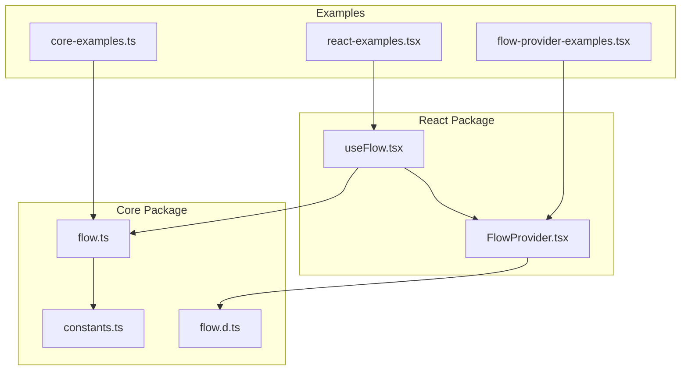
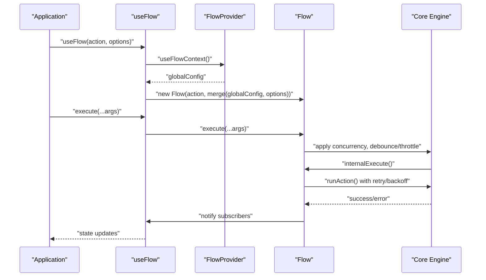
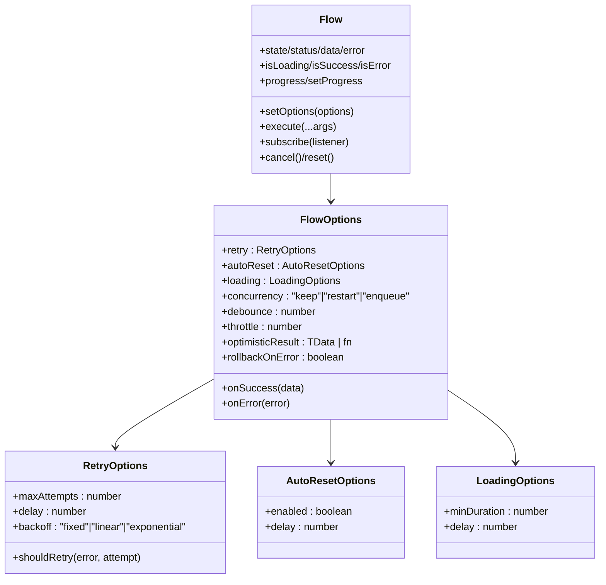
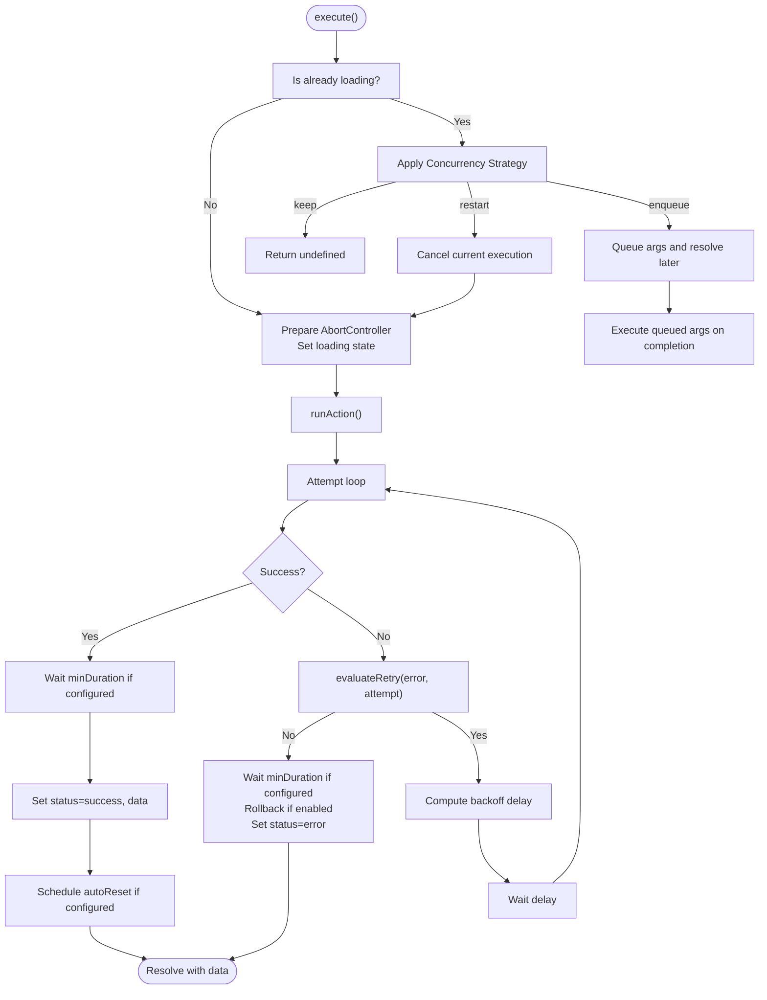
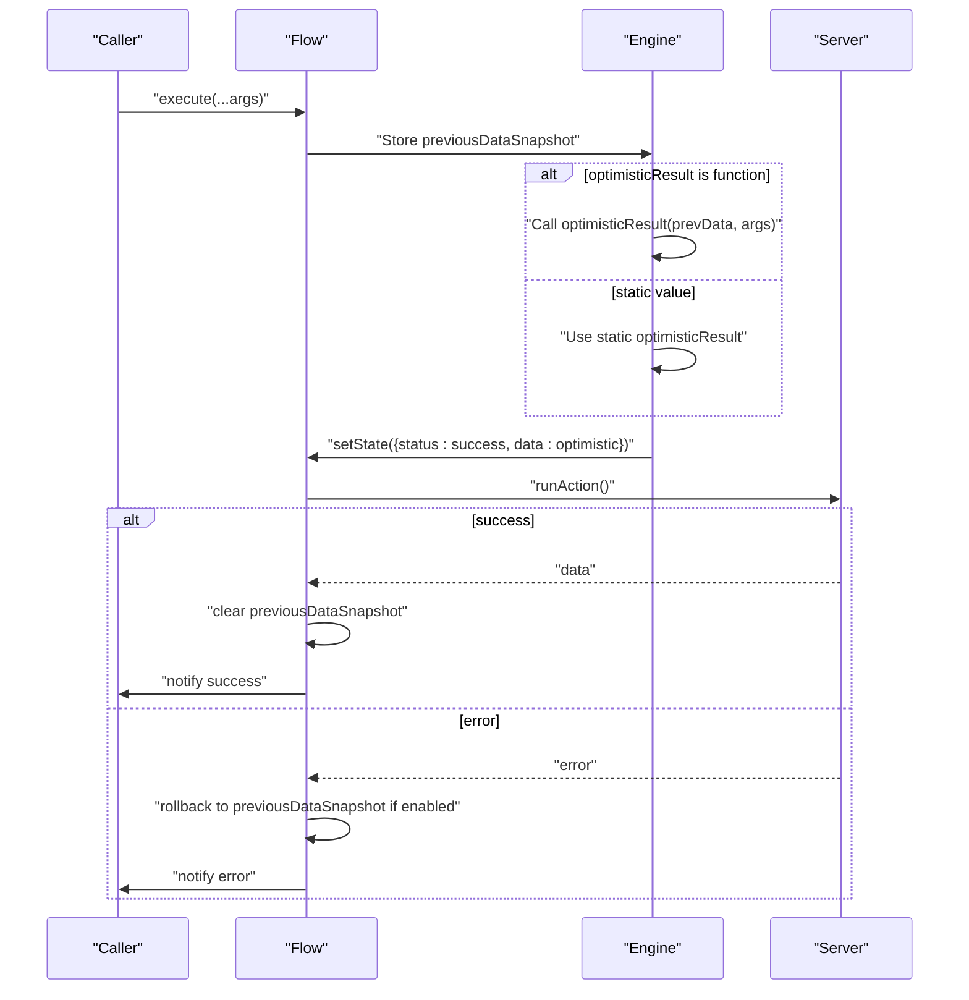
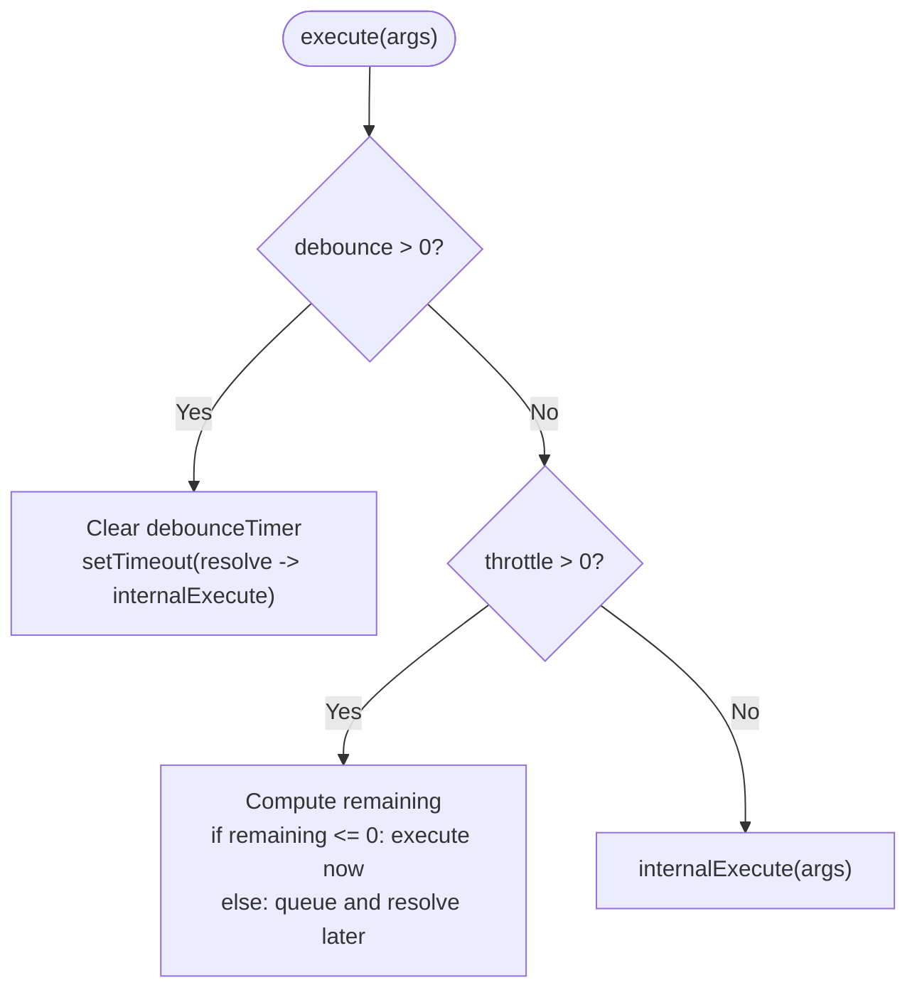
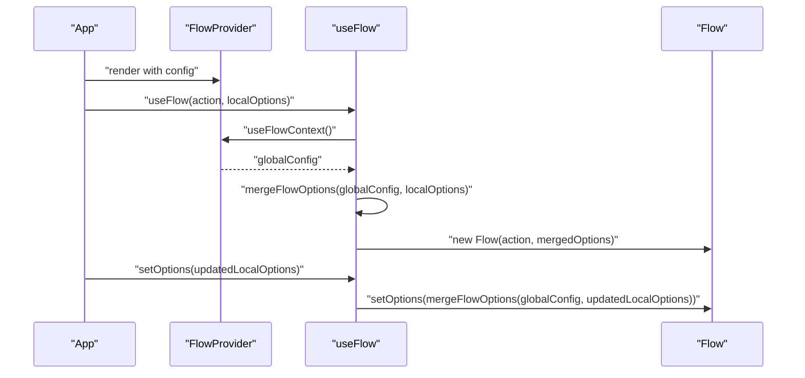
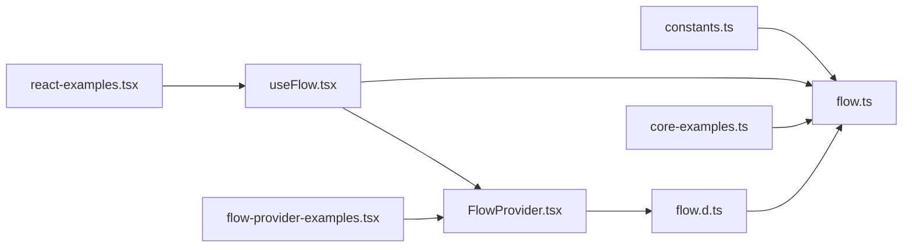

# Configuration Options

<cite>
**Referenced Files in This Document**
- [flow.d.ts](file://packages/core/src/flow.d.ts)
- [flow.ts](file://packages/core/src/flow.ts)
- [constants.ts](file://packages/core/src/constants.ts)
- [FlowProvider.tsx](file://packages/react/src/FlowProvider.tsx)
- [useFlow.tsx](file://packages/react/src/useFlow.tsx)
- [core-examples.ts](file://examples/basic/core-examples.ts)
- [react-examples.tsx](file://examples/react/react-examples.tsx)
- [flow-provider-examples.tsx](file://examples/react/flow-provider-examples.tsx)
- [flow.test.ts](file://packages/core/src/flow.test.ts)
</cite>

## Table of Contents

1. [Introduction](#introduction)
2. [Project Structure](#project-structure)
3. [Core Components](#core-components)
4. [Architecture Overview](#architecture-overview)
5. [Detailed Component Analysis](#detailed-component-analysis)
6. [Dependency Analysis](#dependency-analysis)
7. [Performance Considerations](#performance-considerations)
8. [Troubleshooting Guide](#troubleshooting-guide)
9. [Conclusion](#conclusion)
10. [Appendices](#appendices)

## Introduction

This document provides comprehensive documentation for the FlowOptions interface and all configuration parameters exposed by the Flow class. It explains callback handlers (onSuccess and onError), retry configuration, autoReset options, loading UX controls, concurrency strategies, debouncing/throttling settings, optimisticResult feature and its implications, and dynamic option updates via setOptions(). It also covers default values, validation rules, and best practices, with practical examples drawn from the repository’s examples and tests.

## Project Structure

The configuration surface is defined in the core package and consumed by the React integration. Global configuration can be centralized using FlowProvider, which merges global and local options.

**Diagram sources**

- [flow.ts](file://packages/core/src/flow.ts#L1-L796)
- [flow.d.ts](file://packages/core/src/flow.d.ts#L1-L177)
- [constants.ts](file://packages/core/src/constants.ts#L1-L51)
- [useFlow.tsx](file://packages/react/src/useFlow.tsx#L1-L281)
- [FlowProvider.tsx](file://packages/react/src/FlowProvider.tsx#L1-L139)
- [core-examples.ts](file://examples/basic/core-examples.ts#L1-L221)
- [react-examples.tsx](file://examples/react/react-examples.tsx#L1-L491)
- [flow-provider-examples.tsx](file://examples/react/flow-provider-examples.tsx#L1-L368)

**Section sources**

- [flow.ts](file://packages/core/src/flow.ts#L1-L796)
- [flow.d.ts](file://packages/core/src/flow.d.ts#L1-L177)
- [constants.ts](file://packages/core/src/constants.ts#L1-L51)
- [useFlow.tsx](file://packages/react/src/useFlow.tsx#L1-L281)
- [FlowProvider.tsx](file://packages/react/src/FlowProvider.tsx#L1-L139)
- [core-examples.ts](file://examples/basic/core-examples.ts#L1-L221)
- [react-examples.tsx](file://examples/react/react-examples.tsx#L1-L491)
- [flow-provider-examples.tsx](file://examples/react/flow-provider-examples.tsx#L1-L368)

## Core Components

- FlowOptions: The primary configuration interface for Flow instances, including callbacks, retry, autoReset, loading UX, concurrency, debouncing/throttling, optimisticResult, and rollback behavior.
- RetryOptions: Controls retry attempts, delay, backoff strategy, and custom retry decision.
- AutoResetOptions: Controls automatic reset to idle after success.
- LoadingOptions: Controls perceived performance of loading UX.
- Flow class: Implements all configuration behaviors, including execution, retries, optimistic updates, concurrency, debouncing/throttling, and UX timers.

Key defaults are defined in constants and applied when options are missing.

**Section sources**

- [flow.d.ts](file://packages/core/src/flow.d.ts#L58-L177)
- [flow.ts](file://packages/core/src/flow.ts#L96-L160)
- [constants.ts](file://packages/core/src/constants.ts#L6-L51)

## Architecture Overview

The Flow class orchestrates asynchronous actions and UI states. It applies configuration to:

- Retry logic with configurable backoff and custom decision hooks
- Loading UX with minDuration and delay
- Concurrency control (keep, restart, enqueue)
- Debouncing and throttling
- Optimistic updates with optional rollback
- Auto-reset after success

React integration exposes these capabilities via useFlow and centralizes global defaults via FlowProvider.

**Diagram sources**

- [useFlow.tsx](file://packages/react/src/useFlow.tsx#L77-L115)
- [FlowProvider.tsx](file://packages/react/src/FlowProvider.tsx#L50-L138)
- [flow.ts](file://packages/core/src/flow.ts#L449-L544)

## Detailed Component Analysis

### FlowOptions Interface

FlowOptions defines the complete configuration surface for Flow. Below are the documented fields and behaviors.

- onSuccess(data): Called on successful terminal execution. Receives the final data.
- onError(error): Called on terminal error after retries. Receives the error object.
- retry: RetryOptions
  - maxAttempts: Number of attempts (default: 1, meaning no retry)
  - delay: Milliseconds between retries (default: 1000)
  - backoff: "fixed" | "linear" | "exponential" (default: "fixed")
  - shouldRetry(error, attempt): Optional predicate to decide whether to retry a specific error on a given attempt
- autoReset: AutoResetOptions
  - enabled: Boolean to enable auto-reset (default: true if delay is provided)
  - delay: Milliseconds to wait after success before resetting to idle
- loading: LoadingOptions
  - minDuration: Minimum time in ms to stay in loading state (default: 0)
  - delay: Delay in ms before switching to loading status (default: 0)
- concurrency: "keep" | "restart" | "enqueue" (default: "keep")
- debounce: number (milliseconds) to debounce execute() calls
- throttle: number (milliseconds) to throttle execute() calls
- optimisticResult: Static value or function(prevData, args) -> TData to immediately set success state
- rollbackOnError: Boolean to control whether optimistic updates are rolled back on error (default: true)
- dna: FlowDNAOptions for genetic auto-tuning
- ambient: AmbientOptions for environmental intelligence (battery, network, etc.)
- mesh: FlowMeshOptions for cross-tab distributed cache
- autoThrottle: Stress monitoring (rage-click detection)
- ghost: GhostOptions for background task queuing
- purgatory: PurgatoryOptions for enforced undo periods
- edge: EdgeOptions for runtime-aware (Cloudflare/Vercel) execution

Defaults are applied from constants when not provided.

**Section sources**

- [flow.d.ts](file://packages/core/src/flow.d.ts#L58-L177)
- [flow.ts](file://packages/core/src/flow.ts#L96-L160)
- [constants.ts](file://packages/core/src/constants.ts#L6-L51)

### Retry Configuration

- maxAttempts: Defaults to 1 (no retry) if not specified.
- delay: Defaults to 1000 ms if not specified.
- backoff: Defaults to "fixed". Supported strategies:
  - fixed: constant delay
  - linear: delay × attempt × multiplier
  - exponential: delay × base^(attempt - 1)
- shouldRetry: Optional function(error, attempt) returning boolean or Promise<boolean> to decide per-attempt retry decisions.

Behavioral notes:

- Retries are governed by evaluateRetry and delayRetry.
- Aborted executions short-circuit retry loops.
- Backoff multipliers are defined in constants.

**Section sources**

- [flow.ts](file://packages/core/src/flow.ts#L683-L725)
- [constants.ts](file://packages/core/src/constants.ts#L47-L50)
- [flow.test.ts](file://packages/core/src/flow.test.ts#L397-L435)

### AutoReset Options

- enabled: Defaults to true when delay is provided.
- delay: Milliseconds to wait after success before resetting to idle.
- Scheduling and clearing are handled by scheduleAutoReset and finalizeLoading.

**Section sources**

- [flow.ts](file://packages/core/src/flow.ts#L745-L755)
- [flow.ts](file://packages/core/src/flow.ts#L768-L772)

### Loading UX Controls

- minDuration: Ensures loading persists for at least this duration to prevent UI flashes.
- delay: Prevents immediate loading state appearance for very fast actions.
- Internal timers enforce minDuration and delay; isLoading respects delay so it remains false until delay elapses.

**Section sources**

- [flow.ts](file://packages/core/src/flow.ts#L729-L743)
- [flow.ts](file://packages/core/src/flow.ts#L532-L541)
- [flow.test.ts](file://packages/core/src/flow.test.ts#L446-L488)

### Concurrency Strategies

- keep: Ignore new execute() calls while already loading.
- restart: Cancel the current execution and start a new one.
- enqueue: Queue subsequent calls and execute them after the current completes.

Internal queue and timers manage enqueue and restart semantics.

**Section sources**

- [flow.ts](file://packages/core/src/flow.ts#L474-L490)
- [flow.ts](file://packages/core/src/flow.ts#L674-L679)

### Debouncing and Throttling

- debounce: If provided, execute() returns a Promise that resolves after the last call within the delay window.
- throttle: If provided, execute() executes immediately if within the delay window; otherwise queues and executes after the window closes.

Both mechanisms ensure efficient handling of rapid user interactions.

**Section sources**

- [flow.ts](file://packages/core/src/flow.ts#L449-L464)
- [flow.ts](file://packages/core/src/flow.ts#L624-L635)
- [flow.ts](file://packages/core/src/flow.ts#L637-L672)

### OptimisticResult Feature

- Static optimisticResult: Immediately transitions to success with the provided data.
- Dynamic optimisticResult: Function(prevData, args) -> TData calculates optimistic data from previous state and arguments.
- Rollback behavior:
  - By default, on error, the state rolls back to previous data if a snapshot exists.
  - Can be disabled by setting rollbackOnError: false.
- Snapshots are cleared upon successful completion.

Implications:

- Improves perceived responsiveness by updating UI immediately.
- Requires careful design to ensure rollback correctness and consistency.

**Section sources**

- [flow.ts](file://packages/core/src/flow.ts#L494-L524)
- [flow.ts](file://packages/core/src/flow.ts#L593-L614)
- [flow.ts](file://packages/core/src/flow.ts#L252-L254)
- [flow.test.ts](file://packages/core/src/flow.test.ts#L66-L85)
- [flow.test.ts](file://packages/core/src/flow.test.ts#L87-L134)
- [flow.test.ts](file://packages/core/src/flow.test.ts#L136-L200)

### Callback Handlers: onSuccess and onError

- onSuccess(data): Invoked on successful terminal execution; receives the final data.
- onError(error): Invoked on terminal error after retries; receives the error object.
- Both are optional and can be provided globally via FlowProvider or locally via useFlow.

**Section sources**

- [flow.ts](file://packages/core/src/flow.ts#L573-L583)
- [flow.ts](file://packages/core/src/flow.ts#L609-L614)
- [flow.ts](file://packages/core/src/flow.ts#L288-L290)

### Dynamic Option Updates: setOptions()

- setOptions(FlowOptions) merges the provided options with existing configuration.
- Works at runtime to adjust retry, loading, concurrency, optimisticResult, and callbacks without reconstructing the Flow instance.

**Section sources**

- [flow.ts](file://packages/core/src/flow.ts#L288-L290)

### Global Configuration with FlowProvider

- FlowProvider allows setting global defaults for retry, loading, autoReset, onSuccess, onError, concurrency, optimisticResult, and overrideMode.
- mergeFlowOptions merges global and local options, with local taking precedence; overrideMode controls whether local replaces global entirely.

**Section sources**

- [FlowProvider.tsx](file://packages/react/src/FlowProvider.tsx#L50-L138)
- [useFlow.tsx](file://packages/react/src/useFlow.tsx#L94-L115)

### Default Values and Constants

- DEFAULT_RETRY: maxAttempts: 1, delay: 1000, backoff: "fixed"
- DEFAULT_LOADING: minDuration: 0, delay: 0
- DEFAULT_CONCURRENCY: "keep"
- PROGRESS: MIN: 0, MAX: 100, INITIAL: 0, COMPLETE: 100
- BACKOFF_MULTIPLIER: linear: 1, exponential base: 2

**Section sources**

- [constants.ts](file://packages/core/src/constants.ts#L6-L51)

### Validation Rules and Edge Cases

- Retry backoff strategies require numeric delay and positive maxAttempts.
- debounce and throttle must be non-negative numbers; values ≤ 0 disable the respective mechanism.
- concurrency must be one of "keep", "restart", or "enqueue".
- optimisticResult must be either a static value or a function with signature (prevData, args) -> TData.
- rollbackOnError is boolean; false disables rollback.
- Aborted executions (cancel) short-circuit retry loops and do not trigger callbacks.

**Section sources**

- [flow.ts](file://packages/core/src/flow.ts#L683-L725)
- [flow.ts](file://packages/core/src/flow.ts#L624-L672)
- [flow.ts](file://packages/core/src/flow.ts#L474-L490)
- [flow.test.ts](file://packages/core/src/flow.test.ts#L294-L316)

### Best Practices

- Prefer exponential backoff for network resilience with sensible delays.
- Use minDuration and delay to smooth out UI flicker for fast operations.
- Use optimisticResult for write-heavy actions to improve perceived performance; ensure deterministic rollback.
- Use debounce/throttle for search or autosave to reduce server load.
- Use concurrency "keep" to prevent double submissions; use "restart" for user-initiated refreshes.
- Centralize common configurations via FlowProvider to avoid duplication.

**Section sources**

- [flow.ts](file://packages/core/src/flow.ts#L683-L725)
- [flow.ts](file://packages/core/src/flow.ts#L729-L743)
- [flow.ts](file://packages/core/src/flow.ts#L624-L672)
- [flow-provider-examples.tsx](file://examples/react/flow-provider-examples.tsx#L273-L367)

## Architecture Overview

**Diagram sources**

- [flow.d.ts](file://packages/core/src/flow.d.ts#L58-L177)
- [flow.ts](file://packages/core/src/flow.ts#L96-L160)
- [flow.ts](file://packages/core/src/flow.ts#L288-L290)

## Detailed Component Analysis

### Retry Flow

**Diagram sources**

- [flow.ts](file://packages/core/src/flow.ts#L449-L620)
- [flow.ts](file://packages/core/src/flow.ts#L683-L725)
- [flow.ts](file://packages/core/src/flow.ts#L729-L755)

**Section sources**

- [flow.ts](file://packages/core/src/flow.ts#L449-L620)
- [flow.ts](file://packages/core/src/flow.ts#L683-L725)
- [flow.ts](file://packages/core/src/flow.ts#L729-L755)

### Optimistic Update Flow

**Diagram sources**

- [flow.ts](file://packages/core/src/flow.ts#L494-L524)
- [flow.ts](file://packages/core/src/flow.ts#L593-L614)
- [flow.ts](file://packages/core/src/flow.ts#L252-L254)

**Section sources**

- [flow.ts](file://packages/core/src/flow.ts#L494-L524)
- [flow.ts](file://packages/core/src/flow.ts#L593-L614)
- [flow.test.ts](file://packages/core/src/flow.test.ts#L136-L200)

### Debounce and Throttle Flow

**Diagram sources**

- [flow.ts](file://packages/core/src/flow.ts#L449-L464)
- [flow.ts](file://packages/core/src/flow.ts#L624-L672)

**Section sources**

- [flow.ts](file://packages/core/src/flow.ts#L449-L464)
- [flow.ts](file://packages/core/src/flow.ts#L624-L672)

### Global Configuration Merge Pattern

**Diagram sources**

- [FlowProvider.tsx](file://packages/react/src/FlowProvider.tsx#L50-L138)
- [useFlow.tsx](file://packages/react/src/useFlow.tsx#L94-L115)

**Section sources**

- [FlowProvider.tsx](file://packages/react/src/FlowProvider.tsx#L50-L138)
- [useFlow.tsx](file://packages/react/src/useFlow.tsx#L94-L115)

## Dependency Analysis

- Core Flow depends on constants for defaults.
- React useFlow depends on Flow and FlowProvider for global configuration.
- Examples demonstrate usage patterns and best practices.

**Diagram sources**

- [constants.ts](file://packages/core/src/constants.ts#L1-L51)
- [flow.ts](file://packages/core/src/flow.ts#L1-L796)
- [flow.d.ts](file://packages/core/src/flow.d.ts#L1-L177)
- [useFlow.tsx](file://packages/react/src/useFlow.tsx#L1-L281)
- [FlowProvider.tsx](file://packages/react/src/FlowProvider.tsx#L1-L139)
- [core-examples.ts](file://examples/basic/core-examples.ts#L1-L221)
- [react-examples.tsx](file://examples/react/react-examples.tsx#L1-L491)
- [flow-provider-examples.tsx](file://examples/react/flow-provider-examples.tsx#L1-L368)

**Section sources**

- [constants.ts](file://packages/core/src/constants.ts#L1-L51)
- [flow.ts](file://packages/core/src/flow.ts#L1-L796)
- [flow.d.ts](file://packages/core/src/flow.d.ts#L1-L177)
- [useFlow.tsx](file://packages/react/src/useFlow.tsx#L1-L281)
- [FlowProvider.tsx](file://packages/react/src/FlowProvider.tsx#L1-L139)
- [core-examples.ts](file://examples/basic/core-examples.ts#L1-L221)
- [react-examples.tsx](file://examples/react/react-examples.tsx#L1-L491)
- [flow-provider-examples.tsx](file://examples/react/flow-provider-examples.tsx#L1-L368)

## Performance Considerations

- Use minDuration and delay to avoid UI flicker and reduce perceived latency spikes.
- Prefer exponential backoff for resilient retry strategies.
- Debounce/throttle reduce redundant network calls for search and autosave.
- Enqueue concurrency avoids wasted work by batching subsequent requests.

[No sources needed since this section provides general guidance]

## Troubleshooting Guide

Common issues and resolutions:

- Double submissions: Set concurrency to "keep" or "restart" depending on desired behavior.
- Rapid UI updates causing flicker: Increase minDuration and delay.
- Optimistic updates not rolling back: Ensure rollbackOnError is true or explicitly set to true.
- Retries not triggering: Verify shouldRetry conditions and backoff configuration.
- Global vs local conflicts: Understand merge behavior and overrideMode in FlowProvider.

**Section sources**

- [flow.ts](file://packages/core/src/flow.ts#L474-L490)
- [flow.ts](file://packages/core/src/flow.ts#L729-L743)
- [flow.ts](file://packages/core/src/flow.ts#L593-L614)
- [FlowProvider.tsx](file://packages/react/src/FlowProvider.tsx#L76-L138)
- [flow.test.ts](file://packages/core/src/flow.test.ts#L241-L292)

## Conclusion

FlowOptions provides a comprehensive configuration surface for robust asynchronous workflows. By combining retry, loading UX controls, concurrency, debouncing/throttling, and optimistic updates, applications can achieve responsive, resilient, and user-friendly behavior. Centralized global configuration via FlowProvider simplifies maintenance and ensures consistent defaults across components.

[No sources needed since this section summarizes without analyzing specific files]

## Appendices

### Configuration Examples Index

- Basic usage and callbacks: [core-examples.ts](file://examples/basic/core-examples.ts#L14-L38)
- Retry logic: [core-examples.ts](file://examples/basic/core-examples.ts#L44-L73)
- Optimistic UI: [core-examples.ts](file://examples/basic/core-examples.ts#L79-L111)
- Prevent double submission: [core-examples.ts](file://examples/basic/core-examples.ts#L117-L144)
- Auto reset: [core-examples.ts](file://examples/basic/core-examples.ts#L183-L203)
- React login form: [react-examples.tsx](file://examples/react/react-examples.tsx#L14-L87)
- Like button with optimistic UI: [react-examples.tsx](file://examples/react/react-examples.tsx#L100-L128)
- Global error handling and retries: [flow-provider-examples.tsx](file://examples/react/flow-provider-examples.tsx#L59-L95)
- Global UX polish: [flow-provider-examples.tsx](file://examples/react/flow-provider-examples.tsx#L161-L205)
- Nested providers: [flow-provider-examples.tsx](file://examples/react/flow-provider-examples.tsx#L211-L271)
- Production setup: [flow-provider-examples.tsx](file://examples/react/flow-provider-examples.tsx#L277-L367)

**Section sources**

- [core-examples.ts](file://examples/basic/core-examples.ts#L1-L221)
- [react-examples.tsx](file://examples/react/react-examples.tsx#L1-L491)
- [flow-provider-examples.tsx](file://examples/react/flow-provider-examples.tsx#L1-L368)
