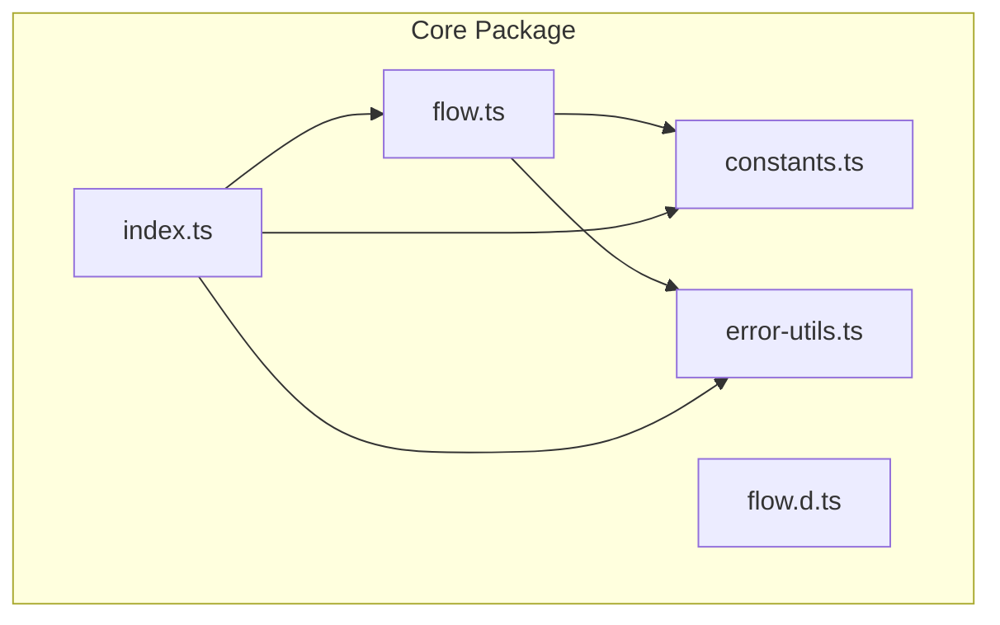
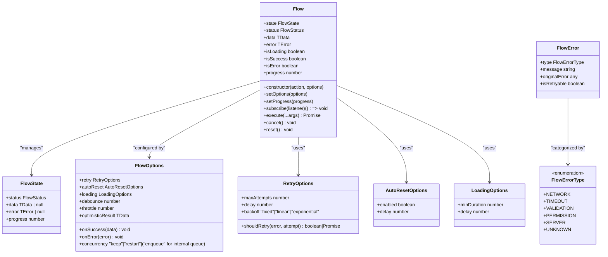
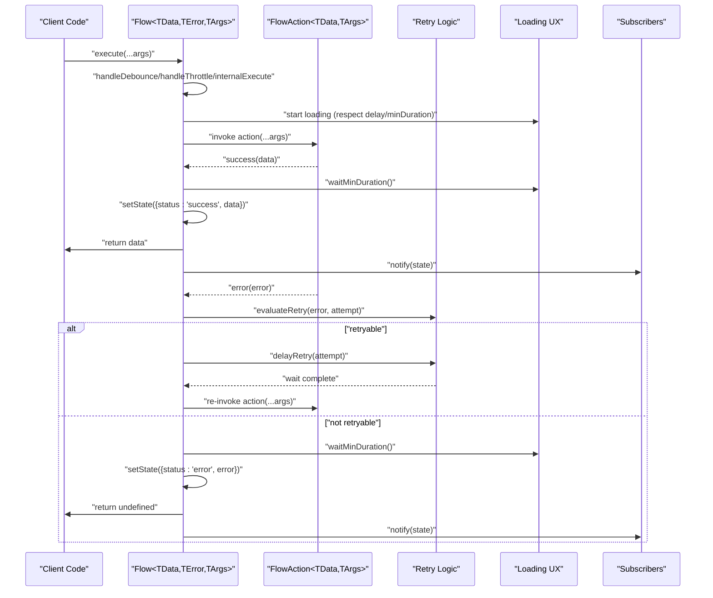
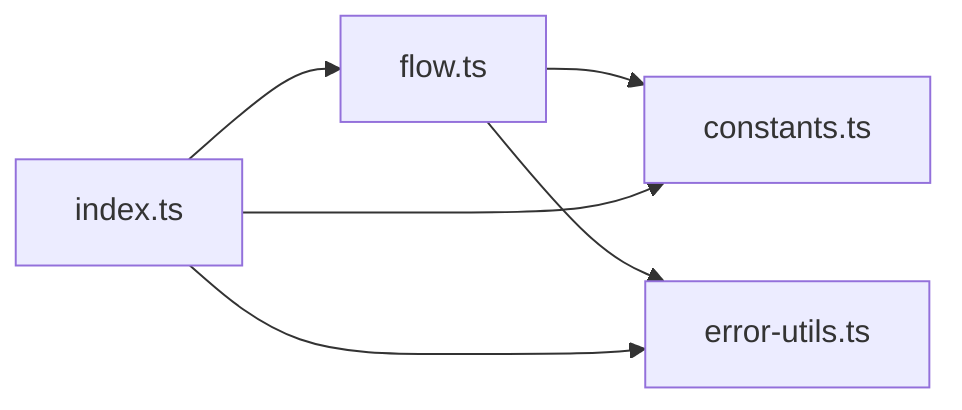

# Core API Reference

<cite>
**Referenced Files in This Document**
- [flow.ts](file://packages/core/src/flow.ts)
- [flow.d.ts](file://packages/core/src/flow.d.ts)
- [constants.ts](file://packages/core/src/constants.ts)
- [error-utils.ts](file://packages/core/src/error-utils.ts)
- [index.ts](file://packages/core/src/index.ts)
- [flow.test.ts](file://packages/core/src/flow.test.ts)
- [core-examples.ts](file://examples/basic/core-examples.ts)
- [react-examples.tsx](file://examples/react/react-examples.tsx)
- [flow-provider-examples.tsx](file://examples/react/flow-provider-examples.tsx)
</cite>

## Table of Contents

1. [Introduction](#introduction)
2. [Project Structure](#project-structure)
3. [Core Components](#core-components)
4. [Architecture Overview](#architecture-overview)
5. [Detailed Component Analysis](#detailed-component-analysis)
6. [Dependency Analysis](#dependency-analysis)
7. [Performance Considerations](#performance-considerations)
8. [Troubleshooting Guide](#troubleshooting-guide)
9. [Conclusion](#conclusion)

## Introduction

This document provides a comprehensive API reference for the AsyncFlowState Core package. It focuses on the Flow class and its surrounding types, detailing constructor parameters, methods, generics, and the observer pattern implementation. It also documents FlowError handling utilities and provides usage examples derived from the repository’s test suite and examples.

## Project Structure

The Core package exposes the Flow class and related types via a single export surface. The implementation is split across several modules:

- Flow class and types: flow.ts and flow.d.ts
- Constants for defaults: constants.ts
- Error utilities: error-utils.ts
- Package exports: index.ts

**Diagram sources**

- [flow.ts](file://packages/core/src/flow.ts#L1-L709)
- [flow.d.ts](file://packages/core/src/flow.d.ts#L1-L177)
- [constants.ts](file://packages/core/src/constants.ts#L1-L51)
- [error-utils.ts](file://packages/core/src/error-utils.ts#L1-L207)
- [index.ts](file://packages/core/src/index.ts#L1-L4)

**Section sources**

- [index.ts](file://packages/core/src/index.ts#L1-L4)
- [flow.ts](file://packages/core/src/flow.ts#L1-L709)
- [flow.d.ts](file://packages/core/src/flow.d.ts#L1-L177)
- [constants.ts](file://packages/core/src/constants.ts#L1-L51)
- [error-utils.ts](file://packages/core/src/error-utils.ts#L1-L207)

## Core Components

This section documents the Flow class and its associated types and enums.

- Flow class: Orchestrates asynchronous actions, manages state transitions, and notifies observers.
- FlowStatus: Enumeration of possible states.
- FlowState: Generic interface representing the current state.
- FlowOptions: Configuration for Flow behavior.
- RetryOptions: Retry policy configuration.
- AutoResetOptions: Auto-reset behavior configuration.
- LoadingOptions: UX timing controls for loading state.
- FlowErrorType: Categorization of errors.
- FlowError: Enhanced error object with metadata.
- FlowAction: Type alias for asynchronous actions.
- Error utilities: Functions to create and handle FlowError instances.

Key generics:

- TData: Type of data returned on success.
- TError: Type of error object on failure.
- TArgs: Tuple type of arguments passed to the action.

**Section sources**

- [flow.ts](file://packages/core/src/flow.ts#L16-L127)
- [flow.d.ts](file://packages/core/src/flow.d.ts#L8-L79)
- [error-utils.ts](file://packages/core/src/error-utils.ts#L1-L207)

## Architecture Overview

The Flow class implements an observer pattern to notify subscribers of state changes. It manages:

- State transitions: idle → loading → success/error
- Retry logic with configurable backoff
- Concurrency control (keep/restart/enqueue)
- Debounce/throttle mechanisms
- Optimistic updates
- Auto-reset behavior
- Progress reporting
- Error categorization and retryability

**Diagram sources**

- [flow.ts](file://packages/core/src/flow.ts#L16-L127)
- [flow.d.ts](file://packages/core/src/flow.d.ts#L8-L79)
- [error-utils.ts](file://packages/core/src/error-utils.ts#L35-L53)

## Detailed Component Analysis

### Flow Class

The Flow class is the core engine for orchestrating asynchronous actions and their UI states. It manages loading, success/error data, retries, concurrency, and optimistic updates.

- Constructor parameters:
  - action: FlowAction<TData, TArgs> — The asynchronous function to manage.
  - options: FlowOptions<TData, TError> — Optional configuration for behavior.

- Public methods:
  - setOptions(options): Merges new options with existing configuration.
  - state: Getter returning a copy of the current FlowState.
  - status, data, error: Getters for current status, last successful data, and last error.
  - isLoading, isSuccess, isError: Boolean getters respecting UX delays.
  - progress: Getter for current progress (0–100).
  - setProgress(progress): Sets progress while loading (clamped to 0–100).
  - subscribe(listener): Registers a listener and returns an unsubscribe function.
  - execute(...args): Executes the action with debounce/throttle/concurrency handling.
  - cancel(): Cancels the current execution and resets to idle.
  - reset(): Resets state to initial idle.

- Private/internal methods:
  - internalExecute(args): Core execution logic handling concurrency.
  - runAction(args, signal): Executes the action with retry/backoff and success/error handling.
  - setState(updates): Updates state and notifies observers.
  - notify(): Notifies all subscribed listeners.
  - finalizeLoading(): Cleans up timers and abort controller.
  - clearAllTimers()/clearTimer(key): Clears scheduled timers.
  - waitMinDuration(): Ensures minimum loading duration.
  - scheduleAutoReset(): Schedules auto-reset after success.
  - handleDebounce(args, delay)/handleThrottle(args, delay): Implements rate limiting.
  - evaluateRetry(error, attempt)/delayRetry(attempt): Retry evaluation and backoff.
  - processEnqueuedTasks(): Executes queued tasks after completion.

- Generics and constraints:
  - TData: Returned data type on success.
  - TError: Error type on failure.
  - TArgs: Tuple of arguments passed to the action.

- Observers and state notifications:
  - Maintains a Set of listeners.
  - Notifies on state changes via notify().
  - Subscribers receive immutable copies of the state.

- Error handling:
  - Uses FlowErrorType and FlowError for categorization and retryability.
  - onError callback invoked on terminal failure.
  - onSuccess callback invoked on success.

- State transitions:
  - idle → loading (with optional UX delay) → success/error.
  - On success, optional minDuration enforced, then auto-reset scheduled if configured.
  - On error, optional minDuration enforced.

- Concurrency and rate limiting:
  - concurrency: "keep" | "restart" | "enqueue".
  - debounce/throttle: time-based suppression of rapid calls.

- Optimistic updates:
  - If optimisticResult is provided, state becomes success immediately with that data.

- Progress:
  - Manual setProgress while loading clamps to 0–100.
  - Success auto-sets progress to 100.

- Defaults:
  - DEFAULT_RETRY, DEFAULT_LOADING, DEFAULT_CONCURRENCY, PROGRESS, BACKOFF_MULTIPLIER.

Example usage patterns are demonstrated in the repository’s examples and tests.

**Section sources**

- [flow.ts](file://packages/core/src/flow.ts#L174-L709)
- [flow.d.ts](file://packages/core/src/flow.d.ts#L84-L177)
- [constants.ts](file://packages/core/src/constants.ts#L10-L50)
- [flow.test.ts](file://packages/core/src/flow.test.ts#L1-L363)
- [core-examples.ts](file://examples/basic/core-examples.ts#L1-L221)

### FlowStatus

Enumeration of possible states:

- "idle": Initial state or after reset.
- "loading": Action is currently executing.
- "success": Action completed successfully.
- "error": Action failed after all retry attempts.

**Section sources**

- [flow.ts](file://packages/core/src/flow.ts#L16-L16)
- [flow.d.ts](file://packages/core/src/flow.d.ts#L8-L8)

### FlowState

Generic interface representing the current state:

- status: FlowStatus
- data: TData | null
- error: TError | null
- progress?: number

**Section sources**

- [flow.ts](file://packages/core/src/flow.ts#L21-L30)
- [flow.d.ts](file://packages/core/src/flow.d.ts#L12-L21)

### FlowOptions

Configuration options for a Flow instance:

- onSuccess?: (data: TData) => void
- onError?: (error: TError) => void
- retry?: RetryOptions
- autoReset?: AutoResetOptions
- loading?: LoadingOptions
- concurrency?: "keep" | "restart" | "enqueue"
- debounce?: number
- throttle?: number
- optimisticResult?: TData

Notes:

- concurrency includes "enqueue" internally for queuing tasks.
- debounce/throttle are supported in execute().

**Section sources**

- [flow.ts](file://packages/core/src/flow.ts#L99-L127)
- [flow.d.ts](file://packages/core/src/flow.d.ts#L60-L79)

### RetryOptions

- maxAttempts?: number (default: DEFAULT_RETRY.MAX_ATTEMPTS)
- delay?: number (default: DEFAULT_RETRY.DELAY)
- backoff?: "fixed" | "linear" | "exponential"
- shouldRetry?: (error: any, attempt: number) => boolean | Promise<boolean>

**Section sources**

- [flow.ts](file://packages/core/src/flow.ts#L65-L74)
- [flow.d.ts](file://packages/core/src/flow.d.ts#L31-L38)
- [constants.ts](file://packages/core/src/constants.ts#L10-L17)

### AutoResetOptions

- enabled?: boolean (default: true if delay is provided)
- delay?: number

**Section sources**

- [flow.ts](file://packages/core/src/flow.ts#L79-L84)
- [flow.d.ts](file://packages/core/src/flow.d.ts#L42-L47)

### LoadingOptions

- minDuration?: number (default: DEFAULT_LOADING.MIN_DURATION)
- delay?: number (default: DEFAULT_LOADING.DELAY)

**Section sources**

- [flow.ts](file://packages/core/src/flow.ts#L89-L94)
- [flow.d.ts](file://packages/core/src/flow.d.ts#L51-L56)
- [constants.ts](file://packages/core/src/constants.ts#L22-L27)

### FlowErrorType

- NETWORK
- TIMEOUT
- VALIDATION
- PERMISSION
- SERVER
- UNKNOWN

**Section sources**

- [flow.ts](file://packages/core/src/flow.ts#L35-L42)
- [flow.d.ts](file://packages/core/src/flow.d.ts#L2-L7)

### FlowError

Enhanced error object with metadata:

- type: FlowErrorType
- message: string
- originalError: TError
- isRetryable: boolean

**Section sources**

- [flow.ts](file://packages/core/src/flow.ts#L47-L53)
- [flow.d.ts](file://packages/core/src/flow.d.ts#L23-L27)

### FlowAction

Type alias for asynchronous actions:

- (...)
- (...args: TArgs) => Promise<TData>

**Section sources**

- [flow.ts](file://packages/core/src/flow.ts#L58-L60)
- [flow.d.ts](file://packages/core/src/flow.d.ts#L25-L27)

### Error Utilities

Utility functions for FlowError:

- createFlowError(error, options?): Creates a FlowError with automatic type detection and default message.
- detectErrorType(error): Detects FlowErrorType from common patterns.
- isErrorRetryable(errorType): Determines if an error type is typically retryable.
- getErrorMessage(error): Extracts a human-readable message from any error object.
- isFlowError(error): Type guard to check if an error is a FlowError.

**Section sources**

- [error-utils.ts](file://packages/core/src/error-utils.ts#L26-L206)

## Architecture Overview

**Diagram sources**

- [flow.ts](file://packages/core/src/flow.ts#L400-L533)
- [flow.ts](file://packages/core/src/flow.ts#L596-L638)
- [flow.ts](file://packages/core/src/flow.ts#L646-L668)

## Detailed Component Analysis

### Method Signatures and Behavior

- constructor(action: FlowAction<TData, TArgs>, options?: FlowOptions<TData, TError>)
  - Initializes Flow with an action and optional configuration.
  - Stores action and merges options with defaults.

- setOptions(options: FlowOptions<TData, TError>): void
  - Merges new options into existing configuration.

- state: FlowState<TData, TError>
  - Returns a shallow copy of the current state.

- status: FlowStatus
- data: TData | null
- error: TError | null
- isLoading: boolean
- isSuccess: boolean
- isError: boolean
- progress: number

- setProgress(progress: number): void
  - Sets progress while loading; clamps to 0–100.

- subscribe(listener: (state: FlowState<TData, TError>) => void): () => void
  - Registers a listener; returns an unsubscribe function.

- execute(...args: TArgs): Promise<TData | undefined>
  - Handles debounce/throttle/concurrency, then executes the action.
  - Returns the action result or undefined if cancelled/debounced.

- cancel(): void
  - Cancels the current execution and resets to idle.

- reset(): void
  - Resets state to initial idle.

**Section sources**

- [flow.ts](file://packages/core/src/flow.ts#L220-L241)
- [flow.ts](file://packages/core/src/flow.ts#L246-L286)
- [flow.ts](file://packages/core/src/flow.ts#L299-L305)
- [flow.ts](file://packages/core/src/flow.ts#L325-L332)
- [flow.ts](file://packages/core/src/flow.ts#L400-L415)
- [flow.ts](file://packages/core/src/flow.ts#L344-L351)
- [flow.ts](file://packages/core/src/flow.ts#L362-L370)

### Usage Patterns and Examples

- Basic usage with subscription and execution:
  - See [core-examples.ts](file://examples/basic/core-examples.ts#L14-L38).

- Retry logic with linear backoff:
  - See [core-examples.ts](file://examples/basic/core-examples.ts#L44-L73).

- Optimistic UI updates:
  - See [core-examples.ts](file://examples/basic/core-examples.ts#L79-L111).

- Preventing double submission:
  - See [core-examples.ts](file://examples/basic/core-examples.ts#L117-L144).

- Cancellation:
  - See [core-examples.ts](file://examples/basic/core-examples.ts#L150-L177).

- Auto reset:
  - See [core-examples.ts](file://examples/basic/core-examples.ts#L183-L203).

- Tests covering state transitions and behaviors:
  - See [flow.test.ts](file://packages/core/src/flow.test.ts#L1-L363).

**Section sources**

- [core-examples.ts](file://examples/basic/core-examples.ts#L1-L221)
- [flow.test.ts](file://packages/core/src/flow.test.ts#L1-L363)

### Observer Pattern Implementation

- Subscription management:
  - Maintains a Set of listeners.
  - subscribe(listener) adds and returns an unsubscribe function.
  - notify() iterates listeners and passes a copy of the state.

- State notification system:
  - setState(updates) updates internal state and triggers notify().
  - Listeners receive immutable snapshots of state.

- Concurrency and UX considerations:
  - isLoading respects loading.delay; during delay, isLoading is false even though status is "loading".

**Section sources**

- [flow.ts](file://packages/core/src/flow.ts#L325-L332)
- [flow.ts](file://packages/core/src/flow.ts#L672-L679)
- [flow.ts](file://packages/core/src/flow.ts#L269-L271)

### Error Handling and FlowError

- Error categorization:
  - detectErrorType(error) automatically detects FlowErrorType.
  - isErrorRetryable(errorType) determines retryability.

- Enhanced error creation:
  - createFlowError(error, options?) wraps any error with FlowError metadata.

- Type guards:
  - isFlowError(error) checks if an error conforms to FlowError.

- Usage in Flow:
  - onError callback receives typed error.
  - Retry logic can be customized via shouldRetry.

**Section sources**

- [error-utils.ts](file://packages/core/src/error-utils.ts#L53-L143)
- [error-utils.ts](file://packages/core/src/error-utils.ts#L26-L39)
- [error-utils.ts](file://packages/core/src/error-utils.ts#L192-L206)
- [flow.ts](file://packages/core/src/flow.ts#L510-L528)

## Dependency Analysis

- flow.ts depends on constants.ts for defaults and error-utils.ts for error handling utilities.
- index.ts re-exports Flow, constants, and error utilities.

**Diagram sources**

- [flow.ts](file://packages/core/src/flow.ts#L1-L7)
- [index.ts](file://packages/core/src/index.ts#L1-L4)

**Section sources**

- [flow.ts](file://packages/core/src/flow.ts#L1-L7)
- [index.ts](file://packages/core/src/index.ts#L1-L4)

## Performance Considerations

- Debounce and throttle reduce redundant executions for rapid user interactions.
- MinDuration prevents UI flicker for fast operations.
- Backoff strategies (fixed/linear/exponential) balance retry aggressiveness with resource usage.
- AbortController enables cooperative cancellation of long-running actions.
- Queuing (enqueue) avoids unnecessary work when subsequent calls supersede earlier ones.

[No sources needed since this section provides general guidance]

## Troubleshooting Guide

- State remains "loading" indefinitely:
  - Check loading.delay and minDuration configurations.
  - Ensure the action resolves or rejects; verify AbortController usage.

- Retries not occurring:
  - Confirm retry.maxAttempts and backoff settings.
  - Provide shouldRetry if custom logic is required.

- Auto-reset not triggering:
  - Verify autoReset.enabled and delay values.
  - Ensure status is "success" when timer fires.

- Subscribers not receiving updates:
  - Ensure subscribe(listener) is called and unsubscribe is not called prematurely.
  - Confirm listener receives immutable state copies.

- Progress not updating:
  - setProgress only affects loading state; ensure action is running and progress is set during execution.

**Section sources**

- [flow.ts](file://packages/core/src/flow.ts#L658-L668)
- [flow.ts](file://packages/core/src/flow.ts#L462-L470)
- [flow.ts](file://packages/core/src/flow.ts#L299-L305)
- [flow.ts](file://packages/core/src/flow.ts#L325-L332)

## Conclusion

The AsyncFlowState Core package provides a robust, framework-agnostic mechanism for managing asynchronous UI flows. Its Flow class centralizes state transitions, retry logic, concurrency control, and UX polish, while the observer pattern ensures decoupled state observation. The included error utilities and examples demonstrate practical usage across common scenarios.
