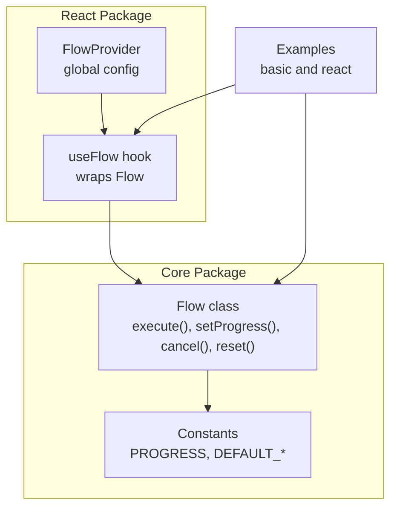
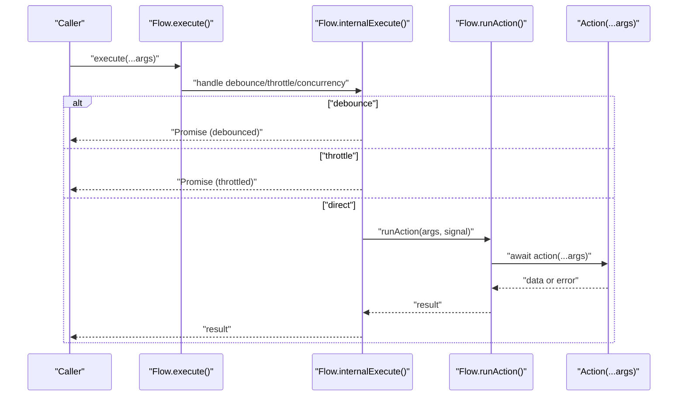
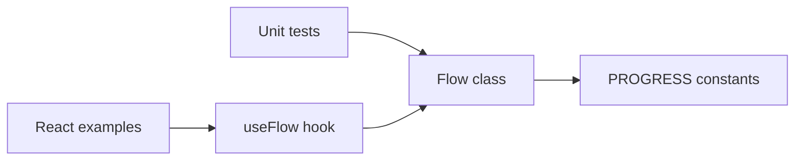

# Execution Methods

<cite>
**Referenced Files in This Document**
- [flow.ts](file://packages/core/src/flow.ts)
- [flow.d.ts](file://packages/core/src/flow.d.ts)
- [constants.ts](file://packages/core/src/constants.ts)
- [flow.test.ts](file://packages/core/src/flow.test.ts)
- [core-examples.ts](file://examples/basic/core-examples.ts)
- [react-examples.tsx](file://examples/react/react-examples.tsx)
- [useFlow.tsx](file://packages/react/src/useFlow.tsx)
</cite>

## Table of Contents
1. [Introduction](#introduction)
2. [Project Structure](#project-structure)
3. [Core Components](#core-components)
4. [Architecture Overview](#architecture-overview)
5. [Detailed Component Analysis](#detailed-component-analysis)
6. [Dependency Analysis](#dependency-analysis)
7. [Performance Considerations](#performance-considerations)
8. [Troubleshooting Guide](#troubleshooting-guide)
9. [Conclusion](#conclusion)

## Introduction
This document focuses on the Flow execution methods: execute(), setProgress(), cancel(), and reset(). It explains their signatures, parameter handling, return types, and behavior under various conditions. It also covers concurrency scenarios, method interactions, and practical examples for method chaining, error handling, and cleanup patterns.

## Project Structure
The Flow class resides in the core package and exposes public methods for orchestration of asynchronous actions. The React package wraps Flow for convenient UI integration.

**Diagram sources**
- [flow.ts](file://packages/core/src/flow.ts#L220-L796)
- [constants.ts](file://packages/core/src/constants.ts#L37-L50)
- [useFlow.tsx](file://packages/react/src/useFlow.tsx#L77-L281)
- [FlowProvider.tsx](file://packages/react/src/FlowProvider.tsx#L50-L139)
- [core-examples.ts](file://examples/basic/core-examples.ts#L1-L221)
- [react-examples.tsx](file://examples/react/react-examples.tsx#L1-L491)

**Section sources**
- [flow.ts](file://packages/core/src/flow.ts#L220-L796)
- [flow.d.ts](file://packages/core/src/flow.d.ts#L84-L177)
- [constants.ts](file://packages/core/src/constants.ts#L37-L50)
- [useFlow.tsx](file://packages/react/src/useFlow.tsx#L77-L281)
- [FlowProvider.tsx](file://packages/react/src/FlowProvider.tsx#L50-L139)
- [core-examples.ts](file://examples/basic/core-examples.ts#L1-L221)
- [react-examples.tsx](file://examples/react/react-examples.tsx#L1-L491)

## Core Components
- Flow class: Orchestrates asynchronous actions, manages state, progress, retries, concurrency, and optimistic updates.
- Constants module: Defines progress bounds and default behaviors.
- React integration: useFlow hook exposes execute(), cancel(), reset(), setProgress() to components.

Key execution-related methods:
- execute(...args): Initiates action execution with debounce/throttle/concurrency handling.
- setProgress(progress): Manually updates progress while loading.
- cancel(): Aborts current execution and resets state to idle.
- reset(): Resets state to initial idle regardless of current status.

**Section sources**
- [flow.ts](file://packages/core/src/flow.ts#L449-L464)
- [flow.ts](file://packages/core/src/flow.ts#L348-L354)
- [flow.ts](file://packages/core/src/flow.ts#L393-L400)
- [flow.ts](file://packages/core/src/flow.ts#L411-L419)
- [flow.d.ts](file://packages/core/src/flow.d.ts#L144-L169)
- [constants.ts](file://packages/core/src/constants.ts#L37-L42)

## Architecture Overview
The Flow class encapsulates execution lifecycle and state transitions. The execute() method routes to internal logic that applies UX controls (minDuration, delay), optimistic updates, and retry/backoff strategies. Progress updates are constrained to a bounded range and only apply while loading.

**Diagram sources**
- [flow.ts](file://packages/core/src/flow.ts#L449-L464)
- [flow.ts](file://packages/core/src/flow.ts#L474-L544)
- [flow.ts](file://packages/core/src/flow.ts#L553-L620)

## Detailed Component Analysis

### execute(...args): Signatures, Parameters, and Return Types
- Signature: execute(...args: TArgs): Promise<TData | undefined>
- Purpose: Starts action execution with optional debounce/throttle/concurrency handling.
- Parameters:
  - args: Variable-length arguments passed to the underlying action function.
- Return:
  - Promise that resolves to the action’s data or undefined if the call was debounced/cancelled.
- Behavior highlights:
  - Debounce: If options.debounce > 0, only the last call within the delay window executes.
  - Throttle: If options.throttle > 0, only one execution per window is allowed.
  - Concurrency:
    - keep: Ignore new calls while loading; returns undefined.
    - restart: Cancel current execution and start a new one.
    - enqueue: Queue subsequent calls; execute after current finishes.
  - Optimistic updates: If configured, state becomes success immediately with optimistic data.
  - Loading UX: Applies loading delay and minDuration; respects isLoading getter.
  - Retries: Uses configured retry strategy; honors shouldRetry callback if provided.
  - Auto reset: Schedules reset after success if enabled.

Practical examples:
- Basic execution with arguments: [core-examples.ts](file://examples/basic/core-examples.ts#L14-L38)
- Retry logic: [core-examples.ts](file://examples/basic/core-examples.ts#L44-L73)
- Prevent double submission: [core-examples.ts](file://examples/basic/core-examples.ts#L117-L144)
- Cancellation and auto reset: [core-examples.ts](file://examples/basic/core-examples.ts#L150-L203)

**Section sources**
- [flow.ts](file://packages/core/src/flow.ts#L449-L464)
- [flow.ts](file://packages/core/src/flow.ts#L474-L544)
- [flow.ts](file://packages/core/src/flow.ts#L553-L620)
- [flow.d.ts](file://packages/core/src/flow.d.ts#L160-L164)
- [core-examples.ts](file://examples/basic/core-examples.ts#L14-L203)

### setProgress(progress): Manual Progress Setting
- Signature: setProgress(progress: number): void
- Purpose: Manually set progress while loading.
- Constraints:
  - Only effective when status is loading.
  - Value clamped to [PROGRESS.MIN, PROGRESS.MAX].
- Timing:
  - Progress is validated and normalized before applying.
  - Typical usage inside the action to reflect real progress.
- Behavior:
  - Updates internal state and notifies subscribers.
  - Does not affect finalization; success transitions to PROGRESS.COMPLETE automatically.

Validation and timing constraints:
- Clamping ensures values remain within [0, 100].
- No-op if not loading; prevents accidental mutation outside loading.

Example usage:
- Tracking progress during execution: [flow.test.ts](file://packages/core/src/flow.test.ts#L490-L499)

**Section sources**
- [flow.ts](file://packages/core/src/flow.ts#L348-L354)
- [flow.d.ts](file://packages/core/src/flow.d.ts#L144-L146)
- [constants.ts](file://packages/core/src/constants.ts#L37-L42)
- [flow.test.ts](file://packages/core/src/flow.test.ts#L490-L499)

### cancel(): Cancellation and State Reset
- Signature: cancel(): void
- Purpose: Abort the currently running action and reset state to idle.
- Behavior:
  - Clears all timers (loading delay, auto reset, debounce, throttle).
  - Calls AbortController.abort() to signal cancellation.
  - Resets state to idle with progress INITIAL and clears error.
- Interaction:
  - Works with concurrency restart to swap current execution.
  - Safe to call at any time; cleans up timers and listeners.

Example usage:
- Immediate cancellation: [core-examples.ts](file://examples/basic/core-examples.ts#L150-L177)
- Cancellation in tests: [flow.test.ts](file://packages/core/src/flow.test.ts#L329-L352)

**Section sources**
- [flow.ts](file://packages/core/src/flow.ts#L393-L400)
- [flow.d.ts](file://packages/core/src/flow.d.ts#L156-L158)
- [flow.test.ts](file://packages/core/src/flow.test.ts#L329-L352)

### reset(): State Reset Without Cancellation
- Signature: reset(): void
- Purpose: Reset state to initial idle regardless of current status.
- Behavior:
  - Clears all timers and resets state to idle with progress INITIAL.
  - Useful for clearing success/error states after UI interactions.
- Interaction:
  - Does not abort running actions; only affects state.
  - Often paired with autoReset for automatic cleanup.

Example usage:
- Manual reset after success: [core-examples.ts](file://examples/basic/core-examples.ts#L183-L203)
- Reset in tests: [flow.test.ts](file://packages/core/src/flow.test.ts#L318-L327)

**Section sources**
- [flow.ts](file://packages/core/src/flow.ts#L411-L419)
- [flow.d.ts](file://packages/core/src/flow.d.ts#L167-L169)
- [flow.test.ts](file://packages/core/src/flow.test.ts#L318-L327)

### Method Interactions and Concurrency Scenarios
- Concurrency strategies:
  - keep: Ignores concurrent calls while loading; returns undefined.
  - restart: Cancels current execution and starts a new one.
  - enqueue: Queues subsequent calls; executes after current finishes.
- Debounce/throttle:
  - Debounce: Last call within delay window wins; earlier calls are superseded.
  - Throttle: Only one call per window; others are queued until the window opens.
- Optimistic updates:
  - If configured, state becomes success immediately with optimistic data; real data replaces it upon completion.
- Progress:
  - Manual progress updates are only effective while loading; success sets progress to COMPLETE.

Concurrency examples:
- keep: [flow.test.ts](file://packages/core/src/flow.test.ts#L241-L264)
- restart: [flow.test.ts](file://packages/core/src/flow.test.ts#L266-L292)

**Section sources**
- [flow.ts](file://packages/core/src/flow.ts#L474-L544)
- [flow.ts](file://packages/core/src/flow.ts#L624-L672)
- [flow.test.ts](file://packages/core/src/flow.test.ts#L241-L292)

### Error Handling and Cleanup Patterns
- Error handling:
  - Terminal errors after retries trigger error state and optional rollback for optimistic updates.
  - onError callbacks are invoked on terminal failures.
- Cleanup:
  - cancel() and reset() clear timers and reset state.
  - Auto reset schedules idle transition after success if configured.
- Best practices:
  - Always subscribe to state changes to drive UI updates.
  - Use reset() to clear success/error states after user-initiated actions.
  - Use cancel() to stop long-running operations when appropriate.

Cleanup and error handling examples:
- onError callback: [flow.test.ts](file://packages/core/src/flow.test.ts#L303-L316)
- Auto reset: [flow.test.ts](file://packages/core/src/flow.test.ts#L369-L380)
- Manual reset: [flow.test.ts](file://packages/core/src/flow.test.ts#L318-L327)

**Section sources**
- [flow.ts](file://packages/core/src/flow.ts#L553-L620)
- [flow.ts](file://packages/core/src/flow.ts#L745-L755)
- [flow.test.ts](file://packages/core/src/flow.test.ts#L303-L380)

### Practical Examples and Method Chaining
- Basic execution with arguments: [core-examples.ts](file://examples/basic/core-examples.ts#L14-L38)
- Retry logic with linear/exponential backoff: [core-examples.ts](file://examples/basic/core-examples.ts#L44-L73)
- Prevent double submission: [core-examples.ts](file://examples/basic/core-examples.ts#L117-L144)
- Cancellation and auto reset: [core-examples.ts](file://examples/basic/core-examples.ts#L150-L203)
- Optimistic UI updates: [react-examples.tsx](file://examples/react/react-examples.tsx#L93-L128)

Method chaining patterns:
- Call execute(), then chain reset() or cancel() based on outcome.
- Use setProgress() periodically during long-running actions.
- Combine with subscribe() to react to state changes.

**Section sources**
- [core-examples.ts](file://examples/basic/core-examples.ts#L14-L203)
- [react-examples.tsx](file://examples/react/react-examples.tsx#L93-L128)
- [flow.test.ts](file://packages/core/src/flow.test.ts#L490-L499)

## Dependency Analysis
The Flow class depends on constants for progress bounds and default behaviors. Tests validate execution, progress, and concurrency. React integration exposes Flow methods to components.

**Diagram sources**
- [flow.ts](file://packages/core/src/flow.ts#L348-L354)
- [constants.ts](file://packages/core/src/constants.ts#L37-L42)
- [flow.test.ts](file://packages/core/src/flow.test.ts#L490-L499)
- [useFlow.tsx](file://packages/react/src/useFlow.tsx#L262-L268)
- [react-examples.tsx](file://examples/react/react-examples.tsx#L93-L128)

**Section sources**
- [flow.ts](file://packages/core/src/flow.ts#L348-L354)
- [constants.ts](file://packages/core/src/constants.ts#L37-L42)
- [flow.test.ts](file://packages/core/src/flow.test.ts#L490-L499)
- [useFlow.tsx](file://packages/react/src/useFlow.tsx#L262-L268)
- [react-examples.tsx](file://examples/react/react-examples.tsx#L93-L128)

## Performance Considerations
- Debounce/throttle reduce redundant executions for rapid user interactions.
- MinDuration and loading delay improve perceived performance and avoid UI flicker.
- Backoff strategies for retries balance responsiveness with reliability.
- Proper cleanup via cancel()/reset() prevents memory leaks and stale timers.

[No sources needed since this section provides general guidance]

## Troubleshooting Guide
Common issues and resolutions:
- Progress not updating: Ensure setProgress() is called while status is loading; values are clamped to [0, 100].
- Concurrency confusion: Verify concurrency option; use keep to ignore, restart to swap, enqueue to queue.
- Cancellation not taking effect: cancel() aborts the current execution; confirm AbortController is active and timers are cleared.
- Auto reset not firing: Confirm autoReset.enabled and delay are set appropriately; reset only occurs after success.

**Section sources**
- [flow.ts](file://packages/core/src/flow.ts#L348-L354)
- [flow.ts](file://packages/core/src/flow.ts#L393-L400)
- [flow.ts](file://packages/core/src/flow.ts#L411-L419)
- [flow.ts](file://packages/core/src/flow.ts#L745-L755)

## Conclusion
The Flow execution methods provide a robust foundation for managing asynchronous actions with rich UX controls. execute() integrates debounce/throttle/concurrency; setProgress() enables manual progress updates while loading; cancel() and reset() offer precise control over state transitions. Combined with tests and examples, these methods support reliable, user-friendly asynchronous workflows across diverse applications.