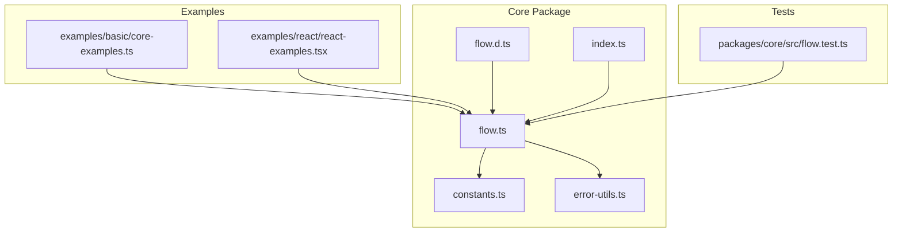
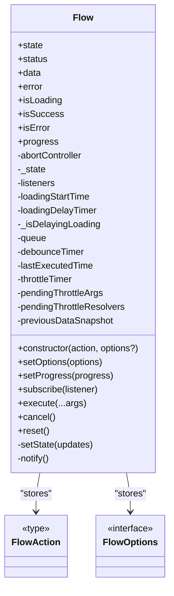
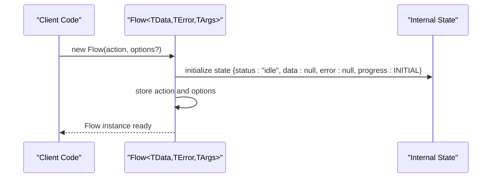
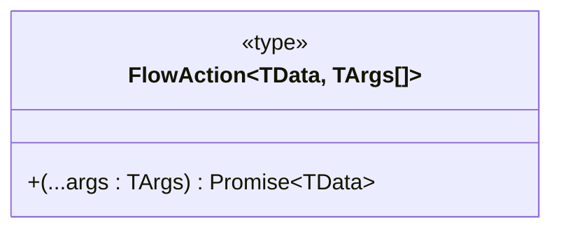
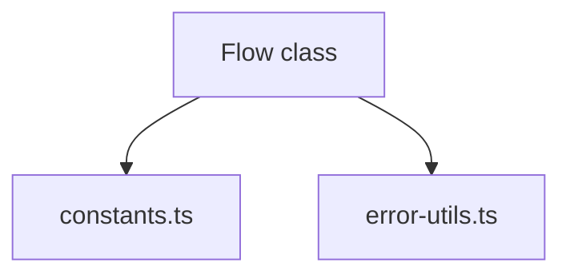

# Flow Class

<cite>
**Referenced Files in This Document**
- [flow.ts](file://packages/core/src/flow.ts)
- [flow.d.ts](file://packages/core/src/flow.d.ts)
- [constants.ts](file://packages/core/src/constants.ts)
- [error-utils.ts](file://packages/core/src/error-utils.ts)
- [core-examples.ts](file://examples/basic/core-examples.ts)
- [react-examples.tsx](file://examples/react/react-examples.tsx)
- [flow.test.ts](file://packages/core/src/flow.test.ts)
</cite>

## Table of Contents
1. [Introduction](#introduction)
2. [Project Structure](#project-structure)
3. [Core Components](#core-components)
4. [Architecture Overview](#architecture-overview)
5. [Detailed Component Analysis](#detailed-component-analysis)
6. [Dependency Analysis](#dependency-analysis)
7. [Performance Considerations](#performance-considerations)
8. [Troubleshooting Guide](#troubleshooting-guide)
9. [Conclusion](#conclusion)

## Introduction
This document provides comprehensive documentation for the Flow class constructor and initialization. It explains the Flow constructor signature with generic type parameters TData, TError, and TArgs, documents the FlowAction type definition, and demonstrates how to create Flow instances with custom actions. It covers different constructor patterns (basic usage with async functions, constructor with options object, and typed constructor with specific generic parameters), the relationship between constructor parameters and internal state initialization, and practical examples for proper instantiation patterns and common use cases.

## Project Structure
The Flow class resides in the core package under packages/core/src. The relevant files include the implementation, type definitions, constants, error utilities, examples, and tests.

**Diagram sources**
- [flow.ts](file://packages/core/src/flow.ts#L1-L796)
- [flow.d.ts](file://packages/core/src/flow.d.ts#L1-L177)
- [constants.ts](file://packages/core/src/constants.ts#L1-L51)
- [error-utils.ts](file://packages/core/src/error-utils.ts#L1-L207)
- [core-examples.ts](file://examples/basic/core-examples.ts#L1-L221)
- [react-examples.tsx](file://examples/react/react-examples.tsx#L1-L491)
- [flow.test.ts](file://packages/core/src/flow.test.ts#L1-L517)

**Section sources**
- [flow.ts](file://packages/core/src/flow.ts#L1-L796)
- [flow.d.ts](file://packages/core/src/flow.d.ts#L1-L177)
- [constants.ts](file://packages/core/src/constants.ts#L1-L51)
- [error-utils.ts](file://packages/core/src/error-utils.ts#L1-L207)
- [core-examples.ts](file://examples/basic/core-examples.ts#L1-L221)
- [react-examples.tsx](file://examples/react/react-examples.tsx#L1-L491)
- [flow.test.ts](file://packages/core/src/flow.test.ts#L1-L517)

## Core Components
This section focuses on the Flow constructor signature, generic type parameters, and the FlowAction type definition.

- Constructor signature
  - The Flow constructor accepts two parameters:
    - action: a FlowAction<TData, TArgs> representing the asynchronous function to manage
    - options: a FlowOptions<TData, TError, TArgs> object configuring behavior (optional)
  - The constructor signature is defined as:
    - constructor(action: FlowAction<TData, TArgs>, options?: FlowOptions<TData, TError, TArgs>)
  - The constructor initializes internal state and stores the provided action and options.

- Generic type parameters
  - TData: The type of data returned by successful action execution
  - TError: The type of error object thrown on failure
  - TArgs: The tuple type of arguments passed to the action

- FlowAction type definition
  - FlowAction<TData, TArgs extends any[]> is a function type that takes a rest parameter of type TArgs and returns a Promise<TData>.
  - This enables strongly-typed actions with flexible argument lists.

- Relationship between constructor parameters and internal state initialization
  - The constructor stores the action and options as private members.
  - Internal state initialization occurs in the constructor body, setting the initial FlowState with status "idle", data and error null, and progress set to the initial progress constant.

**Section sources**
- [flow.ts](file://packages/core/src/flow.ts#L269-L272)
- [flow.ts](file://packages/core/src/flow.ts#L220-L227)
- [flow.d.ts](file://packages/core/src/flow.d.ts#L84-L105)
- [flow.d.ts](file://packages/core/src/flow.d.ts#L25-L27)

## Architecture Overview
The Flow class orchestrates asynchronous actions and their UI states. It manages loading, success/error data, retries, concurrency, and optimistic updates. The constructor sets up the internal state and stores the action and options for later execution.

**Diagram sources**
- [flow.ts](file://packages/core/src/flow.ts#L220-L272)
- [flow.d.ts](file://packages/core/src/flow.d.ts#L84-L176)

## Detailed Component Analysis

### Flow Constructor and Initialization
- Constructor signature and generics
  - The constructor signature is defined with generic parameters TData, TError, and TArgs.
  - The action parameter is typed as FlowAction<TData, TArgs>.
  - The options parameter is typed as FlowOptions<TData, TError, TArgs>.

- Internal state initialization
  - The constructor initializes the internal state object with:
    - status: "idle"
    - data: null
    - error: null
    - progress: set to the initial progress constant
  - It also initializes other internal fields for subscriptions, timers, queues, and optimistic updates.

- Relationship to FlowOptions and defaults
  - The constructor stores the provided options object.
  - Default values for retry, loading, and concurrency are defined in constants and used internally when options are not provided.

**Diagram sources**
- [flow.ts](file://packages/core/src/flow.ts#L269-L272)
- [flow.ts](file://packages/core/src/flow.ts#L220-L227)
- [constants.ts](file://packages/core/src/constants.ts#L37-L42)

**Section sources**
- [flow.ts](file://packages/core/src/flow.ts#L269-L272)
- [flow.ts](file://packages/core/src/flow.ts#L220-L227)
- [flow.d.ts](file://packages/core/src/flow.d.ts#L84-L105)
- [constants.ts](file://packages/core/src/constants.ts#L37-L42)

### FlowAction Type Definition
- FlowAction<TData, TArgs extends any[]> defines the shape of asynchronous actions managed by Flow.
- It accepts a rest parameter of type TArgs and returns a Promise<TData>.
- This enables actions to accept any number of arguments with strong typing.

**Diagram sources**
- [flow.d.ts](file://packages/core/src/flow.d.ts#L25-L27)

**Section sources**
- [flow.d.ts](file://packages/core/src/flow.d.ts#L25-L27)

### Constructor Patterns and Examples

#### Basic Usage with Async Functions
- Pattern: new Flow(async (...args) => Promise<TData>)
- The action is an async function returning a Promise<TData>.
- Options are omitted, so defaults apply.

Example reference:
- [core-examples.ts](file://examples/basic/core-examples.ts#L26-L38)

#### Constructor with Options Object
- Pattern: new Flow(action, { onSuccess, onError, retry, autoReset, loading, concurrency, debounce, throttle, optimisticResult, rollbackOnError })
- The options object configures behavior such as retry logic, auto-reset, loading UX, concurrency, debouncing/throttling, and optimistic updates.

Example reference:
- [core-examples.ts](file://examples/basic/core-examples.ts#L60-L73)

#### Typed Constructor with Specific Generic Parameters
- Pattern: new Flow<TData, TError, TArgs>(action, options?)
- Explicitly specify TData, TError, and TArgs for strong typing of action arguments and return values.

Example reference:
- [flow.test.ts](file://packages/core/src/flow.test.ts#L98-L134)

**Section sources**
- [core-examples.ts](file://examples/basic/core-examples.ts#L26-L38)
- [core-examples.ts](file://examples/basic/core-examples.ts#L60-L73)
- [flow.test.ts](file://packages/core/src/flow.test.ts#L98-L134)

### Practical Instantiation Patterns and Common Use Cases

#### Simple Async Action
- Instantiate Flow with an async action and subscribe to state changes.
- Execute the flow with arguments and observe status transitions.

Example reference:
- [core-examples.ts](file://examples/basic/core-examples.ts#L14-L38)

#### Retry Logic
- Configure retry options including maxAttempts, delay, and backoff strategy.
- Use onSuccess and onError callbacks for handling outcomes.

Example reference:
- [core-examples.ts](file://examples/basic/core-examples.ts#L44-L73)

#### Optimistic UI
- Use optimisticResult to immediately reflect UI updates while the action runs.
- The UI shows optimistic data until the real result arrives.

Example reference:
- [core-examples.ts](file://examples/basic/core-examples.ts#L79-L111)

#### Prevent Double Submission
- Configure concurrency to "keep" to ignore subsequent requests while loading.
- This prevents multiple simultaneous executions.

Example reference:
- [core-examples.ts](file://examples/basic/core-examples.ts#L117-L144)

#### Cancellation
- Cancel an ongoing execution to reset state to idle.
- Useful for aborting long-running tasks.

Example reference:
- [core-examples.ts](file://examples/basic/core-examples.ts#L150-L177)

#### Auto Reset
- Enable autoReset to automatically return to idle after success.
- Configure delay to control when reset occurs.

Example reference:
- [core-examples.ts](file://examples/basic/core-examples.ts#L183-L203)

**Section sources**
- [core-examples.ts](file://examples/basic/core-examples.ts#L14-L38)
- [core-examples.ts](file://examples/basic/core-examples.ts#L44-L73)
- [core-examples.ts](file://examples/basic/core-examples.ts#L79-L111)
- [core-examples.ts](file://examples/basic/core-examples.ts#L117-L144)
- [core-examples.ts](file://examples/basic/core-examples.ts#L150-L177)
- [core-examples.ts](file://examples/basic/core-examples.ts#L183-L203)

## Dependency Analysis
The Flow class depends on constants for default configurations and error utilities for error handling.

**Diagram sources**
- [flow.ts](file://packages/core/src/flow.ts#L1-L7)
- [constants.ts](file://packages/core/src/constants.ts#L1-L51)
- [error-utils.ts](file://packages/core/src/error-utils.ts#L1-L207)

**Section sources**
- [flow.ts](file://packages/core/src/flow.ts#L1-L7)
- [constants.ts](file://packages/core/src/constants.ts#L1-L51)
- [error-utils.ts](file://packages/core/src/error-utils.ts#L1-L207)

## Performance Considerations
- Loading UX controls
  - minDuration ensures the loading state persists for a minimum time, preventing UI flicker for fast actions.
  - delay prevents immediate loading state display for near-instant actions.
- Retry backoff strategies
  - fixed, linear, and exponential backoff reduce server load and improve resilience.
- Concurrency strategies
  - keep ignores concurrent requests, restart cancels and restarts, enqueue queues subsequent requests.
- Debounce and throttle
  - Debounce groups rapid calls into a single execution window.
  - Throttle limits execution frequency to a specified interval.

**Section sources**
- [flow.ts](file://packages/core/src/flow.ts#L449-L464)
- [flow.ts](file://packages/core/src/flow.ts#L624-L672)
- [flow.ts](file://packages/core/src/flow.ts#L712-L725)
- [constants.ts](file://packages/core/src/constants.ts#L22-L27)
- [constants.ts](file://packages/core/src/constants.ts#L10-L17)

## Troubleshooting Guide
- State transitions
  - Verify initial state is "idle" and transitions to "loading", then "success" or "error".
- Retry behavior
  - Confirm maxAttempts, delay, and backoff settings align with expectations.
- Optimistic updates
  - Ensure optimisticResult is set appropriately; verify rollback behavior with rollbackOnError.
- Concurrency issues
  - Choose the right concurrency strategy ("keep", "restart", "enqueue") based on desired behavior.
- Cancellation and reset
  - Use cancel() to abort ongoing executions and reset() to return to idle state.

**Section sources**
- [flow.test.ts](file://packages/core/src/flow.test.ts#L5-L31)
- [flow.test.ts](file://packages/core/src/flow.test.ts#L32-L47)
- [flow.test.ts](file://packages/core/src/flow.test.ts#L136-L200)
- [flow.test.ts](file://packages/core/src/flow.test.ts#L241-L292)
- [flow.test.ts](file://packages/core/src/flow.test.ts#L318-L352)

## Conclusion
The Flow constructor provides a flexible and strongly-typed foundation for managing asynchronous actions and their UI states. By leveraging generic type parameters and a comprehensive options object, developers can configure retry logic, loading UX, concurrency, debouncing/throttling, and optimistic updates. The examples demonstrate practical instantiation patterns and common use cases, enabling robust and user-friendly asynchronous workflows across various environments.