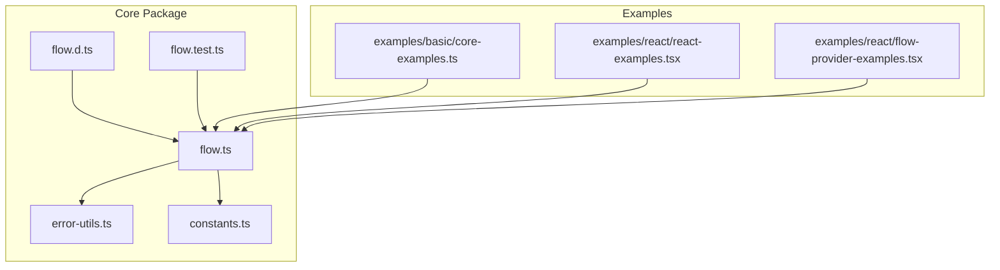
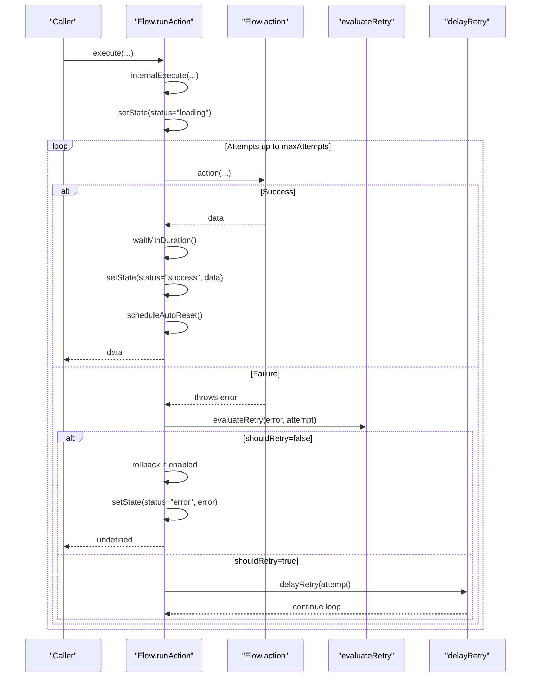
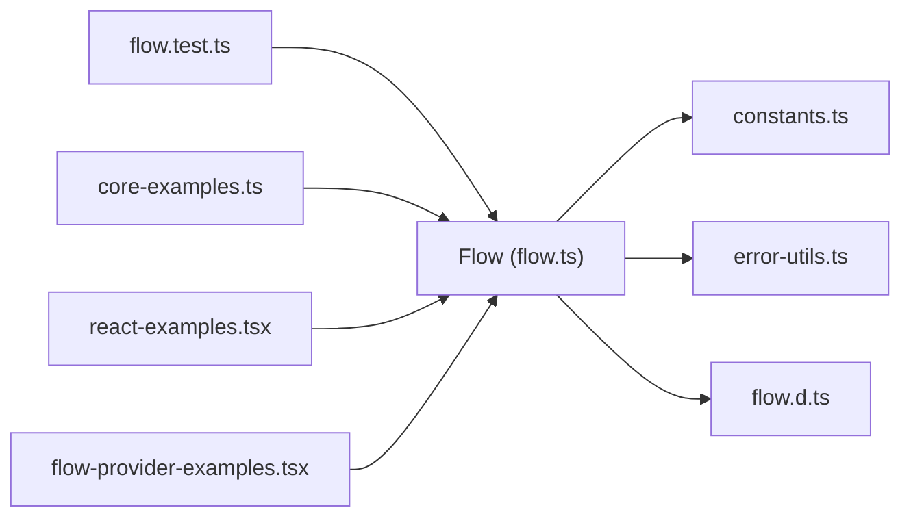

# Retry and Error Handling

<cite>
**Referenced Files in This Document**
- [flow.ts](file://packages/core/src/flow.ts)
- [flow.d.ts](file://packages/core/src/flow.d.ts)
- [error-utils.ts](file://packages/core/src/error-utils.ts)
- [constants.ts](file://packages/core/src/constants.ts)
- [flow.test.ts](file://packages/core/src/flow.test.ts)
- [core-examples.ts](file://examples/basic/core-examples.ts)
- [react-examples.tsx](file://examples/react/react-examples.tsx)
- [flow-provider-examples.tsx](file://examples/react/flow-provider-examples.tsx)
</cite>

## Table of Contents

1. [Introduction](#introduction)
2. [Project Structure](#project-structure)
3. [Core Components](#core-components)
4. [Architecture Overview](#architecture-overview)
5. [Detailed Component Analysis](#detailed-component-analysis)
6. [Dependency Analysis](#dependency-analysis)
7. [Performance Considerations](#performance-considerations)
8. [Troubleshooting Guide](#troubleshooting-guide)
9. [Conclusion](#conclusion)

## Introduction

This document explains the retry logic and error handling mechanisms in the project. It covers the RetryOptions interface, FlowErrorType enumeration, and the FlowError interface with enhanced error metadata. It documents error categorization, retry evaluation logic, and automatic retry mechanisms. Practical examples demonstrate different retry configurations, custom retry conditions, and error handling patterns, including error propagation and recovery strategies such as optimistic updates and rollbacks.

## Project Structure

The retry and error handling features are implemented in the core package under packages/core/src. The main files are:

- flow.ts: Core Flow class with retry logic, error handling, and state management
- flow.d.ts: Type definitions for Flow, RetryOptions, FlowErrorType, FlowError, and related interfaces
- error-utils.ts: Utilities for creating and handling FlowError instances, including error categorization and retryability checks
- constants.ts: Default values for retry, loading, concurrency, progress, and backoff multipliers
- flow.test.ts: Tests covering retry behavior, backoff strategies, and error handling
- examples/basic/core-examples.ts: Basic usage examples including retry logic
- examples/react/react-examples.tsx: React usage examples demonstrating retry and error handling
- examples/react/flow-provider-examples.tsx: Global configuration and advanced retry patterns via FlowProvider

**Diagram sources**

- [flow.ts](file://packages/core/src/flow.ts#L1-L796)
- [flow.d.ts](file://packages/core/src/flow.d.ts#L1-L177)
- [error-utils.ts](file://packages/core/src/error-utils.ts#L1-L207)
- [constants.ts](file://packages/core/src/constants.ts#L1-L51)
- [flow.test.ts](file://packages/core/src/flow.test.ts#L1-L517)
- [core-examples.ts](file://examples/basic/core-examples.ts#L1-L221)
- [react-examples.tsx](file://examples/react/react-examples.tsx#L1-L491)
- [flow-provider-examples.tsx](file://examples/react/flow-provider-examples.tsx#L1-L368)

**Section sources**

- [flow.ts](file://packages/core/src/flow.ts#L1-L796)
- [flow.d.ts](file://packages/core/src/flow.d.ts#L1-L177)
- [error-utils.ts](file://packages/core/src/error-utils.ts#L1-L207)
- [constants.ts](file://packages/core/src/constants.ts#L1-L51)
- [flow.test.ts](file://packages/core/src/flow.test.ts#L1-L517)
- [core-examples.ts](file://examples/basic/core-examples.ts#L1-L221)
- [react-examples.tsx](file://examples/react/react-examples.tsx#L1-L491)
- [flow-provider-examples.tsx](file://examples/react/flow-provider-examples.tsx#L1-L368)

## Core Components

- RetryOptions: Defines maxAttempts, delay, backoff, and an optional shouldRetry callback for fine-grained retry control.
- FlowErrorType: Enumeration of error categories (NETWORK, TIMEOUT, VALIDATION, PERMISSION, SERVER, UNKNOWN).
- FlowError: Enhanced error object with type, message, originalError, and isRetryable flag.
- Flow class: Orchestrates execution, manages state, applies retry/backoff, and handles error propagation and recovery.

Key behaviors:

- Retry evaluation uses maxAttempts and an optional shouldRetry callback.
- Backoff strategies supported: fixed, linear, exponential.
- Error categorization and retryability defaults are provided by error-utils.
- Automatic retry mechanism integrates with Flow’s runAction loop.

**Section sources**

- [flow.d.ts](file://packages/core/src/flow.d.ts#L29-L74)
- [flow.ts](file://packages/core/src/flow.ts#L32-L53)
- [flow.ts](file://packages/core/src/flow.ts#L65-L74)
- [error-utils.ts](file://packages/core/src/error-utils.ts#L3-L39)
- [error-utils.ts](file://packages/core/src/error-utils.ts#L53-L143)

## Architecture Overview

The Flow class encapsulates retry and error handling within its execution pipeline. The runAction loop performs attempts, evaluates shouldRetry, applies backoff delays, and transitions to success or error states. Error utilities provide categorization and retryability decisions.

**Diagram sources**

- [flow.ts](file://packages/core/src/flow.ts#L553-L620)
- [flow.ts](file://packages/core/src/flow.ts#L690-L705)
- [flow.ts](file://packages/core/src/flow.ts#L712-L725)

**Section sources**

- [flow.ts](file://packages/core/src/flow.ts#L553-L620)
- [flow.ts](file://packages/core/src/flow.ts#L690-L705)
- [flow.ts](file://packages/core/src/flow.ts#L712-L725)

## Detailed Component Analysis

### RetryOptions and Backoff Strategies

- maxAttempts: Total number of attempts (default 1, effectively disabling retries).
- delay: Base delay between retries in milliseconds (default 1000).
- backoff: Strategy selection among fixed, linear, exponential.
- shouldRetry: Optional callback receiving error and attempt number to decide whether to retry.

Backoff computation:

- Fixed: delay × attempt multiplier is not applied.
- Linear: delay × attempt × BACKOFF_MULTIPLIER.LINEAR.
- Exponential: delay × Math.pow(BACKOFF_MULTIPLIER.EXPONENTIAL_BASE, attempt - 1).

Default values are defined in constants.ts.

Practical examples:

- Fixed backoff with 3 attempts and 100ms delay.
- Linear backoff with 3 attempts and 20ms delay.
- Exponential backoff with 3 attempts and 10ms delay.

**Section sources**

- [flow.d.ts](file://packages/core/src/flow.d.ts#L29-L74)
- [flow.ts](file://packages/core/src/flow.ts#L65-L74)
- [flow.ts](file://packages/core/src/flow.ts#L712-L725)
- [constants.ts](file://packages/core/src/constants.ts#L10-L17)
- [constants.ts](file://packages/core/src/constants.ts#L47-L50)
- [flow.test.ts](file://packages/core/src/flow.test.ts#L397-L435)
- [core-examples.ts](file://examples/basic/core-examples.ts#L44-L73)

### FlowErrorType and FlowError

- FlowErrorType: Enumerates error categories used for categorization and retryability decisions.
- FlowError: Enhanced error object containing type, message, originalError, and isRetryable.

Error categorization logic:

- Network-related errors (e.g., network, fetch, connection, networkerror).
- Timeout-related errors (e.g., timeout, timed out, aborted).
- Permission/authorization errors (e.g., unauthorized, forbidden, permission, 401, 403).
- Validation errors (e.g., validation, invalid, required, 400).
- Server errors (e.g., server, 500, 503, 502).
- Unknown otherwise.

Retryability defaults:

- NETWORK, TIMEOUT, SERVER are retryable.
- VALIDATION, PERMISSION are not retryable.
- UNKNOWN defaults to not retryable.

Utilities:

- createFlowError: Wraps any error with automatic type detection and retryability.
- detectErrorType: Heuristic-based categorization.
- isErrorRetryable: Returns retryability based on type.
- getErrorMessage: Extracts a human-readable message from various error forms.
- isFlowError: Type guard to check if an error is a FlowError.

**Section sources**

- [flow.ts](file://packages/core/src/flow.ts#L32-L53)
- [error-utils.ts](file://packages/core/src/error-utils.ts#L26-L39)
- [error-utils.ts](file://packages/core/src/error-utils.ts#L53-L113)
- [error-utils.ts](file://packages/core/src/error-utils.ts#L130-L143)
- [error-utils.ts](file://packages/core/src/error-utils.ts#L162-L176)
- [error-utils.ts](file://packages/core/src/error-utils.ts#L192-L206)

### Retry Evaluation Logic

The evaluateRetry method determines whether to retry:

- If attempt reaches maxAttempts, return false.
- If a custom shouldRetry callback is provided, delegate to it.
- Otherwise, return true.

This allows overriding default retryability per error type with custom logic.

**Section sources**

- [flow.ts](file://packages/core/src/flow.ts#L690-L705)

### Automatic Retry Mechanism

The runAction loop:

- Tracks attempt count.
- On success, waits for minDuration, sets success state, triggers callbacks, schedules auto-reset, and processes queued tasks.
- On failure, evaluates retry; if retryable, waits according to backoff strategy and loops; otherwise, handles rollback (if enabled), sets error state, triggers onError callback, and finalizes loading.

Rollback behavior:

- Enabled by default when optimisticResult is used and rollbackOnError is not explicitly disabled.
- Restores previous data snapshot on error.

**Section sources**

- [flow.ts](file://packages/core/src/flow.ts#L553-L620)
- [flow.ts](file://packages/core/src/flow.ts#L594-L614)

### Error Propagation and Recovery Strategies

- Propagation: onError callback receives the error after retries are exhausted or when rollback occurs.
- Recovery: Optimistic updates with rollback enable immediate UI responsiveness while preserving data integrity on failure.
- Auto-reset: Success state can be automatically reset after a configurable delay.

**Section sources**

- [flow.ts](file://packages/core/src/flow.ts#L574-L583)
- [flow.ts](file://packages/core/src/flow.ts#L598-L614)
- [flow.ts](file://packages/core/src/flow.ts#L745-L755)
- [flow.test.ts](file://packages/core/src/flow.test.ts#L136-L200)

### Practical Examples

#### Fixed Backoff Retry

- Configure maxAttempts, delay, and backoff: "fixed".
- Demonstrates that failures are retried until success or maxAttempts reached.

**Section sources**

- [flow.test.ts](file://packages/core/src/flow.test.ts#L32-L47)
- [core-examples.ts](file://examples/basic/core-examples.ts#L44-L73)

#### Linear Backoff Retry

- Configure backoff: "linear".
- Delays increase linearly with attempt number.

**Section sources**

- [flow.test.ts](file://packages/core/src/flow.test.ts#L397-L415)

#### Exponential Backoff Retry

- Configure backoff: "exponential".
- Delays grow exponentially with attempt number.

**Section sources**

- [flow.test.ts](file://packages/core/src/flow.test.ts#L417-L435)

#### Custom Retry Conditions

- Use shouldRetry to override default retryability.
- Example demonstrates excluding validation and unauthorized errors from retries.

**Section sources**

- [flow-provider-examples.tsx](file://examples/react/flow-provider-examples.tsx#L302-L314)

#### Error Handling Patterns

- onError callback invoked after retries are exhausted.
- Error messages extracted via getErrorMessage for consistent display.

**Section sources**

- [flow.ts](file://packages/core/src/flow.ts#L574-L583)
- [flow.ts](file://packages/core/src/flow.ts#L610-L614)
- [error-utils.ts](file://packages/core/src/error-utils.ts#L162-L176)

#### Optimistic Updates with Rollback

- OptimisticResult can be a static value or a function deriving data from previous state and arguments.
- Rollback restores previous data on error unless rollbackOnError is disabled.

**Section sources**

- [flow.ts](file://packages/core/src/flow.ts#L495-L524)
- [flow.ts](file://packages/core/src/flow.ts#L594-L614)
- [flow.test.ts](file://packages/core/src/flow.test.ts#L136-L200)

#### Global Retry Configuration via FlowProvider

- Configure retry globally and inherit it across flows.
- Override specific flows when needed.

**Section sources**

- [flow-provider-examples.tsx](file://examples/react/flow-provider-examples.tsx#L59-L95)
- [flow-provider-examples.tsx](file://examples/react/flow-provider-examples.tsx#L101-L155)

## Dependency Analysis

The Flow class depends on:

- constants.ts for default values (retry, loading, progress, backoff multipliers).
- error-utils.ts for error categorization and retryability decisions.

**Diagram sources**

- [flow.ts](file://packages/core/src/flow.ts#L1-L796)
- [constants.ts](file://packages/core/src/constants.ts#L1-L51)
- [error-utils.ts](file://packages/core/src/error-utils.ts#L1-L207)
- [flow.d.ts](file://packages/core/src/flow.d.ts#L1-L177)
- [flow.test.ts](file://packages/core/src/flow.test.ts#L1-L517)
- [core-examples.ts](file://examples/basic/core-examples.ts#L1-L221)
- [react-examples.tsx](file://examples/react/react-examples.tsx#L1-L491)
- [flow-provider-examples.tsx](file://examples/react/flow-provider-examples.tsx#L1-L368)

**Section sources**

- [flow.ts](file://packages/core/src/flow.ts#L1-L796)
- [constants.ts](file://packages/core/src/constants.ts#L1-L51)
- [error-utils.ts](file://packages/core/src/error-utils.ts#L1-L207)
- [flow.d.ts](file://packages/core/src/flow.d.ts#L1-L177)
- [flow.test.ts](file://packages/core/src/flow.test.ts#L1-L517)
- [core-examples.ts](file://examples/basic/core-examples.ts#L1-L221)
- [react-examples.tsx](file://examples/react/react-examples.tsx#L1-L491)
- [flow-provider-examples.tsx](file://examples/react/flow-provider-examples.tsx#L1-L368)

## Performance Considerations

- Backoff strategies influence retry timing; exponential backoff reduces load on failing systems but increases total latency.
- minDuration ensures consistent UX by preventing UI flashes for fast operations.
- Debounce and throttle reduce redundant executions when users trigger frequent actions.
- AbortController cancels in-flight requests to avoid wasted resources.

[No sources needed since this section provides general guidance]

## Troubleshooting Guide

Common issues and resolutions:

- Retries not occurring: Verify maxAttempts > 1 and that shouldRetry does not return false for the given error.
- Unexpected retry behavior: Inspect detectErrorType and isErrorRetryable to confirm categorization and default retryability.
- Rollback not happening: Ensure optimisticResult is set and rollbackOnError is not disabled.
- Long delays: Adjust delay and backoff strategy; consider minDuration and loading delay for UX.

**Section sources**

- [flow.ts](file://packages/core/src/flow.ts#L690-L705)
- [error-utils.ts](file://packages/core/src/error-utils.ts#L53-L143)
- [flow.ts](file://packages/core/src/flow.ts#L594-L614)
- [flow.test.ts](file://packages/core/src/flow.test.ts#L397-L435)

## Conclusion

The retry and error handling system provides robust mechanisms for resilient asynchronous operations. RetryOptions offers flexible configuration, while FlowErrorType and FlowError enable structured error handling with categorization and retryability. The Flow class integrates these capabilities seamlessly, supporting backoff strategies, custom retry conditions, optimistic updates with rollback, and automatic state transitions. Examples across basic and React contexts demonstrate practical usage patterns for production-grade applications.
