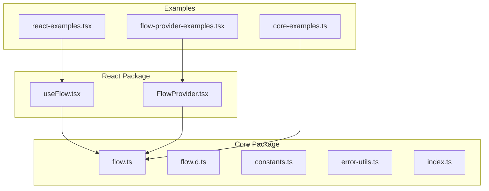
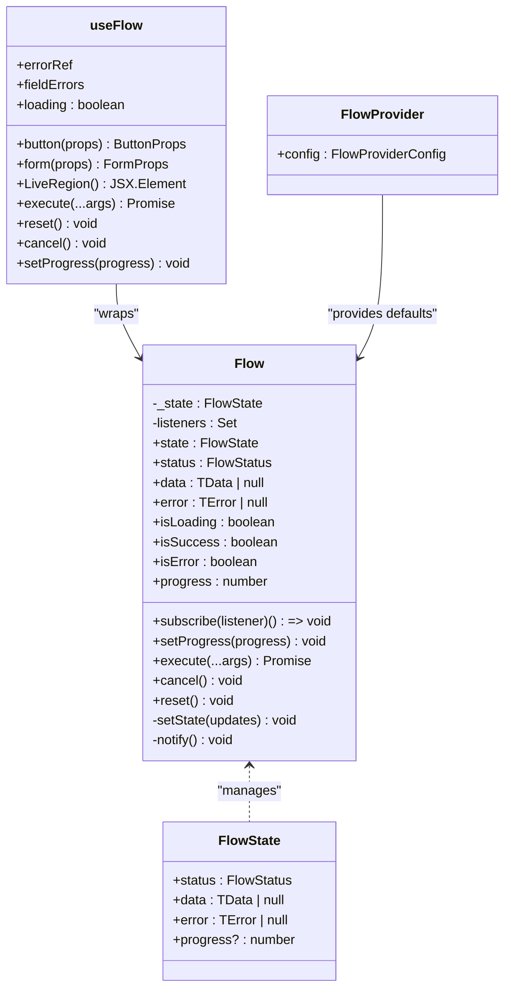
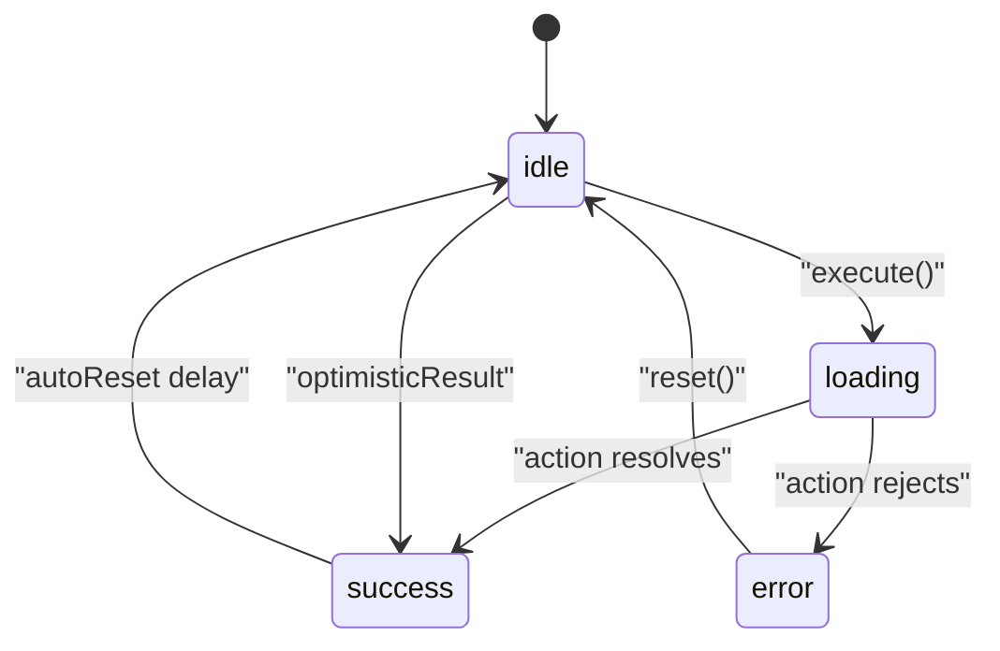
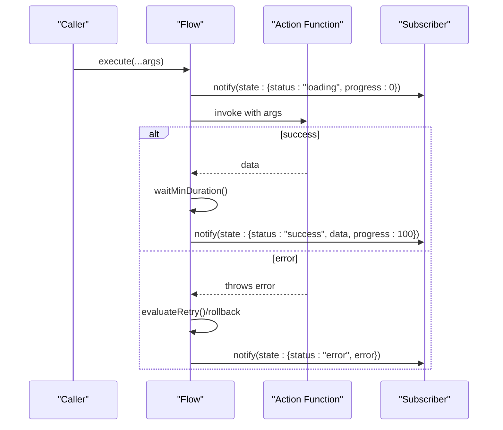
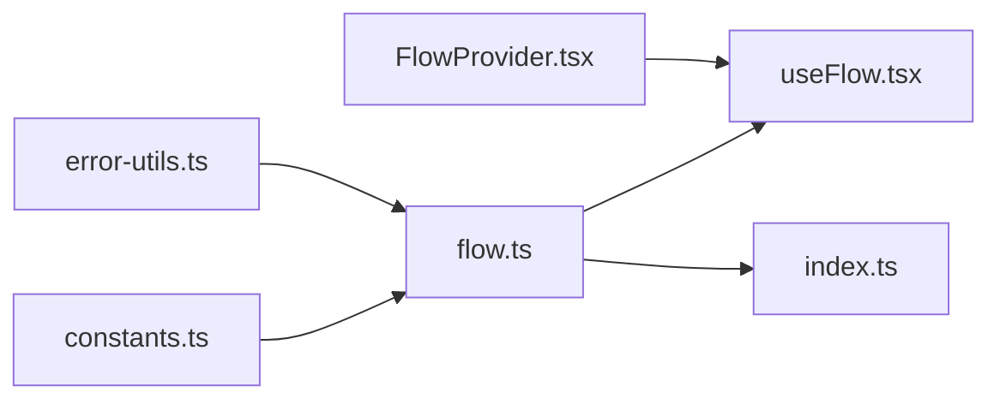

# State Management

<cite>
**Referenced Files in This Document**
- [flow.d.ts](file://packages/core/src/flow.d.ts)
- [flow.ts](file://packages/core/src/flow.ts)
- [constants.ts](file://packages/core/src/constants.ts)
- [error-utils.ts](file://packages/core/src/error-utils.ts)
- [index.ts](file://packages/core/src/index.ts)
- [useFlow.tsx](file://packages/react/src/useFlow.tsx)
- [FlowProvider.tsx](file://packages/react/src/FlowProvider.tsx)
- [flow.test.ts](file://packages/core/src/flow.test.ts)
- [core-examples.ts](file://examples/basic/core-examples.ts)
- [react-examples.tsx](file://examples/react/react-examples.tsx)
- [flow-provider-examples.tsx](file://examples/react/flow-provider-examples.tsx)
</cite>

## Table of Contents

1. [Introduction](#introduction)
2. [Project Structure](#project-structure)
3. [Core Components](#core-components)
4. [Architecture Overview](#architecture-overview)
5. [Detailed Component Analysis](#detailed-component-analysis)
6. [Dependency Analysis](#dependency-analysis)
7. [Performance Considerations](#performance-considerations)
8. [Troubleshooting Guide](#troubleshooting-guide)
9. [Conclusion](#conclusion)
10. [Appendices](#appendices)

## Introduction

This document explains the Flow state management system, focusing on the FlowState interface, FlowStatus enumeration, and state properties. It documents all state getters (status, data, error, isLoading, isSuccess, isError, progress), describes state transitions among idle, loading, success, and error states, and demonstrates observer pattern implementation with the subscribe() method. It also covers the reactive nature of state updates and how subscribers receive notifications, with practical examples and diagrams.

## Project Structure

The state management lives primarily in the core package under packages/core/src. The React integration is in packages/react/src. Examples are provided in examples/ for both core and React usage.

**Diagram sources**

- [flow.ts](file://packages/core/src/flow.ts#L1-L796)
- [flow.d.ts](file://packages/core/src/flow.d.ts#L1-L177)
- [constants.ts](file://packages/core/src/constants.ts#L1-L51)
- [error-utils.ts](file://packages/core/src/error-utils.ts#L1-L207)
- [index.ts](file://packages/core/src/index.ts#L1-L4)
- [useFlow.tsx](file://packages/react/src/useFlow.tsx#L1-L281)
- [FlowProvider.tsx](file://packages/react/src/FlowProvider.tsx#L1-L139)
- [core-examples.ts](file://examples/basic/core-examples.ts#L1-L221)
- [react-examples.tsx](file://examples/react/react-examples.tsx#L1-L491)
- [flow-provider-examples.tsx](file://examples/react/flow-provider-examples.tsx#L1-L368)

**Section sources**

- [flow.ts](file://packages/core/src/flow.ts#L1-L796)
- [flow.d.ts](file://packages/core/src/flow.d.ts#L1-L177)
- [useFlow.tsx](file://packages/react/src/useFlow.tsx#L1-L281)
- [FlowProvider.tsx](file://packages/react/src/FlowProvider.tsx#L1-L139)

## Core Components

- FlowState interface defines the shape of the internal state: status, data, error, and optional progress.
- FlowStatus is a union of "idle", "loading", "success", "error".
- Flow class encapsulates state, execution, retries, concurrency, optimistic updates, and subscriptions.

Key elements:

- Internal state storage and immutable snapshots for getters.
- Reactive updates via setState and notify.
- Observer pattern via subscribe(listener) returning an unsubscribe function.
- Progress tracking with bounds checking and manual setter.

**Section sources**

- [flow.d.ts](file://packages/core/src/flow.d.ts#L12-L30)
- [flow.ts](file://packages/core/src/flow.ts#L220-L227)
- [flow.ts](file://packages/core/src/flow.ts#L294-L335)
- [flow.ts](file://packages/core/src/flow.ts#L374-L381)
- [flow.ts](file://packages/core/src/flow.ts#L759-L766)

## Architecture Overview

The Flow engine orchestrates asynchronous actions and maintains UI-ready state. It exposes getters for convenience and a subscribe mechanism for observers. React integration wraps Flow with hooks and providers to deliver a declarative API.

**Diagram sources**

- [flow.d.ts](file://packages/core/src/flow.d.ts#L12-L30)
- [flow.ts](file://packages/core/src/flow.ts#L220-L227)
- [flow.ts](file://packages/core/src/flow.ts#L294-L335)
- [flow.ts](file://packages/core/src/flow.ts#L374-L381)
- [flow.ts](file://packages/core/src/flow.ts#L759-L766)
- [useFlow.tsx](file://packages/react/src/useFlow.tsx#L77-L281)
- [FlowProvider.tsx](file://packages/react/src/FlowProvider.tsx#L50-L56)

## Detailed Component Analysis

### FlowState and FlowStatus

- FlowStatus is a closed set of string literals: "idle", "loading", "success", "error".
- FlowState includes:
  - status: current execution status
  - data: last successful result or null
  - error: last failed error or null
  - progress?: numeric progress in 0–100

These fields are exposed via getters and updated atomically through setState.

**Section sources**

- [flow.d.ts](file://packages/core/src/flow.d.ts#L8-L30)
- [flow.ts](file://packages/core/src/flow.ts#L220-L227)

### State Getters Behavior

- status: returns the current FlowStatus.
- data: returns the last successful data or null.
- error: returns the last failed error or null.
- isLoading: true when status is "loading" and not delaying; respects loading.delay.
- isSuccess: true when status is "success".
- isError: true when status is "error".
- progress: returns current progress or 0 if unset.

Behavioral notes:

- isLoading respects a delay timer so very fast actions do not flash loading UI.
- progress is clamped to [0, 100] and can be set manually while loading.

**Section sources**

- [flow.ts](file://packages/core/src/flow.ts#L294-L335)
- [flow.ts](file://packages/core/src/flow.ts#L318-L320)
- [flow.ts](file://packages/core/src/flow.ts#L348-L354)
- [constants.ts](file://packages/core/src/constants.ts#L37-L42)

### State Transitions

Transitions occur based on execution lifecycle:

- idle → loading: when execute() starts and no optimistic update is applied.
- loading → success: after action resolves, respecting minDuration and setting progress to 100.
- loading → error: after action rejects, honoring retry policy and rollback behavior.
- success → idle: after autoReset delay elapses.
- error → idle: after manual reset or cancel.
- idle → success (optimistic): when optimisticResult is provided and applied immediately.

**Diagram sources**

- [flow.ts](file://packages/core/src/flow.ts#L524-L543)
- [flow.ts](file://packages/core/src/flow.ts#L573-L583)
- [flow.ts](file://packages/core/src/flow.ts#L598-L614)
- [flow.ts](file://packages/core/src/flow.ts#L745-L754)
- [flow.ts](file://packages/core/src/flow.ts#L494-L524)

**Section sources**

- [flow.ts](file://packages/core/src/flow.ts#L524-L543)
- [flow.ts](file://packages/core/src/flow.ts#L553-L620)
- [flow.ts](file://packages/core/src/flow.ts#L745-L754)

### Observer Pattern and Reactive Updates

- subscribe(listener) registers a callback that receives a deep copy of the current state snapshot on every change.
- setState(updates) updates internal state and triggers notify().
- notify() iterates registered listeners and invokes them with the current snapshot.

Reactive behavior:

- React wrapper subscribes to Flow and keeps a local snapshot, exposing loading, data, error, and other helpers.
- Changes propagate to UI via React state updates.

**Section sources**

- [flow.ts](file://packages/core/src/flow.ts#L374-L381)
- [flow.ts](file://packages/core/src/flow.ts#L759-L766)
- [useFlow.tsx](file://packages/react/src/useFlow.tsx#L251-L253)

### State Mutation Patterns

Common mutations:

- Transition to loading: set status to "loading", clear error, reset progress.
- Apply optimistic result: set status to "success", set data to optimistic value, clear error, reset progress.
- On success: set status to "success", set data to real result, set progress to 100, call onSuccess, schedule autoReset.
- On error: set status to "error", preserve or rollback data, set error, call onError, finalize loading.
- Manual progress: setProgress(n) while loading clamps n to [0, 100].
- Reset/cancel: reset to idle with null data and error, clear timers.

**Section sources**

- [flow.ts](file://packages/core/src/flow.ts#L524-L543)
- [flow.ts](file://packages/core/src/flow.ts#L573-L583)
- [flow.ts](file://packages/core/src/flow.ts#L598-L614)
- [flow.ts](file://packages/core/src/flow.ts#L348-L354)
- [flow.ts](file://packages/core/src/flow.ts#L411-L419)
- [flow.ts](file://packages/core/src/flow.ts#L393-L400)

### Examples: State Snapshots and Observer Notifications

- Core examples demonstrate subscribe() usage and state snapshots across phases.
- Tests verify state transitions, isLoading semantics, and progress behavior.

Representative scenarios:

- Initial state: status "idle", data null, error null, progress 0.
- During loading: status "loading", isLoading true (respecting delay), progress 0 initially.
- After success: status "success", data set, error null, progress 100, autoReset scheduled.
- After error: status "error", data preserved or rolled back, error set.
- After reset/cancel: status "idle", data null, error null, progress 0.

**Section sources**

- [flow.test.ts](file://packages/core/src/flow.test.ts#L5-L30)
- [flow.test.ts](file://packages/core/src/flow.test.ts#L382-L395)
- [flow.test.ts](file://packages/core/src/flow.test.ts#L490-L499)
- [core-examples.ts](file://examples/basic/core-examples.ts#L28-L38)

### Sequence: Execution Flow and State Notifications

**Diagram sources**

- [flow.ts](file://packages/core/src/flow.ts#L449-L464)
- [flow.ts](file://packages/core/src/flow.ts#L553-L620)
- [flow.ts](file://packages/core/src/flow.ts#L733-L743)
- [flow.ts](file://packages/core/src/flow.ts#L764-L766)

## Dependency Analysis

- Core Flow depends on constants for defaults and backoff multipliers.
- React useFlow depends on Flow and FlowProvider for configuration merging.
- Error utilities provide FlowError creation and categorization.

**Diagram sources**

- [constants.ts](file://packages/core/src/constants.ts#L1-L51)
- [error-utils.ts](file://packages/core/src/error-utils.ts#L1-L207)
- [flow.ts](file://packages/core/src/flow.ts#L1-L7)
- [useFlow.tsx](file://packages/react/src/useFlow.tsx#L9-L10)
- [FlowProvider.tsx](file://packages/react/src/FlowProvider.tsx#L1-L2)
- [index.ts](file://packages/core/src/index.ts#L1-L4)

**Section sources**

- [flow.ts](file://packages/core/src/flow.ts#L1-L7)
- [useFlow.tsx](file://packages/react/src/useFlow.tsx#L9-L10)
- [FlowProvider.tsx](file://packages/react/src/FlowProvider.tsx#L1-L2)
- [index.ts](file://packages/core/src/index.ts#L1-L4)

## Performance Considerations

- Loading UX: minDuration prevents UI flicker for fast actions; delay avoids showing spinners for near-instant operations.
- Progress: setProgress clamps values and only applies while loading.
- Retries: backoff strategies (fixed, linear, exponential) balance resilience and latency.
- Concurrency: keep vs restart vs enqueue reduces redundant work and improves responsiveness.
- React integration: memoized helpers and snapshot synchronization minimize re-renders.

[No sources needed since this section provides general guidance]

## Troubleshooting Guide

Common issues and checks:

- isLoading false during short delays: verify loading.delay is configured; isLoading respects delay.
- Progress not updating: ensure setProgress is called while status is "loading"; values are clamped.
- Auto-reset not happening: confirm autoReset.enabled and delay are set appropriately.
- Optimistic rollback unexpected: check rollbackOnError default and explicit configuration.
- Subscriber not receiving updates: ensure subscribe() is called and not immediately unsubscribed.

**Section sources**

- [flow.ts](file://packages/core/src/flow.ts#L533-L541)
- [flow.ts](file://packages/core/src/flow.ts#L733-L743)
- [flow.ts](file://packages/core/src/flow.ts#L348-L354)
- [flow.ts](file://packages/core/src/flow.ts#L745-L754)
- [flow.ts](file://packages/core/src/flow.ts#L594-L614)
- [flow.test.ts](file://packages/core/src/flow.test.ts#L465-L488)
- [flow.test.ts](file://packages/core/src/flow.test.ts#L490-L499)
- [flow.test.ts](file://packages/core/src/flow.test.ts#L369-L380)

## Conclusion

Flow provides a robust, reactive state management model for asynchronous actions. Its state getters, transitions, and observer pattern enable predictable UI behavior across loading, success, and error states. The core package offers fine-grained control, while the React integration simplifies adoption with hooks and providers.

[No sources needed since this section summarizes without analyzing specific files]

## Appendices

### Appendix A: State Getter Reference

- status: returns FlowStatus.
- data: returns last successful data or null.
- error: returns last failed error or null.
- isLoading: true when status is "loading" and not delaying.
- isSuccess: true when status is "success".
- isError: true when status is "error".
- progress: returns current progress or 0.

**Section sources**

- [flow.ts](file://packages/core/src/flow.ts#L294-L335)

### Appendix B: Example Workflows

- Core examples: simple action, retry logic, optimistic UI, concurrency prevention, cancellation, auto reset.
- React examples: login form, optimistic like button, delete with confirmation, form helpers, search with debounce, file upload with progress, retry with user control, advanced form with validation and accessibility.

**Section sources**

- [core-examples.ts](file://examples/basic/core-examples.ts#L14-L221)
- [react-examples.tsx](file://examples/react/react-examples.tsx#L14-L491)
