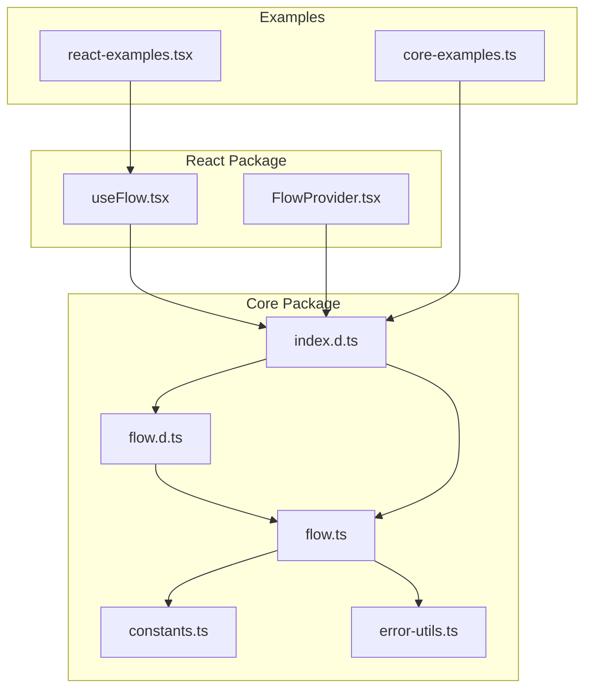
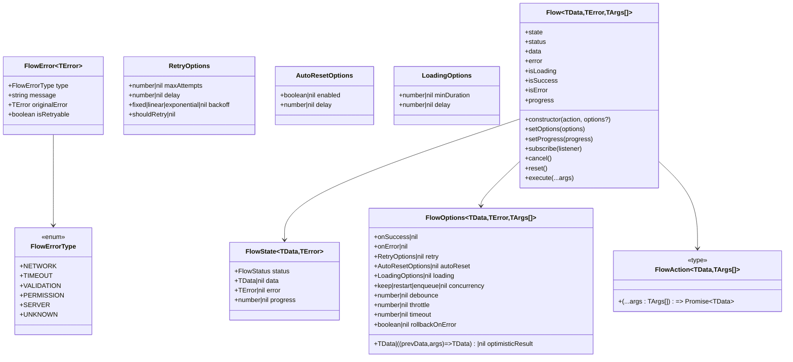
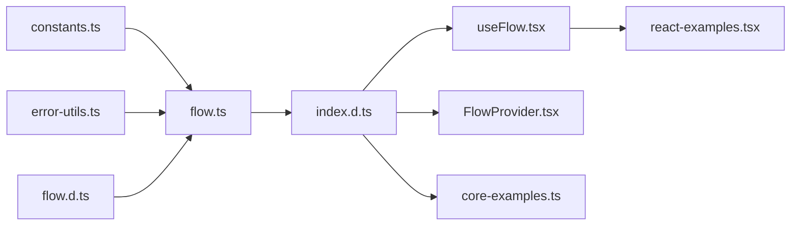

# Type Definitions

<cite>
**Referenced Files in This Document**
- [flow.d.ts](file://packages/core/src/flow.d.ts)
- [flow.ts](file://packages/core/src/flow.ts)
- [constants.ts](file://packages/core/src/constants.ts)
- [error-utils.ts](file://packages/core/src/error-utils.ts)
- [index.d.ts](file://packages/core/src/index.d.ts)
- [useFlow.tsx](file://packages/react/src/useFlow.tsx)
- [FlowProvider.tsx](file://packages/react/src/FlowProvider.tsx)
- [core-examples.ts](file://examples/basic/core-examples.ts)
- [react-examples.tsx](file://examples/react/react-examples.tsx)
</cite>

## Table of Contents
1. [Introduction](#introduction)
2. [Project Structure](#project-structure)
3. [Core Components](#core-components)
4. [Architecture Overview](#architecture-overview)
5. [Detailed Component Analysis](#detailed-component-analysis)
6. [Dependency Analysis](#dependency-analysis)
7. [Performance Considerations](#performance-considerations)
8. [Troubleshooting Guide](#troubleshooting-guide)
9. [Conclusion](#conclusion)

## Introduction
This document provides a comprehensive guide to the TypeScript type definitions and interfaces used in the Flow API. It focuses on the FlowState generic interface with type parameters, FlowAction type alias, FlowErrorType enum, FlowError interface, and all option interfaces (RetryOptions, AutoResetOptions, LoadingOptions, FlowOptions). It also documents the FlowStatus union type and FlowAction generic constraints. The guide includes practical examples demonstrating proper type usage, generic type inference, and type-safe patterns, along with type safety considerations and common pitfalls.

## Project Structure
The Flow API consists of two primary packages:
- Core package (@asyncflowstate/core): Provides the Flow class and its associated types and utilities.
- React package (@asyncflowstate/react): Provides React hooks and components that build on top of the core Flow types.

**Diagram sources**
- [flow.d.ts](file://packages/core/src/flow.d.ts#L1-L177)
- [flow.ts](file://packages/core/src/flow.ts#L1-L810)
- [constants.ts](file://packages/core/src/constants.ts#L1-L51)
- [error-utils.ts](file://packages/core/src/error-utils.ts#L1-L207)
- [index.d.ts](file://packages/core/src/index.d.ts#L1-L2)
- [useFlow.tsx](file://packages/react/src/useFlow.tsx#L1-L281)
- [FlowProvider.tsx](file://packages/react/src/FlowProvider.tsx#L1-L139)
- [core-examples.ts](file://examples/basic/core-examples.ts#L1-L221)
- [react-examples.tsx](file://examples/react/react-examples.tsx#L1-L491)

**Section sources**
- [index.d.ts](file://packages/core/src/index.d.ts#L1-L2)

## Core Components
This section documents the primary type definitions and their roles in the Flow API.

- FlowStatus union type
  - Purpose: Represents the lifecycle states of a Flow.
  - Values: "idle" | "loading" | "success" | "error".
  - Usage: Used in FlowState.status and getter methods like isLoading, isSuccess, isError.

- FlowState generic interface
  - Purpose: Encapsulates the current state of a Flow instance.
  - Type parameters:
    - TData: The type of data returned by successful action execution.
    - TError: The type of error object thrown on failure.
  - Properties:
    - status: FlowStatus
    - data: TData | null
    - error: TError | null
    - progress?: number (optional)

- FlowAction type alias
  - Purpose: Describes an asynchronous action function that Flow executes.
  - Generic constraints:
    - TData: Return type of the action.
    - TArgs extends any[]: Tuple type representing the arguments passed to the action.
  - Signature: (...args: TArgs) => Promise<TData>

- FlowErrorType enum
  - Purpose: Categorizes errors to drive UI feedback and retry logic.
  - Values: NETWORK, TIMEOUT, VALIDATION, PERMISSION, SERVER, UNKNOWN.

- FlowError interface
  - Purpose: Enhanced error object with metadata for Flow.
  - Type parameter: TError (original error type).
  - Properties:
    - type: FlowErrorType
    - message: string
    - originalError: TError
    - isRetryable: boolean

- Option interfaces
  - RetryOptions: Controls retry behavior.
    - maxAttempts?: number
    - delay?: number
    - backoff?: "fixed" | "linear" | "exponential"
    - shouldRetry?: (error: any, attempt: number) => boolean | Promise<boolean>
  - AutoResetOptions: Controls automatic reset to idle after success.
    - enabled?: boolean
    - delay?: number
  - LoadingOptions: Controls perceived performance of loading state.
    - minDuration?: number
    - delay?: number
  - FlowOptions generic interface
    - Purpose: Configuration options for a Flow instance.
    - Type parameters:
      - TData = any
      - TError = any
      - TArgs extends any[] = any[]
    - Properties:
      - onSuccess?: (data: TData) => void
      - onError?: (error: TError) => void
      - retry?: RetryOptions
      - autoReset?: AutoResetOptions
      - loading?: LoadingOptions
      - concurrency?: "keep" | "restart" | "enqueue"
      - debounce?: number
      - throttle?: number
      - timeout?: number
      - optimisticResult?: TData | ((prevData: TData | null, args: TArgs) => TData)
      - rollbackOnError?: boolean

- Flow class generics
  - Purpose: Orchestrates asynchronous actions and manages UI states.
  - Generics:
    - TData = any
    - TError = any
    - TArgs extends any[] = any[]
  - Key members:
    - Constructor(action: FlowAction<TData, TArgs>, options?: FlowOptions<TData, TError>)
    - state, status, data, error, isLoading, isSuccess, isError, progress
    - setOptions(options: FlowOptions<TData, TError>): void
    - subscribe(listener: (state: FlowState<TData, TError>) => void): () => void
    - cancel(): void
    - reset(): void
    - setProgress(progress: number): void
    - execute(...args: TArgs): Promise<TData | undefined>

**Section sources**
- [flow.d.ts](file://packages/core/src/flow.d.ts#L8-L177)
- [flow.ts](file://packages/core/src/flow.ts#L16-L171)
- [constants.ts](file://packages/core/src/constants.ts#L10-L50)

## Architecture Overview
The Flow API exposes a strongly-typed interface for managing asynchronous actions. The core types are defined in the core package and consumed by the React package. The Flow class encapsulates state, error handling, retries, concurrency, and optimistic updates, while the option interfaces provide flexible configuration.

**Diagram sources**
- [flow.d.ts](file://packages/core/src/flow.d.ts#L12-L177)
- [flow.ts](file://packages/core/src/flow.ts#L21-L171)

## Detailed Component Analysis

### FlowStatus Union Type
- Description: Represents the lifecycle states of a Flow.
- Values: "idle" | "loading" | "success" | "error".
- Usage: Used in FlowState.status and getter methods like isLoading, isSuccess, isError.

**Section sources**
- [flow.d.ts](file://packages/core/src/flow.d.ts#L8-L8)

### FlowState Generic Interface
- Purpose: Encapsulates the current state of a Flow instance.
- Type parameters:
  - TData: The type of data returned by successful action execution.
  - TError: The type of error object thrown on failure.
- Properties:
  - status: FlowStatus
  - data: TData | null
  - error: TError | null
  - progress?: number (optional)

**Section sources**
- [flow.d.ts](file://packages/core/src/flow.d.ts#L12-L21)

### FlowAction Type Alias
- Purpose: Describes an asynchronous action function that Flow executes.
- Generic constraints:
  - TData: Return type of the action.
  - TArgs extends any[]: Tuple type representing the arguments passed to the action.
- Signature: (...args: TArgs) => Promise<TData>

**Section sources**
- [flow.d.ts](file://packages/core/src/flow.d.ts#L25-L27)

### FlowErrorType Enum
- Purpose: Categorizes errors to drive UI feedback and retry logic.
- Values: NETWORK, TIMEOUT, VALIDATION, PERMISSION, SERVER, UNKNOWN.

**Section sources**
- [flow.ts](file://packages/core/src/flow.ts#L35-L42)

### FlowError Interface
- Purpose: Enhanced error object with metadata for Flow.
- Type parameter: TError (original error type).
- Properties:
  - type: FlowErrorType
  - message: string
  - originalError: TError
  - isRetryable: boolean

**Section sources**
- [flow.ts](file://packages/core/src/flow.ts#L47-L53)

### Option Interfaces

#### RetryOptions
- Purpose: Controls retry behavior.
- Properties:
  - maxAttempts?: number
  - delay?: number
  - backoff?: "fixed" | "linear" | "exponential"
  - shouldRetry?: (error: any, attempt: number) => boolean | Promise<boolean>

**Section sources**
- [flow.ts](file://packages/core/src/flow.ts#L65-L74)

#### AutoResetOptions
- Purpose: Controls automatic reset to idle after success.
- Properties:
  - enabled?: boolean
  - delay?: number

**Section sources**
- [flow.ts](file://packages/core/src/flow.ts#L79-L84)

#### LoadingOptions
- Purpose: Controls perceived performance of loading state.
- Properties:
  - minDuration?: number
  - delay?: number

**Section sources**
- [flow.ts](file://packages/core/src/flow.ts#L89-L94)

#### FlowOptions Generic Interface
- Purpose: Configuration options for a Flow instance.
- Type parameters:
  - TData = any
  - TError = any
  - TArgs extends any[] = any[]
- Additional properties:
  - concurrency?: "keep" | "restart" | "enqueue"
  - debounce?: number
  - throttle?: number
  - timeout?: number
  - optimisticResult?: TData | ((prevData: TData | null, args: TArgs) => TData)
  - rollbackOnError?: boolean

**Section sources**
- [flow.ts](file://packages/core/src/flow.ts#L99-L171)

### Flow Class Generics and Constraints
- Generics:
  - TData = any
  - TError = any
  - TArgs extends any[] = any[]
- Constraints:
  - TArgs extends any[] ensures FlowAction receives a tuple of arguments.
- Key members:
  - Constructor(action: FlowAction<TData, TArgs>, options?: FlowOptions<TData, TError>)
  - state, status, data, error, isLoading, isSuccess, isError, progress
  - setOptions(options: FlowOptions<TData, TError>): void
  - subscribe(listener: (state: FlowState<TData, TError>) => void): () => void
  - cancel(): void
  - reset(): void
  - setProgress(progress: number): void
  - execute(...args: TArgs): Promise<TData | undefined>

**Section sources**
- [flow.ts](file://packages/core/src/flow.ts#L231-L286)

### Error Utilities and Type Guards
- createFlowError<TError = unknown>(error: TError, options?: Partial<Omit<FlowError<TError>, "originalError">>): FlowError<TError>
- detectErrorType(error: unknown): FlowErrorType
- isErrorRetryable(errorType: FlowErrorType): boolean
- getErrorMessage(error: unknown): string
- isFlowError<TError = unknown>(error: unknown): error is FlowError<TError>

These utilities provide type-safe error handling and categorization, leveraging the FlowError interface and FlowErrorType enum.

**Section sources**
- [error-utils.ts](file://packages/core/src/error-utils.ts#L26-L206)

### React-Specific Types
- FormHelperOptions<TArgs extends any[]>
  - Purpose: Options for the form() helper in React.
  - Properties:
    - extractFormData?: boolean
    - validate?: (...args: TArgs) => Record<string, string> | null | undefined | Promise<Record<string, string> | null | undefined>
    - resetOnSuccess?: boolean
- ButtonHelperOptions extends ButtonHTMLAttributes<HTMLButtonElement>
  - Purpose: Options for the button() helper in React.
- A11yOptions<TData, TError>
  - Purpose: Accessibility configuration for automatic screen reader announcements.
  - Properties:
    - announceSuccess?: string | ((data: TData) => string)
    - announceError?: string | ((error: TError) => string)
    - liveRegionRel?: "polite" | "assertive"
- ReactFlowOptions<TData = any, TError = any> extends FlowOptions<TData, TError>
  - Purpose: React-specific options extending FlowOptions.
  - Properties:
    - a11y?: A11yOptions<TData, TError>
- FlowProviderConfig<TData = any, TError = any> extends FlowOptions<TData, TError>
  - Purpose: Global configuration options for all flows within a FlowProvider.
  - Properties:
    - overrideMode?: "merge" | "replace"

**Section sources**
- [useFlow.tsx](file://packages/react/src/useFlow.tsx#L15-L67)
- [FlowProvider.tsx](file://packages/react/src/FlowProvider.tsx#L7-L17)

## Dependency Analysis
The Flow API types depend on shared constants and error utilities. The core package exports the Flow class and its types, while the React package builds on top of these types to provide React-specific helpers.

**Diagram sources**
- [constants.ts](file://packages/core/src/constants.ts#L1-L51)
- [error-utils.ts](file://packages/core/src/error-utils.ts#L1-L207)
- [flow.d.ts](file://packages/core/src/flow.d.ts#L1-L177)
- [flow.ts](file://packages/core/src/flow.ts#L1-L810)
- [index.d.ts](file://packages/core/src/index.d.ts#L1-L2)
- [useFlow.tsx](file://packages/react/src/useFlow.tsx#L1-L281)
- [FlowProvider.tsx](file://packages/react/src/FlowProvider.tsx#L1-L139)
- [core-examples.ts](file://examples/basic/core-examples.ts#L1-L221)
- [react-examples.tsx](file://examples/react/react-examples.tsx#L1-L491)

**Section sources**
- [flow.ts](file://packages/core/src/flow.ts#L1-L7)
- [error-utils.ts](file://packages/core/src/error-utils.ts#L1-L7)

## Performance Considerations
- Retry backoff strategies: Choose appropriate backoff ("fixed", "linear", "exponential") to balance responsiveness and server load.
- Loading UX: Use minDuration and delay to prevent UI flicker and improve perceived performance.
- Concurrency: Select concurrency strategy ("keep", "restart", "enqueue") based on user expectations and data consistency needs.
- Debounce and throttle: Apply to reduce network requests for rapid user interactions (e.g., search).

[No sources needed since this section provides general guidance]

## Troubleshooting Guide
Common type-related pitfalls and solutions:
- Incorrect generic inference:
  - Symptom: FlowOptions<TData, TError> does not infer TArgs correctly.
  - Solution: Explicitly specify TArgs when creating Flow instances with specific argument tuples.
  - Example reference: [flow.ts](file://packages/core/src/flow.ts#L283-L286)
- Conflicting option types:
  - Symptom: Merging global and local options leads to unexpected behavior.
  - Solution: Use FlowProviderConfig.overrideMode to control merging behavior.
  - Example reference: [FlowProvider.tsx](file://packages/react/src/FlowProvider.tsx#L84-L138)
- Error handling:
  - Symptom: Using generic error types without FlowErrorType categorization.
  - Solution: Use createFlowError and detectErrorType for consistent error handling.
  - Example reference: [error-utils.ts](file://packages/core/src/error-utils.ts#L26-L39)
- Optimistic updates:
  - Symptom: Incorrect rollback behavior or snapshot handling.
  - Solution: Ensure rollbackOnError is configured appropriately and verify snapshot clearing after success.
  - Example reference: [flow.ts](file://packages/core/src/flow.ts#L509-L538)

**Section sources**
- [flow.ts](file://packages/core/src/flow.ts#L283-L286)
- [FlowProvider.tsx](file://packages/react/src/FlowProvider.tsx#L84-L138)
- [error-utils.ts](file://packages/core/src/error-utils.ts#L26-L39)
- [flow.ts](file://packages/core/src/flow.ts#L509-L538)

## Conclusion
The Flow API provides a robust, strongly-typed foundation for managing asynchronous actions with comprehensive state orchestration, error handling, retries, concurrency control, and optimistic updates. By leveraging the documented types and interfaces, developers can build type-safe, predictable, and user-friendly asynchronous workflows across various frameworks and environments.