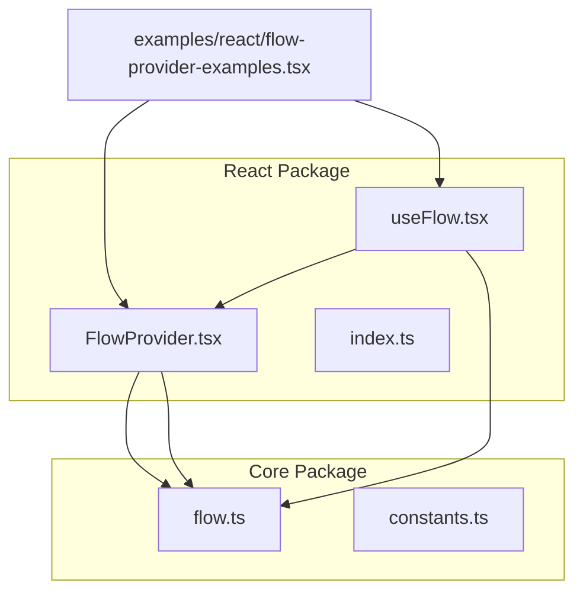
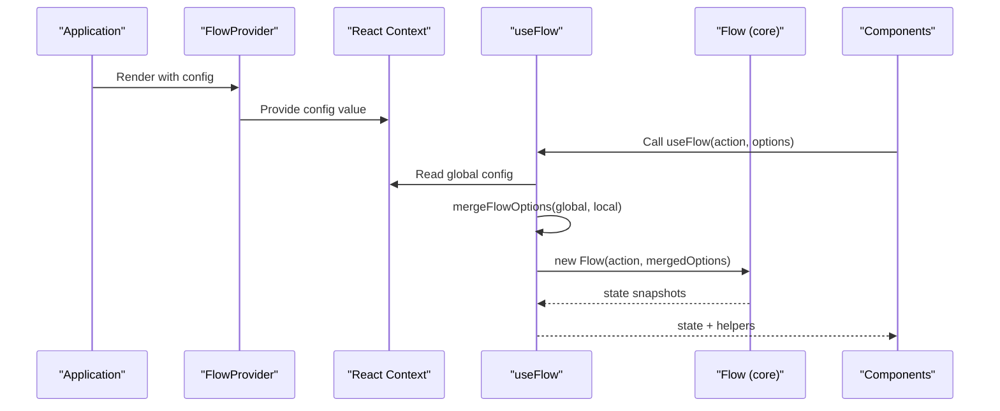
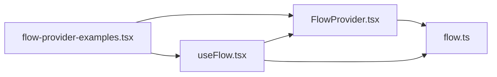

# FlowProvider Component API

<cite>
**Referenced Files in This Document**
- [FlowProvider.tsx](file://packages/react/src/FlowProvider.tsx)
- [useFlow.tsx](file://packages/react/src/useFlow.tsx)
- [flow.ts](file://packages/core/src/flow.ts)
- [constants.ts](file://packages/core/src/constants.ts)
- [flow-provider-examples.tsx](file://examples/react/flow-provider-examples.tsx)
- [FlowProvider.test.tsx](file://packages/react/src/FlowProvider.test.tsx)
- [useFlow.test.tsx](file://packages/react/src/useFlow.test.tsx)
- [index.ts](file://packages/react/src/index.ts)
</cite>

## Table of Contents

1. [Introduction](#introduction)
2. [Project Structure](#project-structure)
3. [Core Components](#core-components)
4. [Architecture Overview](#architecture-overview)
5. [Detailed Component Analysis](#detailed-component-analysis)
6. [Dependency Analysis](#dependency-analysis)
7. [Performance Considerations](#performance-considerations)
8. [Troubleshooting Guide](#troubleshooting-guide)
9. [Conclusion](#conclusion)
10. [Appendices](#appendices)

## Introduction

This document provides comprehensive API documentation for the FlowProvider React component. It explains the component’s props, global configuration system, option merging strategies, and context propagation mechanism. It also details the mergeFlowOptions function, the React Context implementation, provider behavior, and component hierarchy requirements. Additionally, it covers the relationship between FlowProvider and the useFlow hook, including how global settings are inherited by child components, best practices for configuration management, performance considerations, common usage patterns, and dynamic configuration updates.

## Project Structure

The FlowProvider lives in the React package and integrates with the core Flow engine. The React package exports both FlowProvider and useFlow, while the core package provides the Flow class and shared configuration types.

**Diagram sources**

- [FlowProvider.tsx](file://packages/react/src/FlowProvider.tsx#L1-L139)
- [useFlow.tsx](file://packages/react/src/useFlow.tsx#L1-L281)
- [flow.ts](file://packages/core/src/flow.ts#L1-L796)
- [constants.ts](file://packages/core/src/constants.ts#L1-L51)
- [flow-provider-examples.tsx](file://examples/react/flow-provider-examples.tsx#L1-L368)

**Section sources**

- [FlowProvider.tsx](file://packages/react/src/FlowProvider.tsx#L1-L139)
- [useFlow.tsx](file://packages/react/src/useFlow.tsx#L1-L281)
- [flow.ts](file://packages/core/src/flow.ts#L1-L796)
- [index.ts](file://packages/react/src/index.ts#L1-L3)

## Core Components

- FlowProvider: A React component that provides global configuration to descendant components via React Context. It accepts a config prop and renders its children.
- useFlow: A React hook that orchestrates asynchronous actions and their UI states. It reads global configuration from FlowProvider and merges it with local options.
- mergeFlowOptions: A utility function that merges global and local FlowOptions, respecting overrideMode semantics.
- Flow: The core engine that manages state, retries, concurrency, optimistic updates, and UX controls.

Key responsibilities:

- FlowProvider exposes a context value that descendants can consume.
- useFlow consumes the context and merges options before initializing the Flow instance.
- mergeFlowOptions performs deep merging of nested options and respects overrideMode.
- Flow applies the merged options to control behavior such as retry, loading, autoReset, concurrency, and optimistic updates.

**Section sources**

- [FlowProvider.tsx](file://packages/react/src/FlowProvider.tsx#L27-L56)
- [useFlow.tsx](file://packages/react/src/useFlow.tsx#L77-L115)
- [flow.ts](file://packages/core/src/flow.ts#L99-L160)

## Architecture Overview

The FlowProvider establishes a global configuration boundary. Descendant components use useFlow to access and merge global settings with their local options. The merged options are passed to the Flow instance, which enforces behavior such as retry, loading UX, concurrency, and optimistic updates.

**Diagram sources**

- [FlowProvider.tsx](file://packages/react/src/FlowProvider.tsx#L50-L56)
- [useFlow.tsx](file://packages/react/src/useFlow.tsx#L77-L115)
- [flow.ts](file://packages/core/src/flow.ts#L269-L272)

## Detailed Component Analysis

### FlowProvider Component

- Purpose: Provide global Flow configuration to descendant components via React Context.
- Props:
  - config: Optional global configuration extending FlowOptions with overrideMode.
  - children: ReactNode representing the component subtree.
- Behavior:
  - Renders a React Context Provider with value equal to config or null.
  - If no config is provided, the context value is null.
- Context Propagation:
  - Descendants can access the context via useFlowContext or useFlow hook.
  - Nested providers override parent configurations for their subtree.

Best practices:

- Wrap your application or feature sections with FlowProvider to centralize configuration.
- Use overrideMode strategically to enforce strict local overrides when needed.

**Section sources**

- [FlowProvider.tsx](file://packages/react/src/FlowProvider.tsx#L27-L56)

### FlowProviderConfig and FlowOptions

- FlowProviderConfig extends FlowOptions with overrideMode.
- FlowOptions defines the shape of configuration accepted by FlowProvider and useFlow.
- Nested options include retry, autoReset, loading, and top-level callbacks and flags.

Key points:

- overrideMode determines whether local options replace global ones ("replace") or merge with them ("merge").
- Nested options are deeply merged; simple properties are overridden by local values.

**Section sources**

- [FlowProvider.tsx](file://packages/react/src/FlowProvider.tsx#L7-L17)
- [flow.ts](file://packages/core/src/flow.ts#L99-L160)

### mergeFlowOptions Function

Purpose: Merge global and local FlowOptions according to overrideMode semantics.

Behavior:

- If globalConfig is null, return localOptions.
- Extract overrideMode from globalConfig; default is "merge".
- If overrideMode is "replace" and localOptions is non-empty, return localOptions.
- For "merge" mode:
  - Deep merge retry, autoReset, and loading options.
  - Override simple properties (onSuccess, onError, concurrency, optimisticResult) with local values if present.
  - Preserve global onError if no local onError is provided.

Complexity:

- Time: O(n) where n is the number of nested keys in options.
- Space: O(n) for the merged object.

Edge cases:

- Empty global config returns local options.
- Replace mode ignores global options when local options exist.

**Section sources**

- [FlowProvider.tsx](file://packages/react/src/FlowProvider.tsx#L76-L138)

### React Context Implementation

- Context: A React Context created with a default value of null.
- Provider: FlowProvider sets the context value to config or null.
- Consumers:
  - useFlowContext: Hook to read the context value.
  - useFlow: Reads context and merges options before constructing Flow.

Propagation:

- Descendants inherit the nearest ancestor provider.
- Nested providers override parent configurations for their subtree.

**Section sources**

- [FlowProvider.tsx](file://packages/react/src/FlowProvider.tsx#L22-L22)
- [FlowProvider.tsx](file://packages/react/src/FlowProvider.tsx#L64-L66)
- [useFlow.tsx](file://packages/react/src/useFlow.tsx#L82-L82)

### useFlow Hook and Global Configuration Inheritance

- Initialization:
  - Reads global config via useFlowContext.
  - Merges global and local options for the initial Flow instance.
- Runtime updates:
  - Subscribes to option changes and calls flow.setOptions(mergeFlowOptions(global, options)).
- State synchronization:
  - Maintains a snapshot of Flow state and exposes helpers (button, form, LiveRegion).
- Accessibility:
  - Provides LiveRegion for screen reader announcements.

Relationship to FlowProvider:

- useFlow depends on FlowProvider for global configuration.
- Global settings are inherited unless overridden locally.

**Section sources**

- [useFlow.tsx](file://packages/react/src/useFlow.tsx#L77-L115)
- [flow.ts](file://packages/core/src/flow.ts#L288-L290)

### Component Hierarchy Requirements

- Place FlowProvider at the root of your application or feature boundaries.
- Nest providers to scope configuration to subsections.
- Ensure descendant components use useFlow to benefit from global settings.

Examples:

- Single global provider for the entire app.
- Nested providers for admin sections with different retry/loading policies.

**Section sources**

- [flow-provider-examples.tsx](file://examples/react/flow-provider-examples.tsx#L59-L95)
- [flow-provider-examples.tsx](file://examples/react/flow-provider-examples.tsx#L211-L271)

### Option Merging Strategies

- Merge mode (default):
  - Deep merge retry, autoReset, loading.
  - Local overrides simple properties; preserves global onError if local does not provide one.
- Replace mode:
  - If local options exist, ignore global options entirely.

Validation and tests:

- Tests confirm nested merging, override precedence, and replace behavior.

**Section sources**

- [FlowProvider.tsx](file://packages/react/src/FlowProvider.tsx#L76-L138)
- [FlowProvider.test.tsx](file://packages/react/src/FlowProvider.test.tsx#L28-L84)

### Relationship Between FlowProvider and useFlow

- useFlow reads the global config from context and merges it with local options.
- The merged options are used to initialize the Flow instance and to update it dynamically.
- Global settings are inherited by child components unless overridden locally.

**Section sources**

- [useFlow.tsx](file://packages/react/src/useFlow.tsx#L82-L115)
- [FlowProvider.tsx](file://packages/react/src/FlowProvider.tsx#L76-L138)

### Examples of FlowProvider Setup and Hierarchical Option Inheritance

- Global error handling and retry configuration.
- Section-specific overrides for retry and loading.
- Nested providers for different feature areas.

**Section sources**

- [flow-provider-examples.tsx](file://examples/react/flow-provider-examples.tsx#L59-L95)
- [flow-provider-examples.tsx](file://examples/react/flow-provider-examples.tsx#L101-L155)
- [flow-provider-examples.tsx](file://examples/react/flow-provider-examples.tsx#L211-L271)

### Best Practices for Configuration Management

- Centralize common settings in a top-level FlowProvider.
- Use nested providers for feature-specific overrides.
- Prefer merge mode for gradual customization; use replace mode for strict isolation.
- Keep global onError centralized for consistent error handling.
- Use overrideMode thoughtfully to avoid accidental configuration drift.

**Section sources**

- [FlowProvider.tsx](file://packages/react/src/FlowProvider.tsx#L16-L16)
- [flow-provider-examples.tsx](file://examples/react/flow-provider-examples.tsx#L277-L335)

### Performance Considerations

- Context updates: Changes to global config propagate to all descendants; minimize unnecessary re-renders by avoiding frequent provider updates.
- Option merging: mergeFlowOptions is lightweight; however, avoid excessive re-creation of options objects.
- Flow initialization: useFlow persists action and options via refs to prevent re-creating the Flow instance on every render.
- Accessibility helpers: LiveRegion and button/form helpers are memoized to reduce overhead.

**Section sources**

- [useFlow.tsx](file://packages/react/src/useFlow.tsx#L84-L91)
- [useFlow.tsx](file://packages/react/src/useFlow.tsx#L255-L279)

### Common Usage Patterns

- Global provider with retry and loading UX settings.
- Feature sections with stricter retry or different loading behavior.
- Local overrides for onSuccess handlers while inheriting global onError.
- Nested providers for admin vs. regular user experiences.

**Section sources**

- [flow-provider-examples.tsx](file://examples/react/flow-provider-examples.tsx#L101-L155)
- [flow-provider-examples.tsx](file://examples/react/flow-provider-examples.tsx#L211-L271)
- [flow-provider-examples.tsx](file://examples/react/flow-provider-examples.tsx#L277-L335)

### Context Switching Scenarios and Dynamic Configuration Updates

- Context switching: Descendants inherit the nearest ancestor provider; nested providers override parent settings.
- Dynamic updates: useFlow subscribes to option changes and updates the Flow instance accordingly via setOptions.

**Section sources**

- [useFlow.tsx](file://packages/react/src/useFlow.tsx#L113-L115)
- [flow.ts](file://packages/core/src/flow.ts#L288-L290)

## Dependency Analysis

The React package depends on the core package for Flow types and behavior. FlowProvider and useFlow coordinate to provide global configuration and option merging.

**Diagram sources**

- [FlowProvider.tsx](file://packages/react/src/FlowProvider.tsx#L1-L2)
- [useFlow.tsx](file://packages/react/src/useFlow.tsx#L9-L10)
- [flow.ts](file://packages/core/src/flow.ts#L1-L7)
- [flow-provider-examples.tsx](file://examples/react/flow-provider-examples.tsx#L8-L8)

**Section sources**

- [FlowProvider.tsx](file://packages/react/src/FlowProvider.tsx#L1-L2)
- [useFlow.tsx](file://packages/react/src/useFlow.tsx#L9-L10)
- [flow.ts](file://packages/core/src/flow.ts#L1-L7)

## Performance Considerations

- Minimize provider updates to reduce re-renders across the tree.
- Avoid recreating options objects on every render; rely on refs and memoization.
- Use debounce/throttle judiciously to prevent excessive executions.
- Consider replace mode for isolated sections to avoid deep merges.

[No sources needed since this section provides general guidance]

## Troubleshooting Guide

Common issues and resolutions:

- Global config not applied:
  - Ensure FlowProvider wraps the component using useFlow.
  - Verify context value is not null.
- Unexpected overrides:
  - Check overrideMode; "replace" mode replaces global with local options.
- Nested provider confusion:
  - Descendants inherit the nearest ancestor provider; confirm provider placement.
- Dynamic option updates not reflected:
  - Confirm useFlow is receiving updated options and that the effect runs.

**Section sources**

- [FlowProvider.test.tsx](file://packages/react/src/FlowProvider.test.tsx#L86-L112)
- [FlowProvider.test.tsx](file://packages/react/src/FlowProvider.test.tsx#L114-L147)
- [FlowProvider.test.tsx](file://packages/react/src/FlowProvider.test.tsx#L68-L84)

## Conclusion

FlowProvider enables centralized, hierarchical configuration for asynchronous actions managed by useFlow. By leveraging React Context and mergeFlowOptions, it offers flexible global defaults with precise local overrides. Proper use of nested providers, overrideMode, and option merging ensures consistent UX behavior across an application while allowing targeted customization.

[No sources needed since this section summarizes without analyzing specific files]

## Appendices

### API Reference: FlowProvider

- Props:
  - config: Optional FlowProviderConfig
  - children: ReactNode
- Behavior:
  - Provides global configuration to descendants via context
  - Uses overrideMode to determine merge strategy

**Section sources**

- [FlowProvider.tsx](file://packages/react/src/FlowProvider.tsx#L27-L56)

### API Reference: mergeFlowOptions

- Parameters:
  - globalConfig: FlowProviderConfig | null
  - localOptions: FlowOptions
- Returns:
  - Merged FlowOptions

**Section sources**

- [FlowProvider.tsx](file://packages/react/src/FlowProvider.tsx#L76-L138)

### API Reference: useFlow

- Parameters:
  - action: FlowAction
  - options: ReactFlowOptions
- Returns:
  - Flow state and helpers (execute, reset, cancel, setProgress, button, form, LiveRegion, errorRef, fieldErrors)

**Section sources**

- [useFlow.tsx](file://packages/react/src/useFlow.tsx#L77-L280)

### Configuration Types Overview

- FlowOptions: retry, autoReset, loading, onSuccess, onError, concurrency, debounce, throttle, optimisticResult, rollbackOnError
- FlowProviderConfig: Extends FlowOptions with overrideMode

**Section sources**

- [flow.ts](file://packages/core/src/flow.ts#L99-L160)
- [FlowProvider.tsx](file://packages/react/src/FlowProvider.tsx#L7-L17)
