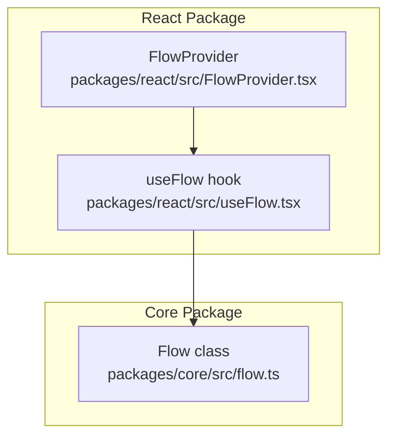
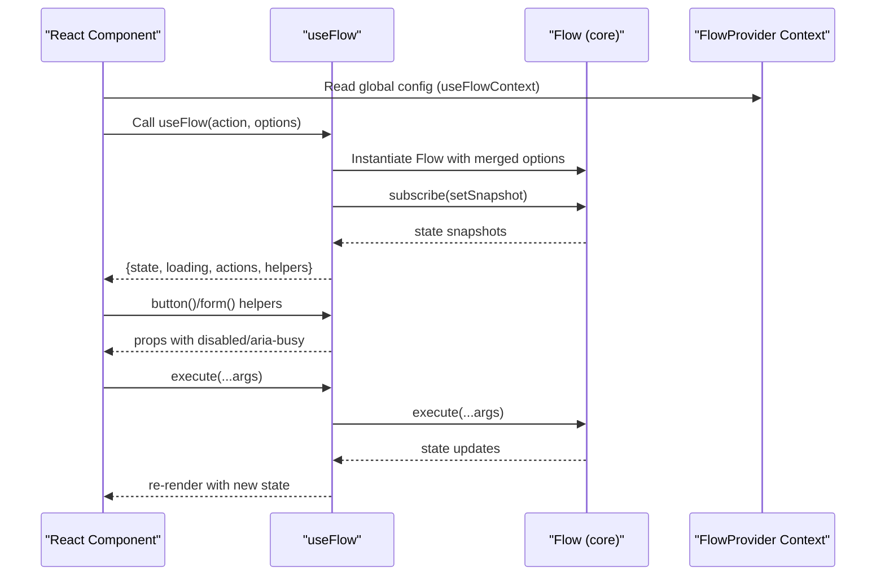
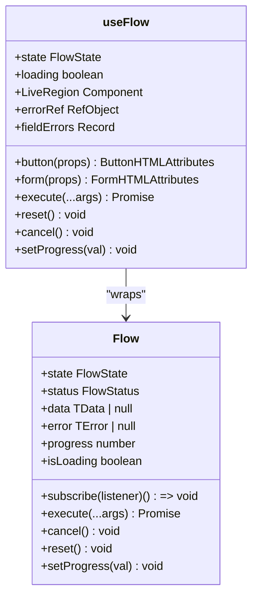
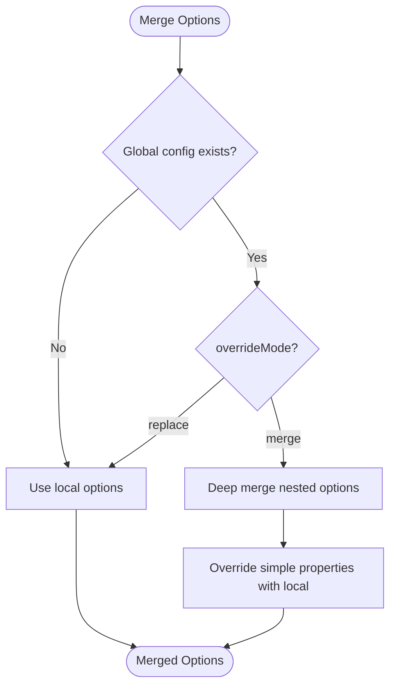
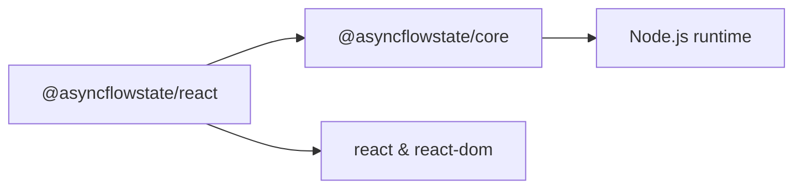

# React API Reference

<cite>
**Referenced Files in This Document**
- [useFlow.tsx](file://packages/react/src/useFlow.tsx)
- [FlowProvider.tsx](file://packages/react/src/FlowProvider.tsx)
- [flow.ts](file://packages/core/src/flow.ts)
- [flow.d.ts](file://packages/core/src/flow.d.ts)
- [react-examples.tsx](file://examples/react/react-examples.tsx)
- [flow-provider-examples.tsx](file://examples/react/flow-provider-examples.tsx)
- [comparison.tsx](file://examples/react/comparison.tsx)
- [useFlow.test.tsx](file://packages/react/src/useFlow.test.tsx)
- [FlowProvider.test.tsx](file://packages/react/src/FlowProvider.test.tsx)
- [README.md (React)](file://packages/react/README.md)
- [README.md (Core)](file://packages/core/README.md)
- [package.json (React)](file://packages/react/package.json)
- [package.json (Core)](file://packages/core/package.json)
</cite>

## Table of Contents

1. [Introduction](#introduction)
2. [Project Structure](#project-structure)
3. [Core Components](#core-components)
4. [Architecture Overview](#architecture-overview)
5. [Detailed Component Analysis](#detailed-component-analysis)
6. [Dependency Analysis](#dependency-analysis)
7. [Performance Considerations](#performance-considerations)
8. [Troubleshooting Guide](#troubleshooting-guide)
9. [Conclusion](#conclusion)
10. [Appendices](#appendices)

## Introduction

This document provides a comprehensive API reference for the @asyncflowstate/react package. It focuses on the useFlow React hook and the FlowProvider component, detailing their parameters, return types, React integration patterns, accessibility features, and how they extend the core Flow class. It also covers global configuration, subscription management, lifecycle integration, and practical usage examples.

## Project Structure

The React package exports two primary APIs:

- useFlow: A React hook that wraps the core Flow engine and exposes a concise state and helper interface.
- FlowProvider: A React context provider enabling global configuration that flows down to all useFlow hooks within its subtree.

**Diagram sources**

- [useFlow.tsx](file://packages/react/src/useFlow.tsx#L77-L281)
- [FlowProvider.tsx](file://packages/react/src/FlowProvider.tsx#L50-L66)
- [flow.ts](file://packages/core/src/flow.ts#L174-L709)

**Section sources**

- [package.json (React)](file://packages/react/package.json#L28-L39)
- [package.json (Core)](file://packages/core/package.json#L28-L39)

## Core Components

This section documents the primary APIs and their types and behaviors.

### useFlow hook

useFlow is a React hook that orchestrates asynchronous actions and their UI states. It returns a comprehensive object combining Flow state, derived loading flags, action methods, and helper utilities for buttons and forms.

- Hook signature
  - Parameters
    - action: FlowAction<TData, TArgs>, an async function to manage
    - options: ReactFlowOptions<TData, TError>, optional React-specific and core Flow options
  - Returns: Object with state, actions, helpers, and accessibility utilities

- Returned object properties
  - State
    - status: FlowStatus
    - data: TData | null
    - error: TError | null
    - progress: number
    - fieldErrors: Record<string, string>
  - Derived flags
    - loading: boolean (respects loading.delay)
  - Actions
    - execute(...args: TArgs): Promise<TData | undefined>
    - reset(): void
    - cancel(): void
    - setProgress(val: number): void
  - Helpers and components
    - button(props?): ButtonHTMLAttributes
    - form(props?): FormHTMLAttributes
    - LiveRegion: React component for screen reader announcements
    - errorRef: React.RefObject<HTMLElement | null>
  - Internals
    - flow: The underlying Flow instance (not recommended for direct mutation)

- React-specific options
  - a11y?: A11yOptions<TData, TError>
    - announceSuccess?: string | ((data: TData) => string)
    - announceError?: string | ((error: TError) => string)
    - liveRegionRel?: "polite" | "assertive"

- Accessibility features
  - Auto-focus error element when entering error state
  - LiveRegion component for automatic screen reader announcements
  - aria-busy and disabled props injected by button() and form()

- Integration patterns
  - Button props generation: button(props?)
  - Form props generation: form(props?)
  - Manual execution: execute(...args)
  - Reset/cancel: reset(), cancel()
  - Progress reporting: setProgress(val)
  - Field-level validation errors: fieldErrors

**Section sources**

- [useFlow.tsx](file://packages/react/src/useFlow.tsx#L77-L281)
- [flow.d.ts](file://packages/core/src/flow.d.ts#L84-L177)
- [README.md (React)](file://packages/react/README.md#L179-L207)

### FlowProvider component

FlowProvider enables global configuration shared across all useFlow hooks within its subtree. It merges global options with local options, allowing fine-grained control per component.

- Props
  - config?: FlowProviderConfig<TData, TError>
    - overrideMode?: "merge" | "replace"
    - All FlowOptions<TData, TError> fields supported
  - children: ReactNode

- Behavior
  - Provides global defaults via React context
  - Merges global and local options with local precedence
  - Supports nested providers for different sections

- Global configuration merging
  - Deep merges nested options (retry, autoReset, loading)
  - Overrides simple properties with local values when present
  - Supports overrideMode "merge" (default) or "replace"

**Section sources**

- [FlowProvider.tsx](file://packages/react/src/FlowProvider.tsx#L27-L139)
- [README.md (React)](file://packages/react/README.md#L33-L81)

## Architecture Overview

The React integration builds on the core Flow engine, adding React-specific concerns like subscriptions, refs, and helpers.

**Diagram sources**

- [useFlow.tsx](file://packages/react/src/useFlow.tsx#L84-L253)
- [FlowProvider.tsx](file://packages/react/src/FlowProvider.tsx#L64-L139)
- [flow.ts](file://packages/core/src/flow.ts#L325-L332)

## Detailed Component Analysis

### useFlow hook internals and relationships

- Initialization
  - Reads global config via useFlowContext
  - Merges global and local options with mergeFlowOptions
  - Creates Flow instance once with memoized action and options
- State synchronization
  - Subscribes to Flow state changes and mirrors to React state
  - Exposes derived loading flag respecting UX delays
- Accessibility
  - Auto-focus error element on error state
  - LiveRegion component for screen reader announcements
- Helpers
  - button(props?): Injects disabled and aria-busy; optionally executes flow if no onClick provided
  - form(props?): Handles preventDefault, optional FormData extraction, validation, and optional form reset on success

**Diagram sources**

- [flow.ts](file://packages/core/src/flow.ts#L174-L709)
- [useFlow.tsx](file://packages/react/src/useFlow.tsx#L77-L281)

**Section sources**

- [useFlow.tsx](file://packages/react/src/useFlow.tsx#L84-L281)
- [flow.ts](file://packages/core/src/flow.ts#L174-L709)

### FlowProvider configuration merging

- Merging strategy
  - overrideMode "merge": Merge nested options; local values override global
  - overrideMode "replace": Use only local options
- Supported merges
  - retry: deep merge
  - autoReset: deep merge
  - loading: deep merge
  - onSuccess/onError/concurrency/optimisticResult: simple overrides

**Diagram sources**

- [FlowProvider.tsx](file://packages/react/src/FlowProvider.tsx#L76-L138)

**Section sources**

- [FlowProvider.tsx](file://packages/react/src/FlowProvider.tsx#L76-L139)

### Accessibility and screen reader support

- LiveRegion component
  - Renders an aria-live region with atomic updates
  - Uses configurable rel ("polite"|"assertive")
- Auto-focus behavior
  - On error state, focuses element referenced by errorRef
- Helper props
  - button() injects disabled and aria-busy
  - form() injects aria-busy

**Section sources**

- [useFlow.tsx](file://packages/react/src/useFlow.tsx#L147-L168)
- [useFlow.tsx](file://packages/react/src/useFlow.tsx#L117-L141)

### React integration patterns and examples

- Button props generation
  - Use button() to get disabled and aria-busy props
  - Optionally provide onClick; if absent, clicking triggers flow.execute()
- Form integration
  - Use form() to handle onSubmit, optional FormData extraction, validation, and reset-on-success
  - Access fieldErrors for client-side validation feedback
- Manual execution
  - Call execute(...args) directly when you need programmatic control
- Lifecycle and cleanup
  - useFlow subscribes to Flow state; subscription is cleaned up on hook unmount
- Accessibility
  - Place LiveRegion in the component tree
  - Use errorRef on error message elements for auto-focus

**Section sources**

- [useFlow.tsx](file://packages/react/src/useFlow.tsx#L174-L249)
- [react-examples.tsx](file://examples/react/react-examples.tsx#L420-L490)
- [comparison.tsx](file://examples/react/comparison.tsx#L156-L201)

## Dependency Analysis

- useFlow depends on:
  - @asyncflowstate/core Flow class and FlowOptions/FlowState types
  - React context (FlowProvider) for global configuration
- FlowProvider depends on:
  - React context API
  - mergeFlowOptions utility for option merging

**Diagram sources**

- [package.json (React)](file://packages/react/package.json#L54-L66)
- [package.json (Core)](file://packages/core/package.json#L45-L56)

**Section sources**

- [package.json (React)](file://packages/react/package.json#L54-L66)
- [package.json (Core)](file://packages/core/package.json#L45-L56)

## Performance Considerations

- Loading perception
  - Use loading.delay and loading.minDuration to prevent UI flicker and ensure perceived responsiveness
- Concurrency
  - Choose concurrency strategy ("keep"|"restart"|...) to control behavior when execute() is called while loading
- Debounce/throttle
  - Use options.debounce or options.throttle to limit rapid executions (e.g., search inputs)
- Auto-reset
  - Enable autoReset to automatically revert success state after a delay, keeping UI clean

**Section sources**

- [flow.ts](file://packages/core/src/flow.ts#L99-L127)
- [flow.ts](file://packages/core/src/flow.ts#L400-L415)
- [README.md (Core)](file://packages/core/README.md#L51-L65)

## Troubleshooting Guide

- Hook does not update UI
  - Ensure you spread helper props (button(), form()) onto DOM elements
  - Verify execute(...) is being called and not silently returning undefined due to concurrency strategy
- Global config not applied
  - Confirm FlowProvider wraps the component using useFlow
  - Check overrideMode and nested providers
- Accessibility issues
  - Place LiveRegion in the component tree
  - Ensure errorRef targets an element intended for focus on error
- Validation not working
  - Ensure form() helper is used and validate returns an object of field errors or null/undefined
- Tests reference
  - See tests for expected behavior of button(), form(), LiveRegion, and option merging

**Section sources**

- [useFlow.test.tsx](file://packages/react/src/useFlow.test.tsx#L1-L142)
- [FlowProvider.test.tsx](file://packages/react/src/FlowProvider.test.tsx#L1-L184)

## Conclusion

The @asyncflowstate/react package provides a powerful, accessible, and ergonomic way to manage asynchronous UI behavior in React. By leveraging the core Flow engine and React-specific helpers, developers can reduce boilerplate, improve UX, and maintain consistent behavior across an application. Use FlowProvider for global configuration and useFlow for component-level control, integrating helpers like button() and form() to streamline common patterns.

## Appendices

### API Definitions

- useFlow<TData, TError, TArgs>(action, options?)
  - Parameters
    - action: FlowAction<TData, TArgs>
    - options?: ReactFlowOptions<TData, TError>
  - Returns: Object with state, actions, helpers, and accessibility utilities

- ReactFlowOptions<TData, TError>
  - Extends FlowOptions<TData, TError>
  - a11y?: A11yOptions<TData, TError>

- A11yOptions<TData, TError>
  - announceSuccess?: string | ((data: TData) => string)
  - announceError?: string | ((error: TError) => string)
  - liveRegionRel?: "polite" | "assertive"

- FlowProviderConfig<TData, TError>
  - overrideMode?: "merge" | "replace"
  - All FlowOptions<TData, TError> fields

- FlowProviderProps
  - config?: FlowProviderConfig<TData, TError>
  - children: ReactNode

**Section sources**

- [useFlow.tsx](file://packages/react/src/useFlow.tsx#L58-L80)
- [FlowProvider.tsx](file://packages/react/src/FlowProvider.tsx#L7-L32)
- [flow.d.ts](file://packages/core/src/flow.d.ts#L58-L79)

### Practical Usage Patterns

- Basic form submission
  - Use form() helper with extractFormData and validate
  - Access fieldErrors for inline validation feedback
- Button integration
  - Spread button() props onto button elements
  - Use loading flag to disable inputs and show busy states
- Optimistic UI
  - Provide optimisticResult in options to reflect immediate UI changes
- Global configuration
  - Wrap app with FlowProvider to centralize retry, error handling, and UX settings
  - Override locally when needed

**Section sources**

- [react-examples.tsx](file://examples/react/react-examples.tsx#L186-L245)
- [react-examples.tsx](file://examples/react/react-examples.tsx#L420-L490)
- [flow-provider-examples.tsx](file://examples/react/flow-provider-examples.tsx#L59-L95)
