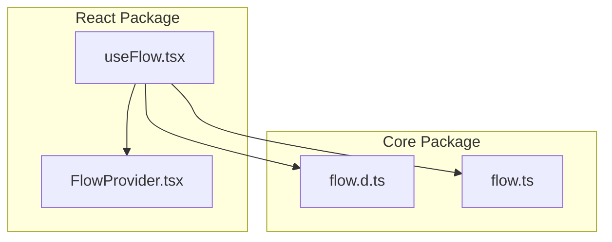
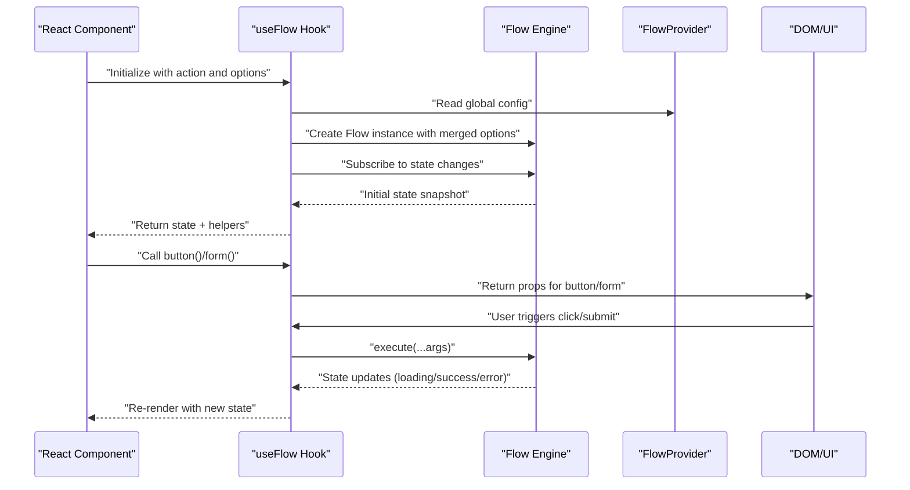
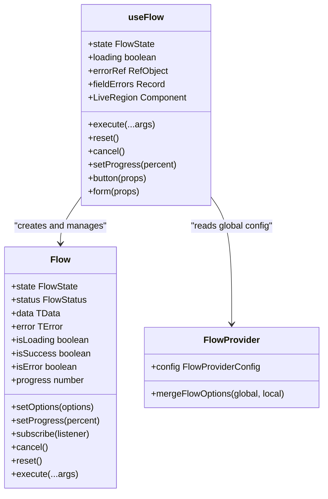
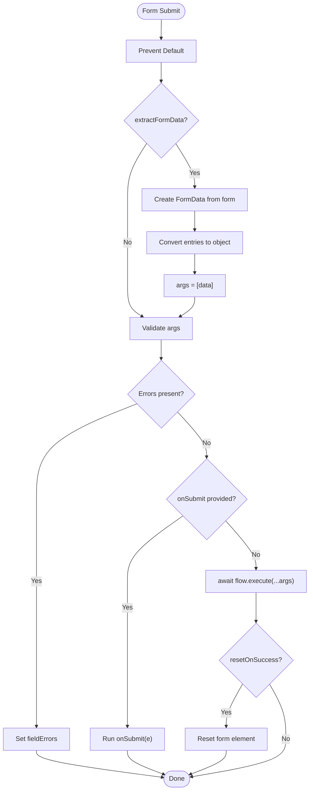
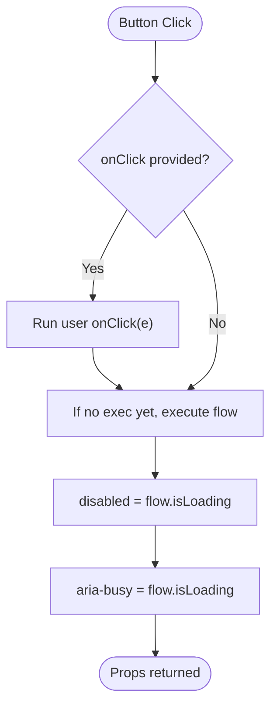
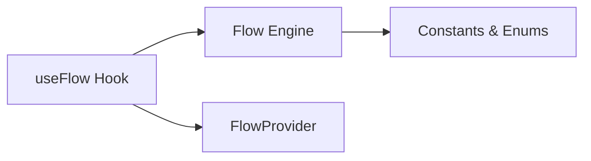

# useFlow Hook API

<cite>
**Referenced Files in This Document**
- [useFlow.tsx](file://packages/react/src/useFlow.tsx)
- [FlowProvider.tsx](file://packages/react/src/FlowProvider.tsx)
- [flow.d.ts](file://packages/core/src/flow.d.ts)
- [flow.ts](file://packages/core/src/flow.ts)
- [react-examples.tsx](file://examples/react/react-examples.tsx)
- [flow-provider-examples.tsx](file://examples/react/flow-provider-examples.tsx)
- [useFlow.test.tsx](file://packages/react/src/useFlow.test.tsx)
</cite>

## Table of Contents

1. [Introduction](#introduction)
2. [Project Structure](#project-structure)
3. [Core Components](#core-components)
4. [Architecture Overview](#architecture-overview)
5. [Detailed Component Analysis](#detailed-component-analysis)
6. [Dependency Analysis](#dependency-analysis)
7. [Performance Considerations](#performance-considerations)
8. [Troubleshooting Guide](#troubleshooting-guide)
9. [Conclusion](#conclusion)
10. [Appendices](#appendices)

## Introduction

This document provides comprehensive API documentation for the useFlow React hook. It covers the hook signature with generic type parameters, parameter types, return value interface, helper functions, accessibility features, and practical usage patterns. The goal is to enable developers to integrate asynchronous actions into React components with robust state management, form/button helpers, and built-in accessibility support.

## Project Structure

The useFlow hook resides in the React package and builds upon the core Flow engine. It integrates with FlowProvider for global configuration and exposes helpers for buttons and forms.

**Diagram sources**

- [useFlow.tsx](file://packages/react/src/useFlow.tsx#L1-L281)
- [FlowProvider.tsx](file://packages/react/src/FlowProvider.tsx#L1-L139)
- [flow.d.ts](file://packages/core/src/flow.d.ts#L1-L177)
- [flow.ts](file://packages/core/src/flow.ts#L1-L796)

**Section sources**

- [useFlow.tsx](file://packages/react/src/useFlow.tsx#L1-L281)
- [FlowProvider.tsx](file://packages/react/src/FlowProvider.tsx#L1-L139)
- [flow.d.ts](file://packages/core/src/flow.d.ts#L1-L177)
- [flow.ts](file://packages/core/src/flow.ts#L1-L796)

## Core Components

- useFlow hook: Orchestrates asynchronous actions, exposes state snapshot, and provides helpers for buttons and forms.
- FlowProvider: Supplies global configuration merged with local options.
- Flow core: Implements state machine, retry logic, concurrency, and optimistic updates.

Key responsibilities:

- Manage Flow lifecycle and state synchronization with React.
- Provide ergonomic helpers for common UI patterns (buttons, forms).
- Integrate accessibility features (screen reader announcements, focus management).

**Section sources**

- [useFlow.tsx](file://packages/react/src/useFlow.tsx#L77-L281)
- [FlowProvider.tsx](file://packages/react/src/FlowProvider.tsx#L50-L139)
- [flow.ts](file://packages/core/src/flow.ts#L220-L796)

## Architecture Overview

The useFlow hook composes the Flow core engine with React-specific concerns. It merges global and local options, subscribes to Flow state, and exposes helpers that encapsulate common patterns.

**Diagram sources**

- [useFlow.tsx](file://packages/react/src/useFlow.tsx#L77-L281)
- [FlowProvider.tsx](file://packages/react/src/FlowProvider.tsx#L50-L139)
- [flow.ts](file://packages/core/src/flow.ts#L220-L796)

## Detailed Component Analysis

### Hook Signature and Generic Types

- Generic parameters:
  - TData: Type of successful action result.
  - TError: Type of error payload.
  - TArgs: Tuple type of arguments passed to the action.
- Parameters:
  - action: FlowAction<TData, TArgs> — asynchronous function to orchestrate.
  - options: ReactFlowOptions<TData, TError> — configuration including FlowOptions and accessibility options.
- Returns: Object combining Flow state snapshot and helper methods.

Behavior highlights:

- Persists action and options via refs to avoid recreating Flow unnecessarily.
- Merges global FlowProvider config with local options.
- Synchronizes Flow state to React via subscription.

**Section sources**

- [useFlow.tsx](file://packages/react/src/useFlow.tsx#L77-L115)
- [flow.d.ts](file://packages/core/src/flow.d.ts#L24-L27)
- [flow.d.ts](file://packages/core/src/flow.d.ts#L60-L79)

### Returned Value Interface

The hook returns a comprehensive object that extends the Flow state snapshot and adds React-specific helpers and state.

Properties:

- State snapshot (from Flow):
  - status: "idle" | "loading" | "success" | "error"
  - data: TData | null
  - error: TError | null
  - progress?: number
- Additional properties:
  - loading: boolean (respects loading.delay)
  - execute(...args): Promise<TData | undefined>
  - reset(): void
  - cancel(): void
  - setProgress(percent): void
  - button(props): ButtonHelperOptions
  - form(props): FormHelperOptions + React.FormHTMLAttributes
  - errorRef: React.RefObject<HTMLElement | null>
  - fieldErrors: Record<string, string>
  - LiveRegion: React.FC

Notes:

- The returned object spreads the Flow state snapshot, so consumers can access status, data, error, progress directly.
- Helpers encapsulate common UI patterns and integrate with React’s event model.

**Section sources**

- [useFlow.tsx](file://packages/react/src/useFlow.tsx#L255-L281)
- [flow.d.ts](file://packages/core/src/flow.d.ts#L12-L21)

### FormHelperOptions

Purpose: Configure the form helper to handle submission, validation, and optional FormData extraction.

Properties:

- extractFormData?: boolean — If true, extracts form data using FormData and passes it as the first argument to the action.
- validate?: (...args: TArgs) => Record<string, string> | null | Promise<...> — Validation function returning field-level errors.
- resetOnSuccess?: boolean — Resets the form element after a successful action completion.
- Additional HTML attributes: Spread to the form element.

Behavior:

- Prevents default form submission.
- Optionally extracts FormData and converts to a plain object.
- Runs validation; if errors exist, sets fieldErrors and prevents execution.
- Calls onSubmit if provided; otherwise executes flow.execute(...args).
- Resets form on success when resetOnSuccess is true.

**Section sources**

- [useFlow.tsx](file://packages/react/src/useFlow.tsx#L15-L36)
- [useFlow.tsx](file://packages/react/src/useFlow.tsx#L200-L249)

### ButtonHelperOptions

Purpose: Generate button props that reflect loading state and trigger execution.

Properties:

- Extends ButtonHTMLAttributes<HTMLButtonElement>.
- Adds disabled and aria-busy attributes based on flow.isLoading.
- onClick handler:
  - If user-provided onClick, executes it first.
  - If no onClick is provided, executes flow.execute with no arguments (requires TArgs to accept zero arguments).

Accessibility:

- disabled reflects loading state.
- aria-busy indicates ongoing activity.

**Section sources**

- [useFlow.tsx](file://packages/react/src/useFlow.tsx#L41-L44)
- [useFlow.tsx](file://packages/react/src/useFlow.tsx#L174-L194)

### Accessibility Features (A11yOptions)

- announceSuccess?: string | ((data: TData) => string) — Message or function to announce on success.
- announceError?: string | ((error: TError) => string) — Message or function to announce on error.
- liveRegionRel?: "polite" | "assertive" — ARIA live region relationship.

Implementation:

- Auto-focus error element when status becomes error.
- Render LiveRegion component that announces messages via an off-screen ARIA live region.
- Announcements triggered on state changes when a11y options are present.

**Section sources**

- [useFlow.tsx](file://packages/react/src/useFlow.tsx#L49-L56)
- [useFlow.tsx](file://packages/react/src/useFlow.tsx#L117-L141)
- [useFlow.tsx](file://packages/react/src/useFlow.tsx#L147-L168)

### Practical Usage Examples

- Basic login form with manual execute and button helper.
- Optimistic UI updates for a like button.
- Delete confirmation flow with conditional rendering.
- Profile form using form helper with validation and reset.
- Search with debounced execution.
- File upload with progress and success handling.
- Retry configuration with user-triggered retries.
- Advanced form with validation, accessibility, and LiveRegion.

See examples for patterns of:

- Passing action and options to useFlow.
- Using form and button helpers.
- Integrating errorRef for focus management.
- Leveraging LiveRegion for screen reader announcements.

**Section sources**

- [react-examples.tsx](file://examples/react/react-examples.tsx#L14-L87)
- [react-examples.tsx](file://examples/react/react-examples.tsx#L100-L128)
- [react-examples.tsx](file://examples/react/react-examples.tsx#L134-L180)
- [react-examples.tsx](file://examples/react/react-examples.tsx#L190-L245)
- [react-examples.tsx](file://examples/react/react-examples.tsx#L251-L301)
- [react-examples.tsx](file://examples/react/react-examples.tsx#L310-L373)
- [react-examples.tsx](file://examples/react/react-examples.tsx#L380-L415)
- [react-examples.tsx](file://examples/react/react-examples.tsx#L421-L490)

### Type Safety and Generic Constraints

- TArgs must include zero arguments when relying on button helper without an explicit onClick.
- Form helper passes extracted data as the first argument to the action; ensure action signature aligns with the extracted shape.
- Validation function receives the same arguments as the action; ensure TArgs matches expected shapes.
- A11y message generators receive data or error payloads; ensure types match TData/TError.

Guidelines:

- Keep action signatures consistent with the arguments you intend to pass.
- Use extractFormData only when the action expects an object derived from form fields.
- Provide explicit onClick for button helper when action requires arguments.

**Section sources**

- [useFlow.tsx](file://packages/react/src/useFlow.tsx#L174-L194)
- [useFlow.tsx](file://packages/react/src/useFlow.tsx#L200-L249)

### React-Specific Behavior Patterns

- State synchronization: Flow state is subscribed to and reflected in React via useState.
- Ref persistence: action and options are stored in refs to avoid recreating Flow on every render.
- Accessibility: LiveRegion renders an off-screen ARIA live region; errorRef enables auto-focus on error.
- Helpers composition: button and form helpers return props that integrate seamlessly with JSX.

**Section sources**

- [useFlow.tsx](file://packages/react/src/useFlow.tsx#L84-L115)
- [useFlow.tsx](file://packages/react/src/useFlow.tsx#L147-L168)
- [useFlow.tsx](file://packages/react/src/useFlow.tsx#L174-L194)
- [useFlow.tsx](file://packages/react/src/useFlow.tsx#L200-L249)

## Architecture Overview

**Diagram sources**

- [flow.ts](file://packages/core/src/flow.ts#L220-L796)
- [useFlow.tsx](file://packages/react/src/useFlow.tsx#L77-L281)
- [FlowProvider.tsx](file://packages/react/src/FlowProvider.tsx#L50-L139)

## Detailed Component Analysis

### useFlow Hook Implementation Details

- Initialization:
  - Persists action and options via refs.
  - Merges global and local options using mergeFlowOptions.
  - Creates Flow instance with bound action and merged options.
- State synchronization:
  - Subscribes to Flow state and mirrors it in React state.
  - Exposes loading flag derived from Flow.isLoading.
- Accessibility:
  - Auto-focuses errorRef when status becomes error.
  - Generates LiveRegion component for announcements.
- Helpers:
  - button(props): Returns disabled and aria-busy attributes; onClick either invokes user-provided handler or executes flow with no args.
  - form(props): Handles preventDefault, optional FormData extraction, validation, and optional form reset on success.

**Section sources**

- [useFlow.tsx](file://packages/react/src/useFlow.tsx#L84-L141)
- [useFlow.tsx](file://packages/react/src/useFlow.tsx#L174-L249)

### Flow Provider Integration

- Global configuration:
  - overrideMode controls whether local options replace or merge with global.
  - mergeFlowOptions deep-merges nested options (retry, autoReset, loading) and overrides simple properties.
- Context usage:
  - useFlowContext reads the global config.
  - mergeFlowOptions ensures local options take precedence unless overrideMode is "replace".

**Section sources**

- [FlowProvider.tsx](file://packages/react/src/FlowProvider.tsx#L7-L139)

### Accessibility Implementation

- Error focus management:
  - errorRef stores a reference to the error element.
  - Effect focuses the element when status transitions to error.
- Screen reader announcements:
  - LiveRegion renders an off-screen div with aria-live and aria-atomic.
  - Announcement messages generated from a11y options are set when status changes to success or error.

**Section sources**

- [useFlow.tsx](file://packages/react/src/useFlow.tsx#L117-L141)
- [useFlow.tsx](file://packages/react/src/useFlow.tsx#L147-L168)

### Form Helper Algorithm

**Diagram sources**

- [useFlow.tsx](file://packages/react/src/useFlow.tsx#L200-L249)

### Button Helper Behavior

**Diagram sources**

- [useFlow.tsx](file://packages/react/src/useFlow.tsx#L174-L194)

## Dependency Analysis

- useFlow depends on:
  - Flow core engine for state management and execution.
  - FlowProvider for global configuration merging.
  - React primitives (useState, useEffect, useRef, useCallback).
- Flow core depends on:
  - Constants and enums for retry/backoff strategies.
  - Internal timers and AbortController for UX and cancellation.

**Diagram sources**

- [useFlow.tsx](file://packages/react/src/useFlow.tsx#L1-L10)
- [flow.ts](file://packages/core/src/flow.ts#L1-L8)

**Section sources**

- [useFlow.tsx](file://packages/react/src/useFlow.tsx#L1-L10)
- [flow.ts](file://packages/core/src/flow.ts#L1-L8)

## Performance Considerations

- Minimize re-renders:
  - Helpers are memoized via useCallback to prevent unnecessary re-renders.
  - Snapshot is synchronized via subscription to avoid polling.
- UX timing:
  - loading.delay prevents UI flashes for fast actions.
  - minDuration ensures loading persists for a minimum time.
- Concurrency:
  - concurrency options control behavior when execute is called while already loading.
- Debounce/throttle:
  - Optional debouncing and throttling reduce redundant executions.

**Section sources**

- [useFlow.tsx](file://packages/react/src/useFlow.tsx#L255-L281)
- [flow.ts](file://packages/core/src/flow.ts#L89-L94)
- [flow.ts](file://packages/core/src/flow.ts#L114-L128)

## Troubleshooting Guide

Common issues and resolutions:

- Button remains enabled/disabled unexpectedly:
  - Ensure flow.isLoading is used for disabled state.
  - Verify button helper is applied to the button element.
- Form does not submit:
  - Provide onSubmit or rely on form helper to call flow.execute.
  - Ensure action signature matches the arguments passed by form helper.
- Validation errors not shown:
  - Return an object with field names as keys and error messages as values.
  - Ensure validate is awaited if it is async.
- LiveRegion not announcing:
  - Include LiveRegion in the component tree.
  - Provide a11y options with announceSuccess or announceError.
- Error focus not working:
  - Attach errorRef to the error element.
  - Ensure the element is focusable (e.g., tabIndex).

**Section sources**

- [useFlow.test.tsx](file://packages/react/src/useFlow.test.tsx#L48-L96)
- [useFlow.test.tsx](file://packages/react/src/useFlow.test.tsx#L119-L140)
- [useFlow.tsx](file://packages/react/src/useFlow.tsx#L117-L168)

## Conclusion

The useFlow hook provides a robust, type-safe way to manage asynchronous actions in React with integrated helpers for forms and buttons, plus built-in accessibility features. By leveraging FlowProvider for global configuration and Flow core for state management, it offers predictable behavior, strong typing, and ergonomic APIs for common UI patterns.

## Appendices

### API Reference Summary

- useFlow<TData, TError, TArgs>(action, options?): returns state + helpers
- ReactFlowOptions<TData, TError> extends FlowOptions<TData, TError> with a11y
- A11yOptions<TData, TError>: announceSuccess, announceError, liveRegionRel
- FormHelperOptions<TArgs>: extractFormData, validate, resetOnSuccess
- ButtonHelperOptions: extends ButtonHTMLAttributes<HTMLButtonElement>
- Helpers: button(), form(), LiveRegion, errorRef, fieldErrors

**Section sources**

- [useFlow.tsx](file://packages/react/src/useFlow.tsx#L77-L281)
- [flow.d.ts](file://packages/core/src/flow.d.ts#L60-L79)
- [flow.d.ts](file://packages/core/src/flow.d.ts#L12-L21)
