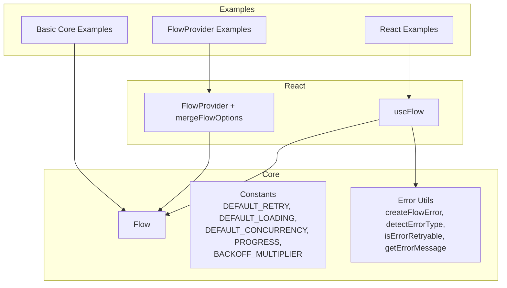
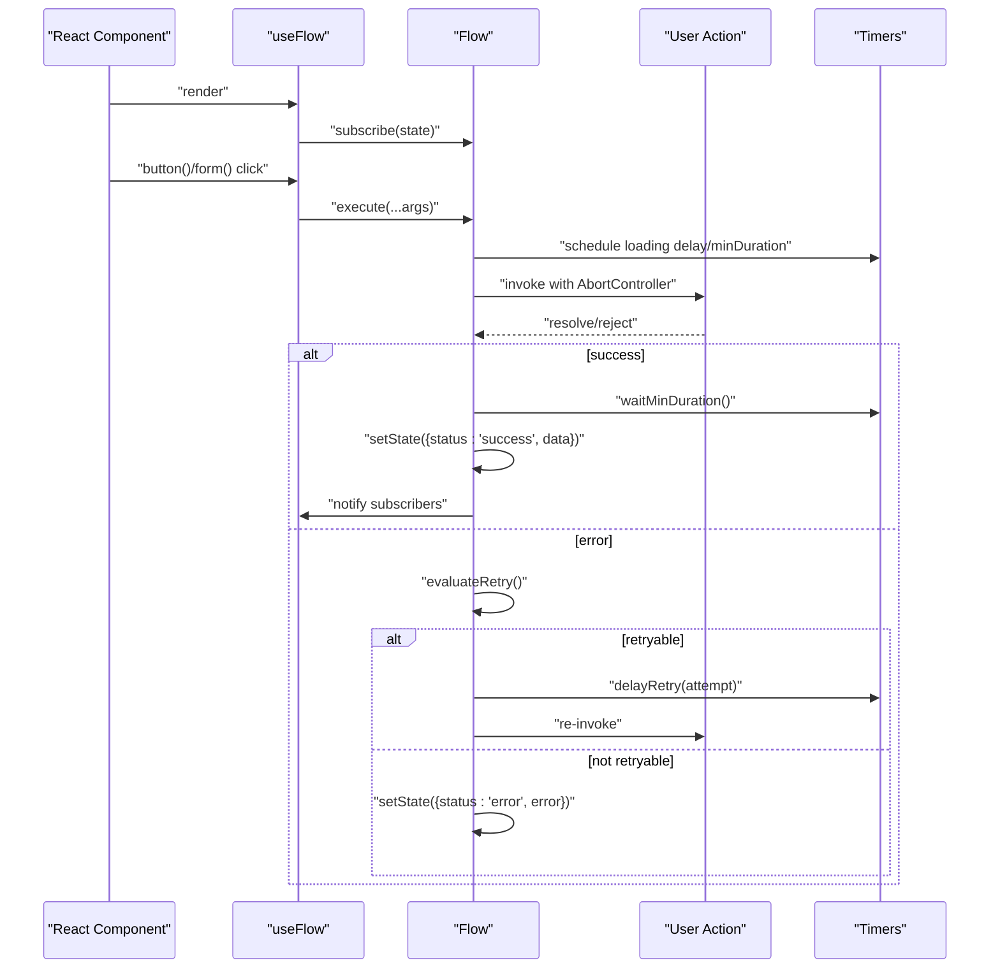
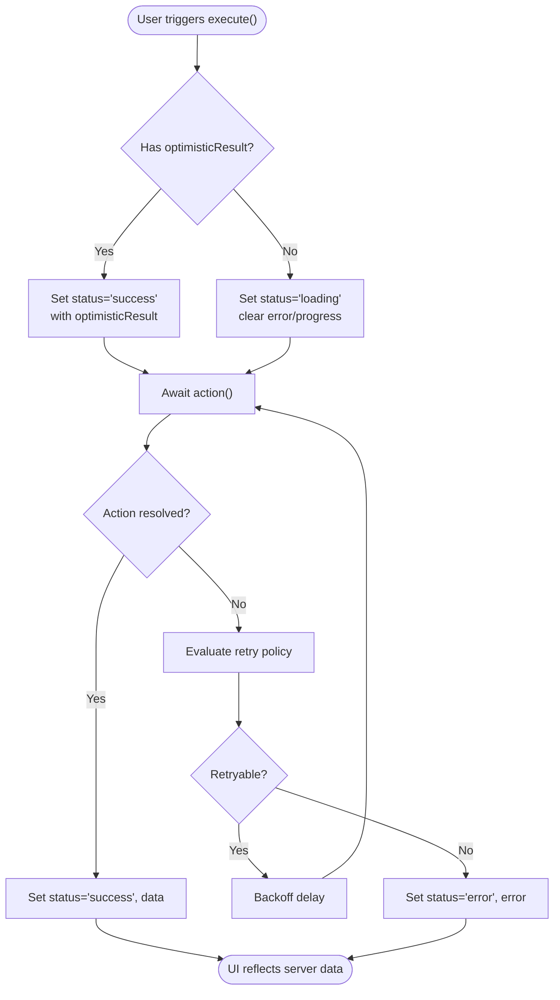
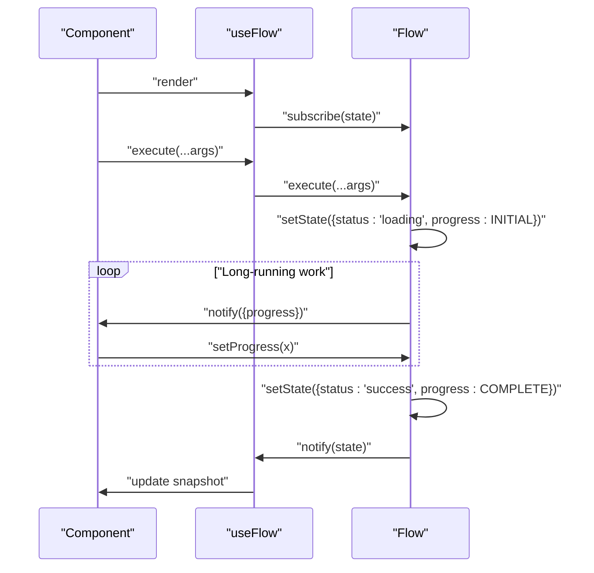
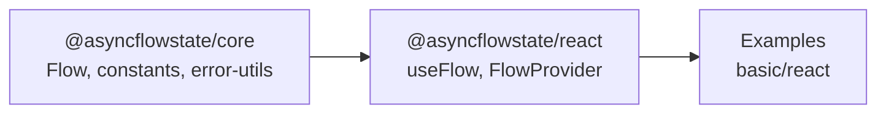

# Advanced Features

<cite>
**Referenced Files in This Document**
- [flow.ts](file://packages/core/src/flow.ts)
- [constants.ts](file://packages/core/src/constants.ts)
- [error-utils.ts](file://packages/core/src/error-utils.ts)
- [useFlow.tsx](file://packages/react/src/useFlow.tsx)
- [FlowProvider.tsx](file://packages/react/src/FlowProvider.tsx)
- [core-examples.ts](file://examples/basic/core-examples.ts)
- [react-examples.tsx](file://examples/react/react-examples.tsx)
- [flow-provider-examples.tsx](file://examples/react/flow-provider-examples.tsx)
- [README.md](file://README.md)
- [packages/core/README.md](file://packages/core/README.md)
- [packages/react/README.md](file://packages/react/README.md)
</cite>

## Table of Contents

1. [Introduction](#introduction)
2. [Project Structure](#project-structure)
3. [Core Components](#core-components)
4. [Architecture Overview](#architecture-overview)
5. [Detailed Component Analysis](#detailed-component-analysis)
6. [Dependency Analysis](#dependency-analysis)
7. [Advanced Orchestration](#advanced-orchestration)
8. [Monitoring and Debugging](#monitoring-and-debugging)
9. [Performance Considerations](#performance-considerations)
10. [Troubleshooting Guide](#troubleshooting-guide)
11. [Conclusion](#conclusion)
12. [Appendices](#appendices)

## Introduction

This document focuses on AsyncFlowState advanced features, including optimistic UI patterns, progress tracking, advanced form integration, and performance/scalability strategies. It synthesizes the core engine behavior and React helpers to provide practical guidance and real-world examples from the repository’s examples directory.

## Project Structure

AsyncFlowState is organized as a monorepo with two primary packages:

- Core engine (@asyncflowstate/core): Framework-agnostic orchestration of async UI behavior.
- React helpers (@asyncflowstate/react): React hooks and accessibility-first utilities built on top of the core.

**Diagram sources**

- [flow.ts](file://packages/core/src/flow.ts#L174-L709)
- [constants.ts](file://packages/core/src/constants.ts#L1-L51)
- [error-utils.ts](file://packages/core/src/error-utils.ts#L1-L207)
- [useFlow.tsx](file://packages/react/src/useFlow.tsx#L1-L281)
- [FlowProvider.tsx](file://packages/react/src/FlowProvider.tsx#L1-L139)
- [core-examples.ts](file://examples/basic/core-examples.ts#L1-L221)
- [react-examples.tsx](file://examples/react/react-examples.tsx#L1-L491)
- [flow-provider-examples.tsx](file://examples/react/flow-provider-examples.tsx#L1-L368)

**Section sources**

- [README.md](file://README.md#L108-L118)
- [packages/core/README.md](file://packages/core/README.md#L1-L134)
- [packages/react/README.md](file://packages/react/README.md#L1-L212)

## Core Components

- Flow: The central orchestrator for async actions, managing status, data, error, progress, retries, concurrency, and UX controls.
- Constants: Default values for retry, loading, progress, and backoff multipliers.
- Error Utilities: Typed error creation, classification, and retryability helpers.
- useFlow: React hook that wraps Flow, exposes helpers (button, form), accessibility features, and state synchronization.
- FlowProvider: Global configuration provider with merging logic for consistent defaults across an app.

Key capabilities:

- Optimistic UI via optimisticResult
- Progress tracking via setProgress and internal progress lifecycle
- Advanced form integration with FormData extraction, validation, and success reset
- Global configuration via FlowProvider with merge semantics
- Robust retry/backoff and UX polish (minDuration, delay)

**Section sources**

- [flow.ts](file://packages/core/src/flow.ts#L174-L709)
- [constants.ts](file://packages/core/src/constants.ts#L1-L51)
- [error-utils.ts](file://packages/core/src/error-utils.ts#L1-L207)
- [useFlow.tsx](file://packages/react/src/useFlow.tsx#L1-L281)
- [FlowProvider.tsx](file://packages/react/src/FlowProvider.tsx#L1-L139)

## Architecture Overview

The advanced features are implemented through layered abstractions:

- Core Flow encapsulates state machine, retry/backoff, concurrency, and progress.
- React useFlow composes Flow with UI concerns: helpers, accessibility, and form orchestration.
- FlowProvider supplies global defaults and merges them with local options.

**Diagram sources**

- [useFlow.tsx](file://packages/react/src/useFlow.tsx#L174-L249)
- [flow.ts](file://packages/core/src/flow.ts#L425-L533)
- [constants.ts](file://packages/core/src/constants.ts#L10-L27)

**Section sources**

- [useFlow.tsx](file://packages/react/src/useFlow.tsx#L1-L281)
- [flow.ts](file://packages/core/src/flow.ts#L174-L709)
- [constants.ts](file://packages/core/src/constants.ts#L1-L51)

## Detailed Component Analysis

### Optimistic UI Patterns

Optimistic UI updates the UI immediately upon user action, assuming success, then reconciles with server results. The core supports this via optimisticResult, while React helpers expose instant success state and error handling.

Configuration options:

- optimisticResult: Data to show immediately upon execute() before the action completes.
- onError: Optional callback to inform consumers when the optimistic update will revert.

Automatic rollback mechanism:

- On terminal error after retries, the Flow state transitions to error and retains error data. Consumers can rely on the latest data (either optimistic or server-provided) and display appropriate UI. The Flow itself does not automatically revert optimistic data; it is up to the consumer to handle rollback in UI logic.

Error recovery strategies:

- Use retry configuration to recover from transient failures.
- Use onError to surface user-facing messages and optionally trigger UI rollbacks.
- Combine with autoReset to clear success state after a delay.

Best practices:

- Keep optimisticResult minimal and consistent with server shape.
- Avoid optimistic updates for destructive actions unless you have strong safeguards.
- Provide clear user feedback when optimistic updates fail.

**Diagram sources**

- [flow.ts](file://packages/core/src/flow.ts#L445-L533)
- [react-examples.tsx](file://examples/react/react-examples.tsx#L93-L128)

**Section sources**

- [flow.ts](file://packages/core/src/flow.ts#L125-L127)
- [flow.ts](file://packages/core/src/flow.ts#L445-L473)
- [flow.ts](file://packages/core/src/flow.ts#L510-L528)
- [react-examples.tsx](file://examples/react/react-examples.tsx#L93-L128)

### Progress Tracking Implementation

The Flow maintains a numeric progress property (0–100). Consumers can:

- Manually set progress during long-running tasks using setProgress().
- Use internal progress lifecycle: INITIAL before loading, COMPLETE on success, INITIAL on error.

Manual progress setting:

- Call setProgress(value) while status is loading.
- Values are clamped to [MIN, MAX].

UI component patterns:

- Render a progress bar or spinner bound to flow.progress.
- Combine with minDuration to avoid flicker for short operations.

**Diagram sources**

- [flow.ts](file://packages/core/src/flow.ts#L299-L305)
- [flow.ts](file://packages/core/src/flow.ts#L499-L502)
- [useFlow.tsx](file://packages/react/src/useFlow.tsx#L267-L268)

**Section sources**

- [flow.ts](file://packages/core/src/flow.ts#L28-DP30)
- [flow.ts](file://packages/core/src/flow.ts#L299-L305)
- [flow.ts](file://packages/core/src/flow.ts#L499-L502)
- [packages/core/README.md](file://packages/core/README.md#L94-L104)
- [packages/react/README.md](file://packages/react/README.md#L165-L177)

### Advanced Form Integration Techniques

The React useFlow provides a form helper that:

- Prevents default submit behavior.
- Optionally extracts FormData into a plain object.
- Runs optional synchronous or asynchronous validation and surfaces field-level errors.
- Executes the flow or calls a custom onSubmit.
- Resets the form on success when configured.

Multi-step forms:

- Use separate flows per step and coordinate UI state externally.
- Use optimisticResult to reflect intermediate steps where safe.

Conditional field handling:

- Implement validation that depends on other fields’ values.
- Use fieldErrors to render targeted messages.

Integration with form libraries:

- Pass extractFormData: true to convert DOM forms to plain objects.
- Use validate to integrate with library validators; return an object keyed by field names.

```mermaid
flowchart TD
Submit["<form> onSubmit"] --> Prevent["preventDefault()"]
Prevent --> Extract{"extractFormData?"}
Extract --> |Yes| ToObj["FormData -> Object"]
Extract --> |No| ArgsReady["Use provided args"]
ToObj --> Validate["Run validate(...)"]
ArgsReady --> Validate
Validate --> HasErr{"Errors returned?"}
HasErr --> |Yes| ShowErr["Set fieldErrors"] --> End
HasErr --> |No| Exec["flow.execute(...args)"]
Exec --> Success{"onSubmit provided?"}
Success --> |Yes| Custom["Call onSubmit(e)"] --> MaybeReset{"resetOnSuccess?"}
Success --> |No| MaybeReset
MaybeReset --> |Yes| Reset["form.reset()"] --> End
MaybeReset --> |No| End
```

**Diagram sources**

- [useFlow.tsx](file://packages/react/src/useFlow.tsx#L200-L249)

**Section sources**

- [useFlow.tsx](file://packages/react/src/useFlow.tsx#L13-L36)
- [useFlow.tsx](file://packages/react/src/useFlow.tsx#L200-L249)
- [react-examples.tsx](file://examples/react/react-examples.tsx#L421-L490)

### Advanced Orchestration

#### Sequential Workflows (FlowSequence)

AsyncFlowState supports complex multi-step workflows where flows depend on each other.

- **Ordered Execution**: Steps run sequentially.
- **Input Mapping**: Pass results from one step as input to the next.
- **Dynamic Branching**: Skip steps (`skipIf`) or jump to specific steps (`nextStep`) based on runtime data.
- **Aggregate State**: Monitor the progress and status of the entire sequence.

#### Flow Lists (useFlowList)

Manage many independent instances of the same action without creating multiple hooks.

- **Dynamic Identification**: Track state by a unique ID.
- **Efficient UI**: Perfect for list items (e.g., delete buttons in a table).

### Monitoring and Debugging

#### Visual Debugger (FlowDebugger)

Real-time timeline visualization of all flow activity.

- **Event Timeline**: Track starts, successes, errors, and retries.
- **State Inspection**: View the full state snapshot at any point in time.

#### Global Notifications (FlowNotificationProvider)

Centralized handling of success and error events across the entire application.

- **Event-Driven**: Automatically fires on any flow success/error.
- **Centralized UI**: Trigger toasts or logging from a single location.

### Global Configuration and Scalability

FlowProvider enables scalable, consistent behavior across an application:

- Global defaults for retry, loading, autoReset, concurrency, and callbacks.
- Merge semantics: local options override global where applicable; nested providers enable section-specific policies.
- overrideMode controls whether local options replace or merge with global.

Scalability patterns:

- Centralize error handling and retry policies in a top-level provider.
- Use nested providers for specialized sections (e.g., admin vs. public).
- Keep global configs minimal and focused on cross-cutting concerns.

**Section sources**

- [FlowProvider.tsx](file://packages/react/src/FlowProvider.tsx#L7-L139)
- [flow-provider-examples.tsx](file://examples/react/flow-provider-examples.tsx#L59-L205)
- [flow-provider-examples.tsx](file://examples/react/flow-provider-examples.tsx#L277-L367)

### Error Handling and Classification

The core provides typed error utilities:

- createFlowError wraps any error with type, message, and retryability.
- detectErrorType heuristically classifies errors (NETWORK, TIMEOUT, VALIDATION, PERMISSION, SERVER, UNKNOWN).
- isErrorRetryable determines whether an error type is typically retryable.
- getErrorMessage extracts a readable message from various error shapes.
- isFlowError guards to safely access FlowError properties.

These utilities support robust error recovery strategies and automated UI feedback.

**Section sources**

- [error-utils.ts](file://packages/core/src/error-utils.ts#L26-L207)
- [flow.ts](file://packages/core/src/flow.ts#L32-L53)

### Real-World Examples from the Examples Directory

- Login Form: Demonstrates basic form handling, loading state, and error display.
- Like Button (Optimistic UI): Shows optimisticResult updating UI instantly.
- Delete with Confirmation: Combines stateful UI with action execution.
- Profile Form: Uses button helper and autoReset behavior.
- Search with Debounce: Implements debounced input triggering.
- File Upload with Progress: Shows manual progress setting and success/reset.
- Data Fetcher with Retry: Demonstrates retry configuration and user-triggered retries.
- Advanced Form: Integrates validation, accessibility announcements, and FormData extraction.

**Section sources**

- [react-examples.tsx](file://examples/react/react-examples.tsx#L14-L87)
- [react-examples.tsx](file://examples/react/react-examples.tsx#L93-L128)
- [react-examples.tsx](file://examples/react/react-examples.tsx#L134-L180)
- [react-examples.tsx](file://examples/react/react-examples.tsx#L186-L244)
- [react-examples.tsx](file://examples/react/react-examples.tsx#L249-L301)
- [react-examples.tsx](file://examples/react/react-examples.tsx#L307-L373)
- [react-examples.tsx](file://examples/react/react-examples.tsx#L379-L415)
- [react-examples.tsx](file://examples/react/react-examples.tsx#L421-L490)

## Dependency Analysis

The React package depends on the core package. FlowProvider and useFlow compose the core Flow with React-specific concerns.

**Diagram sources**

- [FlowProvider.tsx](file://packages/react/src/FlowProvider.tsx#L1-L139)
- [useFlow.tsx](file://packages/react/src/useFlow.tsx#L1-L281)
- [flow.ts](file://packages/core/src/flow.ts#L1-L709)

**Section sources**

- [packages/react/package.json](file://packages/react/package.json#L57-L59)
- [packages/core/package.json](file://packages/core/package.json#L27-L37)

## Performance Considerations

- Concurrency control: Use concurrency strategies to prevent double submissions or to restart costly operations.
- UX polish: Configure loading.delay and loading.minDuration to avoid UI flicker and improve perceived performance.
- Retry/backoff: Tune retry.maxAttempts, retry.delay, and retry.backoff to balance resilience and responsiveness.
- Progress reporting: Use setProgress for long-running tasks to keep users informed and reduce perceived latency.
- Memory management: Cancel in-flight operations when components unmount to avoid stale updates and leaks.

[No sources needed since this section provides general guidance]

## Troubleshooting Guide

Common issues and remedies:

- Double submissions: Ensure concurrency is set appropriately; use "keep" to ignore concurrent calls.
- UI flicker: Increase loading.delay and loading.minDuration to stabilize perceived loading.
- Retries not firing: Verify shouldRetry logic and error classification; ensure error types are retryable.
- Optimistic update not rolling back: Implement UI-level rollback on error; the Flow does not automatically revert optimisticResult.
- Form validation not working: Confirm validate returns null or an object of field errors; ensure extractFormData is set when needed.

**Section sources**

- [flow.ts](file://packages/core/src/flow.ts#L425-L440)
- [flow.ts](file://packages/core/src/flow.ts#L603-L638)
- [error-utils.ts](file://packages/core/src/error-utils.ts#L130-L143)
- [useFlow.tsx](file://packages/react/src/useFlow.tsx#L227-L234)

## Conclusion

AsyncFlowState’s advanced features—optimistic UI, progress tracking, robust form integration, global configuration, and performance controls—enable consistent, resilient, and user-friendly async interactions. By leveraging the core Flow engine and React helpers, teams can reduce boilerplate, avoid common pitfalls, and scale behavior across applications.

[No sources needed since this section summarizes without analyzing specific files]

## Appendices

### API and Behavior References

- Core Flow lifecycle and options: [flow.ts](file://packages/core/src/flow.ts#L99-L127)
- Defaults and progress bounds: [constants.ts](file://packages/core/src/constants.ts#L10-L50)
- Error utilities: [error-utils.ts](file://packages/core/src/error-utils.ts#L26-L207)
- React helpers overview: [useFlow.tsx](file://packages/react/src/useFlow.tsx#L77-L281)
- Provider configuration: [FlowProvider.tsx](file://packages/react/src/FlowProvider.tsx#L76-L139)

**Section sources**

- [packages/core/README.md](file://packages/core/README.md#L106-L130)
- [packages/react/README.md](file://packages/react/README.md#L179-L207)
