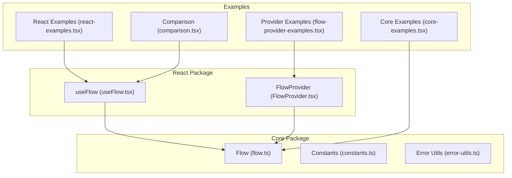
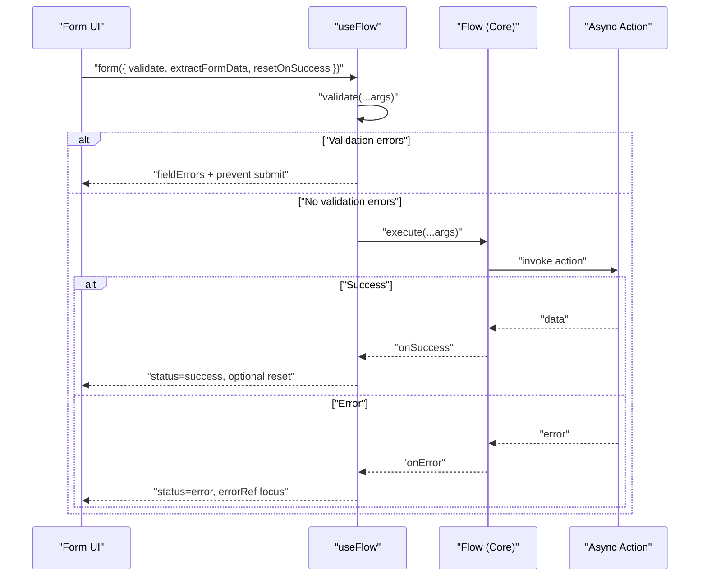
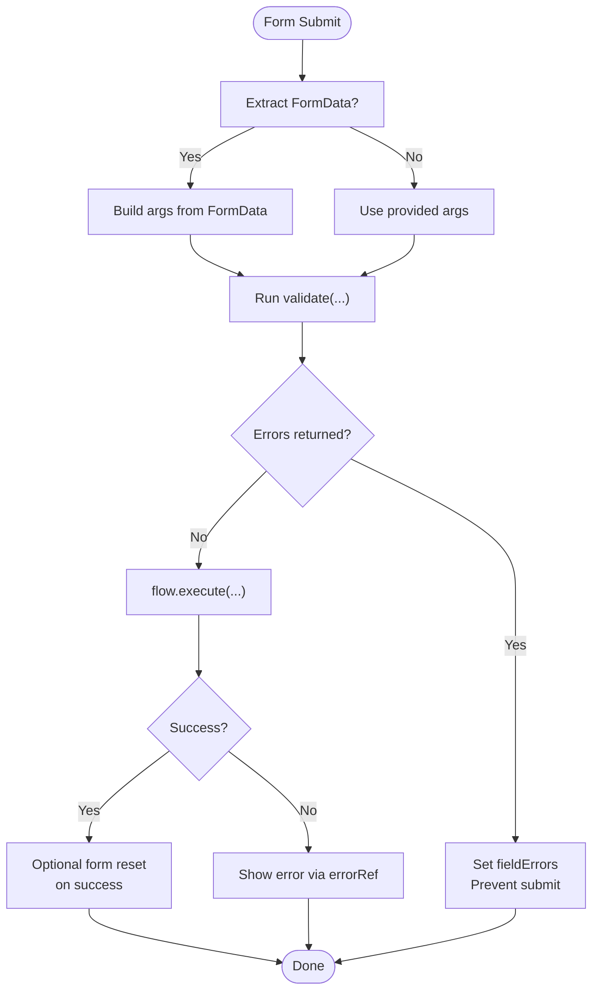
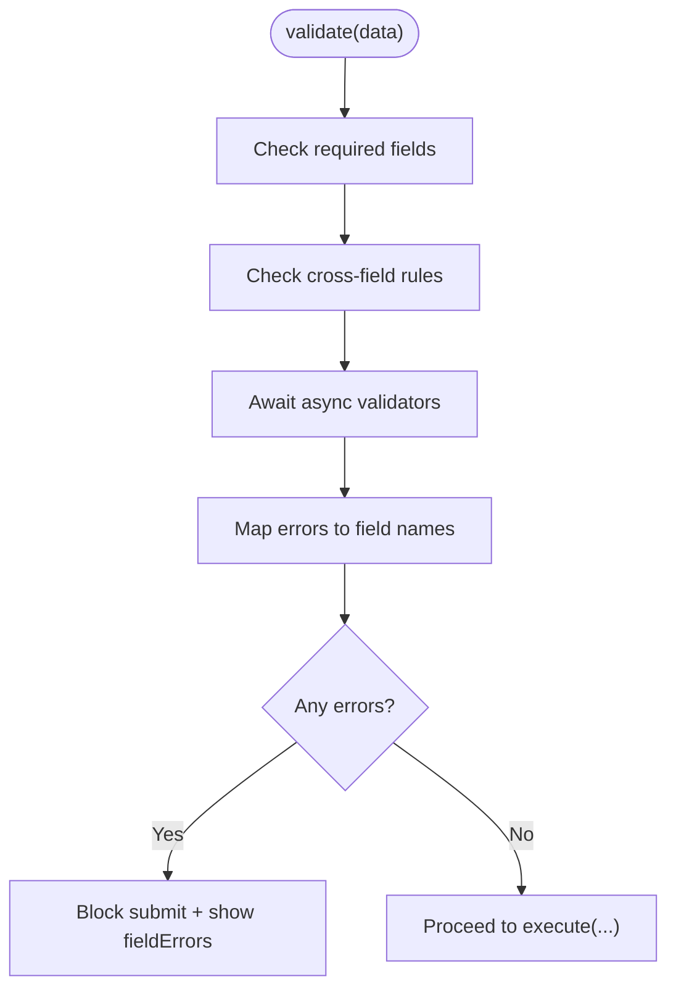
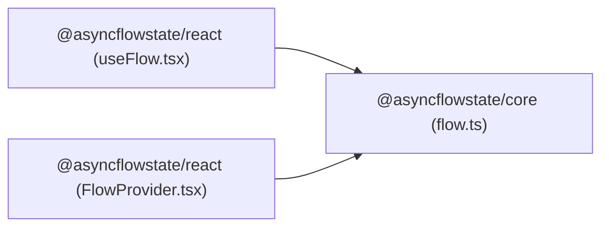

# Complex Form Integration

<cite>
**Referenced Files in This Document**
- [README.md](file://README.md)
- [flow.ts](file://packages/core/src/flow.ts)
- [error-utils.ts](file://packages/core/src/error-utils.ts)
- [constants.ts](file://packages/core/src/constants.ts)
- [useFlow.tsx](file://packages/react/src/useFlow.tsx)
- [FlowProvider.tsx](file://packages/react/src/FlowProvider.tsx)
- [react-examples.tsx](file://examples/react/react-examples.tsx)
- [comparison.tsx](file://examples/react/comparison.tsx)
- [flow-provider-examples.tsx](file://examples/react/flow-provider-examples.tsx)
- [core-examples.ts](file://examples/basic/core-examples.ts)
</cite>

## Table of Contents

1. [Introduction](#introduction)
2. [Project Structure](#project-structure)
3. [Core Components](#core-components)
4. [Architecture Overview](#architecture-overview)
5. [Detailed Component Analysis](#detailed-component-analysis)
6. [Dependency Analysis](#dependency-analysis)
7. [Performance Considerations](#performance-considerations)
8. [Troubleshooting Guide](#troubleshooting-guide)
9. [Conclusion](#conclusion)
10. [Appendices](#appendices)

## Introduction

This document explains advanced form integration patterns with AsyncFlowState, focusing on complex validation scenarios, multi-step flows, and robust error management. It covers conditional field validation, cross-field dependencies, async validation, and persistence across steps. It also documents integration strategies with popular form libraries and custom validation frameworks, along with field-level error management, reset strategies, auto-clear behavior, and accessibility considerations for complex form workflows.

## Project Structure

AsyncFlowState is organized as a monorepo with two primary packages:

- Core engine for async behavior orchestration
- React bindings with helpers for forms and accessibility

**Diagram sources**

- [flow.ts](file://packages/core/src/flow.ts#L174-L709)
- [useFlow.tsx](file://packages/react/src/useFlow.tsx#L77-L281)
- [FlowProvider.tsx](file://packages/react/src/FlowProvider.tsx#L50-L139)
- [react-examples.tsx](file://examples/react/react-examples.tsx#L1-L491)
- [comparison.tsx](file://examples/react/comparison.tsx#L1-L246)
- [flow-provider-examples.tsx](file://examples/react/flow-provider-examples.tsx#L1-L368)
- [core-examples.ts](file://examples/basic/core-examples.ts#L1-L221)

**Section sources**

- [README.md](file://README.md#L108-L117)
- [package.json](file://package.json#L25-L43)

## Core Components

- Flow (core): Orchestrates async actions with loading, success, error states, retries, concurrency, and UX controls.
- useFlow (React): Provides React hooks and helpers for forms, buttons, accessibility, and field-level validation.
- FlowProvider (React): Supplies global defaults and merges them with local options.

Key capabilities for forms:

- Automatic FormData extraction and submission
- Field-level validation with error mapping
- Success auto-reset and form reset
- Accessible announcements and focus management
- Global configuration for retries, UX polish, and error handling

**Section sources**

- [flow.ts](file://packages/core/src/flow.ts#L174-L709)
- [useFlow.tsx](file://packages/react/src/useFlow.tsx#L77-L281)
- [FlowProvider.tsx](file://packages/react/src/FlowProvider.tsx#L50-L139)

## Architecture Overview

The React integration centers around useFlow, which wraps the core Flow engine and exposes helpers tailored for forms and accessibility.

**Diagram sources**

- [useFlow.tsx](file://packages/react/src/useFlow.tsx#L200-L249)
- [flow.ts](file://packages/core/src/flow.ts#L482-L533)

## Detailed Component Analysis

### Form Helpers and Validation

- form helper:
  - Extracts FormData automatically when enabled
  - Runs user-provided validate function
  - Prevents submission if validation returns errors
  - Executes the action and optionally resets the form on success
- button helper:
  - Disables during loading and sets aria-busy
  - Executes flow when clicked if no custom onClick is provided
- fieldErrors:
  - Tracks field-level validation errors returned by the validator
- errorRef:
  - React ref to focus the error message when an error occurs

**Diagram sources**

- [useFlow.tsx](file://packages/react/src/useFlow.tsx#L200-L249)

**Section sources**

- [useFlow.tsx](file://packages/react/src/useFlow.tsx#L15-L36)
- [useFlow.tsx](file://packages/react/src/useFlow.tsx#L200-L249)

### Multi-Step Forms and Flow State Persistence

While the core Flow does not enforce step ordering, you can persist state across steps using:

- Global FlowProvider configuration for shared UX and retry policies
- Manual state management for step indices and persisted data
- Success auto-reset to move forward after each step completes
- Conditional navigation based on current step and validation outcomes

Recommended approach:

- Store current step index and step-specific data in component state
- Use FlowProvider to configure minDuration and autoReset for smooth transitions
- On success, increment step and optionally reset the current step’s flow
- On error, display step-specific error messages and allow correction

**Section sources**

- [FlowProvider.tsx](file://packages/react/src/FlowProvider.tsx#L50-L139)
- [react-examples.tsx](file://examples/react/react-examples.tsx#L1-L491)

### Integration with Popular Form Libraries

- React Hook Form:
  - Use the form helper with extractFormData=false
  - Pass extracted values from RHF to flow.execute(...)
  - Use RHF’s validation for validate prop or run RHF’s validation before calling flow.execute
- Formik:
  - Use formik.handleSubmit to call flow.execute(values)
  - Use Formik’s validation schema to block submission until valid
  - Use Formik’s setFieldError/setErrors to populate fieldErrors for accessibility

Guidelines:

- Keep validation in the form library for declarative validation
- Use fieldErrors from useFlow to mirror field-level errors for accessibility
- Use resetOnSuccess to clear form state after success

**Section sources**

- [useFlow.tsx](file://packages/react/src/useFlow.tsx#L200-L249)
- [react-examples.tsx](file://examples/react/react-examples.tsx#L421-L490)

### Complex Validation Scenarios

- Conditional field validation:
  - validate function checks values and conditionally returns errors keyed by field names
- Cross-field dependencies:
  - validate compares related fields (e.g., confirm password, date ranges)
- Async validation:
  - validate can return a Promise; useFlow awaits it before proceeding
- Error categorization:
  - Use createFlowError and detectErrorType to classify errors for retry decisions

**Diagram sources**

- [useFlow.tsx](file://packages/react/src/useFlow.tsx#L228-L234)
- [error-utils.ts](file://packages/core/src/error-utils.ts#L53-L113)

**Section sources**

- [error-utils.ts](file://packages/core/src/error-utils.ts#L26-L39)
- [error-utils.ts](file://packages/core/src/error-utils.ts#L53-L113)
- [error-utils.ts](file://packages/core/src/error-utils.ts#L130-L143)

### Field-Level Error Management and Auto-Clear

- fieldErrors:
  - Populated by the form helper when validate returns a mapping of field name to error message
  - Clear before each submit to avoid stale errors
- Auto-clear on success:
  - resetOnSuccess triggers HTMLFormElement.reset() after a successful execution
- Accessibility:
  - errorRef focuses the error message element when an error occurs
  - LiveRegion announces success or error messages for screen readers

**Section sources**

- [useFlow.tsx](file://packages/react/src/useFlow.tsx#L117-L141)
- [useFlow.tsx](file://packages/react/src/useFlow.tsx#L217-L242)

### Wizard Forms and Dynamic Forms

- Wizard forms:
  - Persist step index and step data
  - Configure minDuration and autoReset for smooth transitions
  - Use success to advance and error to stay on current step with focused error
- Dynamic forms:
  - Conditionally render fields based on prior selections
  - Use validate to enforce conditional rules
  - Use resetOnSuccess to clear irrelevant fields when moving to next step

**Section sources**

- [react-examples.tsx](file://examples/react/react-examples.tsx#L1-L491)
- [FlowProvider.tsx](file://packages/react/src/FlowProvider.tsx#L50-L139)

### File Uploads and Progress Tracking

- File uploads:
  - Use form helper with extractFormData to capture File objects
  - Manually set progress via setProgress for long-running uploads
- Progress tracking:
  - Call setProgress during upload callbacks
  - Combine with minDuration to avoid flickering progress indicators

**Section sources**

- [useFlow.tsx](file://packages/react/src/useFlow.tsx#L267-L268)
- [react-examples.tsx](file://examples/react/react-examples.tsx#L307-L373)

### Accessibility Considerations

- ARIA:
  - button helper sets aria-busy and disabled during loading
  - form helper sets aria-busy on the form
- Screen reader announcements:
  - LiveRegion component announces success or error messages
  - Focus management ensures error messages receive focus when appearing
- Keyboard navigation:
  - Disabled buttons and inputs during loading improve predictable interactions
  - Proper labeling and error messaging support keyboard-only users

**Section sources**

- [useFlow.tsx](file://packages/react/src/useFlow.tsx#L174-L194)
- [useFlow.tsx](file://packages/react/src/useFlow.tsx#L213-L247)
- [useFlow.tsx](file://packages/react/src/useFlow.tsx#L147-L168)
- [useFlow.tsx](file://packages/react/src/useFlow.tsx#L117-L141)

## Dependency Analysis

The React package depends on the core package, and examples demonstrate usage patterns.

**Diagram sources**

- [useFlow.tsx](file://packages/react/src/useFlow.tsx#L9-L10)
- [FlowProvider.tsx](file://packages/react/src/FlowProvider.tsx#L1-L2)
- [flow.ts](file://packages/core/src/flow.ts#L1-L8)

**Section sources**

- [package.json](file://packages/react/package.json#L58-L60)
- [package.json](file://packages/core/package.json#L28-L38)

## Performance Considerations

- Concurrency control:
  - Use concurrency strategies to prevent double submissions and manage queued executions
- UX polish:
  - minDuration prevents UI flashes for fast actions
  - delay avoids showing spinners for near-instant actions
- Retry strategies:
  - Configure maxAttempts, delay, and backoff to balance resilience and user experience
- Debounce/throttle:
  - Apply to search or frequent inputs to reduce network load

**Section sources**

- [flow.ts](file://packages/core/src/flow.ts#L425-L415)
- [flow.ts](file://packages/core/src/flow.ts#L482-L533)
- [flow.ts](file://packages/core/src/flow.ts#L646-L656)
- [react-examples.tsx](file://examples/react/react-examples.tsx#L251-L301)

## Troubleshooting Guide

Common issues and resolutions:

- Stale field errors after successful submission:
  - Ensure resetOnSuccess is enabled so the form clears after success
- Validation not blocking submission:
  - Verify validate returns a mapping of field names to error messages
- Error message not focused:
  - Confirm errorRef is attached to the error element and that the component renders it
- Unexpected retries:
  - Review error classification; validation and permission errors are not retried by default
- Global vs local options:
  - Use FlowProvider with overrideMode to control merging behavior

**Section sources**

- [useFlow.tsx](file://packages/react/src/useFlow.tsx#L217-L242)
- [useFlow.tsx](file://packages/react/src/useFlow.tsx#L117-L141)
- [error-utils.ts](file://packages/core/src/error-utils.ts#L130-L143)
- [FlowProvider.tsx](file://packages/react/src/FlowProvider.tsx#L76-L138)

## Conclusion

AsyncFlowState provides a robust foundation for complex form integrations. Its form helpers, validation hooks, accessibility features, and global configuration enable sophisticated workflows such as wizard forms, dynamic forms, and file uploads. By combining field-level validation, step persistence, and UX controls, teams can deliver reliable, accessible, and performant form experiences.

## Appendices

### API Reference Highlights

- useFlow:
  - form(options): returns props for form elements with validation and reset behavior
  - button(props): returns props for button elements with accessibility and click handling
  - fieldErrors: record of field-level validation errors
  - errorRef: ref to focus error messages
  - LiveRegion: component for screen reader announcements
- FlowProvider:
  - config: global defaults merged with local options
  - overrideMode: merge or replace behavior for global/local options

**Section sources**

- [useFlow.tsx](file://packages/react/src/useFlow.tsx#L15-L36)
- [useFlow.tsx](file://packages/react/src/useFlow.tsx#L174-L281)
- [FlowProvider.tsx](file://packages/react/src/FlowProvider.tsx#L7-L17)
- [FlowProvider.tsx](file://packages/react/src/FlowProvider.tsx#L76-L138)
