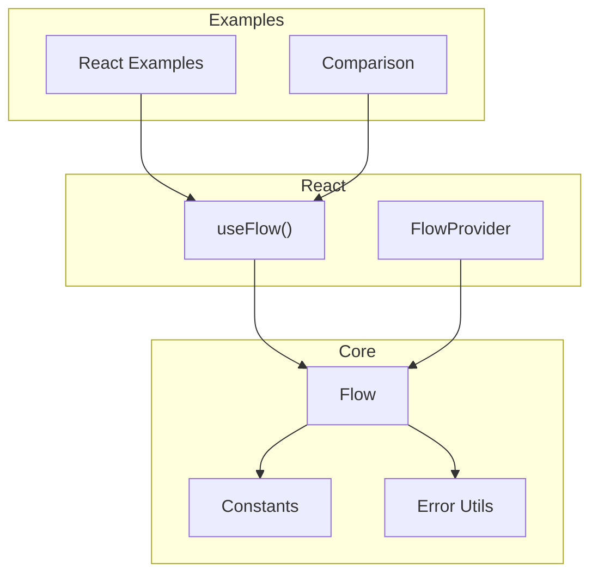
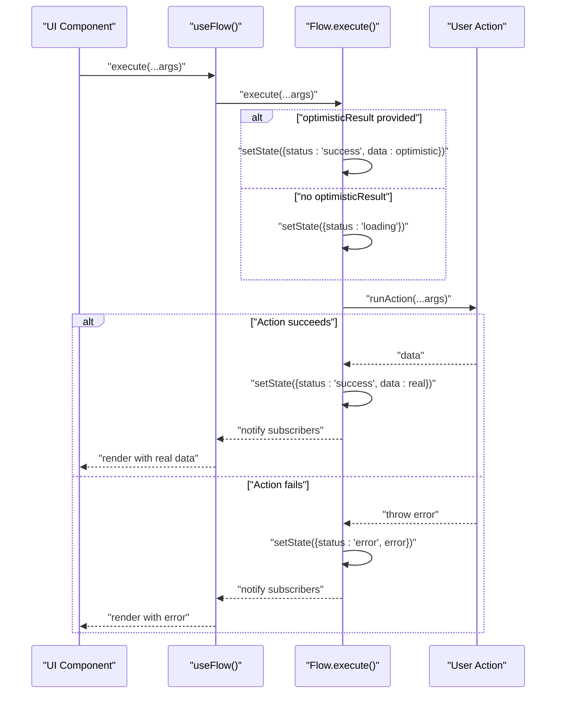
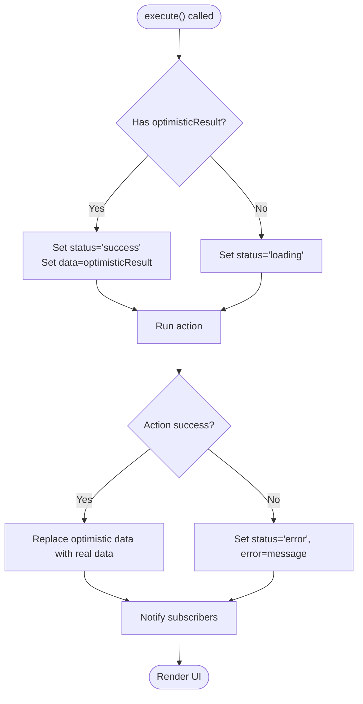
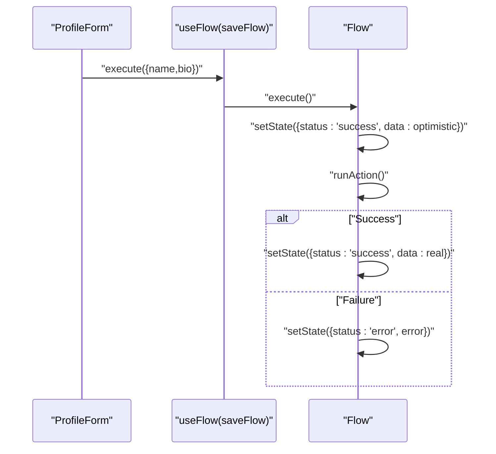
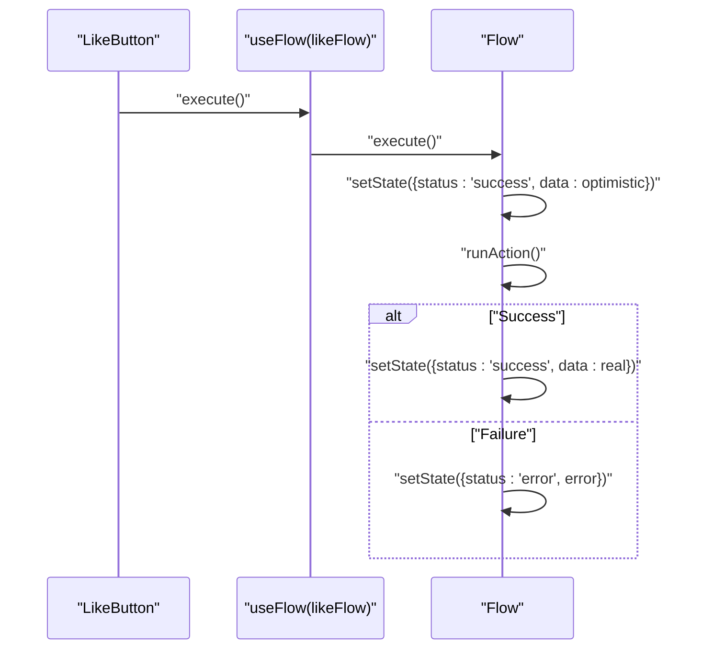
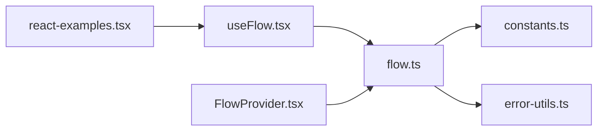

# Optimistic UI Patterns

<cite>
**Referenced Files in This Document**
- [flow.ts](file://packages/core/src/flow.ts)
- [flow.d.ts](file://packages/core/src/flow.d.ts)
- [constants.ts](file://packages/core/src/constants.ts)
- [error-utils.ts](file://packages/core/src/error-utils.ts)
- [useFlow.tsx](file://packages/react/src/useFlow.tsx)
- [FlowProvider.tsx](file://packages/react/src/FlowProvider.tsx)
- [react-examples.tsx](file://examples/react/react-examples.tsx)
- [comparison.tsx](file://examples/react/comparison.tsx)
- [flow.test.ts](file://packages/core/src/flow.test.ts)
- [README.md](file://README.md)
- [packages/core/README.md](file://packages/core/README.md)
- [packages/react/README.md](file://packages/react/README.md)
</cite>

## Table of Contents

1. [Introduction](#introduction)
2. [Project Structure](#project-structure)
3. [Core Components](#core-components)
4. [Architecture Overview](#architecture-overview)
5. [Detailed Component Analysis](#detailed-component-analysis)
6. [Dependency Analysis](#dependency-analysis)
7. [Performance Considerations](#performance-considerations)
8. [Troubleshooting Guide](#troubleshooting-guide)
9. [Conclusion](#conclusion)
10. [Appendices](#appendices)

## Introduction

This document explains how AsyncFlowState implements optimistic UI patterns to deliver instant feedback while preserving correctness. The optimisticResult configuration option enables immediate UI updates before server confirmation. When actions fail, the system does not automatically roll back—instead, it surfaces errors and leaves it to developers to implement rollback strategies. We cover error recovery approaches, best practices for safe optimistic updates, and practical examples from the codebase.

## Project Structure

AsyncFlowState consists of:

- Core engine (@asyncflowstate/core) that orchestrates async behavior and state transitions
- React bindings (@asyncflowstate/react) that provide hooks, helpers, and accessibility features
- Examples demonstrating optimistic patterns and other async UI patterns

**Diagram sources**

- [flow.ts](file://packages/core/src/flow.ts#L174-L709)
- [useFlow.tsx](file://packages/react/src/useFlow.tsx#L77-L281)
- [FlowProvider.tsx](file://packages/react/src/FlowProvider.tsx#L50-L139)
- [react-examples.tsx](file://examples/react/react-examples.tsx#L1-L491)
- [comparison.tsx](file://examples/react/comparison.tsx#L1-L246)

**Section sources**

- [README.md](file://README.md#L108-L117)
- [packages/core/README.md](file://packages/core/README.md#L1-L134)
- [packages/react/README.md](file://packages/react/README.md#L1-L212)

## Core Components

- Flow: The core state machine that manages status, data, error, progress, and lifecycle. It supports optimisticResult to instantly transition to success with provided data.
- useFlow: React hook that wraps Flow, exposes helpers (button, form), accessibility features, and syncs state to React.
- FlowProvider: Provides global defaults and merges them with local options.

Key concepts:

- optimisticResult: When provided, execute() immediately sets status to success with optimistic data, then runs the action. On success, the optimistic data is replaced by the real result. On error, the optimistic data remains until the developer decides how to handle it.
- Error handling: onError callbacks fire on terminal failure; there is no automatic rollback.
- Auto-reset: Optional success auto-reset after a delay.

**Section sources**

- [flow.ts](file://packages/core/src/flow.ts#L99-L127)
- [flow.ts](file://packages/core/src/flow.ts#L425-L473)
- [flow.ts](file://packages/core/src/flow.ts#L494-L533)
- [useFlow.tsx](file://packages/react/src/useFlow.tsx#L77-L281)
- [FlowProvider.tsx](file://packages/react/src/FlowProvider.tsx#L76-L138)

## Architecture Overview

The optimistic update flow is orchestrated by Flow.execute(). When optimisticResult is present, the state becomes success immediately, then the real action runs. On success, the optimistic data is replaced; on error, the state becomes error and the optimistic data persists.

**Diagram sources**

- [flow.ts](file://packages/core/src/flow.ts#L425-L473)
- [flow.ts](file://packages/core/src/flow.ts#L482-L533)
- [useFlow.tsx](file://packages/react/src/useFlow.tsx#L251-L253)

## Detailed Component Analysis

### OptimisticResult Configuration

- Purpose: Provide instant UI updates by transitioning to success with optimistic data before the action completes.
- Behavior:
  - If optimisticResult is set, Flow.execute() immediately sets status to success and data to optimisticResult.
  - After the action resolves, if successful, the optimistic data is replaced by the real result.
  - If the action fails, the state becomes error and the optimistic data remains.

**Diagram sources**

- [flow.ts](file://packages/core/src/flow.ts#L446-L452)
- [flow.ts](file://packages/core/src/flow.ts#L494-L509)
- [flow.ts](file://packages/core/src/flow.ts#L517-L527)

**Section sources**

- [flow.ts](file://packages/core/src/flow.ts#L117-L127)
- [flow.ts](file://packages/core/src/flow.ts#L425-L473)
- [flow.ts](file://packages/core/src/flow.ts#L494-L533)
- [flow.test.ts](file://packages/core/src/flow.test.ts#L49-L85)

### Automatic Rollback Mechanism

- There is no automatic rollback in AsyncFlowState. When an action fails:
  - The state becomes error.
  - The optimistic data remains visible until the developer chooses to reset or revert.
- Recommended strategies:
  - Manual reset: Call flow.reset() to return to idle.
  - Manual revert: Maintain a copy of the previous data and restore it on error.
  - Conditional optimistic updates: Only optimisticResult for idempotent operations.

**Section sources**

- [flow.ts](file://packages/core/src/flow.ts#L517-L527)
- [flow.ts](file://packages/core/src/flow.ts#L362-L370)

### Error Recovery Strategies

- Terminal error handling: Use onError to surface errors and decide whether to keep optimistic data or reset.
- Manual rollback triggers:
  - Reset after error: flow.reset() to clear state.
  - Custom revert: Implement a rollback function that restores previous data.
- Error boundaries and accessibility:
  - Use errorRef to focus error messages.
  - Use LiveRegion to announce errors to assistive technologies.

**Section sources**

- [flow.ts](file://packages/core/src/flow.ts#L102-L103)
- [useFlow.tsx](file://packages/react/src/useFlow.tsx#L117-L141)
- [useFlow.tsx](file://packages/react/src/useFlow.tsx#L273-L278)

### Best Practices for Safe Optimistic Updates

- Idempotency: Prefer optimisticResult for operations that can be safely retried without side-effects.
- Conflict resolution:
  - Use server-side timestamps or ETags to detect conflicts.
  - Implement optimisticResult that reflects the server’s expected outcome.
- Data consistency:
  - Keep a client copy of the previous state to enable manual rollback.
  - Avoid optimisticResult for non-idempotent operations (e.g., charging a card).
- User feedback:
  - Combine optimisticResult with autoReset to hide success messages after a delay.
  - Provide clear error messaging and recovery options.

**Section sources**

- [packages/core/README.md](file://packages/core/README.md#L81-L92)
- [packages/react/README.md](file://packages/react/README.md#L150-L177)

### Practical Examples from the Codebase

#### Form Submission with OptimisticResult

- Pattern: Provide optimisticResult with the expected updated state. On success, the optimistic data is replaced by the server response.
- Example reference: [ProfileForm](file://examples/react/react-examples.tsx#L186-L245)

**Diagram sources**

- [react-examples.tsx](file://examples/react/react-examples.tsx#L186-L245)
- [flow.ts](file://packages/core/src/flow.ts#L425-L473)
- [flow.ts](file://packages/core/src/flow.ts#L494-L509)

**Section sources**

- [react-examples.tsx](file://examples/react/react-examples.tsx#L186-L245)
- [flow.test.ts](file://packages/core/src/flow.test.ts#L66-L85)

#### Like Button with OptimisticResult

- Pattern: Compute optimisticResult by toggling liked state and adjusting counts. On success, the optimistic data is replaced; on failure, keep optimistic data to reflect user intent.
- Example reference: [LikeButton](file://examples/react/react-examples.tsx#L100-L128)

**Diagram sources**

- [react-examples.tsx](file://examples/react/react-examples.tsx#L100-L128)
- [flow.ts](file://packages/core/src/flow.ts#L446-L452)
- [flow.ts](file://packages/core/src/flow.ts#L517-L527)

**Section sources**

- [react-examples.tsx](file://examples/react/react-examples.tsx#L100-L128)
- [flow.test.ts](file://packages/core/src/flow.test.ts#L49-L64)

#### List Modifications with OptimisticResult

- Pattern: Remove or reorder items optimistically, then reconcile with server response. On failure, revert the optimistic change.
- Example reference: [DeleteButton](file://examples/react/react-examples.tsx#L134-L180)

**Diagram sources**

- [react-examples.tsx](file://examples/react/react-examples.tsx#L134-L180)
- [flow.ts](file://packages/core/src/flow.ts#L425-L473)
- [flow.ts](file://packages/core/src/flow.ts#L517-L527)

**Section sources**

- [react-examples.tsx](file://examples/react/react-examples.tsx#L134-L180)

### Error Handling and Accessibility

- Error surfacing: Use onError to display user-friendly messages.
- Focus management: Use errorRef to focus error messages when entering error state.
- Screen reader announcements: Use LiveRegion to announce success or error messages.

**Section sources**

- [flow.ts](file://packages/core/src/flow.ts#L102-L103)
- [useFlow.tsx](file://packages/react/src/useFlow.tsx#L117-L141)
- [useFlow.tsx](file://packages/react/src/useFlow.tsx#L147-L168)

## Dependency Analysis

- useFlow depends on Flow from @asyncflowstate/core.
- FlowProvider merges global and local options, passing optimisticResult to Flow.
- React examples demonstrate optimisticResult usage patterns.

**Diagram sources**

- [useFlow.tsx](file://packages/react/src/useFlow.tsx#L77-L281)
- [flow.ts](file://packages/core/src/flow.ts#L174-L709)
- [FlowProvider.tsx](file://packages/react/src/FlowProvider.tsx#L76-L138)
- [constants.ts](file://packages/core/src/constants.ts#L1-L51)
- [error-utils.ts](file://packages/core/src/error-utils.ts#L1-L207)
- [react-examples.tsx](file://examples/react/react-examples.tsx#L1-L491)

**Section sources**

- [FlowProvider.tsx](file://packages/react/src/FlowProvider.tsx#L76-L138)
- [flow.ts](file://packages/core/src/flow.ts#L174-L709)

## Performance Considerations

- UX polish: Use loading.minDuration and loading.delay to prevent UI flicker and improve perceived performance.
- Concurrency: Choose concurrency strategies to prevent double submissions and race conditions.
- Retry: Configure retry with backoff to handle transient failures gracefully.

**Section sources**

- [flow.ts](file://packages/core/src/flow.ts#L65-L74)
- [flow.ts](file://packages/core/src/flow.ts#L89-L94)
- [flow.ts](file://packages/core/src/flow.ts#L115-L124)
- [packages/core/README.md](file://packages/core/README.md#L51-L65)

## Troubleshooting Guide

- Optimistic data not updating:
  - Ensure optimisticResult is provided and is a valid representation of the expected server outcome.
  - Confirm that the action resolves successfully so the optimistic data can be replaced.
- Error state not clearing:
  - Call flow.reset() to return to idle.
  - Implement manual rollback by restoring previous data.
- Conflicts with server state:
  - Use server timestamps or ETags to detect and resolve conflicts.
  - Avoid optimisticResult for non-idempotent operations.
- User confusion:
  - Provide clear error messages and recovery options.
  - Use LiveRegion and errorRef to improve accessibility.

**Section sources**

- [flow.ts](file://packages/core/src/flow.ts#L362-L370)
- [flow.ts](file://packages/core/src/flow.ts#L517-L527)
- [useFlow.tsx](file://packages/react/src/useFlow.tsx#L117-L141)
- [useFlow.tsx](file://packages/react/src/useFlow.tsx#L147-L168)

## Conclusion

AsyncFlowState’s optimisticResult enables instant UI updates while preserving correctness. Developers must implement explicit rollback strategies for failed actions, maintain data consistency, and provide clear user feedback. The examples demonstrate safe patterns for form submissions, profile updates, and list modifications. Combine optimisticResult with error handling, accessibility features, and UX polish to build responsive and reliable async interactions.

## Appendices

### API Definitions

- FlowOptions.optimisticResult: Optional data to set immediately upon execute().
- FlowOptions.onError/onSuccess: Callbacks invoked on terminal error or success.
- FlowOptions.autoReset: Optional success auto-reset after a delay.
- FlowOptions.loading: Controls perceived loading duration and delay.

**Section sources**

- [flow.d.ts](file://packages/core/src/flow.d.ts#L60-L79)
- [flow.ts](file://packages/core/src/flow.ts#L99-L127)
