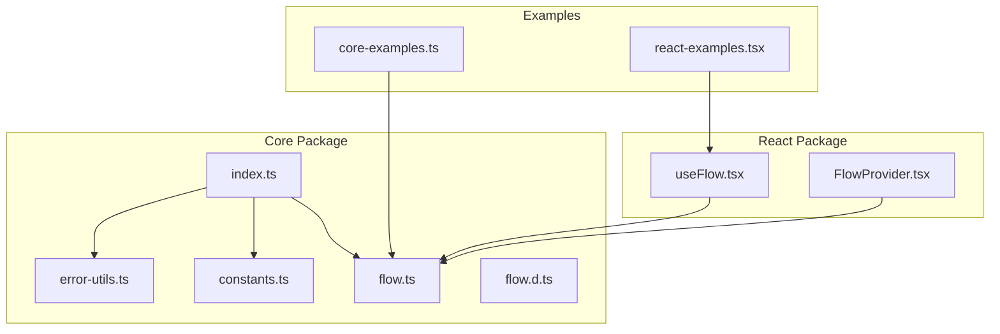
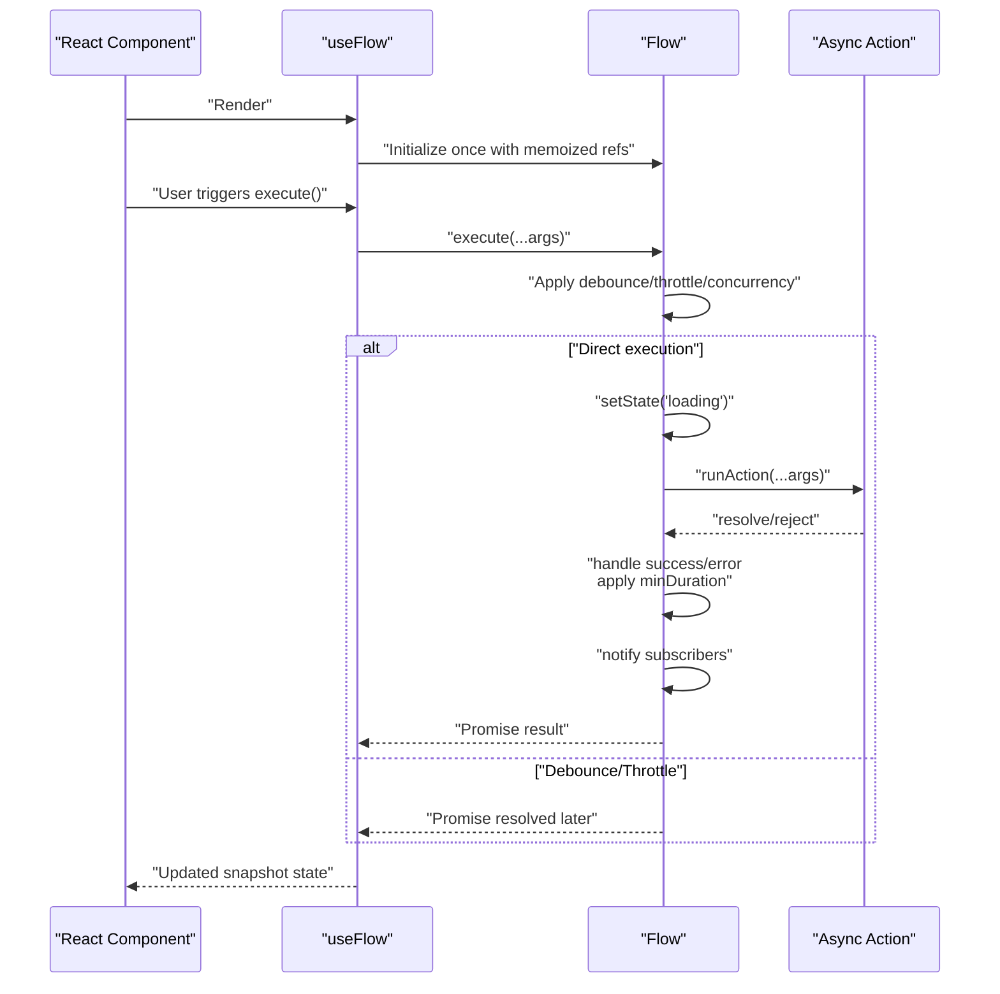
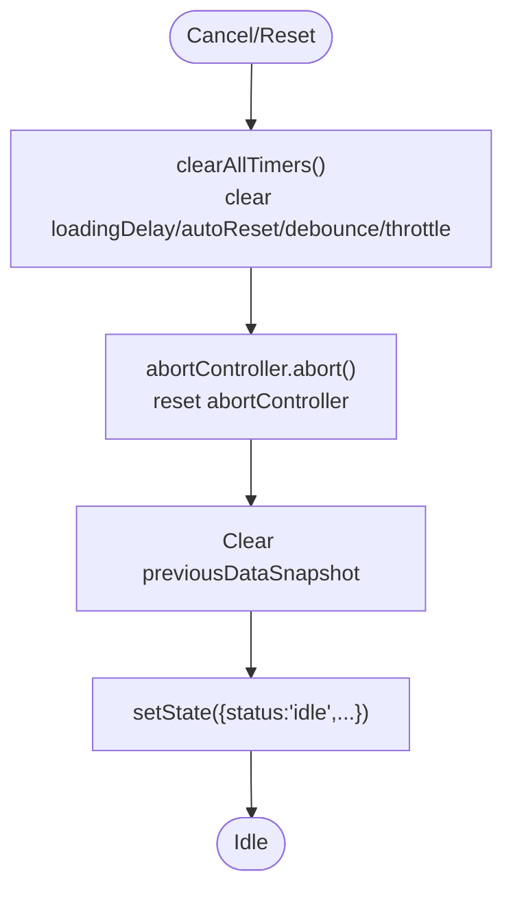
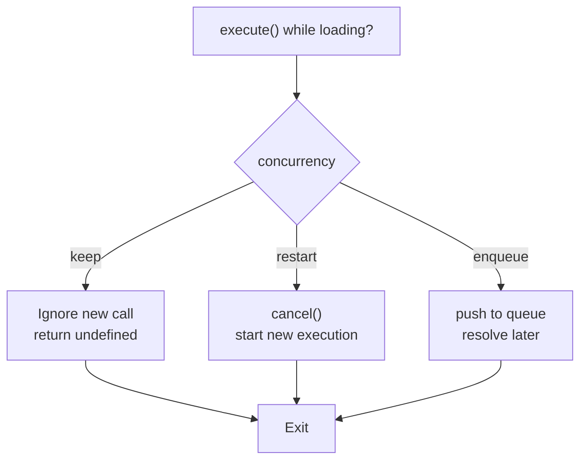
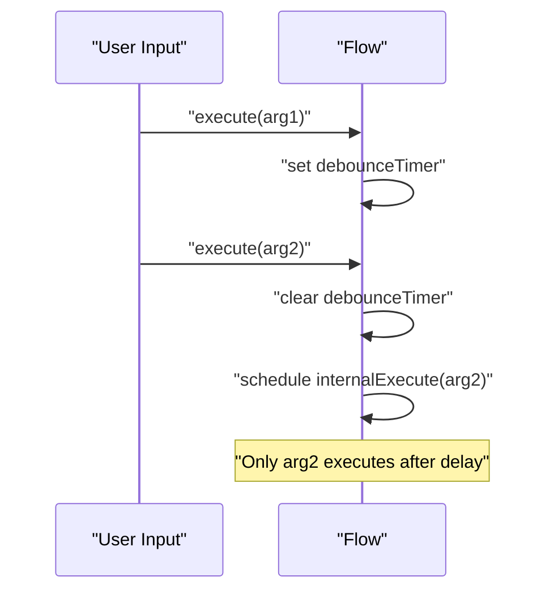
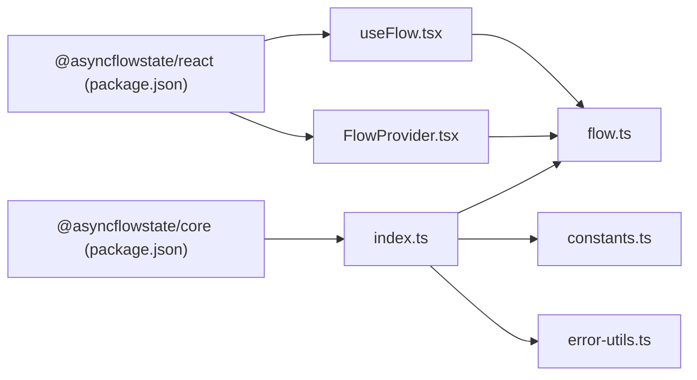

# Performance Optimization

<cite>
**Referenced Files in This Document**
- [flow.ts](file://packages/core/src/flow.ts)
- [constants.ts](file://packages/core/src/constants.ts)
- [error-utils.ts](file://packages/core/src/error-utils.ts)
- [index.ts](file://packages/core/src/index.ts)
- [flow.d.ts](file://packages/core/src/flow.d.ts)
- [useFlow.tsx](file://packages/react/src/useFlow.tsx)
- [FlowProvider.tsx](file://packages/react/src/FlowProvider.tsx)
- [core-examples.ts](file://examples/basic/core-examples.ts)
- [react-examples.tsx](file://examples/react/react-examples.tsx)
- [flow.test.ts](file://packages/core/src/flow.test.ts)
- [useFlow.test.tsx](file://packages/react/src/useFlow.test.tsx)
- [package.json](file://package.json)
- [packages/core/package.json](file://packages/core/package.json)
- [packages/react/package.json](file://packages/react/package.json)
- [packages/core/tsup.config.ts](file://packages/core/tsup.config.ts)
- [packages/react/tsup.config.ts](file://packages/react/tsup.config.ts)
</cite>

## Table of Contents

1. [Introduction](#introduction)
2. [Project Structure](#project-structure)
3. [Core Components](#core-components)
4. [Architecture Overview](#architecture-overview)
5. [Detailed Component Analysis](#detailed-component-analysis)
6. [Dependency Analysis](#dependency-analysis)
7. [Performance Considerations](#performance-considerations)
8. [Troubleshooting Guide](#troubleshooting-guide)
9. [Conclusion](#conclusion)
10. [Appendices](#appendices)

## Introduction

This document focuses on performance optimization strategies for AsyncFlowState, covering memory management, concurrency control, debouncing/throttling, lazy loading, state normalization, caching, monitoring, profiling, and runtime optimization for large-scale applications and low-powered devices. It synthesizes the core Flow engine and React integration to provide actionable guidance grounded in the repository’s implementation.

## Project Structure

AsyncFlowState is organized as a monorepo with two primary packages:

- Core engine (@asyncflowstate/core): Framework-agnostic orchestration of async actions and UI states.
- React integration (@asyncflowstate/react): React hooks and helpers built on top of the core.

**Diagram sources**

- [index.ts](file://packages/core/src/index.ts#L1-L4)
- [flow.ts](file://packages/core/src/flow.ts#L1-L783)
- [constants.ts](file://packages/core/src/constants.ts#L1-L51)
- [error-utils.ts](file://packages/core/src/error-utils.ts#L1-L207)
- [flow.d.ts](file://packages/core/src/flow.d.ts#L1-L177)
- [useFlow.tsx](file://packages/react/src/useFlow.tsx#L1-L281)
- [FlowProvider.tsx](file://packages/react/src/FlowProvider.tsx#L1-L139)
- [core-examples.ts](file://examples/basic/core-examples.ts#L1-L221)
- [react-examples.tsx](file://examples/react/react-examples.tsx#L1-L491)

**Section sources**

- [package.json](file://package.json#L1-L70)
- [packages/core/package.json](file://packages/core/package.json#L1-L56)
- [packages/react/package.json](file://packages/react/package.json#L1-L68)

## Core Components

- Flow: Central orchestrator for async actions, state transitions, retries, concurrency, optimistic updates, and UX controls (loading delay and min duration).
- React useFlow: React hook that wraps Flow, syncs state to React, and provides helpers for forms and buttons with accessibility features.
- FlowProvider: Provides global defaults and merges them with local options.

Key performance-relevant areas:

- Timer lifecycle management (loading delay, auto reset, debounce, throttle).
- Listener cleanup and subscription management.
- Abort controller for cancellation.
- Optimistic snapshots and rollback.
- Concurrency strategies (keep, restart, enqueue).
- Retry backoff strategies.

**Section sources**

- [flow.ts](file://packages/core/src/flow.ts#L207-L783)
- [useFlow.tsx](file://packages/react/src/useFlow.tsx#L77-L281)
- [FlowProvider.tsx](file://packages/react/src/FlowProvider.tsx#L50-L139)

## Architecture Overview

The core Flow engine encapsulates all async orchestration and state management. React’s useFlow integrates Flow into React components, maintaining a snapshot of state and exposing helpers. Global defaults are centralized via FlowProvider.

**Diagram sources**

- [useFlow.tsx](file://packages/react/src/useFlow.tsx#L77-L281)
- [flow.ts](file://packages/core/src/flow.ts#L436-L531)

## Detailed Component Analysis

### Memory Management and Cleanup

- Listener cleanup: Subscriptions are stored in a Set and removed via returned unsubscribe functions. Ensure consumers call unsubscribe to prevent leaks.
- Timer cleanup: Dedicated clearers for loading delay, auto reset, debounce, and throttle timers. The central clearAllTimers routine resets all timers and flags.
- Abort controller: Ensures cancellation of in-flight work and resets internal state.
- Snapshot cleanup: previousDataSnapshot cleared on success or rollback to avoid stale references.

**Diagram sources**

- [flow.ts](file://packages/core/src/flow.ts#L380-L406)
- [flow.ts](file://packages/core/src/flow.ts#L775-L782)

**Section sources**

- [flow.ts](file://packages/core/src/flow.ts#L361-L368)
- [flow.ts](file://packages/core/src/flow.ts#L380-L406)
- [flow.ts](file://packages/core/src/flow.ts#L775-L782)

### Concurrency Control Best Practices

- keep: Ignores concurrent calls while loading; prevents duplicate work.
- restart: Cancels current execution and starts a new one; useful for “last-writer-wins” scenarios.
- enqueue: Queues subsequent calls; executes after current completes; ensures ordered processing.

Recommendations:

- Prefer keep for high-frequency triggers (e.g., rapid clicks) to avoid wasted work.
- Use restart for imperative actions where latest input should supersede prior ones.
- Use enqueue for strict ordering (e.g., sequential saves).

**Diagram sources**

- [flow.ts](file://packages/core/src/flow.ts#L461-L476)

**Section sources**

- [flow.ts](file://packages/core/src/flow.ts#L461-L476)

### Debouncing and Throttling Strategies

- Debounce: Defers execution until after a quiet period. Useful for search or filter inputs.
- Throttle: Limits execution frequency to a fixed interval. Good for scroll or resize handlers.

Implementation highlights:

- Debounce uses a single timer per Flow instance; each new call clears the old timer.
- Throttle batches arguments and resolvers; executes at most once per window.

**Diagram sources**

- [flow.ts](file://packages/core/src/flow.ts#L611-L622)

**Section sources**

- [flow.ts](file://packages/core/src/flow.ts#L611-L659)

### Lazy Loading Patterns

- Defer execution until meaningful user intent (e.g., after typing stops).
- Use minimalDuration to avoid UI flicker for fast operations.
- Combine with optimistic updates to improve perceived responsiveness.

Practical tips:

- Apply debounce to search/filter inputs.
- Use minDuration to stabilize loading indicators.
- Avoid triggering flows on every keystroke; prefer debounced queries.

**Section sources**

- [flow.ts](file://packages/core/src/flow.ts#L720-L730)
- [flow.ts](file://packages/core/src/flow.ts#L611-L622)

### State Normalization and Caching

- Normalize data shape early to reduce transform costs and enable cache-friendly structures.
- Cache frequently accessed data keyed by stable identifiers.
- Invalidate caches on mutation events (e.g., optimistic updates followed by server sync).

Note: The core library does not implement normalization or caching; adopt these patterns at the application layer using the Flow state and callbacks.

[No sources needed since this section provides general guidance]

### Performance Monitoring and Profiling

- Use browser devtools to profile long tasks, memory, and rendering overhead.
- Instrument retry delays and backoff to understand network resilience trade-offs.
- Measure minDuration impact on perceived performance versus actual latency.

Testing references:

- Tests demonstrate minDuration and loading delay behavior under fake timers.
- Tests cover retry backoff timing expectations.

**Section sources**

- [flow.test.ts](file://packages/core/src/flow.test.ts#L292-L334)
- [flow.test.ts](file://packages/core/src/flow.test.ts#L243-L281)

### Bundle Size and Tree Shaking

- Both packages declare sideEffects: false, enabling aggressive tree shaking.
- Build targets ES2020 with separate CJS/ESM outputs.
- React package externalizes peer dependencies (react, react-dom) and core package.

Guidelines:

- Keep imports granular; rely on tree shaking.
- Avoid importing unused features (e.g., optimistic updates only when needed).
- Monitor bundle sizes with tools like webpack-bundle-analyzer.

**Section sources**

- [packages/core/package.json](file://packages/core/package.json#L45-L45)
- [packages/react/package.json](file://packages/react/package.json#L45-L45)
- [packages/core/tsup.config.ts](file://packages/core/tsup.config.ts#L1-L14)
- [packages/react/tsup.config.ts](file://packages/react/tsup.config.ts#L1-L15)

### Runtime Optimization for Mobile and Low-Powered Hardware

- Reduce redundant renders by consuming only necessary parts of the Flow snapshot.
- Use keep concurrency to minimize work on rapid user interactions.
- Prefer debounce over throttle for input-heavy flows to reduce peak load.
- Limit excessive retry attempts and backoff to avoid prolonged CPU wake-ups.
- Avoid heavy synchronous transforms on large datasets; defer or paginate.

**Section sources**

- [useFlow.tsx](file://packages/react/src/useFlow.tsx#L251-L281)
- [flow.ts](file://packages/core/src/flow.ts#L461-L476)
- [flow.ts](file://packages/core/src/flow.ts#L699-L712)

## Dependency Analysis

- Core exports Flow, constants, and error utilities.
- React package depends on core and exposes useFlow and FlowProvider.
- Build outputs are ESM/CJS with declaration files; React package marks core and React as external.

**Diagram sources**

- [packages/core/package.json](file://packages/core/package.json#L28-L39)
- [packages/react/package.json](file://packages/react/package.json#L58-L60)
- [index.ts](file://packages/core/src/index.ts#L1-L4)
- [flow.ts](file://packages/core/src/flow.ts#L1-L783)
- [useFlow.tsx](file://packages/react/src/useFlow.tsx#L1-L281)
- [FlowProvider.tsx](file://packages/react/src/FlowProvider.tsx#L1-L139)

**Section sources**

- [packages/core/package.json](file://packages/core/package.json#L28-L39)
- [packages/react/package.json](file://packages/react/package.json#L58-L60)
- [index.ts](file://packages/core/src/index.ts#L1-L4)

## Performance Considerations

- Minimize state churn: Avoid frequent small updates; batch UI updates where possible.
- Prefer keep concurrency for high-frequency triggers to reduce work duplication.
- Use debounce for search/filter inputs; throttle for scroll/resize handlers.
- Tune retry backoff to balance resilience and resource usage.
- Keep optimistic updates deterministic and lightweight to avoid layout thrashing.
- Use minDuration thoughtfully to avoid perceived slowness without real benefit.

[No sources needed since this section provides general guidance]

## Troubleshooting Guide

Common issues and remedies:

- Stuck loading: Verify minDuration and loading delay timers are cleared on success/error and reset.
- Memory leaks: Ensure unsubscribe is called for all listeners; confirm clearAllTimers is invoked on teardown.
- Unexpected retries: Review retry options and backoff strategy; use shouldRetry for fine-grained control.
- Lost user input: With enqueue concurrency, ensure callers handle queued promises and resolve outcomes.

**Section sources**

- [flow.ts](file://packages/core/src/flow.ts#L775-L782)
- [flow.ts](file://packages/core/src/flow.ts#L540-L607)
- [flow.test.ts](file://packages/core/src/flow.test.ts#L175-L198)

## Conclusion

AsyncFlowState provides robust primitives for managing async UI behavior with strong performance controls: timers, concurrency, retries, and UX smoothing. By applying the strategies outlined here—memory cleanup, debounce/throttle, concurrency selection, optimistic updates, and mindful bundling—you can achieve responsive, efficient experiences across diverse environments, including mobile and low-powered devices.

## Appendices

### API Surface and Key Behaviors

- Flow.getters: isLoading, isSuccess, isError, progress.
- Flow methods: execute, cancel, reset, setProgress, subscribe, setOptions.
- React helpers: button(), form(), LiveRegion, errorRef, fieldErrors.

**Section sources**

- [flow.ts](file://packages/core/src/flow.ts#L281-L322)
- [flow.ts](file://packages/core/src/flow.ts#L436-L451)
- [useFlow.tsx](file://packages/react/src/useFlow.tsx#L174-L279)
