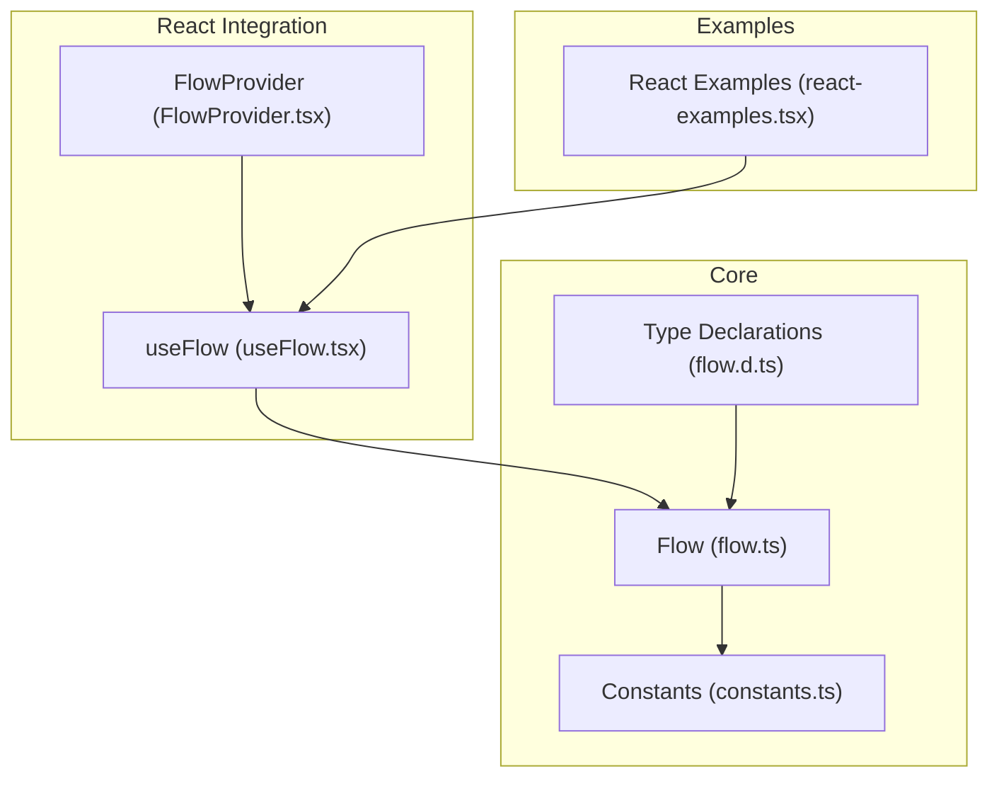
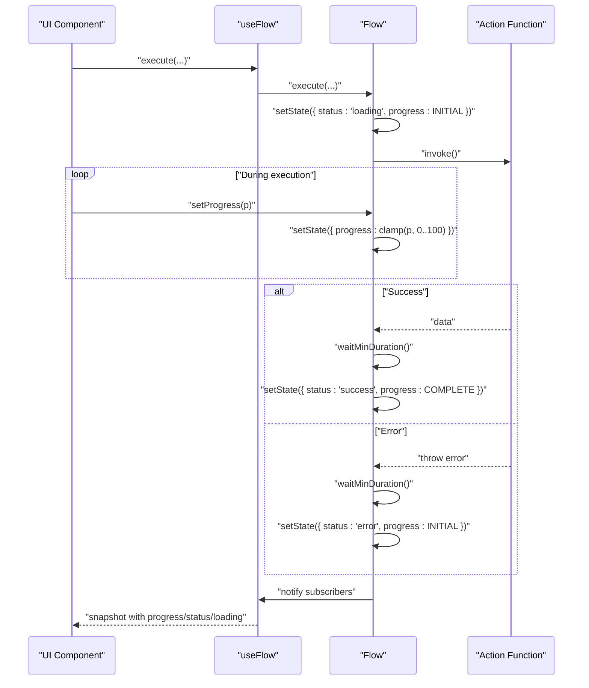
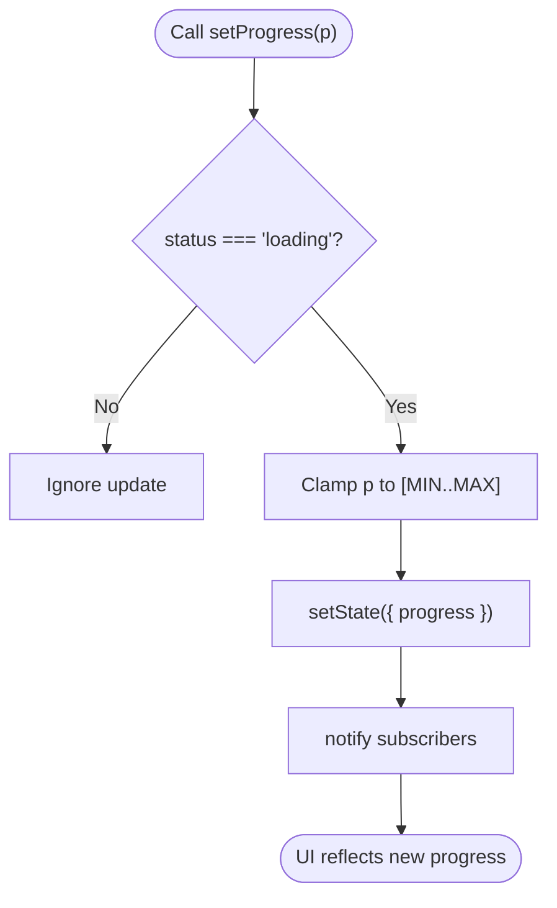
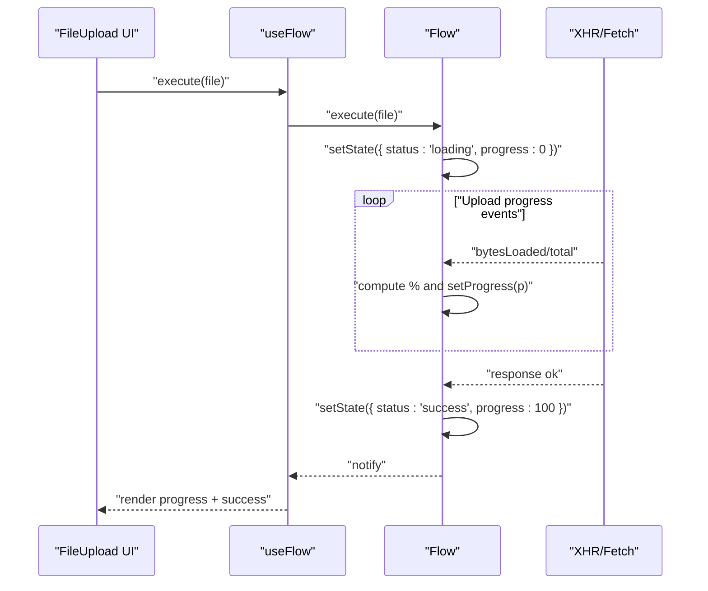
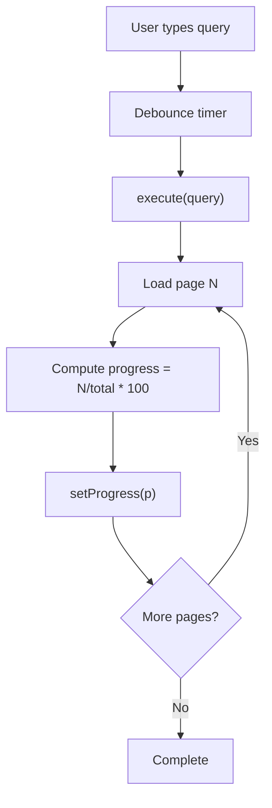
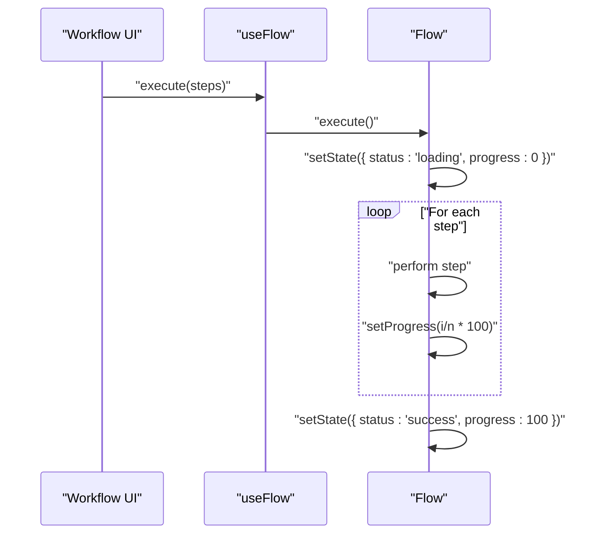
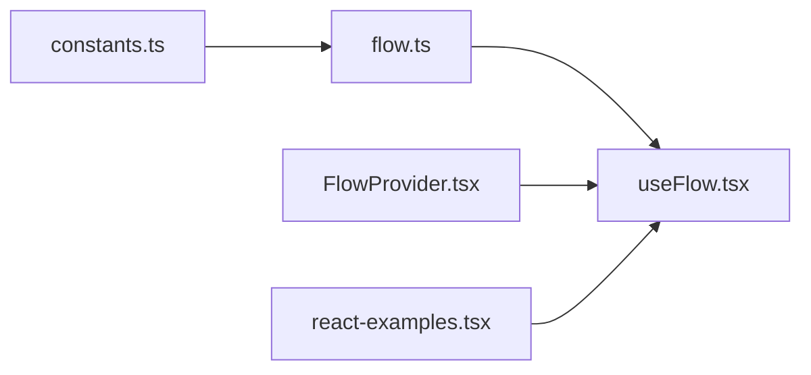

# Progress Tracking

<cite>
**Referenced Files in This Document**
- [flow.ts](file://packages/core/src/flow.ts)
- [constants.ts](file://packages/core/src/constants.ts)
- [flow.d.ts](file://packages/core/src/flow.d.ts)
- [useFlow.tsx](file://packages/react/src/useFlow.tsx)
- [FlowProvider.tsx](file://packages/react/src/FlowProvider.tsx)
- [react-examples.tsx](file://examples/react/react-examples.tsx)
- [flow.test.ts](file://packages/core/src/flow.test.ts)
</cite>

## Table of Contents
1. [Introduction](#introduction)
2. [Project Structure](#project-structure)
3. [Core Components](#core-components)
4. [Architecture Overview](#architecture-overview)
5. [Detailed Component Analysis](#detailed-component-analysis)
6. [Dependency Analysis](#dependency-analysis)
7. [Performance Considerations](#performance-considerations)
8. [Troubleshooting Guide](#troubleshooting-guide)
9. [Conclusion](#conclusion)
10. [Appendices](#appendices)

## Introduction
This document explains AsyncFlowState’s progress tracking capabilities with a focus on the setProgress method, how progress integrates with loading states, and practical patterns for long-running operations such as file uploads, paginated searches, and multi-step workflows. It covers progress value semantics (0–100), UI integration, best practices for smooth animations and user experience, and performance considerations for frequent updates and memory management.

## Project Structure
AsyncFlowState consists of:
- Core Flow engine for state orchestration and progress tracking
- React hooks for UI integration and convenience helpers
- Examples demonstrating real-world usage patterns

**Diagram sources**
- [flow.ts](file://packages/core/src/flow.ts#L174-L709)
- [constants.ts](file://packages/core/src/constants.ts#L37-L42)
- [flow.d.ts](file://packages/core/src/flow.d.ts#L84-L177)
- [useFlow.tsx](file://packages/react/src/useFlow.tsx#L77-L281)
- [FlowProvider.tsx](file://packages/react/src/FlowProvider.tsx#L50-L139)
- [react-examples.tsx](file://examples/react/react-examples.tsx#L1-L491)

**Section sources**
- [flow.ts](file://packages/core/src/flow.ts#L1-L709)
- [constants.ts](file://packages/core/src/constants.ts#L1-L51)
- [flow.d.ts](file://packages/core/src/flow.d.ts#L1-L177)
- [useFlow.tsx](file://packages/react/src/useFlow.tsx#L1-L281)
- [FlowProvider.tsx](file://packages/react/src/FlowProvider.tsx#L1-L139)
- [react-examples.tsx](file://examples/react/react-examples.tsx#L1-L491)

## Core Components
- Flow: Central state machine with progress tracking, loading delays, minDuration, retries, and UI helpers.
- Constants: Defines progress boundaries (MIN/MAX/INITIAL/COMPLETE) and UX defaults.
- useFlow: React hook that exposes isLoading, progress, and setProgress alongside form/button helpers.
- FlowProvider: Global configuration provider for retry, loading, and callbacks.

Key progress-related APIs:
- setProgress(number): Manually update progress while loading (clamped to 0–100).
- progress getter: Current progress value (0–100).
- Loading options: minDuration and delay influence perceived UX timing.

**Section sources**
- [flow.ts](file://packages/core/src/flow.ts#L283-L305)
- [constants.ts](file://packages/core/src/constants.ts#L37-L42)
- [flow.d.ts](file://packages/core/src/flow.d.ts#L140-L146)
- [useFlow.tsx](file://packages/react/src/useFlow.tsx#L267-L268)

## Architecture Overview
The progress lifecycle is tightly coupled with the loading state. While loading, setProgress updates the internal state and notifies subscribers. On success, progress is automatically set to 100; on error, progress resets to initial.

**Diagram sources**
- [flow.ts](file://packages/core/src/flow.ts#L425-L533)
- [flow.ts](file://packages/core/src/flow.ts#L646-L656)
- [flow.ts](file://packages/core/src/flow.ts#L672-L679)
- [useFlow.tsx](file://packages/react/src/useFlow.tsx#L251-L253)

## Detailed Component Analysis

### Manual Progress Updates with setProgress
- Purpose: Allow precise, manual control of progress during long-running tasks.
- Behavior:
  - Only effective while status is loading.
  - Value clamped to [0, 100].
  - Triggers immediate state update and notification to subscribers.
- Typical usage:
  - File uploads with XHR/AbortController progress events.
  - Batch operations with per-item completion tracking.
  - Multi-step workflows with named stages.

**Diagram sources**
- [flow.ts](file://packages/core/src/flow.ts#L299-L305)
- [constants.ts](file://packages/core/src/constants.ts#L37-L42)
- [flow.ts](file://packages/core/src/flow.ts#L672-L679)

**Section sources**
- [flow.ts](file://packages/core/src/flow.ts#L290-L305)
- [flow.test.ts](file://packages/core/src/flow.test.ts#L336-L345)

### Progress Values and UI Impact
- Boundaries:
  - MIN: 0
  - MAX: 100
  - INITIAL: 0
  - COMPLETE: 100
- UI integration:
  - React’s isLoading respects loading delay/minDuration.
  - progress getter provides numeric value for progress bars.
  - useFlow exposes setProgress for manual updates.

Practical UI patterns:
- Indeterminate vs determinate: Use setProgress for determinate progress; rely on loading delay/minDuration for indeterminate UX.
- Animations: Map progress to width/rotation smoothly; debounce frequent updates to reduce layout thrash.

**Section sources**
- [constants.ts](file://packages/core/src/constants.ts#L37-L42)
- [flow.d.ts](file://packages/core/src/flow.d.ts#L140-L146)
- [useFlow.tsx](file://packages/react/src/useFlow.tsx#L259-L268)

### Integration Patterns

#### File Uploads
- Pattern: Call setProgress periodically based on upload progress events. On completion, await success state where progress is set to 100.
- Example reference: FileUpload component demonstrates execute(), loading state, and success handling. To add progress, wrap the underlying upload mechanism and call setProgress during upload.

**Diagram sources**
- [flow.ts](file://packages/core/src/flow.ts#L425-L533)
- [flow.ts](file://packages/core/src/flow.ts#L646-L656)
- [react-examples.tsx](file://examples/react/react-examples.tsx#L307-L373)

**Section sources**
- [react-examples.tsx](file://examples/react/react-examples.tsx#L307-L373)
- [flow.test.ts](file://packages/core/src/flow.test.ts#L336-L345)

#### Search Operations with Pagination
- Pattern: Use debounce/throttle to limit frequent queries. Track progress for multi-page loads by setting progress as pages processed / total pages × 100.
- Example reference: SearchInput shows debounced execution via external timers; integrate setProgress to reflect page completion.

**Diagram sources**
- [react-examples.tsx](file://examples/react/react-examples.tsx#L251-L301)
- [flow.ts](file://packages/core/src/flow.ts#L537-L585)

**Section sources**
- [react-examples.tsx](file://examples/react/react-examples.tsx#L251-L301)
- [flow.ts](file://packages/core/src/flow.ts#L537-L585)

#### Multi-Step Workflows
- Pattern: Divide work into steps and compute progress as completedSteps / totalSteps × 100. Use optimistic intermediate states if desired.
- Example reference: Use optimisticResult to show immediate UI updates, then finalize with success and 100% progress.

**Diagram sources**
- [flow.ts](file://packages/core/src/flow.ts#L446-L452)
- [flow.ts](file://packages/core/src/flow.ts#L502)

**Section sources**
- [flow.ts](file://packages/core/src/flow.ts#L446-L452)
- [flow.ts](file://packages/core/src/flow.ts#L502)

### Best Practices for Progress Calculation and UX
- Deterministic progress:
  - Map known subtasks to fixed percentages (e.g., 30% for upload, 70% for processing).
  - Use weighted steps for uneven durations.
- Smoothing:
  - Apply easing curves or throttling to avoid jittery UI updates.
  - Debounce frequent setProgress calls (e.g., every 50–100ms).
- User experience:
  - Combine progress with loading delay/minDuration to avoid flashing.
  - Announce progress changes for accessibility (LiveRegion in useFlow).
- Error handling:
  - On error, reset progress to initial; consider retaining partial progress visually only if meaningful.

**Section sources**
- [useFlow.tsx](file://packages/react/src/useFlow.tsx#L147-L168)
- [flow.ts](file://packages/core/src/flow.ts#L646-L656)

## Dependency Analysis
- Flow depends on constants for progress bounds and UX defaults.
- useFlow wraps Flow and exposes isLoading, progress, and setProgress to React components.
- FlowProvider merges global and local options, enabling consistent progress UX across the app.

**Diagram sources**
- [constants.ts](file://packages/core/src/constants.ts#L37-L42)
- [flow.ts](file://packages/core/src/flow.ts#L174-L709)
- [useFlow.tsx](file://packages/react/src/useFlow.tsx#L77-L281)
- [FlowProvider.tsx](file://packages/react/src/FlowProvider.tsx#L50-L139)
- [react-examples.tsx](file://examples/react/react-examples.tsx#L1-L491)

**Section sources**
- [flow.ts](file://packages/core/src/flow.ts#L1-L709)
- [useFlow.tsx](file://packages/react/src/useFlow.tsx#L1-L281)
- [FlowProvider.tsx](file://packages/react/src/FlowProvider.tsx#L1-L139)
- [constants.ts](file://packages/core/src/constants.ts#L1-L51)

## Performance Considerations
- Frequency of updates:
  - Limit setProgress calls to avoid excessive renders. Consider batching or throttling.
  - Prefer coarse-grained updates (e.g., per item or per phase) rather than per-byte.
- Memory management:
  - Progress history is not persisted; setProgress replaces the current value. Keep UI rendering lightweight.
- Rendering cost:
  - Use memoization (e.g., React.memo) around progress-dependent components.
  - Avoid synchronous heavy work inside progress handlers.
- UX timers:
  - loading.delay prevents UI flicker for fast operations; minDuration ensures perceived responsiveness.

**Section sources**
- [flow.ts](file://packages/core/src/flow.ts#L646-L656)
- [flow.ts](file://packages/core/src/flow.ts#L537-L585)

## Troubleshooting Guide
- setProgress has no effect:
  - Ensure the action is currently loading; setProgress only works during loading.
- Progress does not reach 100:
  - On success, progress is automatically set to 100. If not, verify the action resolved successfully.
- UI flicker or premature loading indicators:
  - Tune loading.delay and minDuration to smooth perceived loading.
- Accessibility:
  - Use the provided LiveRegion to announce state changes for screen readers.

**Section sources**
- [flow.ts](file://packages/core/src/flow.ts#L299-L305)
- [flow.ts](file://packages/core/src/flow.ts#L502)
- [useFlow.tsx](file://packages/react/src/useFlow.tsx#L147-L168)

## Conclusion
AsyncFlowState provides a robust, framework-agnostic foundation for progress tracking. The setProgress method enables precise, manual control during long-running operations, while loading options and React integration deliver polished UX. By following best practices for deterministic progress, smoothing updates, and thoughtful UI integration, teams can build responsive and accessible experiences for uploads, paginated searches, and multi-step workflows.

## Appendices

### API Reference: Progress and Loading
- setProgress(progress: number): Update progress while loading; clamped to 0–100.
- progress getter: Current progress value (0–100).
- isLoading getter: True when status is loading and delay has elapsed.
- Loading options:
  - minDuration: Minimum time in loading state.
  - delay: Delay before transitioning to loading.

**Section sources**
- [flow.d.ts](file://packages/core/src/flow.d.ts#L140-L146)
- [flow.ts](file://packages/core/src/flow.ts#L269-L271)
- [flow.ts](file://packages/core/src/flow.ts#L646-L656)