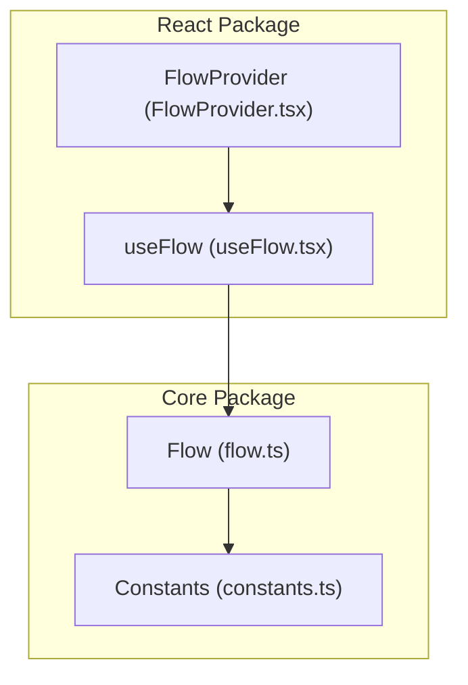
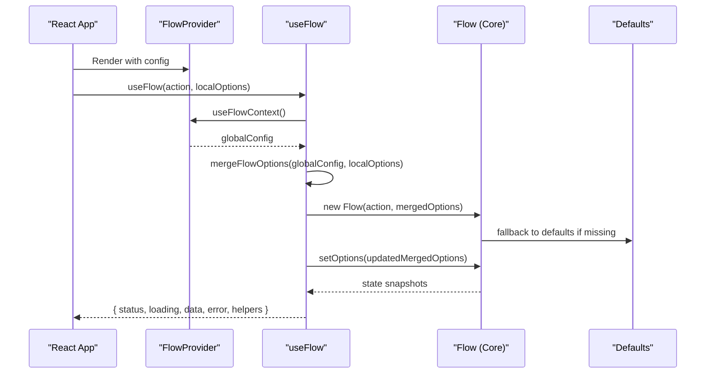
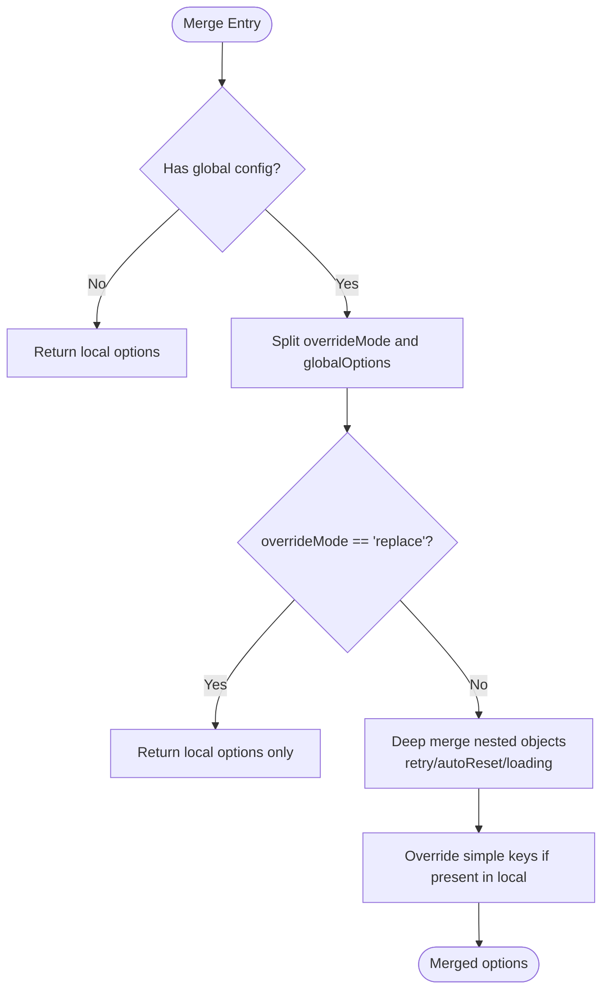
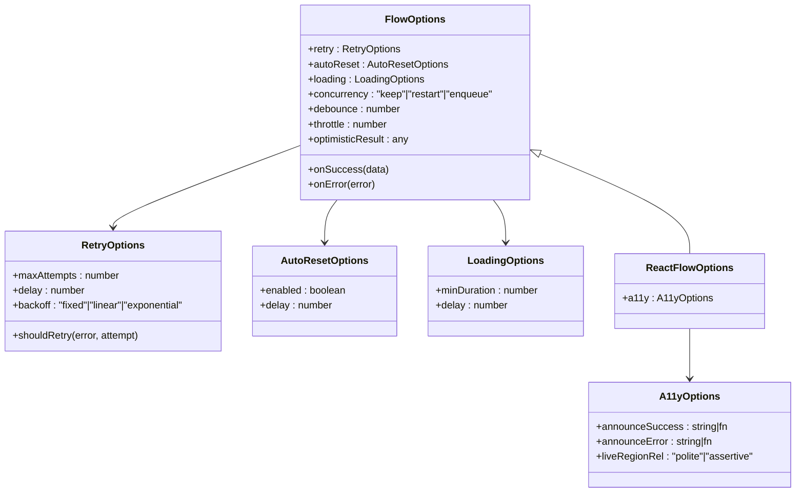
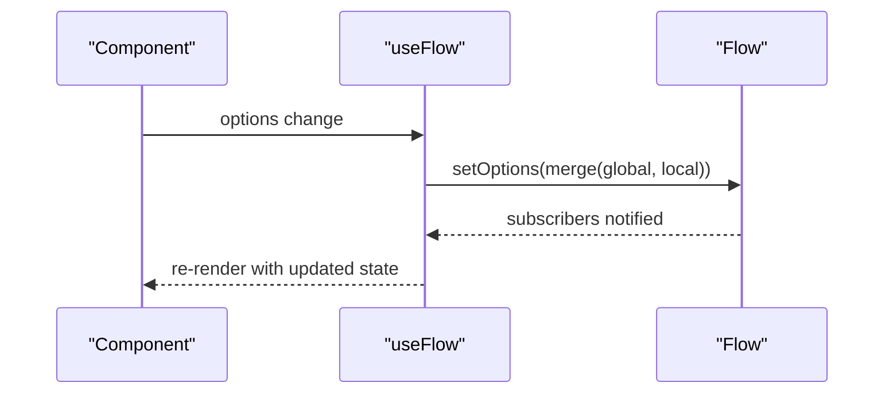
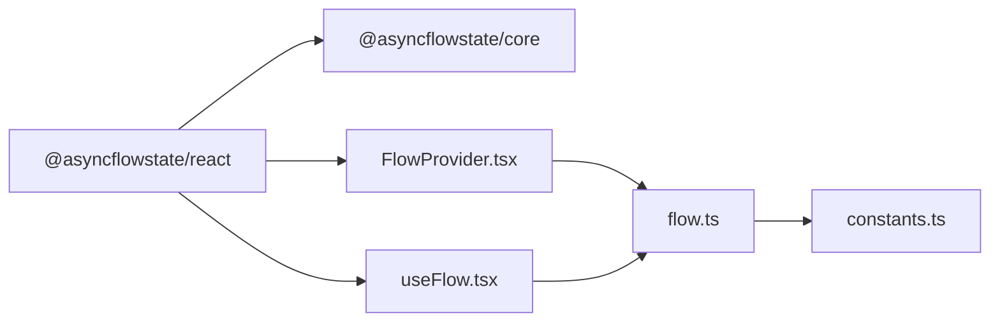

# Configuration and Customization

<cite>
**Referenced Files in This Document**
- [FlowProvider.tsx](file://packages/react/src/FlowProvider.tsx)
- [useFlow.tsx](file://packages/react/src/useFlow.tsx)
- [flow.ts](file://packages/core/src/flow.ts)
- [constants.ts](file://packages/core/src/constants.ts)
- [flow-provider-examples.tsx](file://examples/react/flow-provider-examples.tsx)
- [react-examples.tsx](file://examples/react/react-examples.tsx)
- [core-examples.ts](file://examples/basic/core-examples.ts)
- [FlowProvider.test.tsx](file://packages/react/src/FlowProvider.test.tsx)
- [flow.test.ts](file://packages/core/src/flow.test.ts)
- [useFlow.test.tsx](file://packages/react/src/useFlow.test.tsx)
</cite>

## Table of Contents
1. [Introduction](#introduction)
2. [Project Structure](#project-structure)
3. [Core Components](#core-components)
4. [Architecture Overview](#architecture-overview)
5. [Detailed Component Analysis](#detailed-component-analysis)
6. [Dependency Analysis](#dependency-analysis)
7. [Performance Considerations](#performance-considerations)
8. [Troubleshooting Guide](#troubleshooting-guide)
9. [Conclusion](#conclusion)
10. [Appendices](#appendices)

## Introduction
This document explains how to configure and customize AsyncFlowState, focusing on global and local configuration strategies, option hierarchy, override semantics, and practical patterns. It covers:
- Global configuration via FlowProvider and option inheritance
- Local per-component options and merging logic
- Dynamic configuration updates at runtime
- All configuration parameters: retry, concurrency, UX polish, and accessibility
- Precedence rules and performance implications
- Environment-specific setups and integration patterns

## Project Structure
AsyncFlowState consists of two primary packages:
- Core engine that runs anywhere (Node, browser, workers)
- React bindings that integrate with React’s component model and context

**Diagram sources**
- [FlowProvider.tsx](file://packages/react/src/FlowProvider.tsx#L1-L139)
- [useFlow.tsx](file://packages/react/src/useFlow.tsx#L1-L281)
- [flow.ts](file://packages/core/src/flow.ts#L1-L709)
- [constants.ts](file://packages/core/src/constants.ts#L1-L51)

**Section sources**
- [FlowProvider.tsx](file://packages/react/src/FlowProvider.tsx#L1-L139)
- [useFlow.tsx](file://packages/react/src/useFlow.tsx#L1-L281)
- [flow.ts](file://packages/core/src/flow.ts#L1-L709)
- [constants.ts](file://packages/core/src/constants.ts#L1-L51)

## Core Components
- FlowProvider: Provides global defaults to all flows within its subtree. Supports an override mode to either merge or replace global options with local ones.
- useFlow: React hook that merges global and local options, initializes a Flow instance, and exposes helpers for buttons, forms, and accessibility.
- Flow: Core engine that implements retry, concurrency, UX polish, optimistic updates, and state lifecycle.

Key configuration surfaces:
- Global: FlowProviderConfig (extends FlowOptions) with overrideMode
- Local: FlowOptions (per component) plus React-specific a11y options
- Runtime: Flow.setOptions for dynamic updates

**Section sources**
- [FlowProvider.tsx](file://packages/react/src/FlowProvider.tsx#L7-L17)
- [FlowProvider.tsx](file://packages/react/src/FlowProvider.tsx#L76-L138)
- [useFlow.tsx](file://packages/react/src/useFlow.tsx#L61-L67)
- [flow.ts](file://packages/core/src/flow.ts#L99-L127)
- [flow.ts](file://packages/core/src/flow.ts#L239-L241)

## Architecture Overview
The configuration pipeline flows from global to local, with explicit override semantics.

**Diagram sources**
- [FlowProvider.tsx](file://packages/react/src/FlowProvider.tsx#L50-L66)
- [FlowProvider.tsx](file://packages/react/src/FlowProvider.tsx#L76-L138)
- [useFlow.tsx](file://packages/react/src/useFlow.tsx#L77-L115)
- [flow.ts](file://packages/core/src/flow.ts#L220-L241)
- [constants.ts](file://packages/core/src/constants.ts#L10-L32)

## Detailed Component Analysis

### Global Configuration via FlowProvider
- Purpose: Establish shared defaults for retry, loading UX, autoReset, callbacks, concurrency, and optimistic updates.
- Override mode:
  - merge (default): Local options override global for keys present locally; otherwise inherit global.
  - replace: If local options exist, only those are used; global options are discarded.
- Nested providers: Inner providers override outer ones for their subtree.

**Diagram sources**
- [FlowProvider.tsx](file://packages/react/src/FlowProvider.tsx#L76-L138)

**Section sources**
- [FlowProvider.tsx](file://packages/react/src/FlowProvider.tsx#L7-L17)
- [FlowProvider.tsx](file://packages/react/src/FlowProvider.tsx#L50-L66)
- [FlowProvider.tsx](file://packages/react/src/FlowProvider.tsx#L76-L138)
- [FlowProvider.test.tsx](file://packages/react/src/FlowProvider.test.tsx#L68-L84)

### Local Configuration and Option Merging
- Local options are merged with global options using the merge logic described above.
- React-specific a11y options are supported alongside core FlowOptions.
- Dynamic updates: useFlow syncs Flow.setOptions whenever local/global options change.

**Diagram sources**
- [flow.ts](file://packages/core/src/flow.ts#L65-L127)
- [useFlow.tsx](file://packages/react/src/useFlow.tsx#L49-L67)

**Section sources**
- [useFlow.tsx](file://packages/react/src/useFlow.tsx#L77-L115)
- [flow.ts](file://packages/core/src/flow.ts#L99-L127)
- [useFlow.test.tsx](file://packages/react/src/useFlow.test.tsx#L119-L140)

### Dynamic Configuration Updates
- Flow.setOptions merges new options with existing ones.
- useFlow subscribes to option changes and calls setOptions accordingly.
- This enables environment-specific toggles, feature flags, or user preference-driven adjustments.

**Diagram sources**
- [useFlow.tsx](file://packages/react/src/useFlow.tsx#L113-L115)
- [flow.ts](file://packages/core/src/flow.ts#L239-L241)

**Section sources**
- [flow.ts](file://packages/core/src/flow.ts#L239-L241)
- [useFlow.tsx](file://packages/react/src/useFlow.tsx#L113-L115)

### Configuration Parameters and Defaults
- RetryOptions
  - maxAttempts: default 1 (no retry)
  - delay: default 1000 ms
  - backoff: default fixed
  - shouldRetry: optional predicate
- AutoResetOptions
  - enabled: default true if delay is provided
  - delay: ms to wait after success
- LoadingOptions
  - minDuration: default 0 ms
  - delay: default 0 ms
- FlowOptions
  - concurrency: default keep
  - debounce/throttle: ms
  - optimisticResult: immediate success data
- ReactFlowOptions.a11y
  - announceSuccess/announceError: static or computed messages
  - liveRegionRel: polite or assertive

**Section sources**
- [constants.ts](file://packages/core/src/constants.ts#L10-L32)
- [flow.ts](file://packages/core/src/flow.ts#L65-L127)
- [useFlow.tsx](file://packages/react/src/useFlow.tsx#L49-L67)

### Precedence and Inheritance Rules
- Global precedence:
  - Nested FlowProviders: innermost provider takes effect for its subtree.
  - Global vs local: local overrides global for keys present locally; otherwise inherit global.
- Override mode:
  - merge (default): merge nested objects; simple keys override if present locally.
  - replace: use only local options if any are provided.
- Defaults:
  - Core engine falls back to constants when options are absent.

**Section sources**
- [FlowProvider.tsx](file://packages/react/src/FlowProvider.tsx#L7-L17)
- [FlowProvider.tsx](file://packages/react/src/FlowProvider.tsx#L76-L138)
- [FlowProvider.test.tsx](file://packages/react/src/FlowProvider.test.tsx#L114-L147)
- [constants.ts](file://packages/core/src/constants.ts#L10-L32)

### Practical Configuration Patterns
- Global error handling and retry
  - Configure onError globally and tune retry strategy once; individual flows inherit.
- Environment-specific settings
  - Dev: shorter delays/minDuration for responsiveness; Prod: longer minDuration for UX polish.
- Nested providers for sections
  - Admin section with stricter retry and longer UX delays; regular section with lighter defaults.
- Accessibility-first setup
  - Provide a11y announcements and live region rel for screen readers.
- Feature flags and dynamic toggles
  - Toggle debounce/throttle/concurrency based on user preferences or feature flags.

**Section sources**
- [flow-provider-examples.tsx](file://examples/react/flow-provider-examples.tsx#L277-L335)
- [flow-provider-examples.tsx](file://examples/react/flow-provider-examples.tsx#L101-L155)
- [flow-provider-examples.tsx](file://examples/react/flow-provider-examples.tsx#L161-L205)
- [flow-provider-examples.tsx](file://examples/react/flow-provider-examples.tsx#L211-L271)
- [react-examples.tsx](file://examples/react/react-examples.tsx#L421-L489)

### Integration with Existing Architectures
- React apps: wrap top-level components with FlowProvider; use useFlow in leaf components.
- Micro frontends: each app can host its own FlowProvider; nested providers isolate configuration per app.
- SSR/SSG: FlowProvider is client-side; initialize flows on mount or after hydration.
- Testing: use test utilities to verify merged options and behavior.

**Section sources**
- [FlowProvider.tsx](file://packages/react/src/FlowProvider.tsx#L50-L66)
- [FlowProvider.test.tsx](file://packages/react/src/FlowProvider.test.tsx#L114-L147)

## Dependency Analysis
- React package depends on core package.
- FlowProvider and useFlow depend on Flow core.
- Tests validate merge logic, nested providers, and runtime updates.

**Diagram sources**
- [FlowProvider.tsx](file://packages/react/src/FlowProvider.tsx#L1-L2)
- [useFlow.tsx](file://packages/react/src/useFlow.tsx#L9-L10)
- [flow.ts](file://packages/core/src/flow.ts#L1-L7)
- [constants.ts](file://packages/core/src/constants.ts#L1-L51)

**Section sources**
- [FlowProvider.tsx](file://packages/react/src/FlowProvider.tsx#L1-L2)
- [useFlow.tsx](file://packages/react/src/useFlow.tsx#L9-L10)
- [flow.ts](file://packages/core/src/flow.ts#L1-L7)

## Performance Considerations
- Retry backoff strategies:
  - fixed: predictable latency; minimal CPU overhead.
  - linear: increases delay per attempt; suitable for transient failures.
  - exponential: reduces load on servers; can increase total latency.
- Concurrency:
  - keep: prevents double submissions; ideal for idempotent actions.
  - restart: cancels current execution; useful for replacing stale data.
  - enqueue: queues subsequent calls; ensures ordered processing.
- UX polish:
  - minDuration prevents UI flicker on fast responses.
  - delay avoids showing spinners for near-instant actions.
- Debounce/throttle:
  - Reduce network calls for search or scroll events.
- Accessibility:
  - Live regions and focus management add negligible overhead but improve UX.

[No sources needed since this section provides general guidance]

## Troubleshooting Guide
Common issues and resolutions:
- Global onError not firing
  - Ensure FlowProvider wraps the component and that local onError does not override it unintentionally.
- Nested providers not applying
  - Verify the inner provider is rendered inside the outer provider and that overrideMode is not set to replace.
- Unexpected merge behavior
  - Confirm only intended keys are present in local options; missing keys inherit from global.
- Dynamic updates not taking effect
  - Ensure useFlow receives updated options and that setOptions is called after mounting.
- Accessibility announcements not appearing
  - Confirm LiveRegion is rendered and a11y options are provided.

**Section sources**
- [FlowProvider.test.tsx](file://packages/react/src/FlowProvider.test.tsx#L28-L49)
- [FlowProvider.test.tsx](file://packages/react/src/FlowProvider.test.tsx#L68-L84)
- [FlowProvider.test.tsx](file://packages/react/src/FlowProvider.test.tsx#L114-L147)
- [useFlow.test.tsx](file://packages/react/src/useFlow.test.tsx#L119-L140)

## Conclusion
AsyncFlowState offers a robust configuration system:
- Centralize defaults with FlowProvider and fine-tune per component with local options.
- Choose between merge and replace modes to balance flexibility and safety.
- Leverage core engine features (retry, concurrency, UX polish, optimistic updates) and React helpers (a11y, form/button helpers) for polished user experiences.
- Validate configurations with tests and adapt to environments with nested providers and dynamic updates.

[No sources needed since this section summarizes without analyzing specific files]

## Appendices

### Configuration Reference
- Global (FlowProviderConfig)
  - overrideMode: "merge" | "replace"
  - All FlowOptions keys
- Local (ReactFlowOptions)
  - a11y: A11yOptions
  - All FlowOptions keys
- Core defaults
  - Retry: maxAttempts=1, delay=1000, backoff=fixed
  - Loading: minDuration=0, delay=0
  - Concurrency: keep
  - Progress bounds: 0–100

**Section sources**
- [FlowProvider.tsx](file://packages/react/src/FlowProvider.tsx#L7-L17)
- [useFlow.tsx](file://packages/react/src/useFlow.tsx#L61-L67)
- [flow.ts](file://packages/core/src/flow.ts#L65-L127)
- [constants.ts](file://packages/core/src/constants.ts#L10-L32)

### Example Index
- Global error handling and retry: [flow-provider-examples.tsx](file://examples/react/flow-provider-examples.tsx#L59-L95)
- Global UX polish: [flow-provider-examples.tsx](file://examples/react/flow-provider-examples.tsx#L161-L205)
- Nested providers: [flow-provider-examples.tsx](file://examples/react/flow-provider-examples.tsx#L211-L271)
- Accessibility announcements: [react-examples.tsx](file://examples/react/react-examples.tsx#L421-L489)
- Core engine features: [core-examples.ts](file://examples/basic/core-examples.ts#L44-L144)