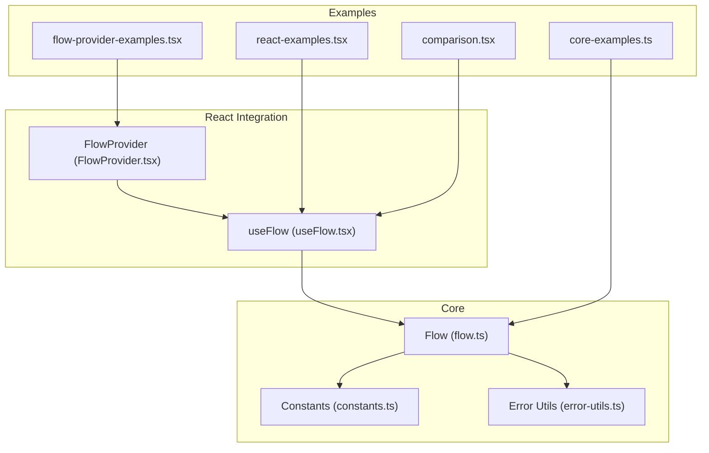
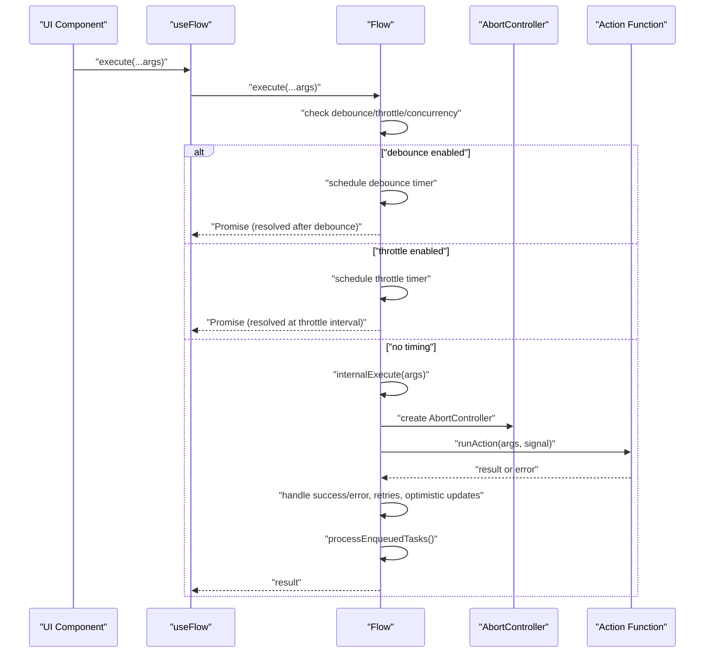
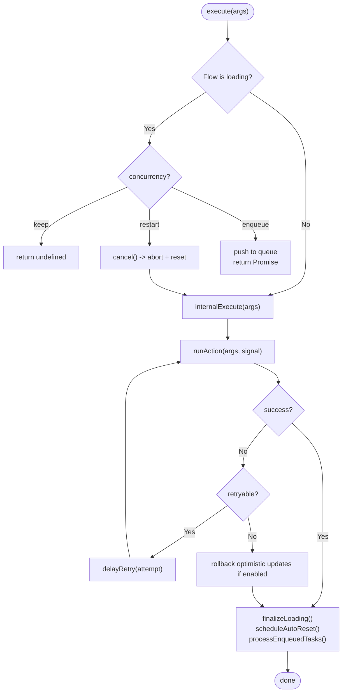
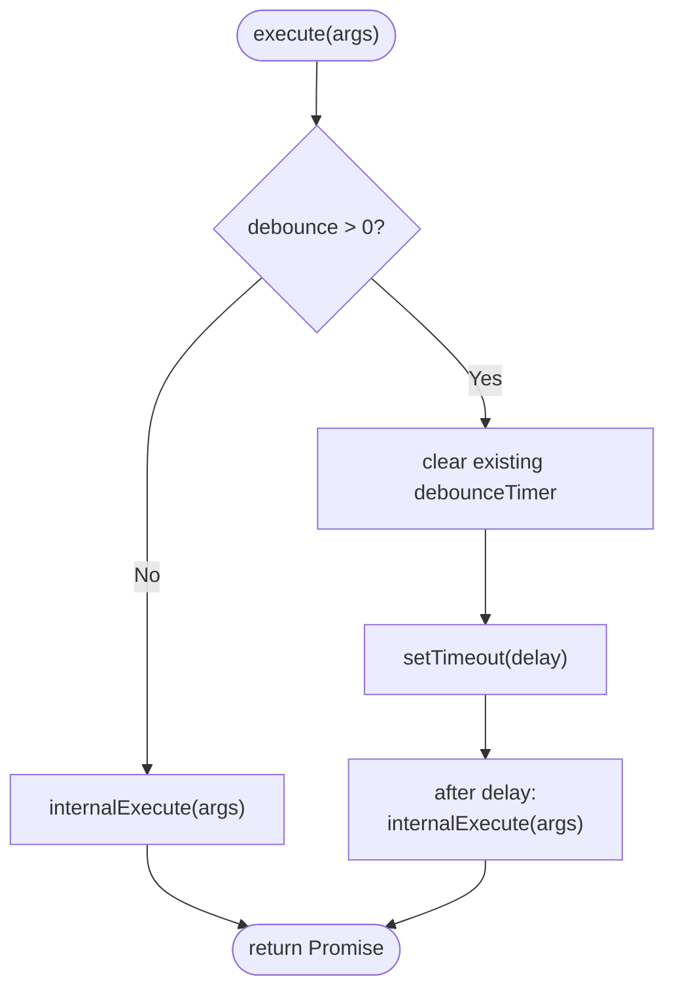
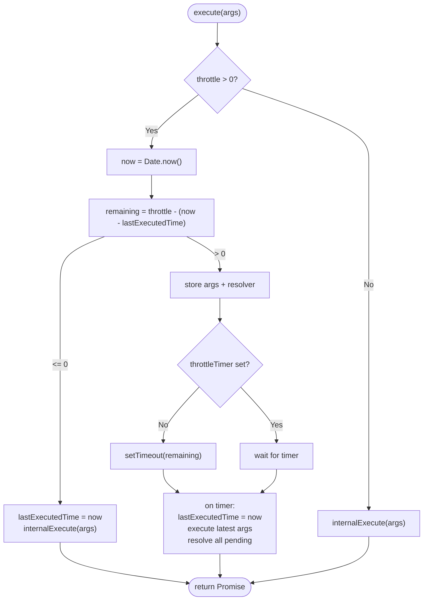
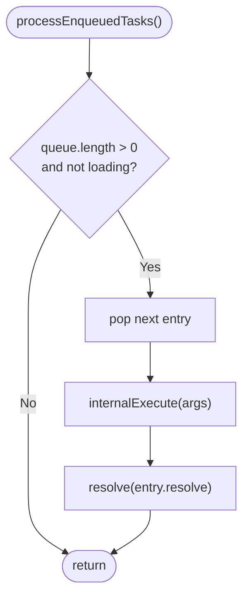
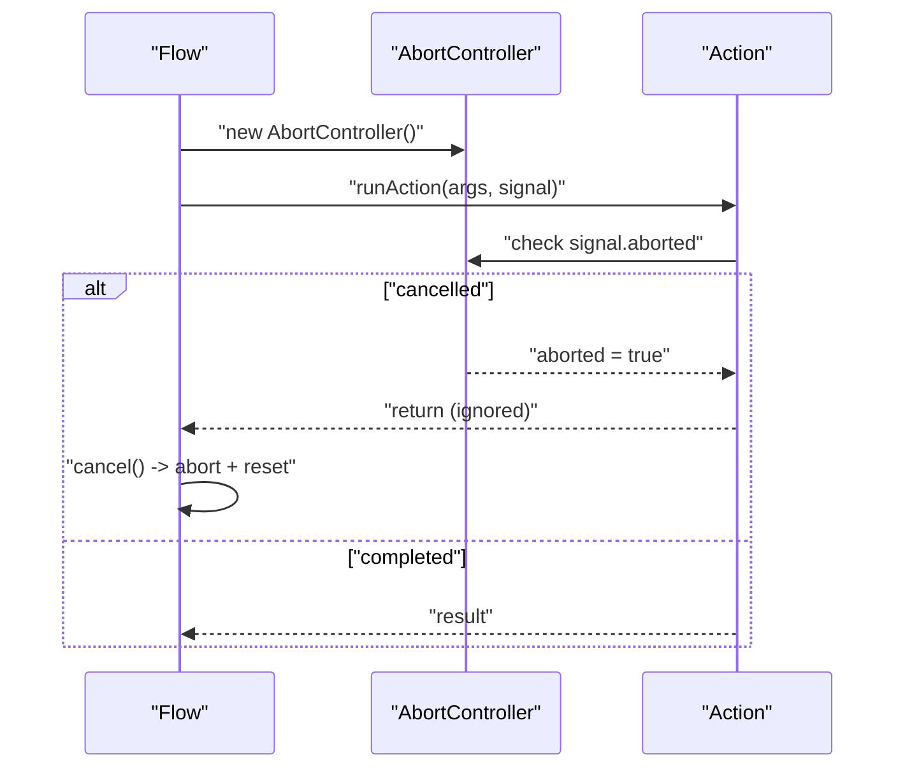
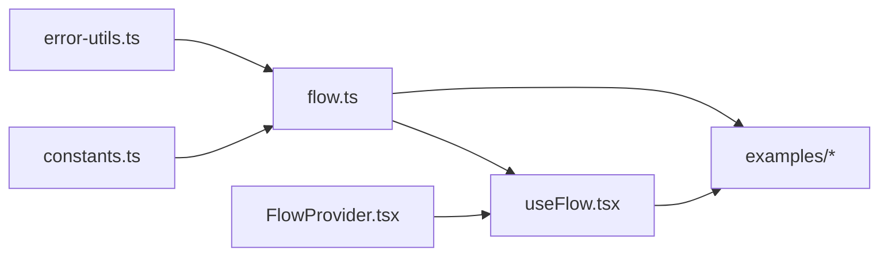

# Concurrency Control

<cite>
**Referenced Files in This Document**
- [flow.ts](file://packages/core/src/flow.ts)
- [constants.ts](file://packages/core/src/constants.ts)
- [error-utils.ts](file://packages/core/src/error-utils.ts)
- [useFlow.tsx](file://packages/react/src/useFlow.tsx)
- [FlowProvider.tsx](file://packages/react/src/FlowProvider.tsx)
- [flow.test.ts](file://packages/core/src/flow.test.ts)
- [useFlow.test.tsx](file://packages/react/src/useFlow.test.tsx)
- [FlowProvider.test.tsx](file://packages/react/src/FlowProvider.test.tsx)
- [core-examples.ts](file://examples/basic/core-examples.ts)
- [react-examples.tsx](file://examples/react/react-examples.tsx)
- [comparison.tsx](file://examples/react/comparison.tsx)
- [flow-provider-examples.tsx](file://examples/react/flow-provider-examples.tsx)
</cite>

## Table of Contents

1. [Introduction](#introduction)
2. [Project Structure](#project-structure)
3. [Core Components](#core-components)
4. [Architecture Overview](#architecture-overview)
5. [Detailed Component Analysis](#detailed-component-analysis)
6. [Dependency Analysis](#dependency-analysis)
7. [Performance Considerations](#performance-considerations)
8. [Troubleshooting Guide](#troubleshooting-guide)
9. [Conclusion](#conclusion)
10. [Appendices](#appendices)

## Introduction

This document explains the concurrency control mechanisms in AsyncFlowState. It covers the three concurrency strategies (keep, restart, enqueue), debounce and throttle implementations, queue management, AbortController integration, and concurrent execution patterns. It also provides performance implications, memory considerations, best practices, and practical examples for configuration and usage.

## Project Structure

The concurrency control logic lives primarily in the core Flow class, with React integration provided by useFlow and FlowProvider. Tests and examples demonstrate real-world usage patterns.

**Diagram sources**

- [flow.ts](file://packages/core/src/flow.ts#L1-L783)
- [constants.ts](file://packages/core/src/constants.ts#L1-L51)
- [error-utils.ts](file://packages/core/src/error-utils.ts#L1-L207)
- [useFlow.tsx](file://packages/react/src/useFlow.tsx#L1-L281)
- [FlowProvider.tsx](file://packages/react/src/FlowProvider.tsx#L1-L139)
- [core-examples.ts](file://examples/basic/core-examples.ts#L1-L221)
- [react-examples.tsx](file://examples/react/react-examples.tsx#L1-L491)
- [comparison.tsx](file://examples/react/comparison.tsx#L1-L246)
- [flow-provider-examples.tsx](file://examples/react/flow-provider-examples.tsx#L1-L368)

**Section sources**

- [flow.ts](file://packages/core/src/flow.ts#L1-L783)
- [useFlow.tsx](file://packages/react/src/useFlow.tsx#L1-L281)
- [FlowProvider.tsx](file://packages/react/src/FlowProvider.tsx#L1-L139)

## Core Components

- Flow: Orchestrates asynchronous actions, manages state transitions, retries, concurrency, debounce/throttle, optimistic updates, and AbortController integration.
- Constants: Defines defaults for retry, loading UX, concurrency, progress, and backoff multipliers.
- Error Utils: Provides helpers to categorize and handle errors consistently.
- useFlow: React hook that wraps Flow, exposes helpers for buttons/forms, and integrates with FlowProvider.
- FlowProvider: React context provider that merges global and local Flow options.

Key concurrency-related members of Flow:

- Concurrency queue: stores queued executions when concurrency is enqueue.
- Debounce timer: delays execution until after a quiet period.
- Throttle timer and pending arguments: ensures executions occur at fixed intervals.
- AbortController: cancels in-flight actions on demand or restarts.

**Section sources**

- [flow.ts](file://packages/core/src/flow.ts#L207-L783)
- [constants.ts](file://packages/core/src/constants.ts#L1-L51)
- [error-utils.ts](file://packages/core/src/error-utils.ts#L1-L207)
- [useFlow.tsx](file://packages/react/src/useFlow.tsx#L1-L281)
- [FlowProvider.tsx](file://packages/react/src/FlowProvider.tsx#L1-L139)

## Architecture Overview

The Flow class centralizes concurrency control and timing logic. React’s useFlow delegates to Flow and adds UI helpers. FlowProvider supplies global defaults that useFlow merges with local options.

**Diagram sources**

- [flow.ts](file://packages/core/src/flow.ts#L436-L783)
- [useFlow.tsx](file://packages/react/src/useFlow.tsx#L1-L281)

## Detailed Component Analysis

### Concurrency Strategies

Flow supports three concurrency strategies via the concurrency option:

- keep: Ignore concurrent calls while loading. execute() returns undefined for ignored calls.
- restart: Cancel the current execution (via AbortController) and start a new one.
- enqueue: Queue the call and execute it after the current one finishes. Queue is FIFO.

Implementation highlights:

- internalExecute checks current status and applies strategy.
- restart triggers cancel() which aborts and resets state.
- enqueue pushes { args, resolve } into queue and returns a Promise that resolves after execution.

**Diagram sources**

- [flow.ts](file://packages/core/src/flow.ts#L461-L783)

**Section sources**

- [flow.ts](file://packages/core/src/flow.ts#L461-L476)
- [flow.ts](file://packages/core/src/flow.ts#L436-L451)
- [flow.ts](file://packages/core/src/flow.ts#L661-L666)
- [flow.test.ts](file://packages/core/src/flow.test.ts#L87-L138)

### Debounce Implementation

Debounce coalesces rapid calls by delaying execution until after a quiet period. The last call within the delay window wins.

Behavior:

- If a debounce timer exists, it is cleared.
- A new timer is scheduled for the given delay.
- After delay, internalExecute is invoked with the latest args.
- The execute() call returns a Promise that resolves after the delayed execution.

**Diagram sources**

- [flow.ts](file://packages/core/src/flow.ts#L611-L622)

**Section sources**

- [flow.ts](file://packages/core/src/flow.ts#L611-L622)
- [flow.test.ts](file://packages/core/src/flow.test.ts#L311-L334)

### Throttle Implementation

Throttle limits execution frequency to a fixed interval. Calls within the interval are batched and executed together after the interval elapses.

Behavior:

- Compute remaining time from lastExecutedTime.
- If remaining <= 0, execute immediately and update lastExecutedTime.
- Otherwise, store args and resolver in pending arrays and schedule a single throttle timer.
- On timer expiry, execute with the latest args and resolve all pending promises.

**Diagram sources**

- [flow.ts](file://packages/core/src/flow.ts#L624-L659)

**Section sources**

- [flow.ts](file://packages/core/src/flow.ts#L624-L659)
- [flow.test.ts](file://packages/core/src/flow.test.ts#L311-L334)

### Queue Management

Queue holds pending executions when concurrency is enqueue. It is processed after each successful or errored execution.

- Queue entries: { args, resolve }.
- FIFO processing: shift() retrieves the next entry.
- After finishing current execution, processEnqueuedTasks() runs the next queued execution.

**Diagram sources**

- [flow.ts](file://packages/core/src/flow.ts#L661-L666)

**Section sources**

- [flow.ts](file://packages/core/src/flow.ts#L229-L237)
- [flow.ts](file://packages/core/src/flow.ts#L661-L666)

### AbortController Integration

Flow uses AbortController to cancel in-flight actions:

- A new AbortController is created per execution.
- runAction checks signal.aborted before proceeding.
- cancel() aborts the current signal, clears timers, and resets state to idle.
- restart strategy calls cancel() before starting a new execution.

**Diagram sources**

- [flow.ts](file://packages/core/src/flow.ts#L478-L549)
- [flow.ts](file://packages/core/src/flow.ts#L380-L387)

**Section sources**

- [flow.ts](file://packages/core/src/flow.ts#L220-L221)
- [flow.ts](file://packages/core/src/flow.ts#L380-L387)
- [flow.ts](file://packages/core/src/flow.ts#L540-L549)

### Concurrent Execution Patterns

- Keep: Ideal for preventing duplicate submissions (e.g., login, save).
- Restart: Best for search-as-you-type where only the latest query matters.
- Enqueue: Suitable for bulk operations or rate-limited APIs where order matters.

Examples in the codebase:

- keep: Demonstrated in double-submission prevention example.
- restart: Demonstrated in cancellation example.
- enqueue: Implicitly supported by queue management and tests.

**Section sources**

- [core-examples.ts](file://examples/basic/core-examples.ts#L117-L144)
- [core-examples.ts](file://examples/basic/core-examples.ts#L150-L177)
- [flow.test.ts](file://packages/core/src/flow.test.ts#L87-L138)

### Debounce and Throttle Configuration Examples

- Debounce: Set debounce in FlowOptions to coalesce rapid calls.
- Throttle: Set throttle in FlowOptions to limit frequency.

Practical usage patterns:

- Search inputs: debounce to reduce network calls.
- Scrolling or resize handlers: throttle to bound CPU usage.
- Rate-limited APIs: throttle to respect endpoint limits.

**Section sources**

- [flow.ts](file://packages/core/src/flow.ts#L118-L128)
- [react-examples.tsx](file://examples/react/react-examples.tsx#L248-L301)

### Optimistic Updates and Rollback

Optimistic updates can be combined with concurrency:

- Store previous data snapshot before setting optimistic success.
- On success, clear snapshot.
- On error and rollback enabled, restore previous data.

**Section sources**

- [flow.ts](file://packages/core/src/flow.ts#L481-L511)
- [flow.ts](file://packages/core/src/flow.ts#L580-L595)
- [flow.ts](file://packages/core/src/flow.ts#L563-L564)

## Dependency Analysis

- Flow depends on constants for defaults and error-utils for error categorization.
- useFlow depends on Flow and FlowProvider for configuration merging.
- FlowProvider provides a context for global defaults and merges with local options.

**Diagram sources**

- [flow.ts](file://packages/core/src/flow.ts#L1-L783)
- [constants.ts](file://packages/core/src/constants.ts#L1-L51)
- [error-utils.ts](file://packages/core/src/error-utils.ts#L1-L207)
- [useFlow.tsx](file://packages/react/src/useFlow.tsx#L1-L281)
- [FlowProvider.tsx](file://packages/react/src/FlowProvider.tsx#L1-L139)

**Section sources**

- [flow.ts](file://packages/core/src/flow.ts#L1-L783)
- [FlowProvider.tsx](file://packages/react/src/FlowProvider.tsx#L76-L138)

## Performance Considerations

- Debounce/throttle reduce network/API calls and CPU usage by limiting execution frequency.
- Queueing enqueues minimal overhead but can increase latency under heavy load.
- AbortController avoids wasted work on cancelled operations.
- MinDuration and delay improve perceived UX by smoothing UI flashes.
- Retries with backoff strategies balance resilience and resource usage.

Memory considerations:

- Debounce/throttle timers and queue entries are short-lived; cleared on completion or cancellation.
- Previous data snapshots for optimistic updates are cleared on success or rollback.
- Listeners are retained until unsubscribed; ensure proper cleanup in long-running apps.

Best practices:

- Use keep for idempotent actions where duplicates are wasteful.
- Use restart for search-like inputs where only the latest result matters.
- Use enqueue for ordered operations or rate-limited endpoints.
- Prefer debounce for user-driven events (typing, scrolling).
- Prefer throttle for continuous events (resize, scroll) with strict rate limits.
- Combine optimistic updates with rollback for responsive UI.

[No sources needed since this section provides general guidance]

## Troubleshooting Guide

Common issues and resolutions:

- Double submissions: Set concurrency to keep or throttle user interactions.
- Stale results: Use restart to cancel outdated requests.
- Memory leaks: Ensure listeners are removed and timers cleared; Flow handles this automatically via cancel/reset.
- Unexpected ignores: Verify concurrency strategy and that the flow is not already loading.
- Debounce not triggering: Confirm debounce delay is greater than zero and that rapid calls occur within the window.

Relevant tests and examples:

- Concurrency behavior: keep, restart, enqueue.
- Debounce/throttle timing: minDuration and delay.
- AbortController behavior: cancel and reset.

**Section sources**

- [flow.test.ts](file://packages/core/src/flow.test.ts#L87-L138)
- [flow.test.ts](file://packages/core/src/flow.test.ts#L292-L334)
- [flow.test.ts](file://packages/core/src/flow.test.ts#L175-L198)
- [core-examples.ts](file://examples/basic/core-examples.ts#L117-L177)

## Conclusion

AsyncFlowState provides robust concurrency control through keep, restart, and enqueue strategies, complemented by debounce and throttle for timing control. AbortController integration ensures efficient cancellation, while queue management guarantees orderly execution. Combined with optimistic updates and error handling utilities, these features enable responsive, resilient asynchronous workflows across diverse use cases.

[No sources needed since this section summarizes without analyzing specific files]

## Appendices

### Configuration Reference

- concurrency: "keep" | "restart" | "enqueue"
- debounce: number (milliseconds)
- throttle: number (milliseconds)
- retry: maxAttempts, delay, backoff, shouldRetry
- loading: minDuration, delay
- optimisticResult: static value or function(prevData, args)
- rollbackOnError: boolean

**Section sources**

- [flow.ts](file://packages/core/src/flow.ts#L99-L160)
- [constants.ts](file://packages/core/src/constants.ts#L10-L27)

### React Integration Notes

- useFlow exposes helpers for buttons and forms, integrates with FlowProvider.
- FlowProvider merges global and local options, with override modes.

**Section sources**

- [useFlow.tsx](file://packages/react/src/useFlow.tsx#L77-L281)
- [FlowProvider.tsx](file://packages/react/src/FlowProvider.tsx#L76-L139)
