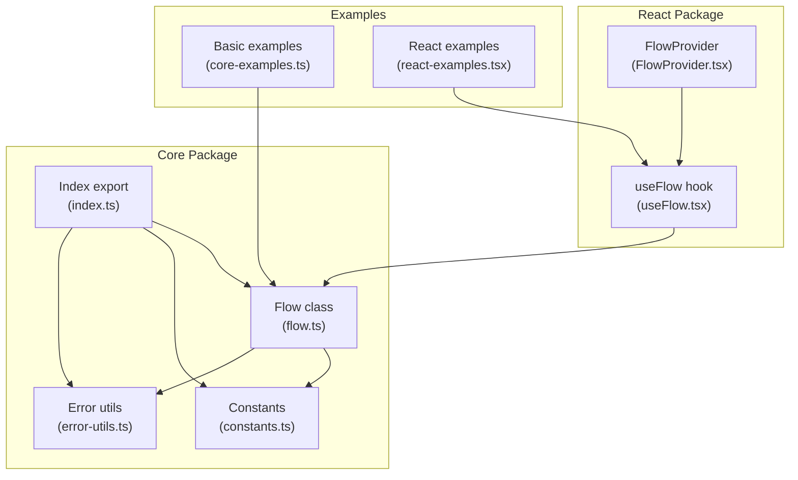
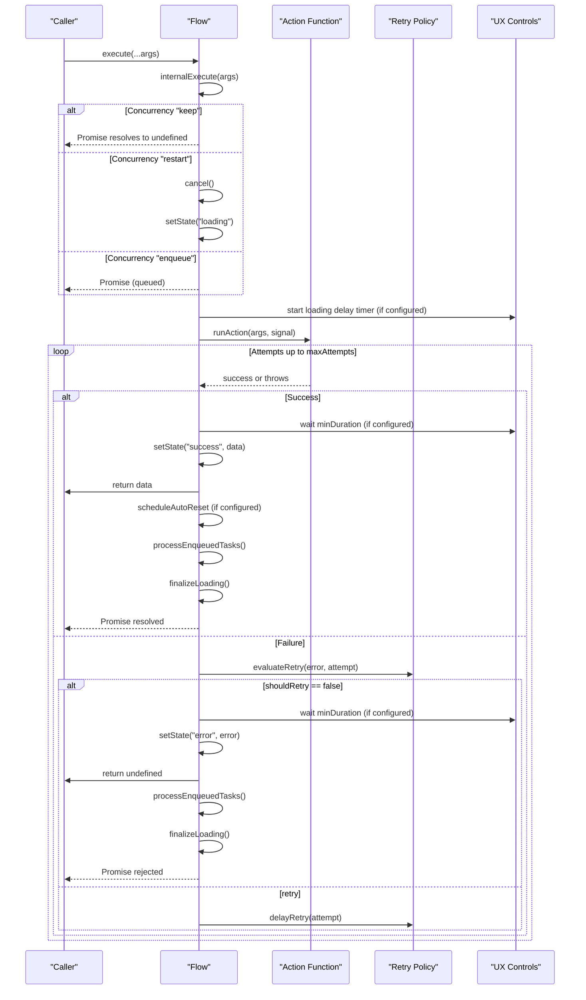
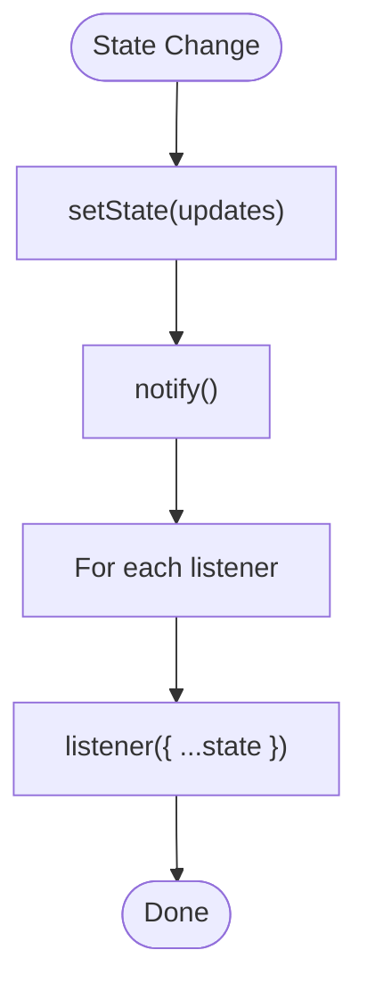
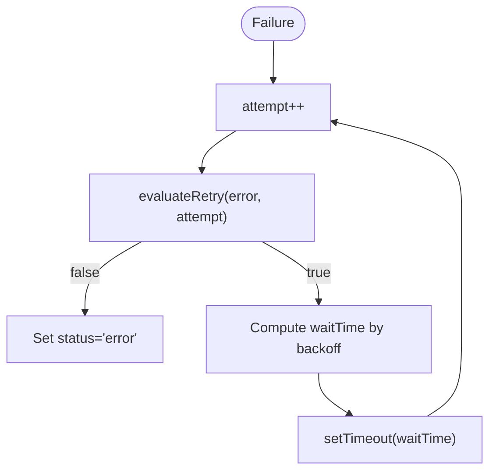
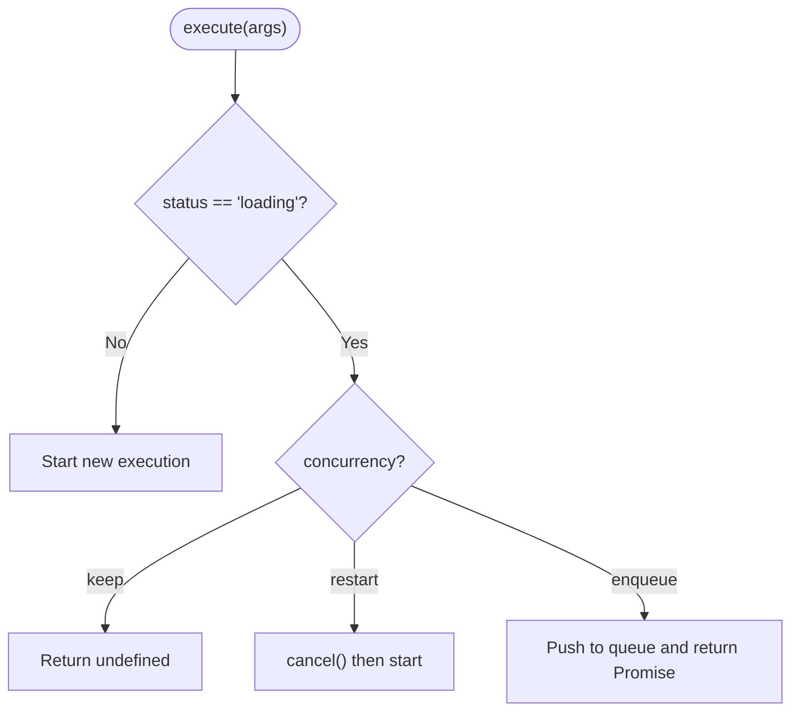
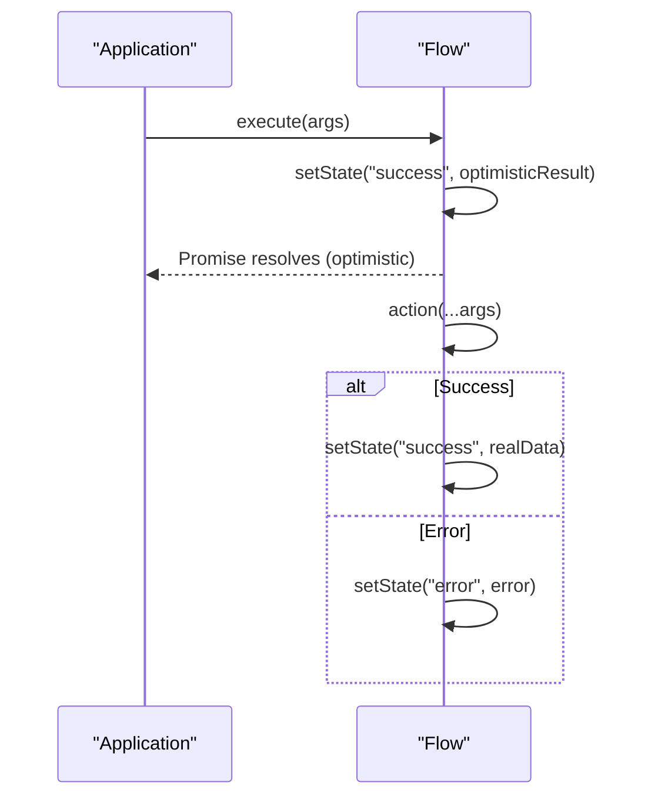
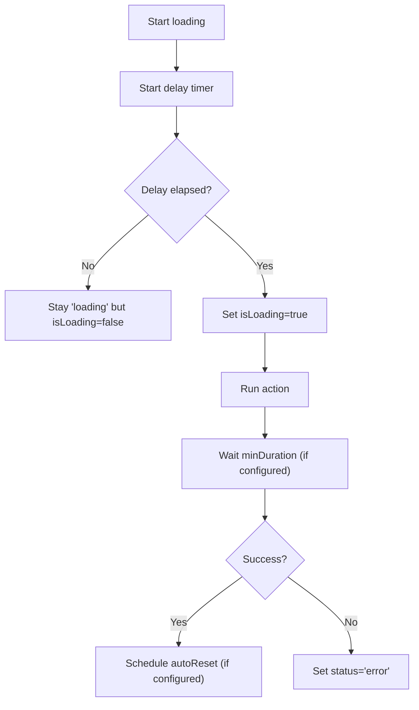
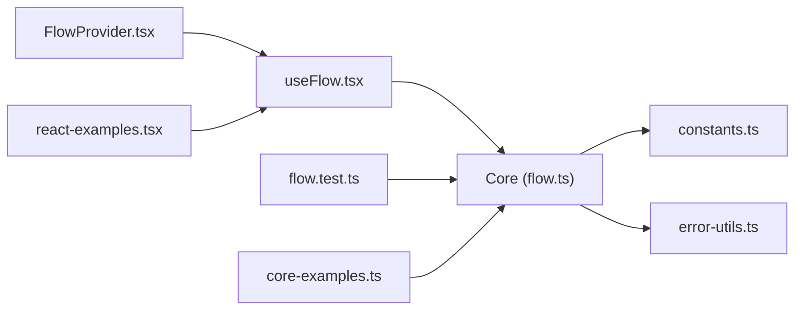

# Core Engine

<cite>
**Referenced Files in This Document**
- [flow.ts](file://packages/core/src/flow.ts)
- [flow.d.ts](file://packages/core/src/flow.d.ts)
- [constants.ts](file://packages/core/src/constants.ts)
- [error-utils.ts](file://packages/core/src/error-utils.ts)
- [index.ts](file://packages/core/src/index.ts)
- [flow.test.ts](file://packages/core/src/flow.test.ts)
- [core-examples.ts](file://examples/basic/core-examples.ts)
- [react-examples.tsx](file://examples/react/react-examples.tsx)
- [useFlow.tsx](file://packages/react/src/useFlow.tsx)
- [FlowProvider.tsx](file://packages/react/src/FlowProvider.tsx)
- [README.md](file://packages/core/README.md)
</cite>

## Table of Contents

1. [Introduction](#introduction)
2. [Project Structure](#project-structure)
3. [Core Components](#core-components)
4. [Architecture Overview](#architecture-overview)
5. [Detailed Component Analysis](#detailed-component-analysis)
6. [Dependency Analysis](#dependency-analysis)
7. [Performance Considerations](#performance-considerations)
8. [Troubleshooting Guide](#troubleshooting-guide)
9. [Conclusion](#conclusion)
10. [Appendices](#appendices)

## Introduction

This document provides comprehensive documentation for the AsyncFlowState core engine, focusing on the Flow class as a framework-agnostic async orchestration engine. It explains Flow’s state management system, observer pattern implementation, lifecycle management, and complete API surface. It also covers advanced features such as retry logic with backoff strategies, concurrency control, optimistic UI patterns, and UX optimization features. Practical examples demonstrate direct Flow usage for non-React applications, error handling patterns, and integration with various async operations.

## Project Structure

The core engine resides in the packages/core module. It exposes the Flow class, constants, and error utilities. The examples directory demonstrates usage in both vanilla JS/TS and React contexts. The React package builds on top of the core to provide hooks and helpers.



**Diagram sources**

- [flow.ts](file://packages/core/src/flow.ts#L1-L709)
- [constants.ts](file://packages/core/src/constants.ts#L1-L51)
- [error-utils.ts](file://packages/core/src/error-utils.ts#L1-L207)
- [index.ts](file://packages/core/src/index.ts#L1-L4)
- [core-examples.ts](file://examples/basic/core-examples.ts#L1-L221)
- [react-examples.tsx](file://examples/react/react-examples.tsx#L1-L491)
- [useFlow.tsx](file://packages/react/src/useFlow.tsx#L1-L281)
- [FlowProvider.tsx](file://packages/react/src/FlowProvider.tsx#L1-L139)

**Section sources**

- [flow.ts](file://packages/core/src/flow.ts#L1-L709)
- [index.ts](file://packages/core/src/index.ts#L1-L4)
- [README.md](file://packages/core/README.md#L1-L134)

## Core Components

- Flow class: Orchestrates async actions, manages state, observers, retries, concurrency, and UX controls.
- Constants: Provide default values for retry, loading, progress, and backoff multipliers.
- Error utilities: Create and categorize FlowError instances, detect error types, and assist with retryability.
- Index: Re-exports Flow, constants, and error utilities for ergonomic consumption.

Key responsibilities:

- State management: Tracks status, data, error, and progress.
- Observer pattern: Notifies subscribers on state changes.
- Lifecycle: Execute, cancel, reset, and auto-reset after success.
- Advanced features: Retry with backoff, concurrency control, optimistic UI, progress tracking, and UX controls (minDuration, delay).

**Section sources**

- [flow.ts](file://packages/core/src/flow.ts#L174-L709)
- [constants.ts](file://packages/core/src/constants.ts#L1-L51)
- [error-utils.ts](file://packages/core/src/error-utils.ts#L1-L207)
- [index.ts](file://packages/core/src/index.ts#L1-L4)

## Architecture Overview

The Flow class encapsulates the entire orchestration logic. It maintains internal state, manages timers and AbortController for cancellation, and coordinates execution with retry/backoff, concurrency, and UX policies. Subscribers receive immutable snapshots of the state.

```mermaid
classDiagram
class Flow {
-_state : FlowState
-listeners : Set
-abortController : AbortController
-loadingStartTime : number
-loadingDelayTimer : Timer
-_isDelayingLoading : boolean
-autoResetTimer : Timer
-queue : Array
-debounceTimer : Timer
-lastExecutedTime : number
-throttleTimer : Timer
-pendingThrottleArgs : TArgs
-pendingThrottleResolvers : Array
+constructor(action, options)
+setOptions(options)
+get state()
+get status()
+get data()
+get error()
+get isLoading()
+get isSuccess()
+get isError()
+get progress()
+setProgress(progress)
+subscribe(listener)
+execute(...args)
+cancel()
+reset()
-setState(updates)
-notify()
-finalizeLoading()
-clearTimer(key)
-clearAllTimers()
-internalExecute(args)
-runAction(args, signal)
-handleDebounce(args, delay)
-handleThrottle(args, delay)
-processEnqueuedTasks()
-evaluateRetry(error, attempt)
-delayRetry(attempt)
-waitMinDuration()
-scheduleAutoReset()
-startAutoProgress()
-restorePersistedData()
-persistData(data)
+startPolling()
+stopPolling()
+emit(event)
}
class FlowState {
+status : FlowStatus
+data : TData
+error : TError
+progress : number
+}
+class PollingOptions {
+interval : number
+enabled : boolean
+stopIf : (data)=>boolean
+stopOnError : boolean
+}
+class FlowOptions {
+polling : PollingOptions
+precondition : ()=>boolean
+onBlocked : ()=>void
+debugName : string
+}
+class FlowSequence {
++constructor(steps, options)
++execute()
++cancel()
++reset()
++status
++progress
+}
+class FlowMiddleware {
+onStart : (args) => void
+onSuccess : (data) => void
+onError : (error) => void
+onSettled : (data, error) => void
 }
+class SyncOptions {
+channel : string
+syncLoading : boolean
+}
+Flow --> PollingOptions : "uses"
+Flow --> FlowSequence : "part of"
+Flow --> FlowMiddleware : "uses"
+Flow --> SyncOptions : "uses"
class RetryOptions {
+maxAttempts : number
+delay : number
+backoff : "fixed"|"linear"|"exponential"
+shouldRetry : (error, attempt)=>boolean
}
class AutoResetOptions {
+enabled : boolean
+delay : number
}
class AutoProgressOptions {
+duration : number
+end : number
}
class LoadingOptions {
+minDuration : number
+delay : number
}
Flow --> FlowState : "manages"
Flow --> RetryOptions : "uses"
Flow --> AutoResetOptions : "uses"
Flow --> AutoProgressOptions : "uses"
Flow --> LoadingOptions : "uses"
```

**Diagram sources**

- [flow.ts](file://packages/core/src/flow.ts#L174-L709)

## Detailed Component Analysis

### Flow Class API and Behavior

- Constructor
  - Parameters: action (async function), options (FlowOptions).
  - Initializes internal state, timers, and listeners.
- Public properties
  - state: Immutable snapshot of current FlowState.
  - status, data, error, progress: Typed getters.
  - isLoading, isSuccess, isError: Computed booleans respecting UX delays.
- Public methods
  - setProgress(progress): Sets progress while loading (0–100).
  - subscribe(listener): Adds a state change listener; returns an unsubscribe function.
  - execute(...args): Executes the action with debounce/throttle/concurrency handling.
  - cancel(): Aborts current execution and resets to idle.
  - reset(): Resets state to idle with clean timers.
- Internal methods
  - internalExecute(args): Applies concurrency strategy and initiates loading.
  - runAction(args, signal): Executes action, handles retries/backoff, success/error transitions, minDuration, and auto-reset.
  - handleDebounce(args, delay), handleThrottle(args, delay): Rate-limiting logic.
  - evaluateRetry(error, attempt), delayRetry(attempt): Retry policy and backoff scheduling.
  - `pauseOffline`: If enabled, flow pauses while offline and resumes when online.
  - waitMinDuration(), scheduleAutoReset(), finalizeLoading(), clearAllTimers(): UX and lifecycle helpers.
  - startAutoProgress(): Manages simulated progress updates.
  - restorePersistedData(), persistData(data), clearPersistedData(): Persistence helpers.

State transitions

- idle → loading: On first execution or restart.
- loading → success: On successful action completion after minDuration.
- loading → error: On terminal failure after retries.
- success → idle: After autoReset delay (if configured).

Data and error storage

- data: Last successful result.
- error: Terminal error after all retry attempts.
- progress: Numeric progress (0–100) updated by setProgress or auto-completed on success.

Subscription system

- Subscribers receive immutable copies of state snapshots.
- Listeners are invoked synchronously upon state changes.

Concurrency control

- keep: Ignore new execute() calls while loading.
- restart: Cancel current execution and start a new one.
- enqueue: Queue subsequent calls to run after current completes.

Request Deduplication & Caching

- `dedupKey`: If multiple flows share this key, they will attach to the _same_ in-flight promise.
- `staleTime`: If valid cached data exists for this key, return it immediately without hitting the network.

Optimistic UI

- If optimisticResult is provided, state transitions to success immediately with optimistic data before action completion. Real data replaces optimistic data upon resolution.

UX optimization

- delay: Prevents flicker by delaying loading state visibility until threshold reached.
- minDuration: Ensures loading persists for a minimum duration once shown.

Success Persistence (Lightweight Caching)

- persistKey: If provided, data is saved to storage on success and re-hydrated on initialization.
- persistStorage: 'local' (default) or 'session'.

Middleware & Interceptors

- `use(middleware)`: Register local middleware for a specific flow.
- `useGlobal(middleware)`: Register global middleware for all flows.
- Hooks: `onStart`, `onSuccess`, `onError`, `onSettled`.

Cross-Tab Synchronization

- `sync`: Configure `channel` to synchronize flow state across browser tabs.
- Uses `BroadcastChannel` API to keep multiple tabs in sync.

Enhanced Progress Simulation

- autoProgress: { duration: 2000, end: 90 }
- Automatically animates progress from current value to 'end' over 'duration'.
- Jumps to 100% on actual completion.

Retry logic with backoff

- maxAttempts: Number of attempts (default 1 disables retries).
- delay: Base delay between attempts.
- backoff: fixed, linear, exponential.
- shouldRetry: Optional predicate to decide retry per error/attempt.

Polling

- interval: Number of milliseconds between polls.
- enabled: Whether polling is active.
- stopIf: Predicate to stop polling based on data.
- stopOnError: Whether to stop polling on error.

Preconditions

- precondition: Function returning boolean to gate execution.
- onBlocked: Callback when precondition fails.

**Section sources**

- [flow.ts](file://packages/core/src/flow.ts#L174-L709)
- [flow.d.ts](file://packages/core/src/flow.d.ts#L84-L176)
- [constants.ts](file://packages/core/src/constants.ts#L1-L51)

### Error Handling and Utilities

- FlowErrorType: NETWORK, TIMEOUT, VALIDATION, PERMISSION, SERVER, UNKNOWN.
- FlowError: Enhanced error with type, message, originalError, and isRetryable flag.
- createFlowError(error, options): Wraps any error with automatic type detection and retryability.
- detectErrorType(error): Heuristically categorizes errors based on message patterns.
- isErrorRetryable(type): Indicates retryability by type.
- getErrorMessage(error): Extracts a human-readable message from any error object.
- isFlowError(error): Type guard for FlowError.

These utilities enable robust error handling and automated retry decisions.

**Section sources**

- [error-utils.ts](file://packages/core/src/error-utils.ts#L1-L207)
- [flow.ts](file://packages/core/src/flow.ts#L32-L53)

### Examples of Direct Flow Usage (Non-React)

- Simple async action with subscription and execution.
- Retry logic with linear backoff and callbacks.
- Optimistic UI updates with immediate success state.
- Preventing double submission via concurrency: keep.
- Cancellation and reset behaviors.
- Auto reset after success.

These examples demonstrate core capabilities without React dependencies.

**Section sources**

- [core-examples.ts](file://examples/basic/core-examples.ts#L1-L221)

### Integration Patterns

- React integration via useFlow hook:
  - Provides button(), form(), errorRef, fieldErrors, LiveRegion, and memoized state snapshot.
  - Merges global FlowProvider config with local options.
- FlowProvider enables global defaults and override modes.

**Section sources**

- [useFlow.tsx](file://packages/react/src/useFlow.tsx#L1-L281)
- [FlowProvider.tsx](file://packages/react/src/FlowProvider.tsx#L1-L139)

## Architecture Overview



**Diagram sources**

- [flow.ts](file://packages/core/src/flow.ts#L400-L533)

## Detailed Component Analysis

### State Management and Observer Pattern

- Internal state is a sealed object with status, data, error, and progress.
- setState merges updates and notifies all listeners with a fresh copy of state.
- Subscribers receive immutable snapshots, preventing accidental mutations.



**Diagram sources**

- [flow.ts](file://packages/core/src/flow.ts#L672-L679)

**Section sources**

- [flow.ts](file://packages/core/src/flow.ts#L174-L223)
- [flow.ts](file://packages/core/src/flow.ts#L672-L679)

### Retry Logic and Backoff Strategies

- maxAttempts default is 1 (no retry).
- delay default is 1000 ms.
- backoff strategies:
  - fixed: constant delay.
  - linear: delay × attempt × multiplier.
  - exponential: delay × base^(attempt - 1).
- shouldRetry predicate allows custom retry decisions per error/attempt.



**Diagram sources**

- [flow.ts](file://packages/core/src/flow.ts#L596-L638)
- [constants.ts](file://packages/core/src/constants.ts#L10-L17)

**Section sources**

- [flow.ts](file://packages/core/src/flow.ts#L596-L638)
- [constants.ts](file://packages/core/src/constants.ts#L10-L17)

### Concurrency Control Mechanisms

- keep: Ignore concurrent execute() calls while loading.
- restart: Cancel current execution and start a new one.
- enqueue: Queue subsequent calls; execute after current finishes.



**Diagram sources**

- [flow.ts](file://packages/core/src/flow.ts#L425-L473)
- [flow.ts](file://packages/core/src/flow.ts#L587-L592)

**Section sources**

- [flow.ts](file://packages/core/src/flow.ts#L425-L473)
- [flow.ts](file://packages/core/src/flow.ts#L587-L592)

### Optimistic UI Patterns

- If optimisticResult is provided, Flow immediately transitions to success with optimistic data.
- Real data replaces optimistic data upon successful action completion.
- onError does not revert optimistic state; application logic should handle rollback.



**Diagram sources**

- [flow.ts](file://packages/core/src/flow.ts#L446-L452)
- [flow.ts](file://packages/core/src/flow.ts#L502-L527)

**Section sources**

- [flow.ts](file://packages/core/src/flow.ts#L446-L452)
- [flow.ts](file://packages/core/src/flow.ts#L502-L527)

### UX Optimization Features

- delay: Prevents loading state from appearing until threshold reached; isLoading remains false during delay.
- minDuration: Ensures loading persists for a minimum time once shown.
- autoReset: Resets to idle after success with configurable delay.



**Diagram sources**

- [flow.ts](file://packages/core/src/flow.ts#L461-L470)
- [flow.ts](file://packages/core/src/flow.ts#L646-L668)

**Section sources**

- [flow.ts](file://packages/core/src/flow.ts#L461-L470)
- [flow.ts](file://packages/core/src/flow.ts#L646-L668)

### Progress Tracking

- setProgress(value) updates progress while loading, clamped to [0, 100].
- Success automatically sets progress to 100.

**Section sources**

- [flow.ts](file://packages/core/src/flow.ts#L299-L305)
- [flow.ts](file://packages/core/src/flow.ts#L502-L502)

### Subscription System

- subscribe(listener) returns an unsubscribe function.
- Listeners receive immutable state snapshots.

**Section sources**

- [flow.ts](file://packages/core/src/flow.ts#L325-L332)
- [flow.ts](file://packages/core/src/flow.ts#L677-L679)

## Dependency Analysis

- Core depends on constants and error utilities.
- React package depends on core and provides hooks and providers.
- Tests validate state transitions, retries, concurrency, UX controls, and optimistic updates.



**Diagram sources**

- [flow.ts](file://packages/core/src/flow.ts#L1-L7)
- [constants.ts](file://packages/core/src/constants.ts#L1-L51)
- [error-utils.ts](file://packages/core/src/error-utils.ts#L1-L7)
- [useFlow.tsx](file://packages/react/src/useFlow.tsx#L9-L10)
- [FlowProvider.tsx](file://packages/react/src/FlowProvider.tsx#L1-L2)
- [flow.test.ts](file://packages/core/src/flow.test.ts#L1-L2)
- [core-examples.ts](file://examples/basic/core-examples.ts#L8)
- [react-examples.tsx](file://examples/react/react-examples.tsx#L8)

**Section sources**

- [flow.ts](file://packages/core/src/flow.ts#L1-L7)
- [index.ts](file://packages/core/src/index.ts#L1-L4)

## Performance Considerations

- Debounce and throttle reduce redundant executions for rapid user interactions.
- minDuration prevents UI flicker and improves perceived performance.
- Backoff strategies avoid overwhelming external systems and improve resilience.
- AbortController ensures cancellation without leaking resources.
- Immutable state snapshots in notifications minimize accidental mutations.

[No sources needed since this section provides general guidance]

## Troubleshooting Guide

Common issues and resolutions:

- Action completes but state remains loading:
  - Ensure minDuration is not excessively long or that the action resolves promptly.
- Retries not triggering:
  - Verify retry.maxAttempts > 1 and that shouldRetry does not return false prematurely.
- Double submissions still occur:
  - Confirm concurrency is set to keep or restart as intended.
- Optimistic data not replaced:
  - Ensure the action resolves successfully; errors do not replace optimistic data.
- Cancellation not working:
  - Use cancel() to abort; note that cancellation stops future state updates but does not interrupt already-started promises.

## Testing Utilities

The core package exports `createMockFlow` to help test components that consume flows.

```typescript
import { createMockFlow } from "@asyncflowstate/core";

// 1. Create a controlled flow
const { flow, resolve, reject } = createMockFlow();

// 2. Pass it to your component
render(<MyComponent flow={flow} />);

// 3. Simulate events
await act(async () => {
  flow.execute(); // Sets status to 'loading'
  resolve({ id: 123 }); // Sets status to 'success'
});
```

**Section sources**

- [flow.ts](file://packages/core/src/flow.ts#L344-L370)
- [flow.ts](file://packages/core/src/flow.ts#L482-L533)
- [flow.test.ts](file://packages/core/src/flow.test.ts#L175-L198)

## Conclusion

The Flow class provides a robust, framework-agnostic foundation for orchestrating asynchronous actions with rich state management, observable updates, and advanced UX controls. Its APIs are designed for clarity and extensibility, enabling optimistic UI, resilient retry logic, and fine-grained concurrency control. The included error utilities and constants ensure consistent behavior across applications. The React package builds on the core to deliver ergonomic hooks and helpers, while the examples demonstrate practical usage patterns for both vanilla and React environments.

[No sources needed since this section summarizes without analyzing specific files]

## Appendices

### API Reference Summary

- Constructor
  - new Flow(action, options?)
- Properties
  - status, data, error, progress, isLoading, isSuccess, isError, state
- Methods
  - setProgress(value), subscribe(listener), execute(...args), cancel(), reset()
- Options
  - onSuccess, onError, retry (maxAttempts, delay, backoff, shouldRetry), autoReset (enabled, delay), loading (minDuration, delay), concurrency ("keep" | "restart" | "enqueue"), debounce, throttle, optimisticResult, persistKey, persistStorage, autoProgress (duration, end)

**Section sources**

- [flow.d.ts](file://packages/core/src/flow.d.ts#L84-L176)
- [flow.ts](file://packages/core/src/flow.ts#L99-L127)
- [README.md](file://packages/core/README.md#L106-L130)
