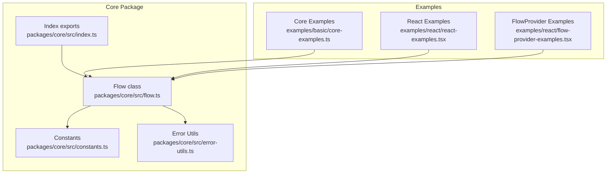
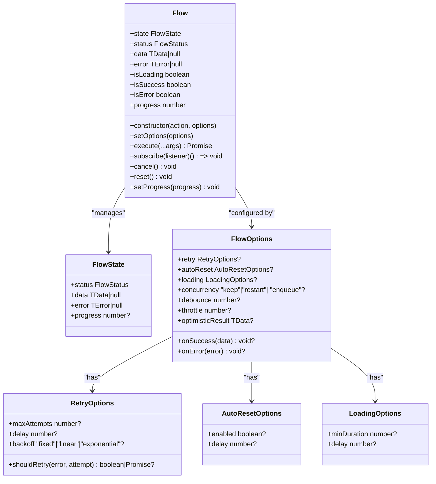
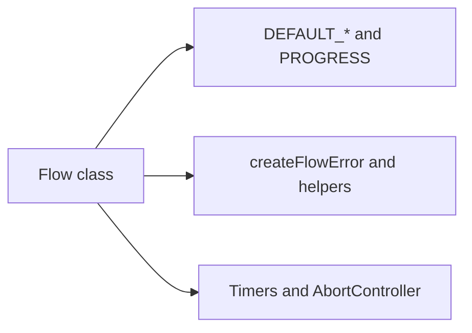

# Flow Class API

<cite>
**Referenced Files in This Document**
- [flow.ts](file://packages/core/src/flow.ts)
- [flow.d.ts](file://packages/core/src/flow.d.ts)
- [constants.ts](file://packages/core/src/constants.ts)
- [error-utils.ts](file://packages/core/src/error-utils.ts)
- [flow.test.ts](file://packages/core/src/flow.test.ts)
- [core-examples.ts](file://examples/basic/core-examples.ts)
- [react-examples.tsx](file://examples/react/react-examples.tsx)
- [flow-provider-examples.tsx](file://examples/react/flow-provider-examples.tsx)
- [index.ts](file://packages/core/src/index.ts)
- [package.json](file://packages/core/package.json)
</cite>

## Table of Contents
1. [Introduction](#introduction)
2. [Project Structure](#project-structure)
3. [Core Components](#core-components)
4. [Architecture Overview](#architecture-overview)
5. [Detailed Component Analysis](#detailed-component-analysis)
6. [Dependency Analysis](#dependency-analysis)
7. [Performance Considerations](#performance-considerations)
8. [Troubleshooting Guide](#troubleshooting-guide)
9. [Conclusion](#conclusion)
10. [Appendices](#appendices)

## Introduction
This document provides comprehensive API documentation for the Flow class, the core engine of AsyncFlowState. It covers the constructor interface, all public methods and getters, TypeScript generics, error handling patterns, and integration with various async operations. It also includes usage patterns, method chaining examples, and guidance for different data types and error scenarios.

## Project Structure
The Flow class resides in the core package and is designed to be framework-agnostic. It exposes a minimal TypeScript API surface with strong typing for data and error types, and integrates with optional utilities for error categorization and retry decisions.

**Diagram sources**
- [flow.ts](file://packages/core/src/flow.ts#L174-L223)
- [constants.ts](file://packages/core/src/constants.ts#L1-L51)
- [error-utils.ts](file://packages/core/src/error-utils.ts#L1-L207)
- [index.ts](file://packages/core/src/index.ts#L1-L4)
- [core-examples.ts](file://examples/basic/core-examples.ts#L1-L221)
- [react-examples.tsx](file://examples/react/react-examples.tsx#L1-L491)
- [flow-provider-examples.tsx](file://examples/react/flow-provider-examples.tsx#L1-L368)

**Section sources**
- [flow.ts](file://packages/core/src/flow.ts#L1-L709)
- [constants.ts](file://packages/core/src/constants.ts#L1-L51)
- [error-utils.ts](file://packages/core/src/error-utils.ts#L1-L207)
- [index.ts](file://packages/core/src/index.ts#L1-L4)

## Core Components
- Flow<TData, TError, TArgs>: The central orchestrator for async actions, managing state transitions, retries, concurrency, and UX controls.
- FlowState<TData, TError>: Immutable snapshot of the current state including status, data, error, and progress.
- FlowOptions<TData, TError>: Configuration for callbacks, retries, auto-reset, loading UX, concurrency, and optimistic updates.
- FlowAction<TData, TArgs>: The async function signature accepted by Flow.
- Constants: Defaults for retry, loading UX, progress, and backoff multipliers.
- Error utilities: Helpers to create and categorize FlowError instances.

**Section sources**
- [flow.ts](file://packages/core/src/flow.ts#L16-L127)
- [flow.d.ts](file://packages/core/src/flow.d.ts#L8-L79)
- [constants.ts](file://packages/core/src/constants.ts#L10-L50)
- [error-utils.ts](file://packages/core/src/error-utils.ts#L26-L206)

## Architecture Overview
The Flow class encapsulates the execution lifecycle of an async action. It manages:
- State transitions: idle → loading → success/error
- Retries with configurable delay and backoff
- Concurrency control: keep, restart, enqueue
- Debounce/throttle for rate limiting
- Optimistic UI updates
- UX controls: minDuration and loading delay
- Progress reporting
- Subscription-based state observation

**Diagram sources**
- [flow.ts](file://packages/core/src/flow.ts#L174-L223)
- [flow.ts](file://packages/core/src/flow.ts#L21-L127)

## Detailed Component Analysis

### Constructor: new Flow<TData, TError, TArgs>(action, options?)
- Purpose: Initializes a Flow instance with an async action and optional configuration.
- Parameters:
  - action: FlowAction<TData, TArgs> — the async function to orchestrate.
  - options: FlowOptions<TData, TError> — runtime configuration (optional).
- Behavior:
  - Stores action and options.
  - Initializes internal state to idle with initial progress.
  - Sets up listeners and timers for UX and concurrency.
- Notes:
  - TArgs allows precise typing of the action’s argument tuple.
  - Options are merged at runtime via setOptions.

Usage patterns:
- Basic instantiation with an async function.
- Passing onSuccess/onError callbacks.
- Configuring retry, autoReset, loading UX, concurrency, debounce/throttle, and optimisticResult.

**Section sources**
- [flow.ts](file://packages/core/src/flow.ts#L220-L223)
- [flow.d.ts](file://packages/core/src/flow.d.ts#L98-L105)

### Method: setOptions(options)
- Purpose: Merge new options into the existing configuration at runtime.
- Parameters:
  - options: FlowOptions<TData, TError> — partial options to update.
- Behavior:
  - Shallow merges the provided options with current options.
- Typical use cases:
  - Dynamically changing retry strategy.
  - Updating callbacks or UX settings.

Method chaining:
- setOptions returns void; chain it with other methods by calling them in sequence.

**Section sources**
- [flow.ts](file://packages/core/src/flow.ts#L239-L241)
- [flow.d.ts](file://packages/core/src/flow.d.ts#L107-L109)

### Method: execute(...args)
- Purpose: Executes the underlying action with argument forwarding and concurrency control.
- Parameters:
  - args: TArgs — forwarded to the action function.
- Returns:
  - Promise<TData | undefined> — resolves with action result or undefined if canceled/debounced/throttled.
- Behavior:
  - Applies debounce/throttle if configured.
  - Otherwise delegates to internalExecute.
  - Handles optimisticResult, loading UX, retries, callbacks, auto-reset, and enqueued tasks.
- Concurrency strategies:
  - keep: Ignore subsequent calls while loading.
  - restart: Cancel current execution and start a new one.
  - enqueue: Queue and execute after current completes.
- Debounce/throttle:
  - Debounce: Cancels previous scheduled execution and schedules a new one after delay.
  - Throttle: Executes immediately if cooldown elapsed; otherwise queues and executes later.

Method chaining:
- execute returns a Promise; chain with .then/.catch or await.

**Section sources**
- [flow.ts](file://packages/core/src/flow.ts#L400-L415)
- [flow.ts](file://packages/core/src/flow.ts#L425-L473)
- [flow.ts](file://packages/core/src/flow.ts#L537-L585)
- [flow.d.ts](file://packages/core/src/flow.d.ts#L160-L164)

### Method: subscribe(listener)
- Purpose: Registers a listener for state change notifications.
- Parameters:
  - listener: (state: FlowState<TData, TError>) => void — invoked on each state change.
- Returns:
  - () => void — unsubscribe function to remove the listener.
- Behavior:
  - Adds listener to an internal Set.
  - Invoked immediately upon state changes.
- Best practices:
  - Store unsubscribe and call it in cleanup (e.g., useEffect cleanup in React).
  - Avoid heavy work inside listeners; prefer lightweight updates.

Method chaining:
- subscribe returns a function; chain by storing and invoking it later.

**Section sources**
- [flow.ts](file://packages/core/src/flow.ts#L325-L332)
- [flow.d.ts](file://packages/core/src/flow.d.ts#L148-L152)

### Method: cancel()
- Purpose: Aborts the current execution and resets state to idle.
- Behavior:
  - Clears timers and cancels via AbortController.
  - Resets status, error, and progress to initial values.
- Use cases:
  - User-triggered cancellation.
  - Cleanup before unmounting.

Method chaining:
- cancel returns void; chain by calling other methods afterward.

**Section sources**
- [flow.ts](file://packages/core/src/flow.ts#L344-L351)
- [flow.d.ts](file://packages/core/src/flow.d.ts#L156-L158)

### Method: reset()
- Purpose: Resets state to idle regardless of current status.
- Behavior:
  - Clears timers and resets state to initial values.
- Use cases:
  - Manual reset after success or error.
  - Clearing stale data before reuse.

Method chaining:
- reset returns void; chain by calling other methods afterward.

**Section sources**
- [flow.ts](file://packages/core/src/flow.ts#L362-L370)
- [flow.d.ts](file://packages/core/src/flow.d.ts#L167-L169)

### Method: setProgress(progress)
- Purpose: Manually sets progress while loading.
- Parameters:
  - progress: number — clamped between 0 and 100.
- Behavior:
  - Only effective while status is loading.
  - Updates internal state and notifies listeners.
- Use cases:
  - Long-running tasks with known progress (e.g., uploads).

Method chaining:
- setProgress returns void; chain by calling other methods afterward.

**Section sources**
- [flow.ts](file://packages/core/src/flow.ts#L299-L305)
- [flow.d.ts](file://packages/core/src/flow.d.ts#L144-L146)

### Getters: state, status, data, error, isLoading, isSuccess, isError, progress
- state: Returns a shallow copy of the current FlowState.
- status: Current FlowStatus ("idle" | "loading" | "success" | "error").
- data: Last successful data or null.
- error: Last error or null.
- isLoading: True when status is loading and not delayed by loading delay.
- isSuccess: True when status is success.
- isError: True when status is error.
- progress: Current progress percentage (0–100), defaults to 0.

Notes:
- isLoading respects loading.delay; during the delay window, status may be "loading" but isLoading is false.
- progress is initially set to initial value and auto-completes on success.

**Section sources**
- [flow.ts](file://packages/core/src/flow.ts#L246-L286)
- [flow.d.ts](file://packages/core/src/flow.d.ts#L111-L142)

### TypeScript Generics and Type Safety
- TData: Type of the successful action result.
- TError: Type of the error object thrown on failure.
- TArgs: Tuple type of arguments passed to the action (inferred from FlowAction).
- FlowState<TData, TError>: Immutable snapshot of state with typed data and error.
- FlowOptions<TData, TError>: Typed configuration for callbacks, retries, and UX.

Usage tips:
- Specify TData and TError explicitly when the action’s return type is not inferable.
- Use TArgs to constrain action parameters for stricter validation.

**Section sources**
- [flow.ts](file://packages/core/src/flow.ts#L174-L174)
- [flow.ts](file://packages/core/src/flow.ts#L21-L30)
- [flow.ts](file://packages/core/src/flow.ts#L99-L127)
- [flow.d.ts](file://packages/core/src/flow.d.ts#L84-L88)

### Error Handling Patterns
- Built-in retry logic with configurable maxAttempts, delay, and backoff.
- Optional shouldRetry predicate to decide retry eligibility per error and attempt.
- Error categorization and retryability via createFlowError and helpers.
- onError callback fires on terminal failure after retries.
- FlowErrorType includes NETWORK, TIMEOUT, VALIDATION, PERMISSION, SERVER, UNKNOWN.

Integration patterns:
- Use createFlowError to normalize errors and pass to onError handlers.
- Combine shouldRetry with error categorization for fine-grained retry policies.

**Section sources**
- [flow.ts](file://packages/core/src/flow.ts#L482-L533)
- [flow.ts](file://packages/core/src/flow.ts#L603-L638)
- [error-utils.ts](file://packages/core/src/error-utils.ts#L26-L206)

### Integration with Async Operations
Common scenarios:
- API calls: Pass async functions that fetch, mutate, or stream data.
- File uploads: Use setProgress to reflect upload progress.
- Optimistic UI: Provide optimisticResult to immediately reflect changes.
- Debounce/throttle: Apply to search or autosave operations.
- Concurrency: Use restart to allow latest request to supersede older ones.

**Section sources**
- [core-examples.ts](file://examples/basic/core-examples.ts#L14-L38)
- [core-examples.ts](file://examples/basic/core-examples.ts#L82-L111)
- [core-examples.ts](file://examples/basic/core-examples.ts#L120-L144)
- [core-examples.ts](file://examples/basic/core-examples.ts#L150-L177)
- [core-examples.ts](file://examples/basic/core-examples.ts#L183-L203)

### Method Chaining Examples
- Configure then execute:
  - new Flow(action, options).execute(...args)
- Subscribe and execute:
  - const unsub = flow.subscribe(cb); await flow.execute(...args); unsub()
- Set options and execute:
  - flow.setOptions(opts).execute(...args)
- Cancel/reset after execution:
  - await flow.execute(...args); flow.reset()

Note: Methods return void except execute (Promise) and subscribe (unsubscribe function).

**Section sources**
- [flow.ts](file://packages/core/src/flow.ts#L325-L332)
- [flow.ts](file://packages/core/src/flow.ts#L400-L415)
- [flow.ts](file://packages/core/src/flow.ts#L239-L241)
- [flow.ts](file://packages/core/src/flow.ts#L362-L370)

## Dependency Analysis
The Flow class depends on:
- Constants for defaults (retry, loading UX, progress, backoff multipliers).
- Error utilities for error categorization and retryability.
- Internal timers and AbortController for UX and cancellation.
- Listener set for state observation.

**Diagram sources**
- [flow.ts](file://packages/core/src/flow.ts#L1-L7)
- [flow.ts](file://packages/core/src/flow.ts#L672-L707)
- [constants.ts](file://packages/core/src/constants.ts#L10-L50)
- [error-utils.ts](file://packages/core/src/error-utils.ts#L26-L206)

**Section sources**
- [flow.ts](file://packages/core/src/flow.ts#L1-L7)
- [constants.ts](file://packages/core/src/constants.ts#L10-L50)
- [error-utils.ts](file://packages/core/src/error-utils.ts#L26-L206)

## Performance Considerations
- Debounce/throttle reduce redundant executions for frequent triggers (e.g., search input).
- minDuration prevents UI flicker for fast operations; delay avoids showing spinners for instant actions.
- Backoff strategies (fixed, linear, exponential) balance responsiveness and resilience.
- Enqueue concurrency avoids wasted work by queuing subsequent requests.

[No sources needed since this section provides general guidance]

## Troubleshooting Guide
Common issues and resolutions:
- Double submissions: Ensure concurrency is set appropriately; "keep" ignores concurrent calls, "restart" cancels and starts fresh.
- Immediate UI flashes: Increase minDuration to ensure loading persists for a minimum time.
- Spinner appears too early: Increase loading delay to hide spinners for fast operations.
- Retries not triggering: Verify shouldRetry logic and error categorization; ensure error type permits retry.
- Progress not updating: setProgress only affects loading state; confirm status remains "loading".
- Cancellation not stopping work: AbortController cancels future state updates; long-running promises may still complete, but results are ignored.

**Section sources**
- [flow.test.ts](file://packages/core/src/flow.test.ts#L87-L138)
- [flow.test.ts](file://packages/core/src/flow.test.ts#L292-L334)
- [flow.test.ts](file://packages/core/src/flow.test.ts#L336-L345)
- [flow.ts](file://packages/core/src/flow.ts#L482-L533)
- [flow.ts](file://packages/core/src/flow.ts#L646-L656)

## Conclusion
The Flow class provides a robust, typed, and extensible foundation for orchestrating async UI behavior. Its comprehensive configuration, strong typing, and rich UX controls enable consistent and resilient async interactions across diverse applications and frameworks.

[No sources needed since this section summarizes without analyzing specific files]

## Appendices

### API Reference Summary

- Constructor
  - new Flow<TData, TError, TArgs>(action, options?)
- Methods
  - setOptions(options)
  - execute(...args): Promise<TData | undefined>
  - subscribe(listener): () => void
  - cancel(): void
  - reset(): void
  - setProgress(progress): void
- Getters
  - state, status, data, error, isLoading, isSuccess, isError, progress

**Section sources**
- [flow.d.ts](file://packages/core/src/flow.d.ts#L84-L176)

### Example Usage References
- Basic examples: [core-examples.ts](file://examples/basic/core-examples.ts#L14-L38), [core-examples.ts](file://examples/basic/core-examples.ts#L44-L73), [core-examples.ts](file://examples/basic/core-examples.ts#L82-L111), [core-examples.ts](file://examples/basic/core-examples.ts#L120-L144), [core-examples.ts](file://examples/basic/core-examples.ts#L150-L177), [core-examples.ts](file://examples/basic/core-examples.ts#L183-L203)
- React examples: [react-examples.tsx](file://examples/react/react-examples.tsx#L14-L87), [react-examples.tsx](file://examples/react/react-examples.tsx#L100-L128), [react-examples.tsx](file://examples/react/react-examples.tsx#L134-L180), [react-examples.tsx](file://examples/react/react-examples.tsx#L186-L244), [react-examples.tsx](file://examples/react/react-examples.tsx#L251-L301), [react-examples.tsx](file://examples/react/react-examples.tsx#L307-L373), [react-examples.tsx](file://examples/react/react-examples.tsx#L379-L415), [react-examples.tsx](file://examples/react/react-examples.tsx#L421-L490)
- FlowProvider examples: [flow-provider-examples.tsx](file://examples/react/flow-provider-examples.tsx#L59-L95), [flow-provider-examples.tsx](file://examples/react/flow-provider-examples.tsx#L101-L155), [flow-provider-examples.tsx](file://examples/react/flow-provider-examples.tsx#L161-L205), [flow-provider-examples.tsx](file://examples/react/flow-provider-examples.tsx#L211-L271), [flow-provider-examples.tsx](file://examples/react/flow-provider-examples.tsx#L277-L367)