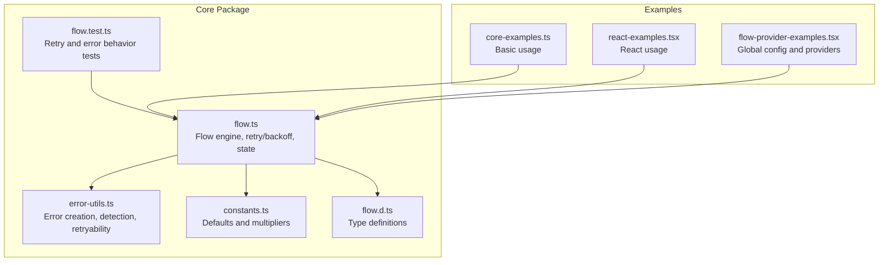
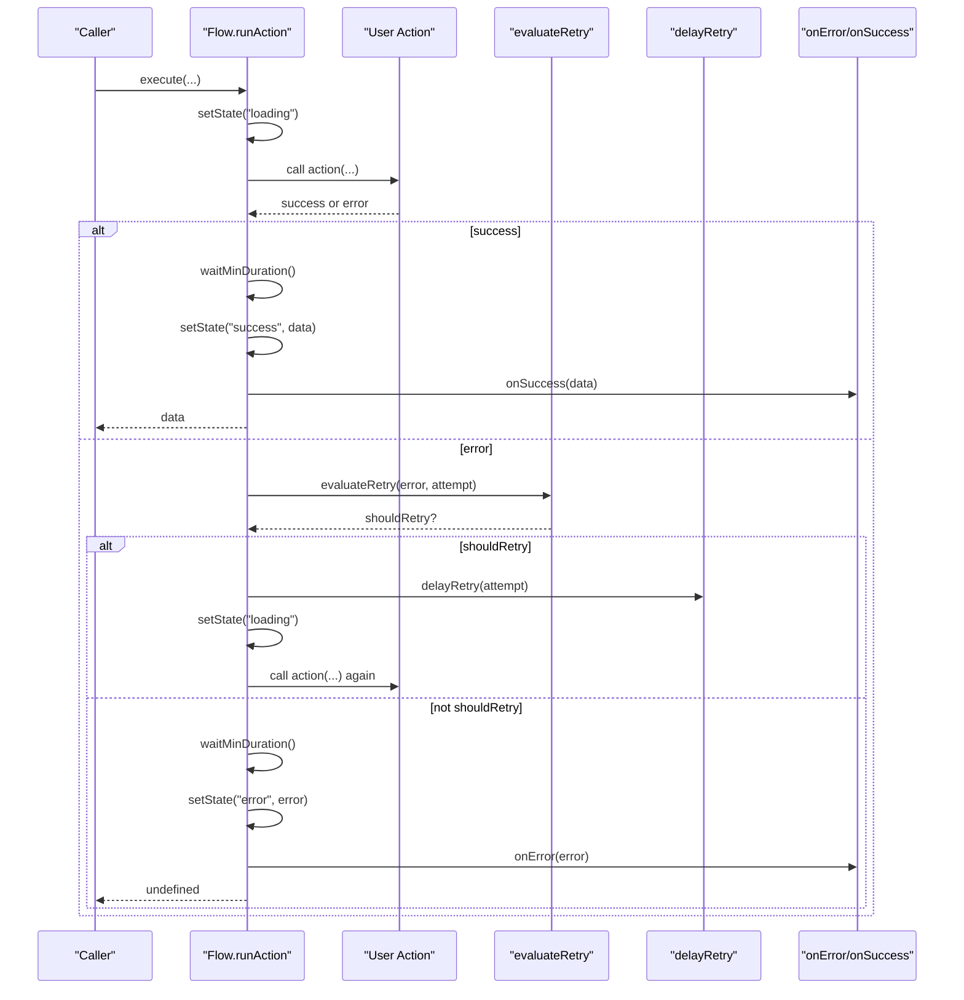
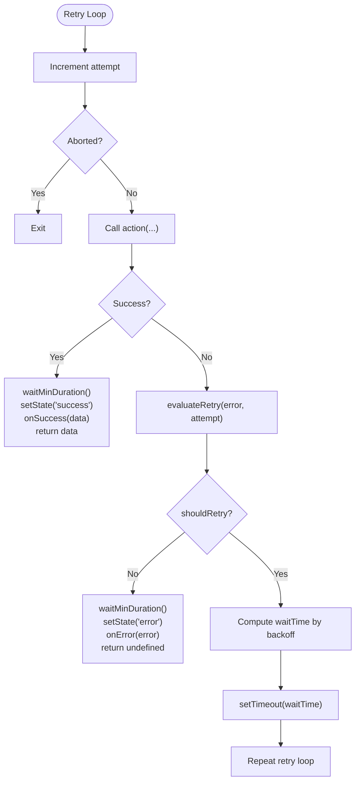
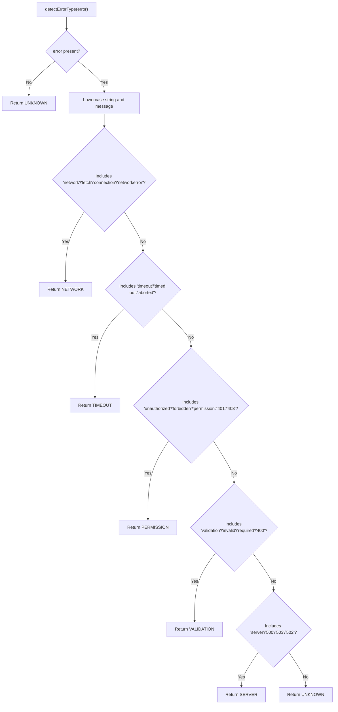
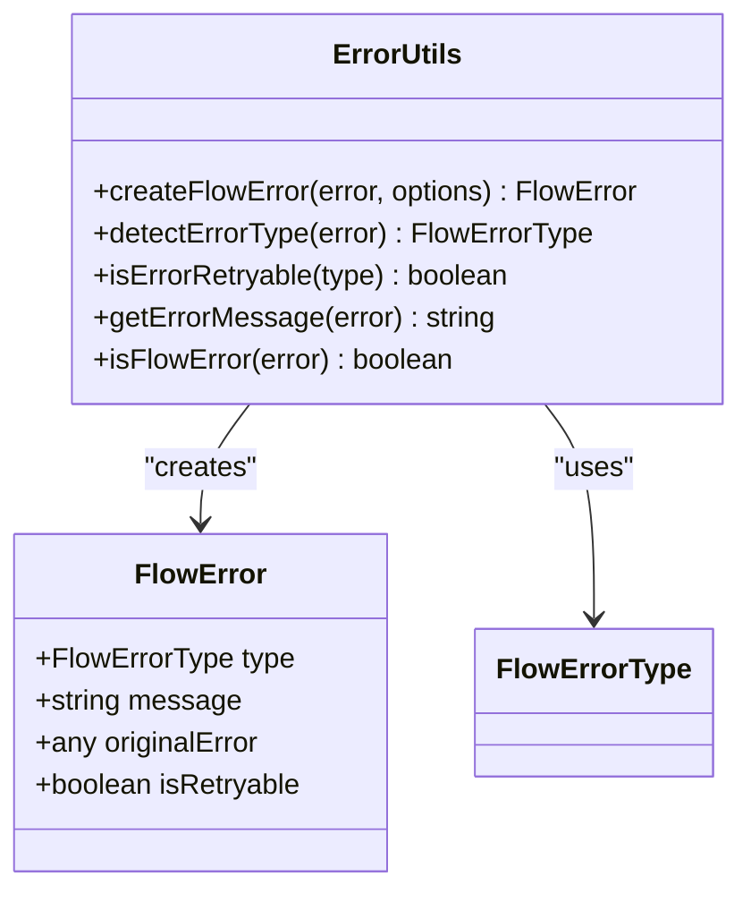
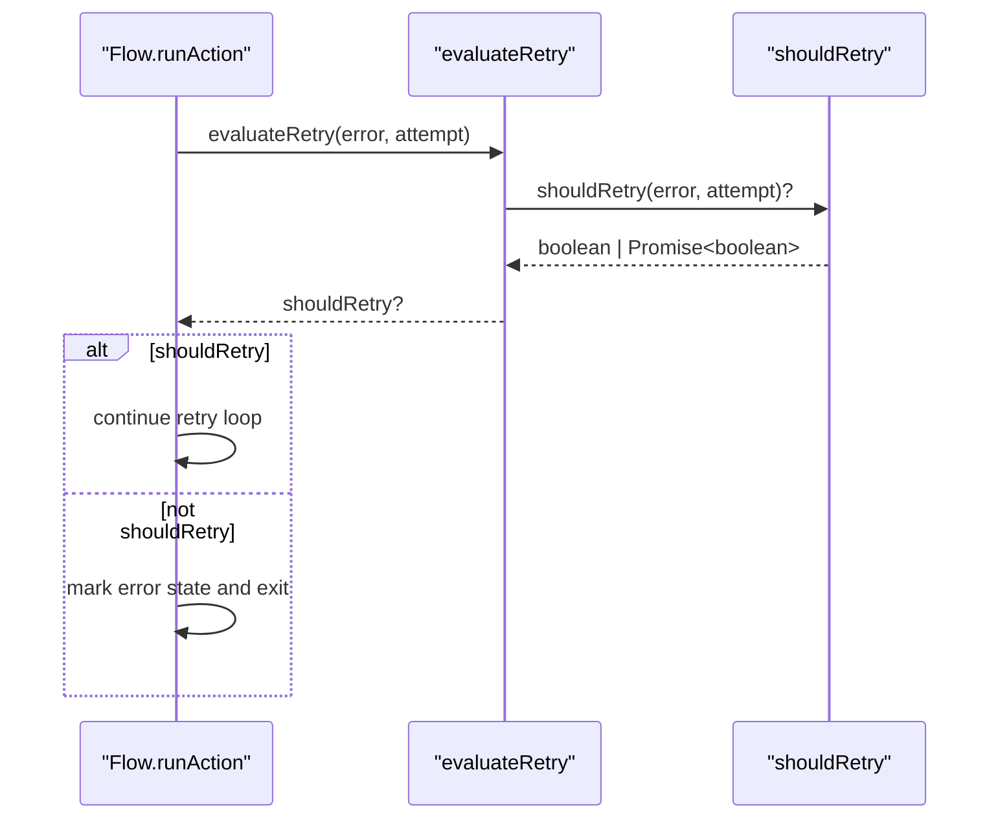
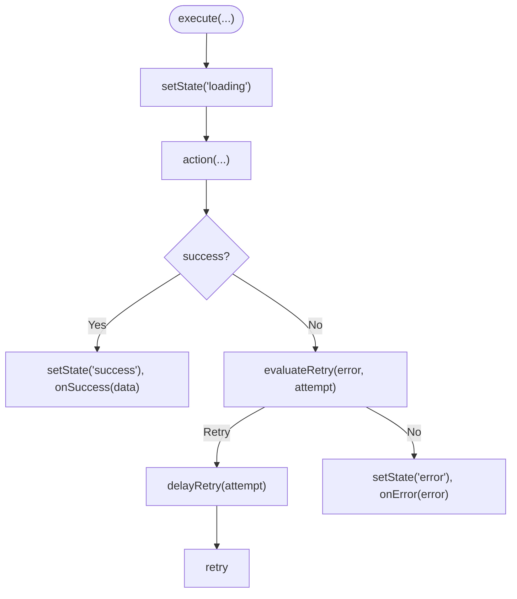
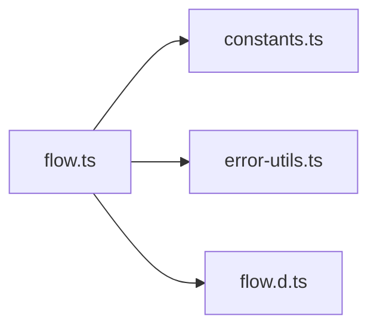

# Retry Logic and Error Handling

<cite>
**Referenced Files in This Document**
- [flow.ts](file://packages/core/src/flow.ts)
- [error-utils.ts](file://packages/core/src/error-utils.ts)
- [constants.ts](file://packages/core/src/constants.ts)
- [flow.d.ts](file://packages/core/src/flow.d.ts)
- [flow.test.ts](file://packages/core/src/flow.test.ts)
- [core-examples.ts](file://examples/basic/core-examples.ts)
- [react-examples.tsx](file://examples/react/react-examples.tsx)
- [flow-provider-examples.tsx](file://examples/react/flow-provider-examples.tsx)
</cite>

## Table of Contents
1. [Introduction](#introduction)
2. [Project Structure](#project-structure)
3. [Core Components](#core-components)
4. [Architecture Overview](#architecture-overview)
5. [Detailed Component Analysis](#detailed-component-analysis)
6. [Dependency Analysis](#dependency-analysis)
7. [Performance Considerations](#performance-considerations)
8. [Troubleshooting Guide](#troubleshooting-guide)
9. [Conclusion](#conclusion)
10. [Appendices](#appendices)

## Introduction
This document explains the retry system and error handling capabilities of the Flow engine. It covers the RetryOptions interface, FlowErrorType enumeration, FlowError interface, automatic error categorization, custom retry conditions, error propagation patterns, and integration with error utilities. Practical examples and best practices are included for different error scenarios.

## Project Structure
The retry and error handling logic lives in the core package under the Flow engine and supporting utilities. The main files are:
- Flow engine and retry/backoff logic
- Error utilities for categorization and propagation
- Constants for defaults
- Type definitions
- Tests validating retry behavior
- Examples demonstrating usage in both basic and React contexts

**Diagram sources**
- [flow.ts](file://packages/core/src/flow.ts#L1-L766)
- [error-utils.ts](file://packages/core/src/error-utils.ts#L1-L207)
- [constants.ts](file://packages/core/src/constants.ts#L1-L51)
- [flow.d.ts](file://packages/core/src/flow.d.ts#L1-L177)
- [flow.test.ts](file://packages/core/src/flow.test.ts#L1-L363)
- [core-examples.ts](file://examples/basic/core-examples.ts#L1-L221)
- [react-examples.tsx](file://examples/react/react-examples.tsx#L1-L491)
- [flow-provider-examples.tsx](file://examples/react/flow-provider-examples.tsx#L1-L368)

**Section sources**
- [flow.ts](file://packages/core/src/flow.ts#L1-L766)
- [error-utils.ts](file://packages/core/src/error-utils.ts#L1-L207)
- [constants.ts](file://packages/core/src/constants.ts#L1-L51)
- [flow.d.ts](file://packages/core/src/flow.d.ts#L1-L177)
- [flow.test.ts](file://packages/core/src/flow.test.ts#L1-L363)
- [core-examples.ts](file://examples/basic/core-examples.ts#L1-L221)
- [react-examples.tsx](file://examples/react/react-examples.tsx#L1-L491)
- [flow-provider-examples.tsx](file://examples/react/flow-provider-examples.tsx#L1-L368)

## Core Components
- RetryOptions: Controls maxAttempts, delay, backoff strategy, and a shouldRetry callback for custom retry decisions.
- FlowErrorType: Automatic error categorization for NETWORK, TIMEOUT, VALIDATION, PERMISSION, SERVER, UNKNOWN.
- FlowError: Enhanced error object with type, message, originalError, and isRetryable flag.
- Error utilities: createFlowError, detectErrorType, isErrorRetryable, getErrorMessage, isFlowError.
- Flow engine: Implements retry loop, backoff strategies, and error propagation.

**Section sources**
- [flow.ts](file://packages/core/src/flow.ts#L32-L53)
- [flow.ts](file://packages/core/src/flow.ts#L62-L74)
- [error-utils.ts](file://packages/core/src/error-utils.ts#L26-L39)
- [error-utils.ts](file://packages/core/src/error-utils.ts#L53-L113)
- [error-utils.ts](file://packages/core/src/error-utils.ts#L130-L143)
- [error-utils.ts](file://packages/core/src/error-utils.ts#L162-L176)
- [error-utils.ts](file://packages/core/src/error-utils.ts#L192-L206)

## Architecture Overview
The Flow engine coordinates execution, retries, and error handling. On failure, it evaluates retry conditions, applies backoff delays, and propagates errors to callbacks and state. Error utilities provide automatic categorization and retryability hints.

**Diagram sources**
- [flow.ts](file://packages/core/src/flow.ts#L523-L590)
- [flow.ts](file://packages/core/src/flow.ts#L660-L675)
- [flow.ts](file://packages/core/src/flow.ts#L682-L695)

## Detailed Component Analysis

### RetryOptions and Backoff Strategies
- maxAttempts: Number of attempts (default 1 disables retries).
- delay: Base delay between retries in milliseconds (default 1000).
- backoff: Strategy selection among fixed, linear, exponential.
- shouldRetry: Optional predicate receiving error and attempt number to decide retry.

Backoff computation:
- Fixed: delay remains constant.
- Linear: delay × attempt × multiplier.
- Exponential: delay × base^(attempt - 1).

**Diagram sources**
- [flow.ts](file://packages/core/src/flow.ts#L523-L590)
- [flow.ts](file://packages/core/src/flow.ts#L660-L675)
- [flow.ts](file://packages/core/src/flow.ts#L682-L695)
- [constants.ts](file://packages/core/src/constants.ts#L47-L50)

**Section sources**
- [flow.ts](file://packages/core/src/flow.ts#L62-L74)
- [flow.ts](file://packages/core/src/flow.ts#L682-L695)
- [constants.ts](file://packages/core/src/constants.ts#L10-L17)
- [constants.ts](file://packages/core/src/constants.ts#L47-L50)
- [flow.test.ts](file://packages/core/src/flow.test.ts#L243-L281)

### FlowErrorType and Automatic Categorization
FlowErrorType enumerates categories used by error detection:
- NETWORK: Matches network-related messages.
- TIMEOUT: Matches timeout or aborted messages.
- VALIDATION: Matches validation or bad request messages.
- PERMISSION: Matches unauthorized or forbidden messages.
- SERVER: Matches server error messages.
- UNKNOWN: Default fallback.

Detection logic inspects error string representations and known HTTP-like patterns.

**Diagram sources**
- [error-utils.ts](file://packages/core/src/error-utils.ts#L53-L113)

**Section sources**
- [flow.ts](file://packages/core/src/flow.ts#L32-L42)
- [error-utils.ts](file://packages/core/src/error-utils.ts#L53-L113)

### FlowError and Error Utilities
FlowError augments raw errors with:
- type: Categorized FlowErrorType
- message: Human-readable message extracted from error
- originalError: The underlying error object
- isRetryable: Boolean hint derived from type

Utilities:
- createFlowError: Wraps any error with automatic type detection and retryability.
- isErrorRetryable: Maps FlowErrorType to retryability.
- getErrorMessage: Extracts a readable message from various error forms.
- isFlowError: Type guard to safely access FlowError properties.

**Diagram sources**
- [flow.ts](file://packages/core/src/flow.ts#L47-L53)
- [error-utils.ts](file://packages/core/src/error-utils.ts#L26-L39)
- [error-utils.ts](file://packages/core/src/error-utils.ts#L130-L143)
- [error-utils.ts](file://packages/core/src/error-utils.ts#L162-L176)
- [error-utils.ts](file://packages/core/src/error-utils.ts#L192-L206)

**Section sources**
- [flow.ts](file://packages/core/src/flow.ts#L47-L53)
- [error-utils.ts](file://packages/core/src/error-utils.ts#L26-L39)
- [error-utils.ts](file://packages/core/src/error-utils.ts#L130-L143)
- [error-utils.ts](file://packages/core/src/error-utils.ts#L162-L176)
- [error-utils.ts](file://packages/core/src/error-utils.ts#L192-L206)

### Custom Retry Conditions and shouldRetry
The shouldRetry callback allows fine-grained control over retry decisions. It receives the error and the current attempt number and returns a boolean or a Promise resolving to a boolean. If provided, it overrides default retry behavior.

**Diagram sources**
- [flow.ts](file://packages/core/src/flow.ts#L660-L675)

**Section sources**
- [flow.ts](file://packages/core/src/flow.ts#L73-L73)
- [flow.ts](file://packages/core/src/flow.ts#L660-L675)
- [flow-provider-examples.tsx](file://examples/react/flow-provider-examples.tsx#L302-L314)

### Error Propagation Patterns
- Terminal error: After maxAttempts reached, the error is propagated to onError callback and stored in state.
- Success path: onSuccess is invoked with the resolved data.
- Optimistic updates: On error, rollback can revert to previous data snapshot unless disabled.

**Diagram sources**
- [flow.ts](file://packages/core/src/flow.ts#L523-L590)

**Section sources**
- [flow.ts](file://packages/core/src/flow.ts#L554-L585)
- [flow.ts](file://packages/core/src/flow.ts#L540-L551)

### Integration with Error Utilities
- Automatic wrapping: Use createFlowError to normalize errors for consistent handling.
- Type-driven retryability: isErrorRetryable helps decide whether to retry based on FlowErrorType.
- Message extraction: getErrorMessage ensures consistent messaging regardless of error shape.

**Section sources**
- [error-utils.ts](file://packages/core/src/error-utils.ts#L26-L39)
- [error-utils.ts](file://packages/core/src/error-utils.ts#L130-L143)
- [error-utils.ts](file://packages/core/src/error-utils.ts#L162-L176)

### Examples and Best Practices
- Basic retry configuration: Configure maxAttempts, delay, and backoff in FlowOptions.retry.
- Custom retry conditions: Provide shouldRetry to override default behavior.
- Global configuration in React: Use FlowProvider to centralize retry and error handling.
- Best practices:
  - Prefer exponential backoff for network-sensitive operations.
  - Disable retries for validation or permission errors via shouldRetry.
  - Use onError for global logging and user notifications.
  - Combine with optimistic updates for responsive UI, with rollbackOnError enabled.

**Section sources**
- [core-examples.ts](file://examples/basic/core-examples.ts#L44-L73)
- [react-examples.tsx](file://examples/react/react-examples.tsx#L379-L415)
- [flow-provider-examples.tsx](file://examples/react/flow-provider-examples.tsx#L302-L314)

## Dependency Analysis
The Flow engine depends on:
- constants.ts for default values and multipliers
- error-utils.ts for error categorization and retryability
- flow.d.ts for type definitions

**Diagram sources**
- [flow.ts](file://packages/core/src/flow.ts#L1-L7)
- [constants.ts](file://packages/core/src/constants.ts#L1-L51)
- [error-utils.ts](file://packages/core/src/error-utils.ts#L1-L1)
- [flow.d.ts](file://packages/core/src/flow.d.ts#L1-L177)

**Section sources**
- [flow.ts](file://packages/core/src/flow.ts#L1-L7)
- [constants.ts](file://packages/core/src/constants.ts#L1-L51)
- [error-utils.ts](file://packages/core/src/error-utils.ts#L1-L1)
- [flow.d.ts](file://packages/core/src/flow.d.ts#L1-L177)

## Performance Considerations
- Backoff strategies: Exponential backoff increases wait time exponentially, reducing load on failing systems.
- Linear backoff: Provides predictable delays proportional to attempt number.
- Fixed backoff: Simple and consistent, suitable for deterministic environments.
- Defaults: Review DEFAULT_RETRY values to balance responsiveness and reliability.

[No sources needed since this section provides general guidance]

## Troubleshooting Guide
Common issues and resolutions:
- Retries not triggering: Ensure maxAttempts > 1 and shouldRetry does not return false prematurely.
- Unexpected retry behavior: Verify backoff strategy and delay values align with intended UX.
- Error not categorized: Confirm error messages contain expected keywords for detection.
- Rollback not happening: Check rollbackOnError setting and that previousDataSnapshot is set.

**Section sources**
- [flow.ts](file://packages/core/src/flow.ts#L660-L675)
- [flow.ts](file://packages/core/src/flow.ts#L682-L695)
- [error-utils.ts](file://packages/core/src/error-utils.ts#L53-L113)
- [flow.test.ts](file://packages/core/src/flow.test.ts#L32-L47)

## Conclusion
The Flow engine provides robust retry and error handling with configurable strategies, automatic categorization, and flexible customization via shouldRetry. Combined with error utilities and React provider patterns, it enables resilient, user-friendly asynchronous workflows across diverse applications.

[No sources needed since this section summarizes without analyzing specific files]

## Appendices
- Example references:
  - Basic retry configuration and execution
  - React provider global retry and error handling
  - Custom shouldRetry in production setups

**Section sources**
- [core-examples.ts](file://examples/basic/core-examples.ts#L44-L73)
- [flow-provider-examples.tsx](file://examples/react/flow-provider-examples.tsx#L302-L314)
- [react-examples.tsx](file://examples/react/react-examples.tsx#L379-L415)