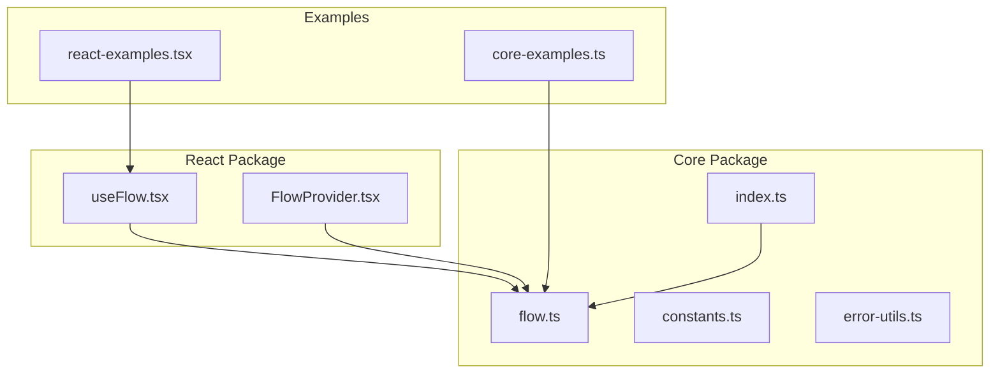
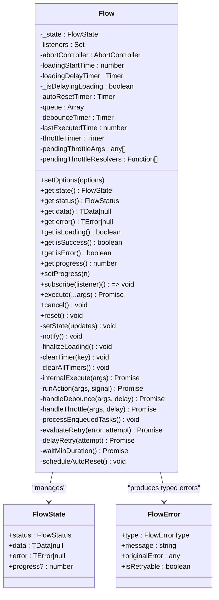
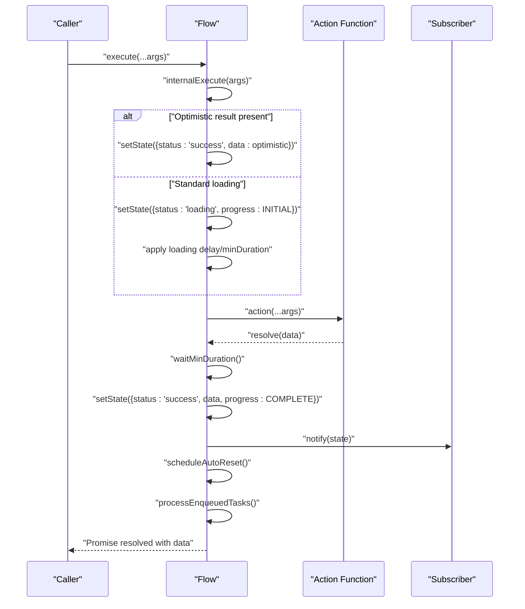
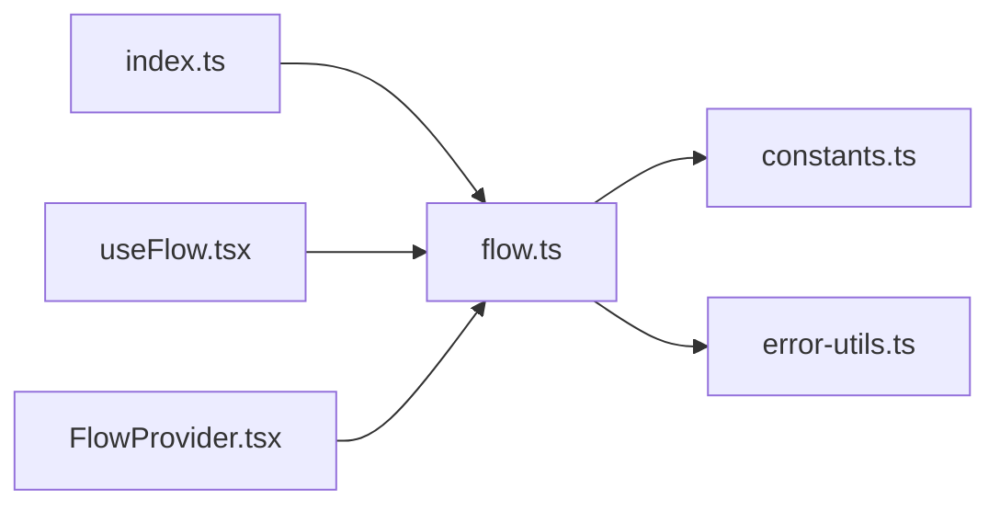

# State Management

<cite>
**Referenced Files in This Document**
- [flow.ts](file://packages/core/src/flow.ts)
- [flow.d.ts](file://packages/core/src/flow.d.ts)
- [constants.ts](file://packages/core/src/constants.ts)
- [error-utils.ts](file://packages/core/src/error-utils.ts)
- [index.ts](file://packages/core/src/index.ts)
- [useFlow.tsx](file://packages/react/src/useFlow.tsx)
- [FlowProvider.tsx](file://packages/react/src/FlowProvider.tsx)
- [core-examples.ts](file://examples/basic/core-examples.ts)
- [react-examples.tsx](file://examples/react/react-examples.tsx)
- [flow.test.ts](file://packages/core/src/flow.test.ts)
- [useFlow.test.tsx](file://packages/react/src/useFlow.test.tsx)
</cite>

## Table of Contents

1. [Introduction](#introduction)
2. [Project Structure](#project-structure)
3. [Core Components](#core-components)
4. [Architecture Overview](#architecture-overview)
5. [Detailed Component Analysis](#detailed-component-analysis)
6. [Dependency Analysis](#dependency-analysis)
7. [Performance Considerations](#performance-considerations)
8. [Troubleshooting Guide](#troubleshooting-guide)
9. [Conclusion](#conclusion)
10. [Appendices](#appendices)

## Introduction

This document explains Flow’s state management system with a focus on the FlowState interface, state lifecycle, observer pattern, immutability, snapshots, reactive updates, progress tracking, persistence considerations, and memory management. It also covers integration with UI frameworks, particularly React, and provides practical examples drawn from the repository.

## Project Structure

The state management lives primarily in the core package, with React-specific bindings in the react package. Examples demonstrate usage patterns across vanilla JS and React.

**Diagram sources**

- [flow.ts](file://packages/core/src/flow.ts#L1-L709)
- [constants.ts](file://packages/core/src/constants.ts#L1-L51)
- [error-utils.ts](file://packages/core/src/error-utils.ts#L1-L207)
- [index.ts](file://packages/core/src/index.ts#L1-L4)
- [useFlow.tsx](file://packages/react/src/useFlow.tsx#L1-L281)
- [FlowProvider.tsx](file://packages/react/src/FlowProvider.tsx#L1-L139)
- [core-examples.ts](file://examples/basic/core-examples.ts#L1-L221)
- [react-examples.tsx](file://examples/react/react-examples.tsx#L1-L491)

**Section sources**

- [flow.ts](file://packages/core/src/flow.ts#L1-L709)
- [useFlow.tsx](file://packages/react/src/useFlow.tsx#L1-L281)
- [FlowProvider.tsx](file://packages/react/src/FlowProvider.tsx#L1-L139)
- [core-examples.ts](file://examples/basic/core-examples.ts#L1-L221)
- [react-examples.tsx](file://examples/react/react-examples.tsx#L1-L491)

## Core Components

- FlowState interface defines the canonical state shape with status, data, error, and optional progress.
- Flow class encapsulates state, lifecycle transitions, observers, concurrency, retry/backoff, optimistic updates, and UX controls.
- React integration via useFlow provides a snapshot of state, helpers, and accessibility features.

Key elements:

- FlowState<TData, TError> exposes status, data, error, and progress.
- Flow exposes subscribe(listener), execute(...args), reset(), cancel(), setProgress(n), and getters like isLoading, isSuccess, isError.
- Constants define defaults for retry, loading UX, progress bounds, and backoff multipliers.
- Error utilities provide typed error wrapping and categorization.

**Section sources**

- [flow.ts](file://packages/core/src/flow.ts#L16-L30)
- [flow.ts](file://packages/core/src/flow.ts#L174-L709)
- [constants.ts](file://packages/core/src/constants.ts#L7-L51)
- [error-utils.ts](file://packages/core/src/error-utils.ts#L9-L207)
- [flow.d.ts](file://packages/core/src/flow.d.ts#L10-L21)

## Architecture Overview

Flow orchestrates asynchronous actions and their UI states. Internally, it maintains a private immutable-like state object and notifies subscribers upon changes. It supports advanced UX controls (minDuration, loading delay), concurrency strategies, retry/backoff, optimistic updates, and progress reporting.

**Diagram sources**

- [flow.ts](file://packages/core/src/flow.ts#L174-L709)
- [flow.d.ts](file://packages/core/src/flow.d.ts#L10-L21)
- [error-utils.ts](file://packages/core/src/error-utils.ts#L47-L53)

## Detailed Component Analysis

### FlowState Interface and Lifecycle

- Status values: idle, loading, success, error.
- Data: last successful result or null.
- Error: last thrown error or null.
- Progress: optional numeric progress in [0..100], initialized to 0.

Lifecycle transitions:

- idle → loading: on execute() when not already loading.
- loading → success: after action resolves and minDuration elapses.
- loading → error: after all retry attempts fail.
- success → idle: via reset() or autoReset after success.
- error → idle: via reset() or autoReset after success.

Timing considerations:

- minDuration ensures loading persists for a minimum time to avoid UI flicker.
- loading delay prevents immediate “loading” appearance for instant actions.

Immutability and snapshots:

- Public getters return copies of state to prevent external mutation.
- notify() sends a defensive copy to listeners.

Reactive updates:

- setState(updates) merges updates into internal state and triggers notify().
- Subscribers receive a fresh snapshot on each state change.

Progress tracking:

- setProgress(n) updates progress while loading, clamped to [0..100].
- On success, progress is set to 100; on error, reset to 0.

**Section sources**

- [flow.ts](file://packages/core/src/flow.ts#L16-L30)
- [flow.ts](file://packages/core/src/flow.ts#L176-L181)
- [flow.ts](file://packages/core/src/flow.ts#L246-L286)
- [flow.ts](file://packages/core/src/flow.ts#L272-L286)
- [flow.ts](file://packages/core/src/flow.ts#L672-L679)
- [flow.ts](file://packages/core/src/flow.ts#L499-L509)
- [flow.ts](file://packages/core/src/flow.ts#L517-L527)
- [flow.ts](file://packages/core/src/flow.ts#L299-L305)
- [flow.ts](file://packages/core/src/flow.ts#L461-L470)
- [flow.ts](file://packages/core/src/flow.ts#L646-L656)
- [constants.ts](file://packages/core/src/constants.ts#L37-L42)

### Observer Pattern and Listener Management

- subscribe(listener) adds a listener to an internal Set and returns an unsubscribe function.
- notify() iterates listeners and invokes them with a defensive copy of the current state.
- Listeners are cleaned up via unsubscribe; timers and AbortController are cleared on reset/cancel.

Practical usage:

- React hook subscribes to Flow and mirrors state into component state.
- Examples show manual subscription for core usage.

**Section sources**

- [flow.ts](file://packages/core/src/flow.ts#L325-L332)
- [flow.ts](file://packages/core/src/flow.ts#L677-L679)
- [useFlow.tsx](file://packages/react/src/useFlow.tsx#L251-L253)
- [core-examples.ts](file://examples/basic/core-examples.ts#L28-L31)

### State Mutability, Snapshots, and Reactive Updates

- Internal state is a plain object; public getters return shallow copies to preserve immutability externally.
- setState() performs a shallow merge and calls notify().
- React integration maintains a local snapshot derived from Flow state.

Best practices:

- Treat Flow state as read-only; rely on getters and subscribe() for updates.
- Avoid mutating Flow’s internal state; use provided APIs.

**Section sources**

- [flow.ts](file://packages/core/src/flow.ts#L246-L248)
- [flow.ts](file://packages/core/src/flow.ts#L672-L679)
- [useFlow.tsx](file://packages/react/src/useFlow.tsx#L106-L108)

### Progress Tracking Mechanisms

- Manual progress: setProgress(n) while loading; clamped to [0..100].
- Automatic progress: success sets progress to 100; error resets to 0.
- UX-aware progress: loading delay and minDuration influence perceived timing.

**Section sources**

- [flow.ts](file://packages/core/src/flow.ts#L299-L305)
- [flow.ts](file://packages/core/src/flow.ts#L502-L502)
- [flow.ts](file://packages/core/src/flow.ts#L519-L521)
- [flow.ts](file://packages/core/src/flow.ts#L461-L470)
- [flow.ts](file://packages/core/src/flow.ts#L646-L656)

### Retry, Concurrency, and Optimistic Updates

- Retry: maxAttempts, delay, backoff (fixed, linear, exponential), and shouldRetry predicate.
- Concurrency: keep (ignore), restart (cancel current), enqueue (queue and resume later).
- Optimistic updates: set optimisticResult to show immediate UI feedback; real data replaces it on success.

**Section sources**

- [flow.ts](file://packages/core/src/flow.ts#L65-L74)
- [flow.ts](file://packages/core/src/flow.ts#L116-L127)
- [flow.ts](file://packages/core/src/flow.ts#L446-L452)
- [flow.ts](file://packages/core/src/flow.ts#L490-L532)
- [flow.ts](file://packages/core/src/flow.ts#L537-L585)
- [constants.ts](file://packages/core/src/constants.ts#L10-L17)
- [constants.ts](file://packages/core/src/constants.ts#L47-L50)

### Error Handling and Typed Errors

- FlowErrorType enumerates categories: NETWORK, TIMEOUT, VALIDATION, PERMISSION, SERVER, UNKNOWN.
- createFlowError() wraps any error with type detection, message extraction, and retryability.
- detectErrorType() heuristically categorizes errors.
- isErrorRetryable() determines retryability by type.

**Section sources**

- [flow.ts](file://packages/core/src/flow.ts#L35-L42)
- [error-utils.ts](file://packages/core/src/error-utils.ts#L26-L39)
- [error-utils.ts](file://packages/core/src/error-utils.ts#L53-L113)
- [error-utils.ts](file://packages/core/src/error-utils.ts#L130-L143)
- [error-utils.ts](file://packages/core/src/error-utils.ts#L162-L176)
- [error-utils.ts](file://packages/core/src/error-utils.ts#L192-L206)

### React Integration: useFlow and FlowProvider

- useFlow creates a Flow instance, subscribes to state, and exposes a snapshot plus helpers (button, form).
- FlowProvider supplies global defaults merged with local options; supports merge vs replace modes.
- Accessibility: LiveRegion for screen reader announcements; auto-focus on error elements.

**Section sources**

- [useFlow.tsx](file://packages/react/src/useFlow.tsx#L77-L281)
- [FlowProvider.tsx](file://packages/react/src/FlowProvider.tsx#L7-L139)

### Examples and Usage Patterns

- Core examples demonstrate subscribe(), retry, optimistic UI, concurrency, cancellation, auto reset, and progress.
- React examples show login, optimistic like button, delete with confirmation, form helpers, search with debounce, file upload, retry control, and advanced form with validation and accessibility.

**Section sources**

- [core-examples.ts](file://examples/basic/core-examples.ts#L14-L38)
- [core-examples.ts](file://examples/basic/core-examples.ts#L44-L73)
- [core-examples.ts](file://examples/basic/core-examples.ts#L79-L111)
- [core-examples.ts](file://examples/basic/core-examples.ts#L117-L144)
- [core-examples.ts](file://examples/basic/core-examples.ts#L150-L177)
- [core-examples.ts](file://examples/basic/core-examples.ts#L183-L203)
- [react-examples.tsx](file://examples/react/react-examples.tsx#L14-L87)
- [react-examples.tsx](file://examples/react/react-examples.tsx#L100-L128)
- [react-examples.tsx](file://examples/react/react-examples.tsx#L134-L180)
- [react-examples.tsx](file://examples/react/react-examples.tsx#L190-L245)
- [react-examples.tsx](file://examples/react/react-examples.tsx#L251-L301)
- [react-examples.tsx](file://examples/react/react-examples.tsx#L310-L373)
- [react-examples.tsx](file://examples/react/react-examples.tsx#L380-L415)
- [react-examples.tsx](file://examples/react/react-examples.tsx#L421-L490)

## Architecture Overview

**Diagram sources**

- [flow.ts](file://packages/core/src/flow.ts#L425-L473)
- [flow.ts](file://packages/core/src/flow.ts#L482-L533)
- [flow.ts](file://packages/core/src/flow.ts#L646-L656)
- [flow.ts](file://packages/core/src/flow.ts#L658-L668)
- [flow.ts](file://packages/core/src/flow.ts#L587-L592)

## Detailed Component Analysis

### State Lifecycle Transitions and Timing

- idle → loading: execute() starts; if optimisticResult is set, state becomes success immediately; otherwise loading begins with progress INITIAL.
- loading → success: action resolves; minDuration enforced; progress set to COMPLETE; onSuccess invoked; autoReset scheduled; queued tasks processed.
- loading → error: action rejects; evaluateRetry decides; if retryable and attempts remain, delayRetry and loop; otherwise minDuration, error state, onError invoked.
- success → idle: reset() clears timers and state; autoReset cancels pending reset.
- error → idle: reset() clears timers and state.

Timing nuances:

- loading delay: status becomes loading but isLoading remains false until delay elapses.
- minDuration: ensures loading persists for a minimum time regardless of action speed.

**Section sources**

- [flow.ts](file://packages/core/src/flow.ts#L446-L470)
- [flow.ts](file://packages/core/src/flow.ts#L499-L509)
- [flow.ts](file://packages/core/src/flow.ts#L517-L527)
- [flow.ts](file://packages/core/src/flow.ts#L646-L656)
- [flow.ts](file://packages/core/src/flow.ts#L461-L469)
- [flow.ts](file://packages/core/src/flow.ts#L658-L668)

### Observer Pattern Implementation

- subscribe(listener) returns unsubscribe closure removing the listener.
- notify() iterates listeners with a defensive copy of state.
- Timers and AbortController are cleared on reset/cancel to prevent leaks.

**Section sources**

- [flow.ts](file://packages/core/src/flow.ts#L325-L332)
- [flow.ts](file://packages/core/src/flow.ts#L677-L679)
- [flow.ts](file://packages/core/src/flow.ts#L701-L707)

### State Immutability and Snapshots

- Public getters return shallow copies of internal state.
- setState() merges updates and notifies listeners.
- React hook maintains a local snapshot synchronized via subscribe.

**Section sources**

- [flow.ts](file://packages/core/src/flow.ts#L246-L248)
- [flow.ts](file://packages/core/src/flow.ts#L672-L679)
- [useFlow.tsx](file://packages/react/src/useFlow.tsx#L106-L108)

### Progress Tracking and UX Controls

- setProgress(n) clamps to [0..100] while loading.
- minDuration and loading delay improve perceived performance.
- Success auto-sets progress to 100; error resets to 0.

**Section sources**

- [flow.ts](file://packages/core/src/flow.ts#L299-L305)
- [flow.ts](file://packages/core/src/flow.ts#L461-L470)
- [flow.ts](file://packages/core/src/flow.ts#L646-L656)
- [flow.ts](file://packages/core/src/flow.ts#L502-L502)
- [flow.ts](file://packages/core/src/flow.ts#L519-L521)

### Concurrency, Debounce, and Throttle

- Concurrency strategies: keep, restart, enqueue.
- Debounce: delays execution until after a quiet period.
- Throttle: limits execution frequency.

**Section sources**

- [flow.ts](file://packages/core/src/flow.ts#L116-L124)
- [flow.ts](file://packages/core/src/flow.ts#L537-L585)

### Error Categorization and Retryability

- Automatic detection of error types and retryability.
- createFlowError() wraps errors with metadata and retryability.

**Section sources**

- [error-utils.ts](file://packages/core/src/error-utils.ts#L26-L39)
- [error-utils.ts](file://packages/core/src/error-utils.ts#L53-L113)
- [error-utils.ts](file://packages/core/src/error-utils.ts#L130-L143)

### React Integration Details

- useFlow initializes Flow, subscribes to state, and exposes helpers (button, form) and accessibility features.
- FlowProvider merges global and local options with configurable override mode.

**Section sources**

- [useFlow.tsx](file://packages/react/src/useFlow.tsx#L77-L281)
- [FlowProvider.tsx](file://packages/react/src/FlowProvider.tsx#L76-L139)

## Dependency Analysis

**Diagram sources**

- [flow.ts](file://packages/core/src/flow.ts#L1-L7)
- [constants.ts](file://packages/core/src/constants.ts#L1-L51)
- [error-utils.ts](file://packages/core/src/error-utils.ts#L1-L207)
- [index.ts](file://packages/core/src/index.ts#L1-L4)
- [useFlow.tsx](file://packages/react/src/useFlow.tsx#L9-L10)
- [FlowProvider.tsx](file://packages/react/src/FlowProvider.tsx#L2-L2)

**Section sources**

- [index.ts](file://packages/core/src/index.ts#L1-L4)
- [useFlow.tsx](file://packages/react/src/useFlow.tsx#L9-L10)
- [FlowProvider.tsx](file://packages/react/src/FlowProvider.tsx#L2-L2)

## Performance Considerations

- MinDuration and loading delay reduce UI flicker for fast actions.
- Debounce/throttle reduce redundant executions for frequent events (e.g., search).
- Backoff strategies for retries avoid thundering herds and reduce load.
- AbortController enables cancellation to free resources promptly.
- Timers are cleared on reset/cancel to prevent memory leaks.

[No sources needed since this section provides general guidance]

## Troubleshooting Guide

Common issues and checks:

- State not updating: ensure subscribe() is called and not immediately unsubscribed; verify listeners receive notifications.
- Double submissions: configure concurrency appropriately; keep ignores, restart cancels, enqueue queues.
- Immediate success with optimistic data: confirm optimisticResult is set; real data replaces optimistic data on resolution.
- Cancellation not reflected: cancel() resets to idle; ensure action respects AbortSignal.
- Auto reset not happening: verify autoReset.enabled and delay; ensure state is success when timer fires.
- Progress not visible: setProgress() only works while loading; success auto-sets to 100; error resets to 0.
- Error categorization incorrect: use createFlowError() and detectErrorType() to ensure consistent typing.

**Section sources**

- [flow.ts](file://packages/core/src/flow.ts#L325-L332)
- [flow.ts](file://packages/core/src/flow.ts#L429-L440)
- [flow.ts](file://packages/core/src/flow.ts#L446-L452)
- [flow.ts](file://packages/core/src/flow.ts#L344-L351)
- [flow.ts](file://packages/core/src/flow.ts#L658-L668)
- [flow.ts](file://packages/core/src/flow.ts#L299-L305)
- [error-utils.ts](file://packages/core/src/error-utils.ts#L26-L39)

## Conclusion

Flow’s state management is a robust, framework-agnostic system centered on a clear FlowState interface and a reactive observer model. It provides fine-grained UX controls, strong error typing, and pragmatic concurrency and retry strategies. React integration offers ergonomic helpers and accessibility features. Together, these enable predictable, resilient async UI behavior across diverse applications.

[No sources needed since this section summarizes without analyzing specific files]

## Appendices

### API Reference Highlights

- FlowState<TData, TError>: status, data, error, progress
- Flow.getters: state, status, data, error, isLoading, isSuccess, isError, progress
- Flow.methods: subscribe(listener), execute(...args), reset(), cancel(), setProgress(n), setOptions(options)
- React: useFlow(action, options) returns snapshot and helpers; FlowProvider for global defaults

**Section sources**

- [flow.d.ts](file://packages/core/src/flow.d.ts#L12-L21)
- [flow.d.ts](file://packages/core/src/flow.d.ts#L113-L142)
- [flow.d.ts](file://packages/core/src/flow.d.ts#L152-L152)
- [flow.d.ts](file://packages/core/src/flow.d.ts#L164-L164)
- [flow.d.ts](file://packages/core/src/flow.d.ts#L169-L169)
- [useFlow.tsx](file://packages/react/src/useFlow.tsx#L77-L281)
- [FlowProvider.tsx](file://packages/react/src/FlowProvider.tsx#L50-L56)

### Examples Index

- Core examples: subscribe, retry, optimistic UI, concurrency, cancellation, auto reset, progress
- React examples: login, optimistic like, delete confirmation, form helpers, search debounce, file upload, retry control, advanced form with validation and accessibility

**Section sources**

- [core-examples.ts](file://examples/basic/core-examples.ts#L14-L221)
- [react-examples.tsx](file://examples/react/react-examples.tsx#L14-L491)
