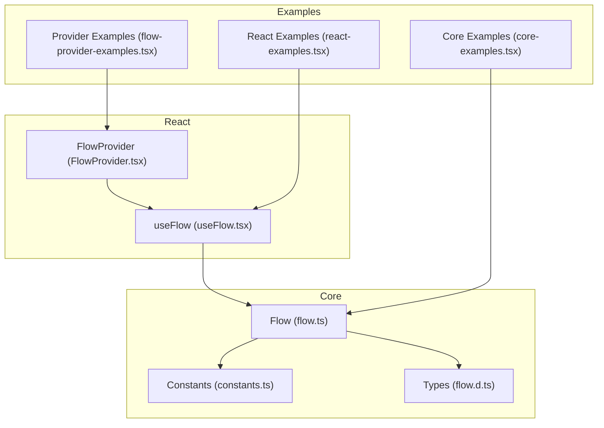
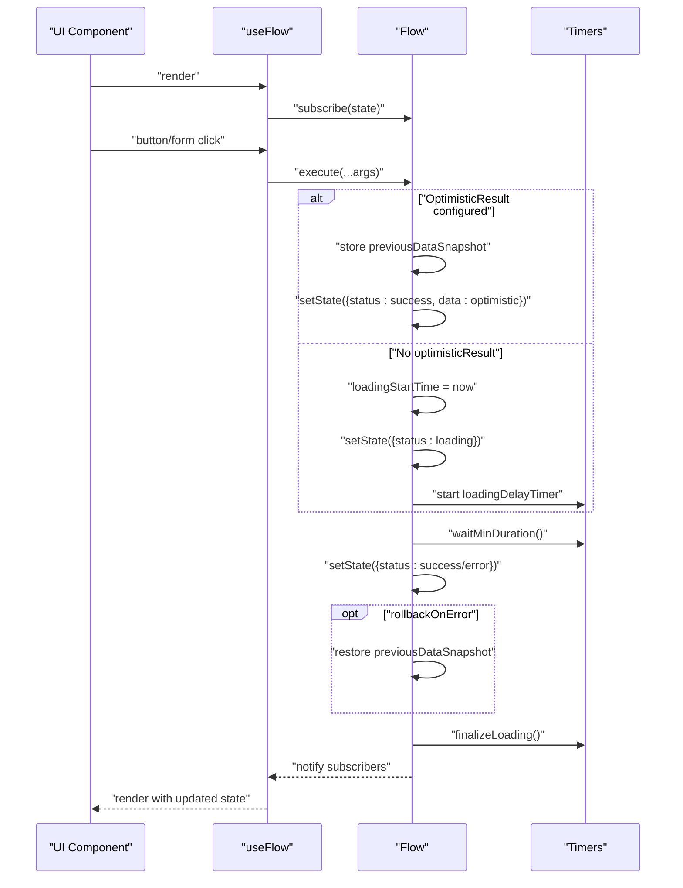
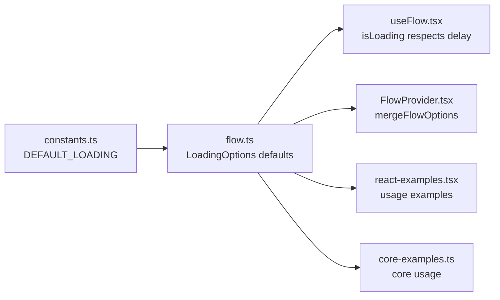

# UX Optimizations

<cite>
**Referenced Files in This Document**
- [flow.ts](file://packages/core/src/flow.ts)
- [flow.d.ts](file://packages/core/src/flow.d.ts)
- [constants.ts](file://packages/core/src/constants.ts)
- [useFlow.tsx](file://packages/react/src/useFlow.tsx)
- [FlowProvider.tsx](file://packages/react/src/FlowProvider.tsx)
- [react-examples.tsx](file://examples/react/react-examples.tsx)
- [flow-provider-examples.tsx](file://examples/react/flow-provider-examples.tsx)
- [core-examples.ts](file://examples/basic/core-examples.ts)
- [README.md](file://README.md)
- [packages/core/README.md](file://packages/core/README.md)
- [packages/react/README.md](file://packages/react/README.md)
</cite>

## Table of Contents

1. [Introduction](#introduction)
2. [Project Structure](#project-structure)
3. [Core Components](#core-components)
4. [Architecture Overview](#architecture-overview)
5. [Detailed Component Analysis](#detailed-component-analysis)
6. [Dependency Analysis](#dependency-analysis)
7. [Performance Considerations](#performance-considerations)
8. [Troubleshooting Guide](#troubleshooting-guide)
9. [Conclusion](#conclusion)
10. [Appendices](#appendices)

## Introduction

This document focuses on user experience (UX) optimization features provided by the AsyncFlowState library. It explains how to configure and use:

- LoadingOptions for minimum loading time and delay to prevent UI flashes
- OptimisticResult for instant success feedback with automatic rollback on errors
- Progress tracking mechanisms
- Loading delay prevention and minimum duration enforcement
- The relationship between UX timing, user perception, and actual operation duration

It also includes practical examples, best practices, and guidance for smooth user interactions.

## Project Structure

The UX optimization features are implemented in the core engine and exposed through React helpers and providers. The key areas are:

- Core Flow engine with LoadingOptions, optimistic updates, and progress tracking
- React useFlow hook that surfaces UX controls and accessibility helpers
- FlowProvider for global configuration and merging local/global options

**Diagram sources**

- [flow.ts](file://packages/core/src/flow.ts#L207-L783)
- [constants.ts](file://packages/core/src/constants.ts#L1-L51)
- [flow.d.ts](file://packages/core/src/flow.d.ts#L1-L177)
- [useFlow.tsx](file://packages/react/src/useFlow.tsx#L1-L281)
- [FlowProvider.tsx](file://packages/react/src/FlowProvider.tsx#L1-L139)
- [react-examples.tsx](file://examples/react/react-examples.tsx#L1-L491)
- [flow-provider-examples.tsx](file://examples/react/flow-provider-examples.tsx#L1-L368)
- [core-examples.ts](file://examples/basic/core-examples.ts#L1-L221)

**Section sources**

- [README.md](file://README.md#L1-L224)
- [packages/core/README.md](file://packages/core/README.md#L1-L134)
- [packages/react/README.md](file://packages/react/README.md#L1-L212)

## Core Components

This section documents the UX-related configuration and behavior in the Flow engine and React helpers.

- LoadingOptions
  - minDuration: Minimum time in milliseconds to remain in the loading state, preventing UI flashes for fast actions.
  - delay: Delay in milliseconds before switching to the loading status, preventing spinners for near-instant actions.
  - Defaults are provided by constants.

- OptimisticResult
  - Static value or dynamic function to compute an immediate result while the action is still executing.
  - RollbackOnError: Controls whether optimistic data is automatically reverted on error.

- Progress Tracking
  - Built-in progress state (0–100) and manual setter during long-running operations.

- UX Helpers
  - isLoading getter respects delay so UI does not flicker for very fast operations.
  - waitMinDuration enforces minimum duration after success or error.

**Section sources**

- [flow.ts](file://packages/core/src/flow.ts#L88-L160)
- [flow.ts](file://packages/core/src/flow.ts#L319-L341)
- [flow.ts](file://packages/core/src/flow.ts#L519-L528)
- [flow.ts](file://packages/core/src/flow.ts#L720-L730)
- [constants.ts](file://packages/core/src/constants.ts#L22-L27)
- [flow.d.ts](file://packages/core/src/flow.d.ts#L49-L79)
- [useFlow.tsx](file://packages/react/src/useFlow.tsx#L259-L260)

## Architecture Overview

The UX optimization pipeline integrates core Flow logic with React helpers and global configuration.

**Diagram sources**

- [flow.ts](file://packages/core/src/flow.ts#L436-L531)
- [flow.ts](file://packages/core/src/flow.ts#L540-L607)
- [flow.ts](file://packages/core/src/flow.ts#L714-L730)
- [useFlow.tsx](file://packages/react/src/useFlow.tsx#L251-L253)

## Detailed Component Analysis

### LoadingOptions: minDuration and delay

- Purpose
  - minDuration ensures the loading indicator remains visible for a minimum time, preventing the UI from flashing when operations complete quickly.
  - delay prevents the loading state from appearing for very fast operations, avoiding unnecessary spinner flicker.

- Implementation highlights
  - delay handling: A timer delays switching to loading until the threshold is exceeded. During this delay, isLoading returns false to keep UI stable.
  - minDuration enforcement: After success or error, the engine waits until the minimum duration has elapsed before finalizing the state.

- Defaults
  - Both minDuration and delay default to zero, allowing fine-grained control per flow.

- Practical usage
  - Configure globally via FlowProvider or locally per flow.
  - Typical values: delay around 150–200 ms and minDuration around 300–500 ms for smoother UX.

**Section sources**

- [flow.ts](file://packages/core/src/flow.ts#L88-L94)
- [flow.ts](file://packages/core/src/flow.ts#L519-L528)
- [flow.ts](file://packages/core/src/flow.ts#L720-L730)
- [constants.ts](file://packages/core/src/constants.ts#L22-L27)
- [FlowProvider.tsx](file://packages/react/src/FlowProvider.tsx#L109-L115)
- [react-examples.tsx](file://examples/react/react-examples.tsx#L434-L436)
- [flow-provider-examples.tsx](file://examples/react/flow-provider-examples.tsx#L165-L168)

### OptimisticResult: instant feedback with automatic rollback

- Purpose
  - Provide immediate UI feedback upon user action, improving perceived responsiveness.
  - Automatically revert optimistic changes on error when rollbackOnError is enabled.

- Implementation highlights
  - Stores a snapshot of previous data before starting execution.
  - Applies optimisticResult immediately if configured; otherwise proceeds to loading.
  - On success, clears the snapshot; on error, restores previous data if rollback is enabled.

- Configuration
  - optimisticResult: static value or function receiving previous data and arguments.
  - rollbackOnError: defaults to true; can be disabled if desired.

- Practical usage
  - Ideal for actions like toggling likes, updating counters, or partial profile edits.

**Section sources**

- [flow.ts](file://packages/core/src/flow.ts#L481-L511)
- [flow.ts](file://packages/core/src/flow.ts#L577-L596)
- [flow.ts](file://packages/core/src/flow.ts#L239-L241)
- [flow.ts](file://packages/core/src/flow.ts#L149-L159)
- [flow.d.ts](file://packages/core/src/flow.d.ts#L149-L159)
- [react-examples.tsx](file://examples/react/react-examples.tsx#L108-L115)
- [core-examples.ts](file://examples/basic/core-examples.ts#L88-L94)

### Progress Tracking Mechanisms

- Built-in progress
  - Flow exposes a numeric progress property (0–100) and a setter that only applies while loading.
  - Progress values are clamped to the allowed range.

- Practical usage
  - Call setProgress periodically during long-running operations to reflect real-time progress.
  - Combine with minDuration to ensure users see meaningful progress for a minimum time.

**Section sources**

- [flow.ts](file://packages/core/src/flow.ts#L319-L341)
- [flow.ts](file://packages/core/src/flow.ts#L335-L341)
- [react-examples.tsx](file://examples/react/react-examples.tsx#L307-L373)

### Loading Delay Prevention and Minimum Duration Enforcement

- Delay prevention
  - When delay is configured, the engine starts a timer before transitioning to loading. During this period, isLoading remains false to avoid UI flicker.

- Minimum duration enforcement
  - After success or error, the engine calculates elapsed time since loading started and waits for the remainder of minDuration if applicable.

- UX timing relationship
  - delay influences user perception by hiding spinners for fast actions.
  - minDuration ensures users see loading states long enough to feel responsive, even if the actual operation was quick.

**Section sources**

- [flow.ts](file://packages/core/src/flow.ts#L519-L528)
- [flow.ts](file://packages/core/src/flow.ts#L720-L730)
- [flow.ts](file://packages/core/src/flow.ts#L305-L307)

### Relationship Between UX Timing, User Perception, and Actual Operation Duration

- User perception
  - Users prefer consistent, predictable feedback. Too frequent loading flashes reduce trust; too short loading times can feel unresponsive.
  - delay and minDuration balance these concerns.

- Actual operation duration
  - minDuration ensures the UI reflects a minimum perceived duration regardless of actual speed.
  - delay prevents UI churn for near-instant operations.

- Best practices
  - Use delay to hide spinners for sub-200 ms operations.
  - Use minDuration to ensure loading persists for at least 300–500 ms when shown.
  - Combine with progress for long-running tasks.

**Section sources**

- [packages/core/README.md](file://packages/core/README.md#L51-L65)
- [packages/react/README.md](file://packages/react/README.md#L150-L163)

### Examples of UX Configuration, Progress Monitoring, and Best Practices

- Global UX polish via FlowProvider
  - Configure minDuration and delay globally for consistent UX across the app.
  - Override per flow when needed for special cases.

- Local UX configuration
  - Apply minDuration and delay per flow for specific actions.
  - Use optimisticResult for instant feedback on idempotent actions.

- Progress monitoring
  - Use setProgress during long-running operations to keep users informed.
  - Combine with minDuration to ensure progress is visible for a meaningful time.

- Best practices
  - Prefer optimistic updates for idempotent, fast operations.
  - Always enable rollbackOnError for optimistic updates.
  - Use FlowProvider for global defaults and local overrides for exceptions.

**Section sources**

- [flow-provider-examples.tsx](file://examples/react/flow-provider-examples.tsx#L161-L178)
- [react-examples.tsx](file://examples/react/react-examples.tsx#L434-L436)
- [react-examples.tsx](file://examples/react/react-examples.tsx#L307-L373)
- [core-examples.ts](file://examples/basic/core-examples.ts#L88-L94)

## Dependency Analysis

The UX features depend on core Flow state management, timers, and React helpers.

**Diagram sources**

- [constants.ts](file://packages/core/src/constants.ts#L22-L27)
- [flow.ts](file://packages/core/src/flow.ts#L519-L528)
- [flow.ts](file://packages/core/src/flow.ts#L88-L94)
- [useFlow.tsx](file://packages/react/src/useFlow.tsx#L259-L260)
- [FlowProvider.tsx](file://packages/react/src/FlowProvider.tsx#L109-L115)
- [react-examples.tsx](file://examples/react/react-examples.tsx#L434-L436)
- [core-examples.ts](file://examples/basic/core-examples.ts#L88-L94)

**Section sources**

- [flow.ts](file://packages/core/src/flow.ts#L88-L94)
- [flow.ts](file://packages/core/src/flow.ts#L519-L528)
- [FlowProvider.tsx](file://packages/react/src/FlowProvider.tsx#L109-L115)
- [useFlow.tsx](file://packages/react/src/useFlow.tsx#L259-L260)

## Performance Considerations

- Timers and state updates
  - Delay and minDuration rely on setTimeout; ensure values are reasonable to avoid excessive timer overhead.
- Optimistic updates
  - Keep optimistic data lightweight and deterministic to minimize memory and computation costs.
- Progress updates
  - Batch or throttle progress updates for long-running tasks to avoid frequent renders.

[No sources needed since this section provides general guidance]

## Troubleshooting Guide

- UI flickers or shows spinners for fast actions
  - Increase delay to hide spinners for sub-200 ms operations.
  - Verify isLoading respects delay; it returns false during the delay period.

- Loading state does not appear for slow operations
  - Ensure delay is not too high; adjust to reveal loading after a short delay.
  - Confirm minDuration is set appropriately to keep loading visible.

- Optimistic data not rolling back on error
  - Verify rollbackOnError is enabled (default true).
  - Ensure optimisticResult is configured; without it, there is no previous data to restore.

- Progress not updating
  - Call setProgress only while loading; it is ignored otherwise.
  - Ensure progress values are within 0–100.

**Section sources**

- [flow.ts](file://packages/core/src/flow.ts#L305-L307)
- [flow.ts](file://packages/core/src/flow.ts#L335-L341)
- [flow.ts](file://packages/core/src/flow.ts#L577-L596)
- [flow.ts](file://packages/core/src/flow.ts#L519-L528)

## Conclusion

AsyncFlowState’s UX optimization features—LoadingOptions (minDuration and delay), optimisticResult with automatic rollback, and progress tracking—provide a robust foundation for smooth, predictable user interactions. By combining global defaults via FlowProvider with targeted local configurations, teams can achieve consistent, polished UX across diverse async actions while maintaining simplicity and reliability.

[No sources needed since this section summarizes without analyzing specific files]

## Appendices

### API and Type Definitions

- LoadingOptions
  - minDuration: number
  - delay: number
- FlowOptions
  - loading?: LoadingOptions
  - optimisticResult?: TData | ((prevData, args) => TData)
  - rollbackOnError?: boolean

**Section sources**

- [flow.d.ts](file://packages/core/src/flow.d.ts#L49-L79)
- [flow.ts](file://packages/core/src/flow.ts#L88-L94)
- [flow.ts](file://packages/core/src/flow.ts#L149-L159)

### Example References

- Global UX polish with FlowProvider
  - [flow-provider-examples.tsx](file://examples/react/flow-provider-examples.tsx#L161-L178)
- Local UX configuration
  - [react-examples.tsx](file://examples/react/react-examples.tsx#L434-L436)
- Optimistic UI
  - [react-examples.tsx](file://examples/react/react-examples.tsx#L108-L115)
  - [core-examples.ts](file://examples/basic/core-examples.ts#L88-L94)
- Progress tracking
  - [react-examples.tsx](file://examples/react/react-examples.tsx#L307-L373)
