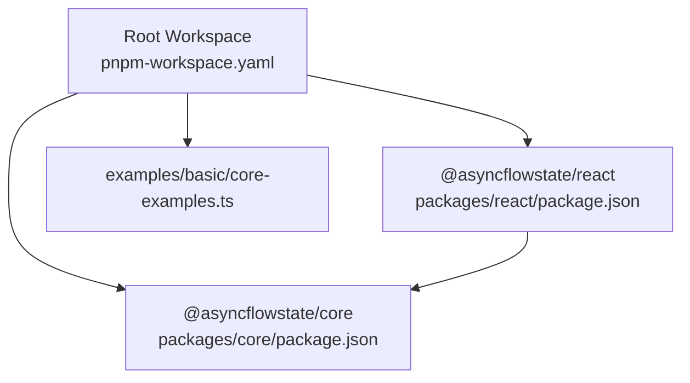
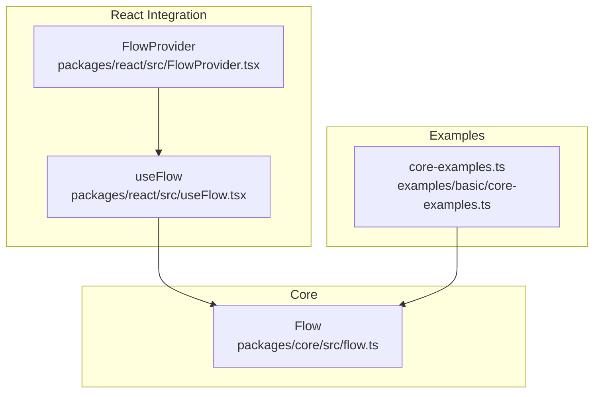
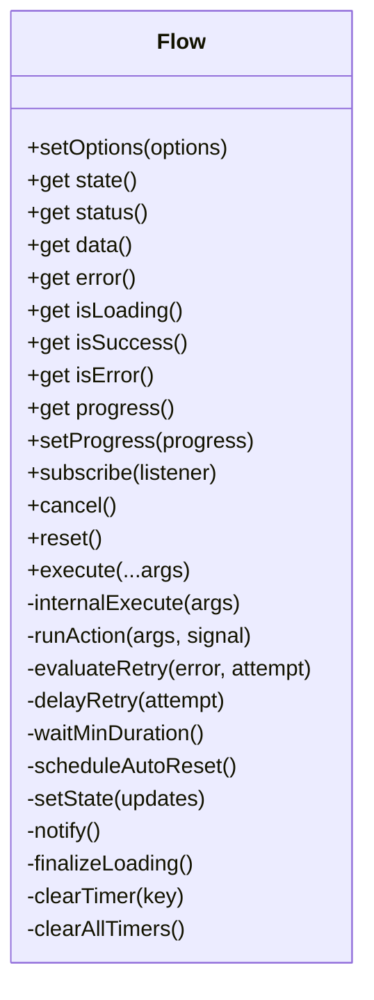
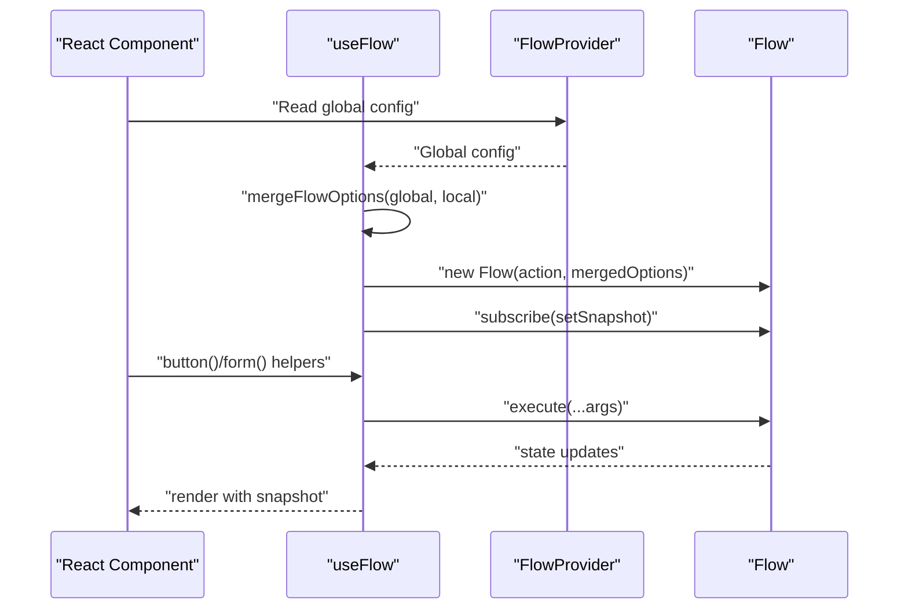
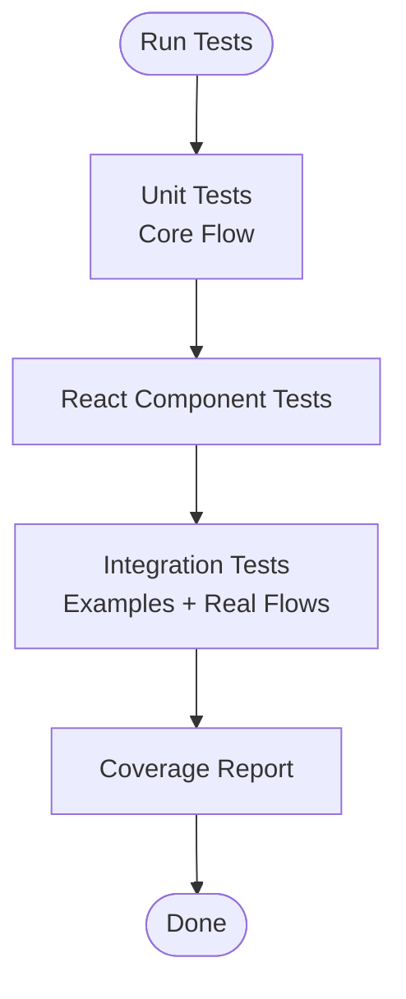
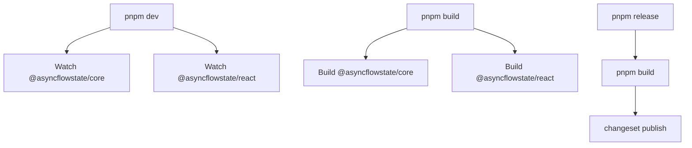
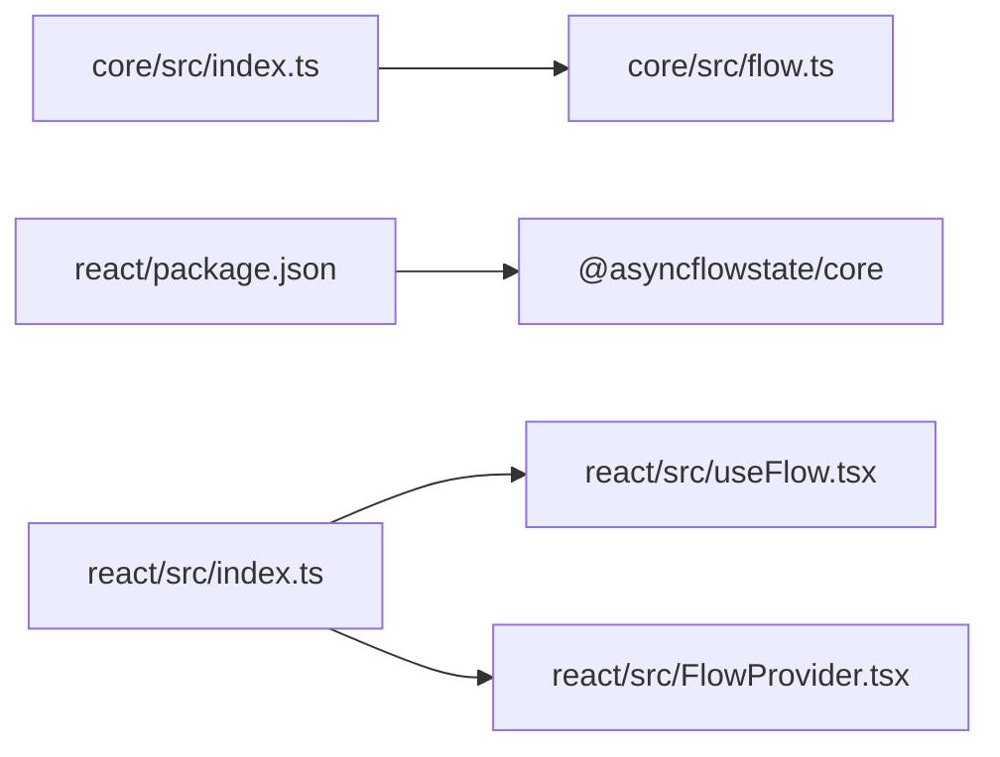

# Development and Testing

<cite>
**Referenced Files in This Document**
- [package.json](file://package.json)
- [pnpm-workspace.yaml](file://pnpm-workspace.yaml)
- [eslint.config.mjs](file://eslint.config.mjs)
- [.prettierrc](file://.prettierrc)
- [vitest.config.ts](file://vitest.config.ts)
- [CONTRIBUTING.md](file://CONTRIBUTING.md)
- [packages/core/package.json](file://packages/core/package.json)
- [packages/core/tsup.config.ts](file://packages/core/tsup.config.ts)
- [packages/core/tsconfig.json](file://packages/core/tsconfig.json)
- [packages/core/src/index.ts](file://packages/core/src/index.ts)
- [packages/core/src/flow.ts](file://packages/core/src/flow.ts)
- [packages/core/src/flow.test.ts](file://packages/core/src/flow.test.ts)
- [packages/react/package.json](file://packages/react/package.json)
- [packages/react/tsup.config.ts](file://packages/react/tsup.config.ts)
- [packages/react/src/index.ts](file://packages/react/src/index.ts)
- [packages/react/src/FlowProvider.tsx](file://packages/react/src/FlowProvider.tsx)
- [packages/react/src/useFlow.tsx](file://packages/react/src/useFlow.tsx)
- [examples/basic/core-examples.ts](file://examples/basic/core-examples.ts)
</cite>

## Table of Contents
1. [Introduction](#introduction)
2. [Project Structure](#project-structure)
3. [Core Components](#core-components)
4. [Architecture Overview](#architecture-overview)
5. [Detailed Component Analysis](#detailed-component-analysis)
6. [Dependency Analysis](#dependency-analysis)
7. [Performance Considerations](#performance-considerations)
8. [Troubleshooting Guide](#troubleshooting-guide)
9. [Conclusion](#conclusion)
10. [Appendices](#appendices)

## Introduction
This document provides comprehensive development and testing guidance for AsyncFlowState. It covers workspace configuration, build and publishing workflows, testing strategies (unit, component, integration), code quality standards, and best practices for developing and debugging async flows. The project is a monorepo using pnpm workspaces, TypeScript, tsup for builds, Vitest for testing, and ESLint/Prettier for code quality.

## Project Structure
AsyncFlowState is organized as a monorepo with two primary packages:
- @asyncflowstate/core: Framework-agnostic async flow engine
- @asyncflowstate/react: React hooks and components built on top of the core

Additional assets:
- examples: Basic usage examples for the core package
- Root tooling: ESLint, Prettier, Vitest, and pnpm workspace configuration

**Diagram sources**
- [pnpm-workspace.yaml](file://pnpm-workspace.yaml#L1-L3)
- [packages/core/package.json](file://packages/core/package.json#L1-L56)
- [packages/react/package.json](file://packages/react/package.json#L1-L68)
- [examples/basic/core-examples.ts](file://examples/basic/core-examples.ts#L1-L221)

**Section sources**
- [pnpm-workspace.yaml](file://pnpm-workspace.yaml#L1-L3)
- [package.json](file://package.json#L1-L70)

## Core Components
- Core Flow engine: Orchestrates async actions, manages state transitions, retry/backoff, concurrency, optimistic updates, and UX controls (minDuration, loading delay).
- React integration: useFlow hook and FlowProvider for React apps, including helpers for buttons and forms, accessibility, and global configuration merging.

Key implementation references:
- Core Flow class and state model: [packages/core/src/flow.ts](file://packages/core/src/flow.ts#L174-L709)
- React hook and provider: [packages/react/src/useFlow.tsx](file://packages/react/src/useFlow.tsx#L77-L281), [packages/react/src/FlowProvider.tsx](file://packages/react/src/FlowProvider.tsx#L50-L139)

**Section sources**
- [packages/core/src/flow.ts](file://packages/core/src/flow.ts#L174-L709)
- [packages/react/src/useFlow.tsx](file://packages/react/src/useFlow.tsx#L77-L281)
- [packages/react/src/FlowProvider.tsx](file://packages/react/src/FlowProvider.tsx#L50-L139)

## Architecture Overview
High-level architecture and data flow:
- Core Flow encapsulates async execution, state, timers, and retry logic.
- React useFlow wraps Flow, syncs state to React, exposes helpers, and integrates accessibility.
- FlowProvider supplies global defaults merged with local options.

**Diagram sources**
- [packages/core/src/flow.ts](file://packages/core/src/flow.ts#L174-L709)
- [packages/react/src/useFlow.tsx](file://packages/react/src/useFlow.tsx#L77-L281)
- [packages/react/src/FlowProvider.tsx](file://packages/react/src/FlowProvider.tsx#L50-L139)
- [examples/basic/core-examples.ts](file://examples/basic/core-examples.ts#L1-L221)

## Detailed Component Analysis

### Core Flow Engine
The Flow class manages:
- State machine: idle → loading → success/error
- Retry/backoff strategies (fixed/linear/exponential)
- Concurrency control (keep/restart/enqueue)
- Debounce/throttle
- Optimistic updates
- UX controls: minDuration, loading delay, auto-reset
- Subscription-based state notifications

**Diagram sources**
- [packages/core/src/flow.ts](file://packages/core/src/flow.ts#L174-L709)

**Section sources**
- [packages/core/src/flow.ts](file://packages/core/src/flow.ts#L174-L709)

### React useFlow Hook
useFlow integrates Flow with React:
- Merges global FlowProvider config with local options
- Synchronizes Flow state to React via useState/useEffect
- Provides helpers: button(), form(), LiveRegion, errorRef, fieldErrors
- Accessibility: auto-focus on error, ARIA live region announcements

**Diagram sources**
- [packages/react/src/useFlow.tsx](file://packages/react/src/useFlow.tsx#L77-L281)
- [packages/react/src/FlowProvider.tsx](file://packages/react/src/FlowProvider.tsx#L50-L139)
- [packages/core/src/flow.ts](file://packages/core/src/flow.ts#L174-L709)

**Section sources**
- [packages/react/src/useFlow.tsx](file://packages/react/src/useFlow.tsx#L77-L281)
- [packages/react/src/FlowProvider.tsx](file://packages/react/src/FlowProvider.tsx#L50-L139)

### Testing Strategy and Patterns
- Unit tests: Core Flow behavior, concurrency, retries, UX controls, and error handling.
- Component tests: React integration via React hooks testing utilities and Vitest.
- Integration tests: End-to-end scenarios using examples and real async flows.

Vitest configuration:
- Environment: jsdom
- Globals enabled

Test coverage and commands:
- Run tests: pnpm test
- Run once: pnpm test:run
- With coverage: pnpm test:coverage

Example tests:
- Core Flow tests: [packages/core/src/flow.test.ts](file://packages/core/src/flow.test.ts#L1-L363)
- React component tests: [packages/react/src/FlowProvider.test.tsx](file://packages/react/src/FlowProvider.test.tsx), [packages/react/src/useFlow.test.tsx](file://packages/react/src/useFlow.test.tsx)

**Diagram sources**
- [vitest.config.ts](file://vitest.config.ts#L1-L10)
- [packages/core/src/flow.test.ts](file://packages/core/src/flow.test.ts#L1-L363)

**Section sources**
- [vitest.config.ts](file://vitest.config.ts#L1-L10)
- [CONTRIBUTING.md](file://CONTRIBUTING.md#L75-L86)
- [packages/core/src/flow.test.ts](file://packages/core/src/flow.test.ts#L1-L363)

### Build Configuration and Publishing Workflow
- Monorepo: pnpm workspaces configured for packages/*
- Core build: tsup with dual output (CJS/ESM), declaration files, sourcemaps, ES2020 target
- React build: tsup with external dependencies (react, react-dom, @asyncflowstate/core)
- Root scripts: build, build:core, build:react, dev, typecheck, lint, format, clean, prepublishOnly, changesets

**Diagram sources**
- [package.json](file://package.json#L25-L43)
- [packages/core/tsup.config.ts](file://packages/core/tsup.config.ts#L1-L14)
- [packages/react/tsup.config.ts](file://packages/react/tsup.config.ts#L1-L15)

**Section sources**
- [package.json](file://package.json#L25-L43)
- [packages/core/tsup.config.ts](file://packages/core/tsup.config.ts#L1-L14)
- [packages/react/tsup.config.ts](file://packages/react/tsup.config.ts#L1-L15)
- [CONTRIBUTING.md](file://CONTRIBUTING.md#L270-L291)

### Code Quality Standards
- ESLint: TypeScript recommended, @typescript-eslint rules, React and React Hooks rules, ignores dist, node_modules, turbo, coverage, next
- Prettier: semicolons, double quotes, trailing commas, 80 char width, tabs vs spaces, LF line endings

Commands:
- Check: pnpm lint, pnpm format:check
- Fix: pnpm lint:fix, pnpm format

**Section sources**
- [eslint.config.mjs](file://eslint.config.mjs#L1-L92)
- [.prettierrc](file://.prettierrc#L1-L14)
- [CONTRIBUTING.md](file://CONTRIBUTING.md#L88-L120)

### Contribution Guidelines
- Prerequisites: Node >= 16, pnpm >= 10.28.0
- Setup: pnpm install, pnpm build
- Development: pnpm dev (watch all), pnpm build (all), pnpm test (watch)
- Quality gate: pnpm typecheck, pnpm lint, pnpm test:run, pnpm build
- Versioning: Changesets CLI, version-packages, release

**Section sources**
- [CONTRIBUTING.md](file://CONTRIBUTING.md#L19-L86)
- [CONTRIBUTING.md](file://CONTRIBUTING.md#L226-L291)

## Dependency Analysis
- Core package exports index re-exports flow, constants, and error utilities.
- React package depends on @asyncflowstate/core (workspace), peerDependencies on react and react-dom, and builds with external dependencies declared.

**Diagram sources**
- [packages/core/src/index.ts](file://packages/core/src/index.ts#L1-L4)
- [packages/core/src/flow.ts](file://packages/core/src/flow.ts#L1-L709)
- [packages/react/src/index.ts](file://packages/react/src/index.ts#L1-L3)
- [packages/react/package.json](file://packages/react/package.json#L58-L66)

**Section sources**
- [packages/core/src/index.ts](file://packages/core/src/index.ts#L1-L4)
- [packages/react/src/index.ts](file://packages/react/src/index.ts#L1-L3)
- [packages/react/package.json](file://packages/react/package.json#L58-L66)

## Performance Considerations
- Minimize UI flashes: Use loading delay and minDuration to stabilize perceived loading states.
- Control network pressure: Use debounce/throttle and concurrency strategies (keep/restart/enqueue).
- Retry backoff: Prefer exponential backoff for transient failures.
- Avoid unnecessary renders: useFlow memoizes return values and refs to prevent re-renders.

[No sources needed since this section provides general guidance]

## Troubleshooting Guide
Common issues and debugging tips:
- Asynchronous flows not reflecting state: Ensure subscriptions are attached and state snapshots are used in React components.
- Retries not working: Verify retry options (maxAttempts, delay, backoff) and shouldRetry predicate.
- Double submissions: Confirm concurrency option is set appropriately.
- Cancellation behavior: Cancellation resets state to idle; verify AbortController usage and timers cleared.
- Testing async timing: Use Vitest fake timers to advance time deterministically in tests.

**Section sources**
- [packages/core/src/flow.ts](file://packages/core/src/flow.ts#L425-L533)
- [packages/core/src/flow.test.ts](file://packages/core/src/flow.test.ts#L283-L361)
- [vitest.config.ts](file://vitest.config.ts#L1-L10)

## Conclusion
AsyncFlowState provides a robust, framework-agnostic core engine and ergonomic React integration. The monorepo setup, tsup builds, and comprehensive testing suite enable reliable development and publishing. Adhering to the established code quality standards and testing patterns ensures maintainability and predictable behavior across async flows.

[No sources needed since this section summarizes without analyzing specific files]

## Appendices

### Development Setup Checklist
- Install dependencies: pnpm install
- Build all packages: pnpm build
- Run development watchers: pnpm dev
- Verify types: pnpm typecheck
- Lint and format: pnpm lint, pnpm format:check
- Run tests: pnpm test or pnpm test:run

**Section sources**
- [CONTRIBUTING.md](file://CONTRIBUTING.md#L26-L86)
- [package.json](file://package.json#L25-L43)

### Example Usage References
- Core examples: [examples/basic/core-examples.ts](file://examples/basic/core-examples.ts#L1-L221)

**Section sources**
- [examples/basic/core-examples.ts](file://examples/basic/core-examples.ts#L1-L221)