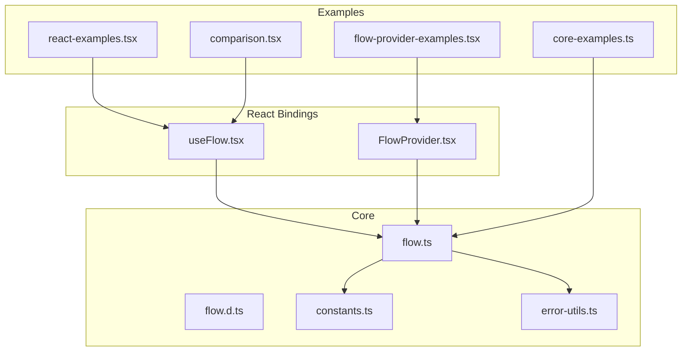
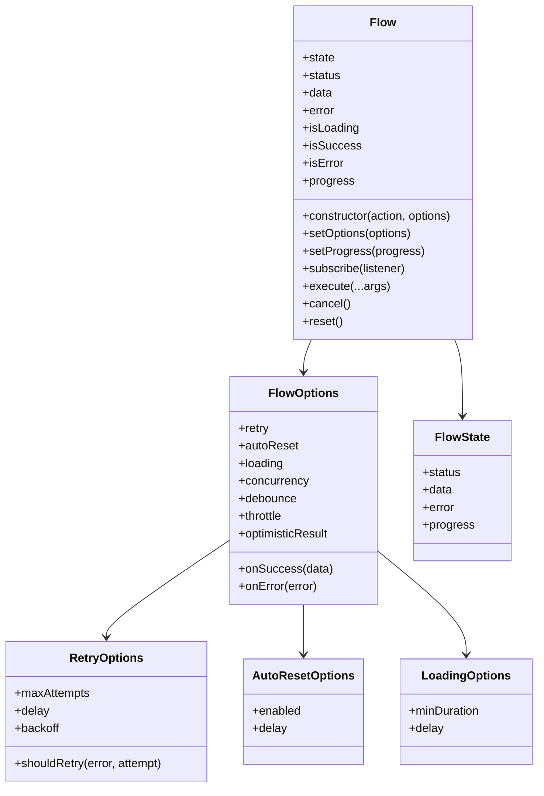
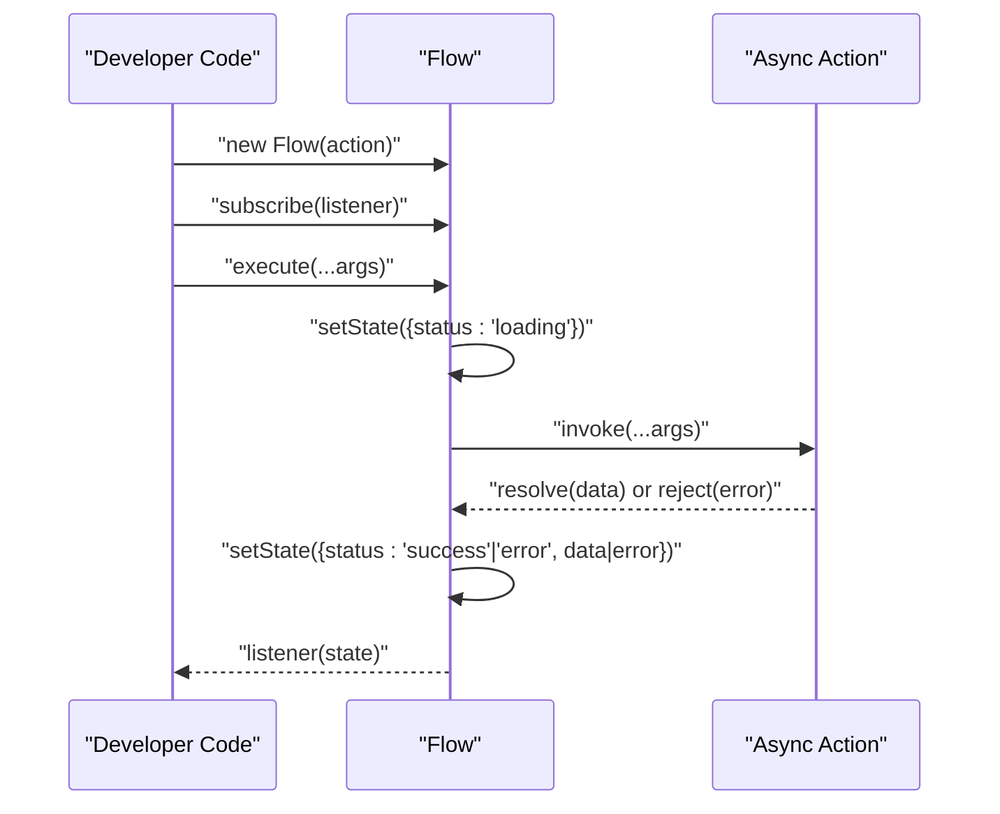
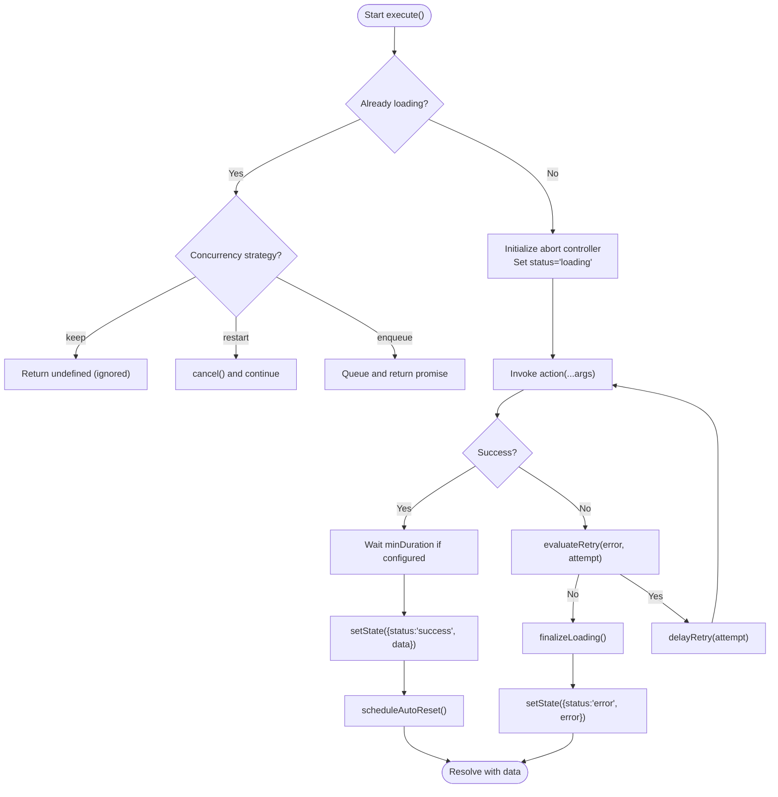
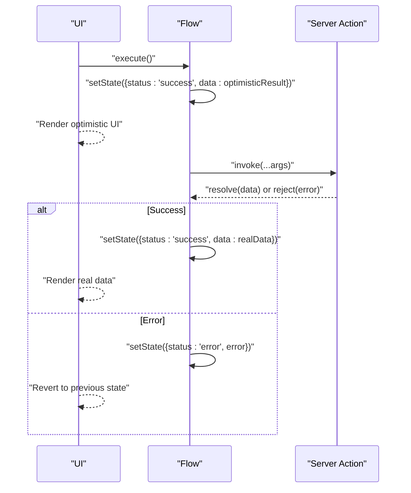
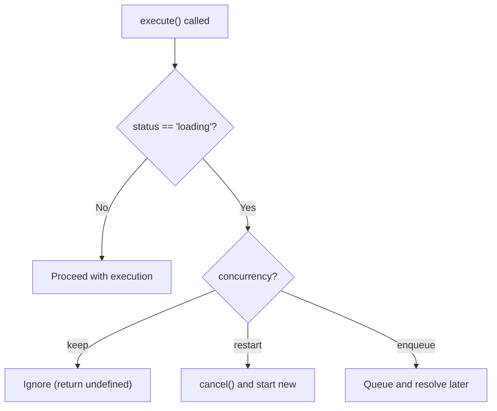
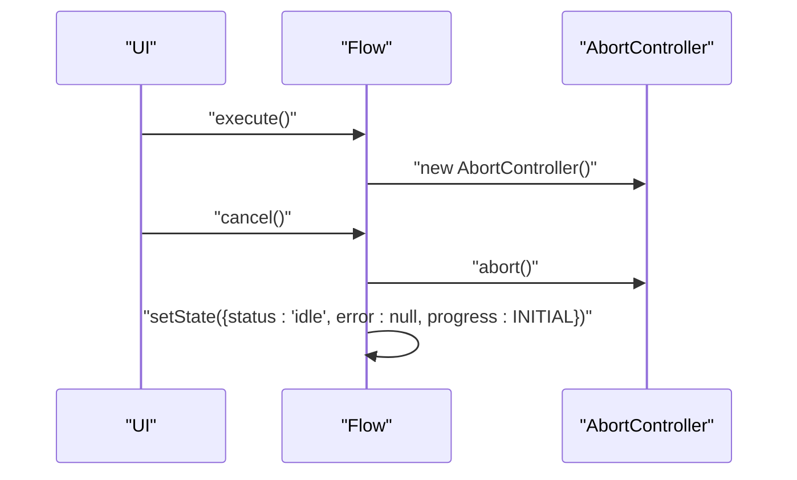
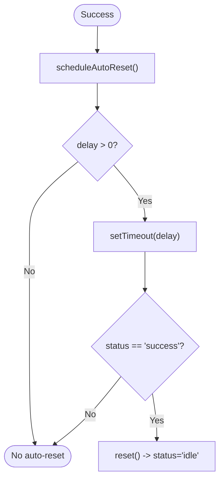
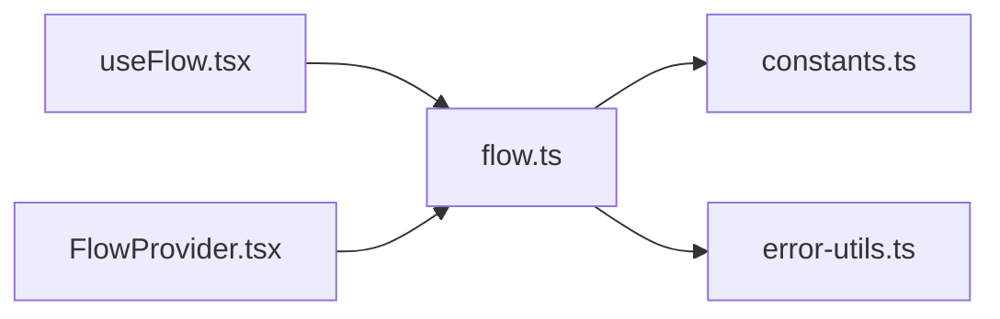

# Basic Usage Examples

<cite>
**Referenced Files in This Document**
- [flow.ts](file://packages/core/src/flow.ts)
- [flow.d.ts](file://packages/core/src/flow.d.ts)
- [constants.ts](file://packages/core/src/constants.ts)
- [error-utils.ts](file://packages/core/src/error-utils.ts)
- [useFlow.tsx](file://packages/react/src/useFlow.tsx)
- [FlowProvider.tsx](file://packages/react/src/FlowProvider.tsx)
- [core-examples.ts](file://examples/basic/core-examples.ts)
- [react-examples.tsx](file://examples/react/react-examples.tsx)
- [comparison.tsx](file://examples/react/comparison.tsx)
- [flow-provider-examples.tsx](file://examples/react/flow-provider-examples.tsx)
- [README.md](file://README.md)
- [packages/core/README.md](file://packages/core/README.md)
- [packages/react/README.md](file://packages/react/README.md)
</cite>

## Table of Contents

1. [Introduction](#introduction)
2. [Project Structure](#project-structure)
3. [Core Components](#core-components)
4. [Architecture Overview](#architecture-overview)
5. [Detailed Component Analysis](#detailed-component-analysis)
6. [Dependency Analysis](#dependency-analysis)
7. [Performance Considerations](#performance-considerations)
8. [Troubleshooting Guide](#troubleshooting-guide)
9. [Conclusion](#conclusion)
10. [Appendices](#appendices)

## Introduction

This document provides comprehensive basic usage examples for AsyncFlowState’s core functionality. It focuses on:

- Simple async action execution
- Retry logic with backoff strategies
- Optimistic UI patterns with instant feedback
- Double submission prevention
- Cancellation handling
- Auto-reset functionality

It also documents the Flow class constructor, execute method, subscribe mechanism, and state management patterns, with practical use cases and integration guidance for different application architectures.

## Project Structure

The repository is organized into:

- Core engine: a framework-agnostic package that orchestrates async actions and UI states
- React bindings: hooks and helpers for React applications
- Examples: runnable examples demonstrating patterns and best practices

**Diagram sources**

- [flow.ts](file://packages/core/src/flow.ts#L1-L709)
- [flow.d.ts](file://packages/core/src/flow.d.ts#L1-L177)
- [constants.ts](file://packages/core/src/constants.ts#L1-L51)
- [error-utils.ts](file://packages/core/src/error-utils.ts#L1-L207)
- [useFlow.tsx](file://packages/react/src/useFlow.tsx#L1-L281)
- [FlowProvider.tsx](file://packages/react/src/FlowProvider.tsx#L1-L139)
- [core-examples.ts](file://examples/basic/core-examples.ts#L1-L221)
- [react-examples.tsx](file://examples/react/react-examples.tsx#L1-L491)
- [comparison.tsx](file://examples/react/comparison.tsx#L1-L246)
- [flow-provider-examples.tsx](file://examples/react/flow-provider-examples.tsx#L1-L368)

**Section sources**

- [README.md](file://README.md#L1-L224)
- [packages/core/README.md](file://packages/core/README.md#L1-L134)
- [packages/react/README.md](file://packages/react/README.md#L1-L212)

## Core Components

This section documents the Flow class and its core APIs, along with related types and utilities.

- Flow class
  - Purpose: Orchestrates async actions and manages UI states (idle, loading, success, error), retries, concurrency, optimistic updates, and UX polish.
  - Constructor: new Flow(action, options?)
  - Key properties: status, data, error, progress, isLoading, state
  - Key methods: execute(), cancel(), reset(), setProgress(), subscribe()

- FlowOptions and related types
  - RetryOptions: maxAttempts, delay, backoff, shouldRetry
  - AutoResetOptions: enabled, delay
  - LoadingOptions: minDuration, delay
  - FlowErrorType and FlowError utilities for categorizing and handling errors

- Constants and defaults
  - DEFAULT_RETRY, DEFAULT_LOADING, DEFAULT_CONCURRENCY, PROGRESS, BACKOFF_MULTIPLIER

- FlowAction and FlowState types define the shape of async actions and state snapshots.

**Section sources**

- [flow.ts](file://packages/core/src/flow.ts#L174-L223)
- [flow.ts](file://packages/core/src/flow.ts#L246-L286)
- [flow.ts](file://packages/core/src/flow.ts#L325-L332)
- [flow.ts](file://packages/core/src/flow.ts#L400-L415)
- [flow.ts](file://packages/core/src/flow.ts#L482-L533)
- [flow.ts](file://packages/core/src/flow.ts#L625-L638)
- [flow.ts](file://packages/core/src/flow.ts#L646-L668)
- [flow.d.ts](file://packages/core/src/flow.d.ts#L84-L176)
- [constants.ts](file://packages/core/src/constants.ts#L10-L50)
- [error-utils.ts](file://packages/core/src/error-utils.ts#L26-L39)

## Architecture Overview

The core engine is framework-agnostic and can be used in vanilla JavaScript environments. React bindings provide convenience hooks and helpers that wrap the core Flow instance.

**Diagram sources**

- [flow.ts](file://packages/core/src/flow.ts#L174-L223)
- [flow.ts](file://packages/core/src/flow.ts#L99-L127)
- [flow.ts](file://packages/core/src/flow.ts#L21-L30)
- [flow.d.ts](file://packages/core/src/flow.d.ts#L84-L176)

## Detailed Component Analysis

### Simple Async Action

- Goal: Execute an async action and observe state changes.
- Implementation steps:
  - Create a Flow with an async action.
  - Subscribe to state changes to react to status transitions.
  - Call execute() with required arguments.
  - Observe data or error after completion.
- Practical use cases:
  - Login/logout flows
  - Fetching user data
  - Saving preferences

**Diagram sources**

- [flow.ts](file://packages/core/src/flow.ts#L425-L473)
- [flow.ts](file://packages/core/src/flow.ts#L482-L533)
- [core-examples.ts](file://examples/basic/core-examples.ts#L14-L38)

**Section sources**

- [core-examples.ts](file://examples/basic/core-examples.ts#L14-L38)
- [flow.ts](file://packages/core/src/flow.ts#L325-L332)
- [flow.ts](file://packages/core/src/flow.ts#L400-L415)

### Retry Logic with Backoff Strategies

- Goal: Automatically retry failed actions with configurable delay and backoff.
- Implementation steps:
  - Configure retry options: maxAttempts, delay, backoff.
  - Optionally provide shouldRetry to customize retry decisions.
  - Observe onSuccess and onError callbacks.
- Backoff strategies:
  - Fixed: constant delay between attempts
  - Linear: delay increases linearly with attempt number
  - Exponential: delay grows exponentially with attempt number
- Practical use cases:
  - Flaky network APIs
  - Batch processing with transient failures

**Diagram sources**

- [flow.ts](file://packages/core/src/flow.ts#L425-L473)
- [flow.ts](file://packages/core/src/flow.ts#L482-L533)
- [flow.ts](file://packages/core/src/flow.ts#L603-L638)
- [constants.ts](file://packages/core/src/constants.ts#L47-L50)

**Section sources**

- [core-examples.ts](file://examples/basic/core-examples.ts#L44-L73)
- [flow.ts](file://packages/core/src/flow.ts#L603-L638)
- [constants.ts](file://packages/core/src/constants.ts#L47-L50)

### Optimistic UI Patterns with Instant Feedback

- Goal: Provide immediate UI feedback while the server action completes.
- Implementation steps:
  - Provide optimisticResult in FlowOptions.
  - On success, the UI reflects optimistic data instantly.
  - On error, revert to previous state or handle accordingly.
- Practical use cases:
  - Like buttons
  - Updating profile fields
  - Voting systems

**Diagram sources**

- [flow.ts](file://packages/core/src/flow.ts#L446-L452)
- [flow.ts](file://packages/core/src/flow.ts#L502-L508)
- [core-examples.ts](file://examples/basic/core-examples.ts#L79-L111)

**Section sources**

- [core-examples.ts](file://examples/basic/core-examples.ts#L79-L111)
- [flow.ts](file://packages/core/src/flow.ts#L446-L452)

### Double Submission Prevention Techniques

- Goal: Prevent multiple simultaneous executions when the action is already running.
- Implementation steps:
  - Choose concurrency strategy: keep (default) ignores new requests while loading.
  - Alternatively, restart cancels the current execution and starts a new one.
  - Enqueue queues subsequent executions to run after the current one completes.
- Practical use cases:
  - Rapid button clicks
  - Search inputs with debounce/throttle
  - Bulk operations

**Diagram sources**

- [flow.ts](file://packages/core/src/flow.ts#L429-L440)
- [flow.ts](file://packages/core/src/flow.ts#L587-L592)

**Section sources**

- [core-examples.ts](file://examples/basic/core-examples.ts#L117-L144)
- [flow.ts](file://packages/core/src/flow.ts#L429-L440)

### Cancellation Handling

- Goal: Allow users to cancel long-running actions and reset the flow to idle.
- Implementation steps:
  - Call cancel() to abort the current action and reset state.
  - Internally uses AbortController to signal cancellation.
- Practical use cases:
  - Long-running uploads
  - Search operations with frequent keystrokes
  - Background sync tasks

**Diagram sources**

- [flow.ts](file://packages/core/src/flow.ts#L344-L351)
- [flow.ts](file://packages/core/src/flow.ts#L442-L443)

**Section sources**

- [core-examples.ts](file://examples/basic/core-examples.ts#L150-L177)
- [flow.ts](file://packages/core/src/flow.ts#L344-L351)

### Auto-Reset Functionality

- Goal: Automatically reset the flow to idle after a successful execution.
- Implementation steps:
  - Configure autoReset with enabled=true and delay (milliseconds).
  - On success, schedule a timer to reset the state after delay.
- Practical use cases:
  - Success notifications
  - One-time success states
  - Clean-up after successful operations

**Diagram sources**

- [flow.ts](file://packages/core/src/flow.ts#L502-L508)
- [flow.ts](file://packages/core/src/flow.ts#L658-L668)

**Section sources**

- [core-examples.ts](file://examples/basic/core-examples.ts#L183-L203)
- [flow.ts](file://packages/core/src/flow.ts#L658-L668)

### Flow Class Constructor, Execute Method, Subscribe Mechanism, and State Management

- Constructor
  - new Flow(action, options?)
  - Initializes internal state, timers, listeners, and abort controller.
- Execute method
  - Handles debounce, throttle, and concurrency logic before invoking the internal execution pipeline.
  - Returns a Promise that resolves with the action result or undefined if cancelled/debounced.
- Subscribe mechanism
  - Adds a listener to receive state snapshots on changes.
  - Returns an unsubscribe function to remove the listener.
- State management
  - Internal state includes status, data, error, and progress.
  - setState() updates state and notifies listeners.
  - notify() broadcasts state to all subscribers.

**Section sources**

- [flow.ts](file://packages/core/src/flow.ts#L220-L223)
- [flow.ts](file://packages/core/src/flow.ts#L400-L415)
- [flow.ts](file://packages/core/src/flow.ts#L325-L332)
- [flow.ts](file://packages/core/src/flow.ts#L672-L679)

### React Integration Patterns

- useFlow hook
  - Wraps a Flow instance and synchronizes React state with Flow state snapshots.
  - Provides helpers: button(), form(), LiveRegion, errorRef, fieldErrors.
  - Merges global and local options via FlowProvider.
- FlowProvider
  - Shares global configuration across all flows within the provider.
  - Supports overrideMode for merge vs replace behavior.
- Practical patterns
  - Login forms, like buttons, delete confirmations, profile editing, file uploads, search with debouncing, and advanced forms with validation and accessibility.

**Section sources**

- [useFlow.tsx](file://packages/react/src/useFlow.tsx#L77-L281)
- [FlowProvider.tsx](file://packages/react/src/FlowProvider.tsx#L50-L139)
- [react-examples.tsx](file://examples/react/react-examples.tsx#L14-L491)
- [comparison.tsx](file://examples/react/comparison.tsx#L75-L93)
- [flow-provider-examples.tsx](file://examples/react/flow-provider-examples.tsx#L59-L95)

## Dependency Analysis

The core Flow class depends on constants and error utilities for default behavior and error categorization. React bindings depend on the core Flow and provide additional helpers and accessibility features.

**Diagram sources**

- [flow.ts](file://packages/core/src/flow.ts#L1-L7)
- [constants.ts](file://packages/core/src/constants.ts#L1-L51)
- [error-utils.ts](file://packages/core/src/error-utils.ts#L1-L7)
- [useFlow.tsx](file://packages/react/src/useFlow.tsx#L9-L10)
- [FlowProvider.tsx](file://packages/react/src/FlowProvider.tsx#L2-L2)

**Section sources**

- [flow.ts](file://packages/core/src/flow.ts#L1-L7)
- [error-utils.ts](file://packages/core/src/error-utils.ts#L1-L7)

## Performance Considerations

- Loading perception
  - Use loading.minDuration to prevent UI flashes for fast actions.
  - Use loading.delay to avoid showing spinners for near-instant actions.
- Concurrency
  - Choose concurrency strategy based on UX needs: keep for safety, restart for responsiveness, enqueue for ordered processing.
- Retry backoff
  - Prefer exponential backoff for resilient systems; adjust maxAttempts and delay to balance user experience and resource usage.
- Progress tracking
  - For long-running tasks, periodically call setProgress() to provide meaningful feedback.

[No sources needed since this section provides general guidance]

## Troubleshooting Guide

- Double submissions
  - Ensure concurrency is set appropriately. keep prevents new requests while loading; restart cancels and starts fresh; enqueue queues subsequent executions.
- Retries not triggering
  - Verify retry.maxAttempts > 1 and retry.shouldRetry if custom logic is needed.
  - Confirm that error types are considered retryable by default (network, timeout, server).
- Optimistic UI not reverting
  - Ensure onError is handled to revert UI state or rely on the engine’s behavior to set error state.
- Cancellation not working
  - Call cancel() before the action completes; ensure the underlying action respects AbortSignal.
- Auto-reset not happening
  - Confirm autoReset.enabled is true and delay is greater than 0; verify that the status is success when the timer fires.

**Section sources**

- [flow.ts](file://packages/core/src/flow.ts#L429-L440)
- [flow.ts](file://packages/core/src/flow.ts#L603-L638)
- [error-utils.ts](file://packages/core/src/error-utils.ts#L130-L143)
- [flow.ts](file://packages/core/src/flow.ts#L344-L351)
- [flow.ts](file://packages/core/src/flow.ts#L658-L668)

## Conclusion

AsyncFlowState provides a robust, framework-agnostic foundation for managing async UI behavior. By leveraging the Flow class and React bindings, developers can eliminate boilerplate, prevent common pitfalls like double submissions and inconsistent loading UX, and build resilient, accessible applications with minimal effort.

[No sources needed since this section summarizes without analyzing specific files]

## Appendices

### Practical Use Cases and Integration Guidance

- Vanilla JavaScript apps
  - Use @asyncflowstate/core directly to manage async actions and UI states.
  - Subscribe to state changes and drive UI updates.
- React apps
  - Use @asyncflowstate/react for hooks and helpers.
  - Combine useFlow with FlowProvider for global configuration and consistency.
- Hybrid architectures
  - Core engine can be used alongside state managers (Redux, Zustand) or data-fetching libraries (React Query, SWR) to orchestrate action behavior independently.

**Section sources**

- [packages/core/README.md](file://packages/core/README.md#L1-L134)
- [packages/react/README.md](file://packages/react/README.md#L1-L212)
- [README.md](file://README.md#L187-L198)
