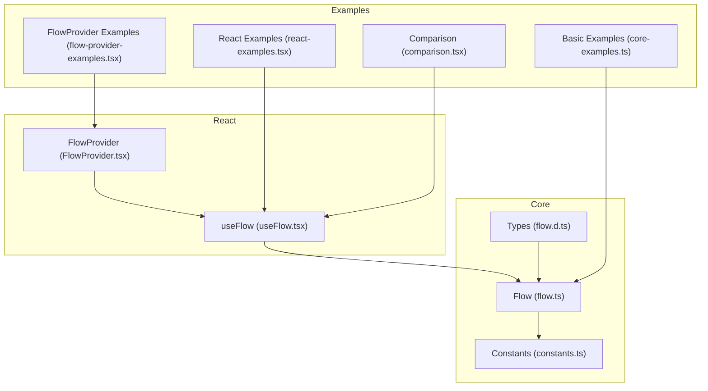
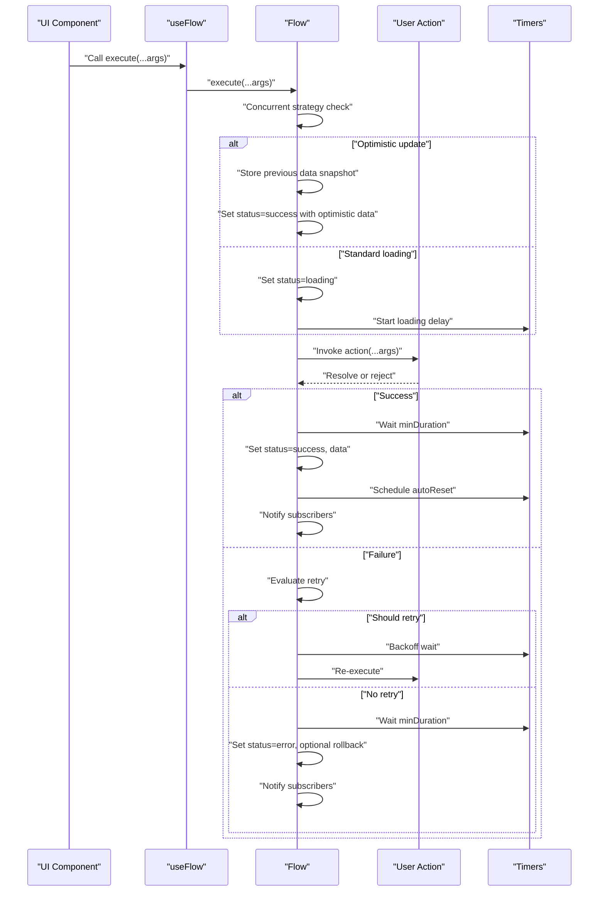
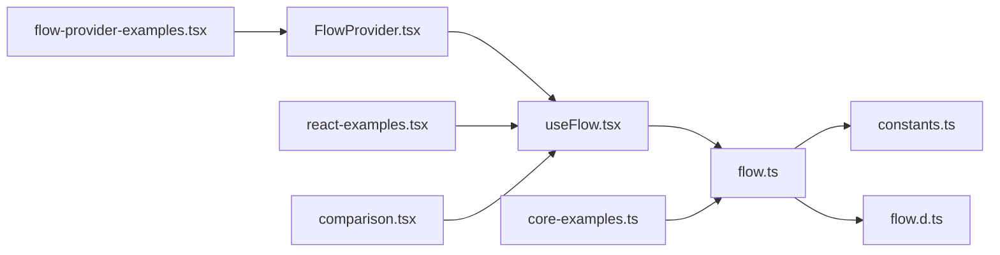

# Common Usage Patterns

<cite>
**Referenced Files in This Document**
- [flow.ts](file://packages/core/src/flow.ts)
- [constants.ts](file://packages/core/src/constants.ts)
- [flow.d.ts](file://packages/core/src/flow.d.ts)
- [useFlow.tsx](file://packages/react/src/useFlow.tsx)
- [FlowProvider.tsx](file://packages/react/src/FlowProvider.tsx)
- [core-examples.ts](file://examples/basic/core-examples.ts)
- [react-examples.tsx](file://examples/react/react-examples.tsx)
- [comparison.tsx](file://examples/react/comparison.tsx)
- [flow-provider-examples.tsx](file://examples/react/flow-provider-examples.tsx)
- [flow.test.ts](file://packages/core/src/flow.test.ts)
- [useFlow.test.tsx](file://packages/react/src/useFlow.test.tsx)
</cite>

## Table of Contents
1. [Introduction](#introduction)
2. [Project Structure](#project-structure)
3. [Core Components](#core-components)
4. [Architecture Overview](#architecture-overview)
5. [Detailed Component Analysis](#detailed-component-analysis)
6. [Dependency Analysis](#dependency-analysis)
7. [Performance Considerations](#performance-considerations)
8. [Troubleshooting Guide](#troubleshooting-guide)
9. [Conclusion](#conclusion)
10. [Appendices](#appendices)

## Introduction
This document explains common AsyncFlowState usage patterns and best practices for managing async UI behavior. It covers loading state management, optimistic updates, retry configuration, auto-reset, double-click prevention, cancellation, error handling, progress tracking, and accessibility. Practical examples are referenced from the repository’s core and React packages, along with runnable examples and tests.

## Project Structure
AsyncFlowState consists of:
- Core engine for async behavior orchestration
- React hooks and accessibility helpers
- Examples and tests demonstrating patterns

**Diagram sources**
- [flow.ts](file://packages/core/src/flow.ts#L207-L770)
- [constants.ts](file://packages/core/src/constants.ts#L1-L51)
- [flow.d.ts](file://packages/core/src/flow.d.ts#L84-L177)
- [useFlow.tsx](file://packages/react/src/useFlow.tsx#L77-L281)
- [FlowProvider.tsx](file://packages/react/src/FlowProvider.tsx#L50-L139)
- [core-examples.ts](file://examples/basic/core-examples.ts#L1-L221)
- [react-examples.tsx](file://examples/react/react-examples.tsx#L1-L491)
- [comparison.tsx](file://examples/react/comparison.tsx#L1-L246)
- [flow-provider-examples.tsx](file://examples/react/flow-provider-examples.tsx#L1-L368)

**Section sources**
- [flow.ts](file://packages/core/src/flow.ts#L1-L770)
- [useFlow.tsx](file://packages/react/src/useFlow.tsx#L1-L281)
- [FlowProvider.tsx](file://packages/react/src/FlowProvider.tsx#L1-L139)
- [core-examples.ts](file://examples/basic/core-examples.ts#L1-L221)
- [react-examples.tsx](file://examples/react/react-examples.tsx#L1-L491)
- [comparison.tsx](file://examples/react/comparison.tsx#L1-L246)
- [flow-provider-examples.tsx](file://examples/react/flow-provider-examples.tsx#L1-L368)

## Core Components
- Flow: Orchestrates async actions, manages state transitions, retries, concurrency, optimistic updates, progress, and timers.
- useFlow: React hook that wraps Flow, syncs state to React, exposes helpers (button, form), and provides accessibility features.
- FlowProvider: Provides global defaults for flows via context merging.

Key capabilities:
- Loading state with minDuration and delay
- Retry with fixed/linear/exponential backoff
- Optimistic updates with optional rollback
- Auto-reset after success
- Concurrency control (keep/restart/enqueue)
- Debounce/throttle
- Progress tracking
- Cancellation and reset
- Accessibility helpers (LiveRegion, focus management)

**Section sources**
- [flow.ts](file://packages/core/src/flow.ts#L207-L770)
- [useFlow.tsx](file://packages/react/src/useFlow.tsx#L77-L281)
- [FlowProvider.tsx](file://packages/react/src/FlowProvider.tsx#L50-L139)

## Architecture Overview
The runtime flow of a typical async action:

**Diagram sources**
- [flow.ts](file://packages/core/src/flow.ts#L436-L594)
- [useFlow.tsx](file://packages/react/src/useFlow.tsx#L251-L280)

## Detailed Component Analysis

### Loading State Management Patterns
Patterns:
- Respect loading delay to avoid UI flicker for fast actions.
- Enforce minimum loading duration to ensure perceived responsiveness.
- isLoading respects delay so UI can remain idle until delay elapses.

Practical usage:
- Configure loading.minDuration and loading.delay to smooth UX.
- Use flow.isLoading (respecting delay) in components.

References:
- [flow.ts](file://packages/core/src/flow.ts#L507-L515)
- [flow.ts](file://packages/core/src/flow.ts#L707-L717)
- [flow.ts](file://packages/core/src/flow.ts#L305-L307)
- [flow.test.ts](file://packages/core/src/flow.test.ts#L292-L334)

**Section sources**
- [flow.ts](file://packages/core/src/flow.ts#L305-L307)
- [flow.ts](file://packages/core/src/flow.ts#L507-L515)
- [flow.ts](file://packages/core/src/flow.ts#L707-L717)
- [flow.test.ts](file://packages/core/src/flow.test.ts#L292-L334)

### Optimistic Update Implementations
Patterns:
- Provide optimisticResult as static data or a function deriving optimistic data from previous data and arguments.
- On success, real data replaces optimistic data; on error, optional rollback restores previous data.

Practical usage:
- Use optimisticResult for instant UI feedback (e.g., toggling like counts).
- Combine with rollbackOnError to revert on failure.

References:
- [flow.ts](file://packages/core/src/flow.ts#L482-L498)
- [flow.ts](file://packages/core/src/flow.ts#L567-L582)
- [react-examples.tsx](file://examples/react/react-examples.tsx#L93-L128)
- [core-examples.ts](file://examples/basic/core-examples.ts#L76-L111)

**Section sources**
- [flow.ts](file://packages/core/src/flow.ts#L482-L498)
- [flow.ts](file://packages/core/src/flow.ts#L567-L582)
- [react-examples.tsx](file://examples/react/react-examples.tsx#L93-L128)
- [core-examples.ts](file://examples/basic/core-examples.ts#L76-L111)

### Retry Configuration Strategies
Patterns:
- Configure maxAttempts, delay, and backoff (fixed, linear, exponential).
- Optionally provide shouldRetry to conditionally retry based on error and attempt count.

Practical usage:
- Use exponential backoff for network resilience.
- Use shouldRetry to avoid retrying on non-transient errors.

References:
- [flow.ts](file://packages/core/src/flow.ts#L664-L679)
- [flow.ts](file://packages/core/src/flow.ts#L686-L699)
- [flow.ts](file://packages/core/src/flow.ts#L527-L594)
- [flow.test.ts](file://packages/core/src/flow.test.ts#L243-L281)
- [flow-provider-examples.tsx](file://examples/react/flow-provider-examples.tsx#L302-L314)

**Section sources**
- [flow.ts](file://packages/core/src/flow.ts#L664-L679)
- [flow.ts](file://packages/core/src/flow.ts#L686-L699)
- [flow.ts](file://packages/core/src/flow.ts#L527-L594)
- [flow.test.ts](file://packages/core/src/flow.test.ts#L243-L281)
- [flow-provider-examples.tsx](file://examples/react/flow-provider-examples.tsx#L302-L314)

### Auto-Reset Functionality
Patterns:
- Enable autoReset with a delay to automatically return to idle after success.
- Useful for ephemeral success notifications.

Practical usage:
- Set autoReset.enabled=true and delay to desired milliseconds.
- Combine with success callbacks for UX polish.

References:
- [flow.ts](file://packages/core/src/flow.ts#L719-L729)
- [flow.ts](file://packages/core/src/flow.ts#L547-L555)
- [react-examples.tsx](file://examples/react/react-examples.tsx#L186-L245)

**Section sources**
- [flow.ts](file://packages/core/src/flow.ts#L719-L729)
- [flow.ts](file://packages/core/src/flow.ts#L547-L555)
- [react-examples.tsx](file://examples/react/react-examples.tsx#L186-L245)

### Double-Click Prevention Techniques
Patterns:
- Use concurrency: "keep" to ignore subsequent calls while loading.
- Use concurrency: "restart" to cancel the current execution and start a new one.

Practical usage:
- Prefer "keep" for safety (race-free) and "restart" when immediate replacement is desired.

References:
- [flow.ts](file://packages/core/src/flow.ts#L464-L476)
- [flow.test.ts](file://packages/core/src/flow.test.ts#L87-L110)
- [flow.test.ts](file://packages/core/src/flow.test.ts#L112-L138)

**Section sources**
- [flow.ts](file://packages/core/src/flow.ts#L464-L476)
- [flow.test.ts](file://packages/core/src/flow.test.ts#L87-L110)
- [flow.test.ts](file://packages/core/src/flow.test.ts#L112-L138)

### Cancellation Handling
Patterns:
- Call cancel() to abort the current execution and reset to idle.
- Cancel clears timers and sets status to idle.

Practical usage:
- Provide explicit cancel controls for long-running actions.
- Use cancel in cleanup or before navigation.

References:
- [flow.ts](file://packages/core/src/flow.ts#L380-L387)
- [flow.ts](file://packages/core/src/flow.ts#L762-L768)
- [core-examples.ts](file://examples/basic/core-examples.ts#L146-L177)

**Section sources**
- [flow.ts](file://packages/core/src/flow.ts#L380-L387)
- [flow.ts](file://packages/core/src/flow.ts#L762-L768)
- [core-examples.ts](file://examples/basic/core-examples.ts#L146-L177)

### Error Handling Patterns
Patterns:
- onSuccess/onError callbacks for side effects.
- Rollback of optimistic updates on error when rollbackOnError is true.
- Access error via flow.error and use errorRef for focus management.

Practical usage:
- Centralize error handling with FlowProvider.onError.
- Use fieldErrors for form validation errors.

References:
- [flow.ts](file://packages/core/src/flow.ts#L547-L588)
- [useFlow.tsx](file://packages/react/src/useFlow.tsx#L126-L141)
- [useFlow.tsx](file://packages/react/src/useFlow.tsx#L200-L249)
- [flow-provider-examples.tsx](file://examples/react/flow-provider-examples.tsx#L282-L294)

**Section sources**
- [flow.ts](file://packages/core/src/flow.ts#L547-L588)
- [useFlow.tsx](file://packages/react/src/useFlow.tsx#L126-L141)
- [useFlow.tsx](file://packages/react/src/useFlow.tsx#L200-L249)
- [flow-provider-examples.tsx](file://examples/react/flow-provider-examples.tsx#L282-L294)

### Progress Tracking Implementations
Patterns:
- setProgress(value) to manually report progress while loading.
- Progress is constrained between 0 and 100.

Practical usage:
- Report progress for long-running tasks (uploads, multi-step operations).

References:
- [flow.ts](file://packages/core/src/flow.ts#L335-L341)
- [flow.ts](file://packages/core/src/flow.ts#L320-L322)
- [flow.test.ts](file://packages/core/src/flow.test.ts#L336-L345)

**Section sources**
- [flow.ts](file://packages/core/src/flow.ts#L335-L341)
- [flow.ts](file://packages/core/src/flow.ts#L320-L322)
- [flow.test.ts](file://packages/core/src/flow.test.ts#L336-L345)

### Accessibility Considerations
Patterns:
- LiveRegion component for screen reader announcements.
- errorRef to auto-focus error messages.
- button() helper sets disabled and aria-busy based on loading state.
- form() helper prevents default and supports validation.

Practical usage:
- Include LiveRegion in component tree for announcements.
- Use errorRef on error containers.
- Use button() and form() helpers for consistent accessibility.

References:
- [useFlow.tsx](file://packages/react/src/useFlow.tsx#L147-L168)
- [useFlow.tsx](file://packages/react/src/useFlow.tsx#L117-L124)
- [useFlow.tsx](file://packages/react/src/useFlow.tsx#L174-L194)
- [useFlow.tsx](file://packages/react/src/useFlow.tsx#L200-L249)
- [useFlow.test.tsx](file://packages/react/src/useFlow.test.tsx#L119-L140)

**Section sources**
- [useFlow.tsx](file://packages/react/src/useFlow.tsx#L147-L168)
- [useFlow.tsx](file://packages/react/src/useFlow.tsx#L117-L124)
- [useFlow.tsx](file://packages/react/src/useFlow.tsx#L174-L194)
- [useFlow.tsx](file://packages/react/src/useFlow.tsx#L200-L249)
- [useFlow.test.tsx](file://packages/react/src/useFlow.test.tsx#L119-L140)

### Combining Patterns for Complex Scenarios
Recommended combinations:
- Optimistic updates + auto-reset + retry: Provide instant feedback, resilient retries, and clean success state.
- Debounce/throttle + concurrency: Prevent excessive calls and race conditions.
- Progress + minDuration: Long-running actions benefit from progress reporting and perceived duration.
- Global FlowProvider + local overrides: Centralize defaults, override per-flow as needed.

References:
- [FlowProvider.tsx](file://packages/react/src/FlowProvider.tsx#L76-L138)
- [react-examples.tsx](file://examples/react/react-examples.tsx#L247-L301)
- [flow-provider-examples.tsx](file://examples/react/flow-provider-examples.tsx#L277-L335)

**Section sources**
- [FlowProvider.tsx](file://packages/react/src/FlowProvider.tsx#L76-L138)
- [react-examples.tsx](file://examples/react/react-examples.tsx#L247-L301)
- [flow-provider-examples.tsx](file://examples/react/flow-provider-examples.tsx#L277-L335)

### Common Pitfalls and How to Avoid Them
- Forgetting to handle loading.delay: UI may flicker for fast actions. Use loading.delay and minDuration together.
- Overusing concurrency: "restart" cancels previous actions; ensure it aligns with UX expectations.
- Not rolling back optimistic updates: Always enable rollbackOnError for critical data.
- Ignoring shouldRetry: Retrying non-transient errors wastes resources; implement shouldRetry.
- Not providing accessibility props: Use button(), form(), LiveRegion, and errorRef.

References:
- [flow.ts](file://packages/core/src/flow.ts#L507-L515)
- [flow.ts](file://packages/core/src/flow.ts#L464-L476)
- [flow.ts](file://packages/core/src/flow.ts#L567-L582)
- [flow.ts](file://packages/core/src/flow.ts#L664-L679)

**Section sources**
- [flow.ts](file://packages/core/src/flow.ts#L507-L515)
- [flow.ts](file://packages/core/src/flow.ts#L464-L476)
- [flow.ts](file://packages/core/src/flow.ts#L567-L582)
- [flow.ts](file://packages/core/src/flow.ts#L664-L679)

## Dependency Analysis
Relationships:
- useFlow depends on Flow and FlowProvider for configuration.
- Flow depends on constants for defaults and timers for UX control.
- Examples demonstrate usage patterns and test coverage.

**Diagram sources**
- [useFlow.tsx](file://packages/react/src/useFlow.tsx#L1-L281)
- [flow.ts](file://packages/core/src/flow.ts#L1-L770)
- [FlowProvider.tsx](file://packages/react/src/FlowProvider.tsx#L1-L139)
- [constants.ts](file://packages/core/src/constants.ts#L1-L51)
- [flow.d.ts](file://packages/core/src/flow.d.ts#L1-L177)
- [core-examples.ts](file://examples/basic/core-examples.ts#L1-L221)
- [react-examples.tsx](file://examples/react/react-examples.tsx#L1-L491)
- [comparison.tsx](file://examples/react/comparison.tsx#L1-L246)
- [flow-provider-examples.tsx](file://examples/react/flow-provider-examples.tsx#L1-L368)

**Section sources**
- [useFlow.tsx](file://packages/react/src/useFlow.tsx#L1-L281)
- [flow.ts](file://packages/core/src/flow.ts#L1-L770)
- [FlowProvider.tsx](file://packages/react/src/FlowProvider.tsx#L1-L139)
- [constants.ts](file://packages/core/src/constants.ts#L1-L51)
- [flow.d.ts](file://packages/core/src/flow.d.ts#L1-L177)
- [core-examples.ts](file://examples/basic/core-examples.ts#L1-L221)
- [react-examples.tsx](file://examples/react/react-examples.tsx#L1-L491)
- [comparison.tsx](file://examples/react/comparison.tsx#L1-L246)
- [flow-provider-examples.tsx](file://examples/react/flow-provider-examples.tsx#L1-L368)

## Performance Considerations
- Prefer minDuration and delay to avoid frequent UI state churn for fast actions.
- Use exponential backoff for retry to reduce load on failing systems.
- Debounce/throttle to limit rapid repeated calls.
- Avoid unnecessary re-renders by memoizing return values in useFlow.
- Use enqueue only when you need ordered execution; otherwise keep/restart reduces latency.

[No sources needed since this section provides general guidance]

## Troubleshooting Guide
- State not updating: Ensure you subscribe or use the React hook; verify listeners are retained.
- Double submissions still occur: Confirm concurrency is set to "keep" or "restart".
- Optimistic data not rolling back: Check rollbackOnError is true or omitted (default).
- Retries not firing: Verify retry.maxAttempts > 1 and shouldRetry conditions.
- Auto-reset not happening: Confirm autoReset.enabled and delay are set appropriately.
- Progress not visible: Ensure setProgress is called while status is loading and value is within bounds.

References:
- [flow.ts](file://packages/core/src/flow.ts#L361-L368)
- [flow.ts](file://packages/core/src/flow.ts#L464-L476)
- [flow.ts](file://packages/core/src/flow.ts#L567-L582)
- [flow.ts](file://packages/core/src/flow.ts#L664-L679)
- [flow.ts](file://packages/core/src/flow.ts#L719-L729)
- [flow.ts](file://packages/core/src/flow.ts#L335-L341)

**Section sources**
- [flow.ts](file://packages/core/src/flow.ts#L361-L368)
- [flow.ts](file://packages/core/src/flow.ts#L464-L476)
- [flow.ts](file://packages/core/src/flow.ts#L567-L582)
- [flow.ts](file://packages/core/src/flow.ts#L664-L679)
- [flow.ts](file://packages/core/src/flow.ts#L719-L729)
- [flow.ts](file://packages/core/src/flow.ts#L335-L341)

## Conclusion
AsyncFlowState provides a robust, framework-agnostic engine for consistent async UI behavior. By combining loading UX controls, retries, optimistic updates, auto-reset, concurrency, progress tracking, and accessibility helpers, teams can build reliable, user-friendly interactions with minimal boilerplate. Use FlowProvider for global defaults and override locally when needed. Leverage the included examples and tests as references for production-ready patterns.

[No sources needed since this section summarizes without analyzing specific files]

## Appendices

### Practical Example References
- Basic usage and patterns: [core-examples.ts](file://examples/basic/core-examples.ts#L1-L221)
- React hooks and helpers: [react-examples.tsx](file://examples/react/react-examples.tsx#L1-L491)
- Before/after comparisons: [comparison.tsx](file://examples/react/comparison.tsx#L1-L246)
- Global configuration with FlowProvider: [flow-provider-examples.tsx](file://examples/react/flow-provider-examples.tsx#L1-L368)

**Section sources**
- [core-examples.ts](file://examples/basic/core-examples.ts#L1-L221)
- [react-examples.tsx](file://examples/react/react-examples.tsx#L1-L491)
- [comparison.tsx](file://examples/react/comparison.tsx#L1-L246)
- [flow-provider-examples.tsx](file://examples/react/flow-provider-examples.tsx#L1-L368)