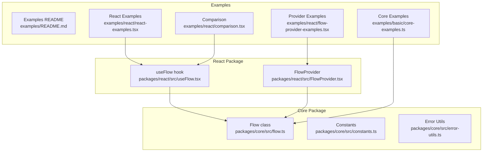
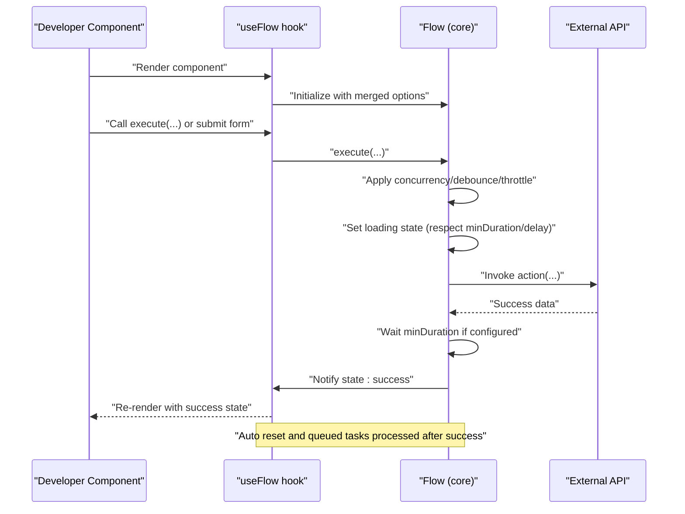
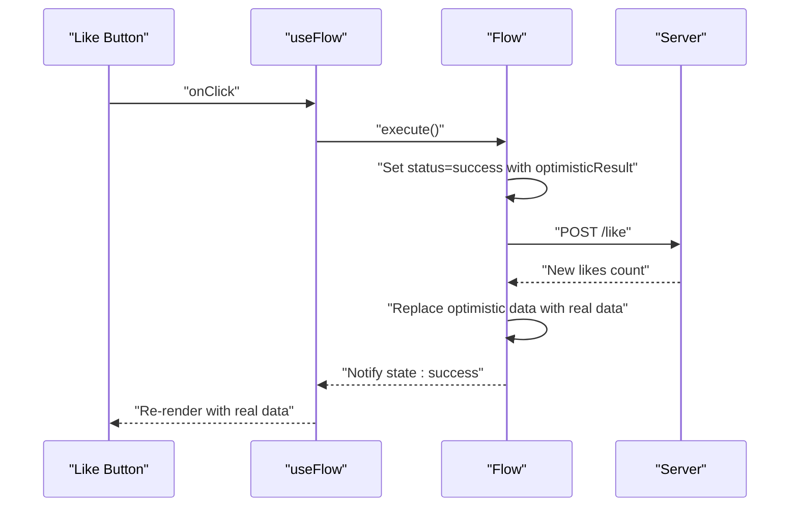
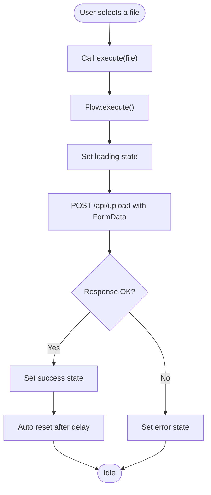
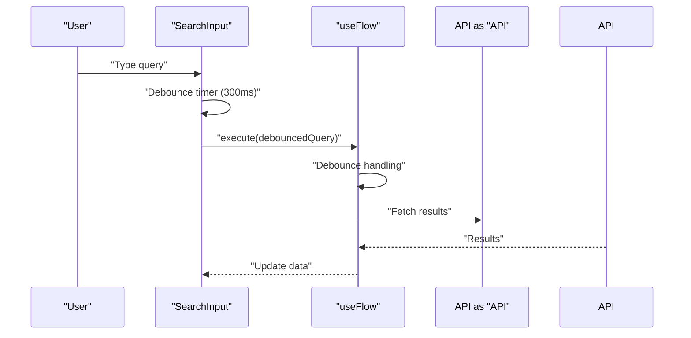
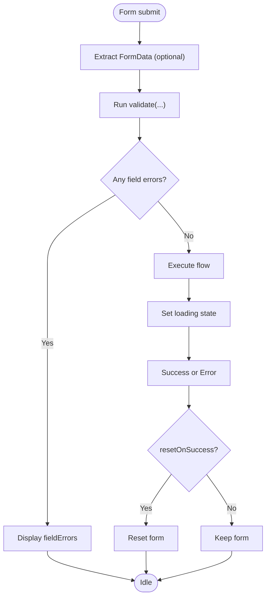
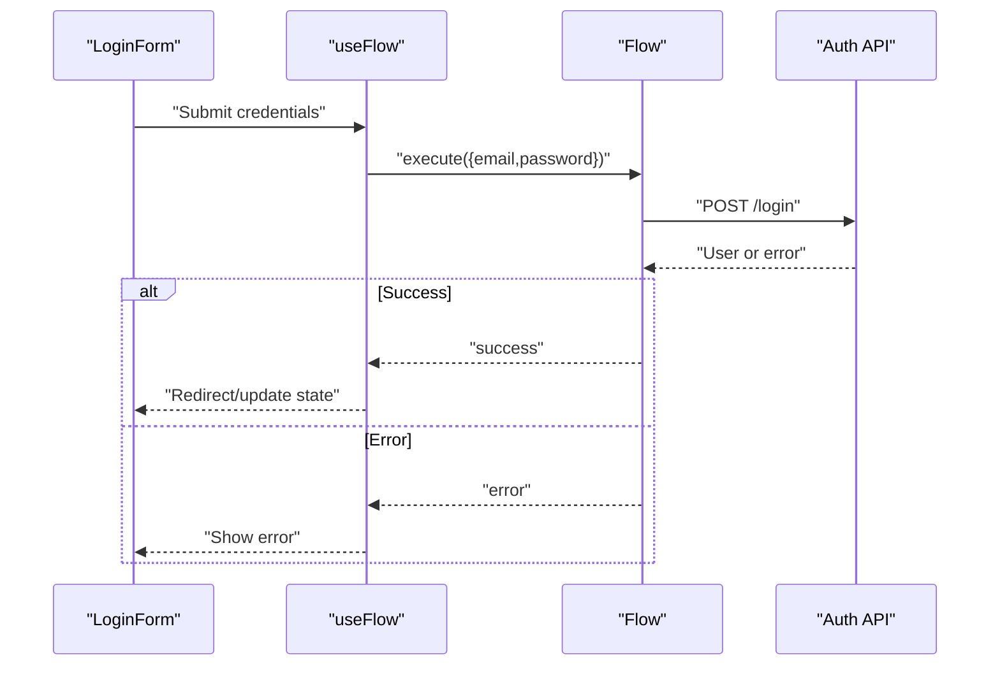
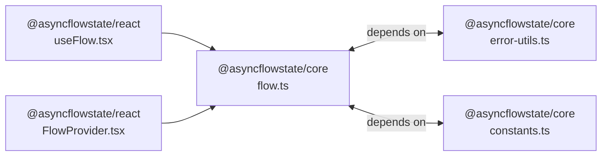

# Examples and Use Cases

<cite>
**Referenced Files in This Document**
- [README.md](file://README.md)
- [examples/README.md](file://examples/README.md)
- [examples/basic/core-examples.ts](file://examples/basic/core-examples.ts)
- [examples/react/react-examples.tsx](file://examples/react/react-examples.tsx)
- [examples/react/comparison.tsx](file://examples/react/comparison.tsx)
- [examples/react/flow-provider-examples.tsx](file://examples/react/flow-provider-examples.tsx)
- [packages/core/src/flow.ts](file://packages/core/src/flow.ts)
- [packages/core/src/constants.ts](file://packages/core/src/constants.ts)
- [packages/core/src/error-utils.ts](file://packages/core/src/error-utils.ts)
- [packages/react/src/useFlow.tsx](file://packages/react/src/useFlow.tsx)
- [packages/react/src/FlowProvider.tsx](file://packages/react/src/FlowProvider.tsx)
- [packages/core/package.json](file://packages/core/package.json)
- [packages/react/package.json](file://packages/react/package.json)
</cite>

## Table of Contents
1. [Introduction](#introduction)
2. [Project Structure](#project-structure)
3. [Core Components](#core-components)
4. [Architecture Overview](#architecture-overview)
5. [Detailed Component Analysis](#detailed-component-analysis)
6. [Dependency Analysis](#dependency-analysis)
7. [Performance Considerations](#performance-considerations)
8. [Troubleshooting Guide](#troubleshooting-guide)
9. [Conclusion](#conclusion)
10. [Appendices](#appendices)

## Introduction
This document provides comprehensive examples and use cases for AsyncFlowState, focusing on practical patterns for building robust async UI behaviors in both framework-agnostic and React environments. It covers basic usage (simple form submission, login/logout flows, error handling, and success states), advanced React patterns (optimistic UI, file uploads, debounced search, complex form validation, and external API integrations), and real-world scenarios (authentication flows, data editing interfaces, bulk operations, and progressive enhancement). Each example references the exact source files and line ranges so you can explore the implementation details.

## Project Structure
The repository is organized into:
- Core package (@asyncflowstate/core): A framework-agnostic Flow class and supporting utilities for async state orchestration.
- React package (@asyncflowstate/react): React hooks and helpers built on top of the core to streamline async UI behavior in React apps.
- Examples: runnable TypeScript examples demonstrating core and React patterns, plus comparisons and provider-based configurations.

**Diagram sources**
- [packages/core/src/flow.ts](file://packages/core/src/flow.ts#L174-L709)
- [packages/core/src/constants.ts](file://packages/core/src/constants.ts#L1-L51)
- [packages/core/src/error-utils.ts](file://packages/core/src/error-utils.ts#L1-L207)
- [packages/react/src/useFlow.tsx](file://packages/react/src/useFlow.tsx#L77-L281)
- [packages/react/src/FlowProvider.tsx](file://packages/react/src/FlowProvider.tsx#L50-L139)
- [examples/README.md](file://examples/README.md#L1-L162)
- [examples/basic/core-examples.ts](file://examples/basic/core-examples.ts#L1-L221)
- [examples/react/react-examples.tsx](file://examples/react/react-examples.tsx#L1-L491)
- [examples/react/comparison.tsx](file://examples/react/comparison.tsx#L1-L246)
- [examples/react/flow-provider-examples.tsx](file://examples/react/flow-provider-examples.tsx#L1-L368)

**Section sources**
- [examples/README.md](file://examples/README.md#L1-L162)
- [packages/core/package.json](file://packages/core/package.json#L1-L56)
- [packages/react/package.json](file://packages/react/package.json#L1-L68)

## Core Components
- Flow (Core): Orchestrates async actions, manages loading/success/error states, supports retries, concurrency, debouncing/throttling, optimistic updates, and progress reporting. See [Flow class](file://packages/core/src/flow.ts#L174-L709).
- useFlow (React): React hook that wraps Flow, exposes a reactive state snapshot, and provides helpers for buttons and forms. See [useFlow hook](file://packages/react/src/useFlow.tsx#L77-L281).
- FlowProvider (React): Provides global configuration for flows via context and merges options with local ones. See [FlowProvider](file://packages/react/src/FlowProvider.tsx#L50-L139).
- Constants and Error Utilities: Defaults, progress bounds, backoff multipliers, and helpers for categorizing and handling errors. See [constants](file://packages/core/src/constants.ts#L1-L51) and [error-utils](file://packages/core/src/error-utils.ts#L1-L207).

Key capabilities demonstrated across examples:
- Basic usage: [Simple Async Action](file://examples/basic/core-examples.ts#L14-L38), [Login Form](file://examples/react/react-examples.tsx#L14-L87)
- Retry logic: [Retry Logic](file://examples/basic/core-examples.ts#L44-L73), [Data Fetcher with retry](file://examples/react/react-examples.tsx#L379-L415)
- Optimistic UI: [Optimistic UI](file://examples/basic/core-examples.ts#L79-L111), [Like Button](file://examples/react/react-examples.tsx#L100-L128)
- Prevent double submission: [Double Submission prevention](file://examples/basic/core-examples.ts#L117-L144), [Concurrency option](file://packages/core/src/flow.ts#L115-L116)
- Cancellation: [Cancellation](file://examples/basic/core-examples.ts#L150-L177)
- Auto reset: [Auto Reset](file://examples/basic/core-examples.ts#L183-L203)
- Debounced input: [Search with Debounce](file://examples/react/react-examples.tsx#L251-L301)
- File upload: [File Upload](file://examples/react/react-examples.tsx#L307-L373)
- Complex form validation: [Advanced Form](file://examples/react/react-examples.tsx#L421-L490)
- Provider-based global config: [FlowProvider examples](file://examples/react/flow-provider-examples.tsx#L59-L367)

**Section sources**
- [packages/core/src/flow.ts](file://packages/core/src/flow.ts#L174-L709)
- [packages/react/src/useFlow.tsx](file://packages/react/src/useFlow.tsx#L77-L281)
- [packages/react/src/FlowProvider.tsx](file://packages/react/src/FlowProvider.tsx#L50-L139)
- [packages/core/src/constants.ts](file://packages/core/src/constants.ts#L1-L51)
- [packages/core/src/error-utils.ts](file://packages/core/src/error-utils.ts#L1-L207)
- [examples/basic/core-examples.ts](file://examples/basic/core-examples.ts#L1-L221)
- [examples/react/react-examples.tsx](file://examples/react/react-examples.tsx#L1-L491)
- [examples/react/flow-provider-examples.tsx](file://examples/react/flow-provider-examples.tsx#L1-L368)

## Architecture Overview
AsyncFlowState separates concerns between the core Flow engine and React helpers:
- Core Flow manages state transitions, retries, concurrency, and UX controls (minDuration, delay).
- React useFlow subscribes to Flow snapshots, exposes helpers (button, form), and integrates accessibility features.
- FlowProvider supplies global defaults and merges them with local options.

**Diagram sources**
- [packages/react/src/useFlow.tsx](file://packages/react/src/useFlow.tsx#L77-L281)
- [packages/core/src/flow.ts](file://packages/core/src/flow.ts#L400-L533)

**Section sources**
- [packages/react/src/useFlow.tsx](file://packages/react/src/useFlow.tsx#L77-L281)
- [packages/core/src/flow.ts](file://packages/core/src/flow.ts#L400-L533)

## Detailed Component Analysis

### Basic Usage Examples
- Simple form submission: Demonstrates subscribing to state changes and executing a flow. See [Simple Async Action](file://examples/basic/core-examples.ts#L14-L38).
- Login/logout flows: React example shows form submission with error display and success messaging. See [Login Form](file://examples/react/react-examples.tsx#L14-L87).
- Basic error handling and success states: Core example shows initial state inspection and result logging. See [Simple Async Action](file://examples/basic/core-examples.ts#L33-L38).
- Success state auto reset: Core example shows enabling autoReset to return to idle after success. See [Auto Reset](file://examples/basic/core-examples.ts#L186-L203).

Implementation highlights:
- Subscribe to state changes to render loading, error, or data states. See [subscribe usage](file://packages/core/src/flow.ts#L325-L332).
- Access status, data, and error via getters. See [getters](file://packages/core/src/flow.ts#L246-L286).
- React helpers provide concise rendering patterns. See [status checks](file://examples/react/react-examples.tsx#L78-L84).

**Section sources**
- [examples/basic/core-examples.ts](file://examples/basic/core-examples.ts#L14-L38)
- [examples/react/react-examples.tsx](file://examples/react/react-examples.tsx#L14-L87)
- [packages/core/src/flow.ts](file://packages/core/src/flow.ts#L325-L332)
- [packages/core/src/flow.ts](file://packages/core/src/flow.ts#L246-L286)

### Advanced React Patterns

#### Optimistic UI
- Core example: Immediately shows success with optimistic data, then reconciles with server response. See [Optimistic UI](file://examples/basic/core-examples.ts#L79-L111).
- React example: Like button toggles UI instantly and syncs with backend. See [Like Button](file://examples/react/react-examples.tsx#L100-L128).

**Diagram sources**
- [examples/basic/core-examples.ts](file://examples/basic/core-examples.ts#L79-L111)
- [examples/react/react-examples.tsx](file://examples/react/react-examples.tsx#L100-L128)
- [packages/core/src/flow.ts](file://packages/core/src/flow.ts#L446-L452)

**Section sources**
- [examples/basic/core-examples.ts](file://examples/basic/core-examples.ts#L79-L111)
- [examples/react/react-examples.tsx](file://examples/react/react-examples.tsx#L100-L128)
- [packages/core/src/flow.ts](file://packages/core/src/flow.ts#L446-L452)

#### File Upload Pattern
- React example: Selects a file, uploads via FormData, handles errors, and auto-resets success state. See [File Upload](file://examples/react/react-examples.tsx#L307-L373).

**Diagram sources**
- [examples/react/react-examples.tsx](file://examples/react/react-examples.tsx#L307-L373)
- [packages/react/src/useFlow.tsx](file://packages/react/src/useFlow.tsx#L262-L268)

**Section sources**
- [examples/react/react-examples.tsx](file://examples/react/react-examples.tsx#L307-L373)
- [packages/react/src/useFlow.tsx](file://packages/react/src/useFlow.tsx#L262-L268)

#### Search with Debounced Input
- React example: Debounces user input to reduce API calls. See [Search with Debounce](file://examples/react/react-examples.tsx#L251-L301).

**Diagram sources**
- [examples/react/react-examples.tsx](file://examples/react/react-examples.tsx#L251-L301)
- [packages/core/src/flow.ts](file://packages/core/src/flow.ts#L537-L548)

**Section sources**
- [examples/react/react-examples.tsx](file://examples/react/react-examples.tsx#L251-L301)
- [packages/core/src/flow.ts](file://packages/core/src/flow.ts#L537-L548)

#### Complex Form Validation
- React example: Extracts FormData, validates fields, shows field-level errors, and resets on success. See [Advanced Form](file://examples/react/react-examples.tsx#L421-L490).

**Diagram sources**
- [examples/react/react-examples.tsx](file://examples/react/react-examples.tsx#L421-L490)
- [packages/react/src/useFlow.tsx](file://packages/react/src/useFlow.tsx#L200-L249)

**Section sources**
- [examples/react/react-examples.tsx](file://examples/react/react-examples.tsx#L421-L490)
- [packages/react/src/useFlow.tsx](file://packages/react/src/useFlow.tsx#L200-L249)

#### Integration with External APIs
- React examples integrate with REST endpoints for login, profile updates, search, and uploads. See:
  - [Login Form](file://examples/react/react-examples.tsx#L18-L41)
  - [Profile Form](file://examples/react/react-examples.tsx#L190-L202)
  - [Search with Debounce](file://examples/react/react-examples.tsx#L255-L262)
  - [File Upload](file://examples/react/react-examples.tsx#L310-L325)

Best practices:
- Respect response.ok and throw meaningful errors for non-2xx statuses.
- Use onSuccess/onError callbacks for side effects (redirects, notifications).
- Combine with retry and autoReset for resilient UX.

**Section sources**
- [examples/react/react-examples.tsx](file://examples/react/react-examples.tsx#L18-L41)
- [examples/react/react-examples.tsx](file://examples/react/react-examples.tsx#L190-L202)
- [examples/react/react-examples.tsx](file://examples/react/react-examples.tsx#L255-L262)
- [examples/react/react-examples.tsx](file://examples/react/react-examples.tsx#L310-L325)

### Comparison Guides: Before/After Patterns
- Manual vs AsyncFlowState for data fetching: Shows how AsyncFlowState eliminates race conditions and reduces boilerplate. See [ManualDataFetcher](file://examples/react/comparison.tsx#L22-L65) vs [AsyncFlowDataFetcher](file://examples/react/comparison.tsx#L75-L93).
- Manual vs AsyncFlowState for form submission: Highlights reduced state management and improved accessibility. See [ManualForm](file://examples/react/comparison.tsx#L105-L148) vs [AsyncFlowForm](file://examples/react/comparison.tsx#L156-L201).
- UX polish: Controlled loading duration prevents flashing UI. See [ManualFlashingLoader](file://examples/react/comparison.tsx#L213-L223) vs [AsyncFlowPolishedLoader](file://examples/react/comparison.tsx#L232-L241).

Migration strategy:
- Replace manual loading/error/data state with useFlow.
- Migrate button/form handlers to useFlow.button() and useFlow.form().
- Centralize global defaults via FlowProvider to avoid repeating options.

**Section sources**
- [examples/react/comparison.tsx](file://examples/react/comparison.tsx#L22-L65)
- [examples/react/comparison.tsx](file://examples/react/comparison.tsx#L75-L93)
- [examples/react/comparison.tsx](file://examples/react/comparison.tsx#L105-L148)
- [examples/react/comparison.tsx](file://examples/react/comparison.tsx#L156-L201)
- [examples/react/comparison.tsx](file://examples/react/comparison.tsx#L213-L223)
- [examples/react/comparison.tsx](file://examples/react/comparison.tsx#L232-L241)

### Integration with Other Libraries
- React ecosystem: Works seamlessly with React Router (redirects in onSuccess), testing libraries (render hooks in tests), and state libraries (update global state in callbacks).
- Accessibility: useFlow provides LiveRegion and errorRef for screen reader announcements and focus management. See [LiveRegion](file://packages/react/src/useFlow.tsx#L147-L168) and [errorRef](file://packages/react/src/useFlow.tsx#L118-L124).
- Error categorization: Use error-utils to detect error types and decide retry behavior. See [detectErrorType](file://packages/core/src/error-utils.ts#L53-L113).

**Section sources**
- [packages/react/src/useFlow.tsx](file://packages/react/src/useFlow.tsx#L147-L168)
- [packages/react/src/useFlow.tsx](file://packages/react/src/useFlow.tsx#L118-L124)
- [packages/core/src/error-utils.ts](file://packages/core/src/error-utils.ts#L53-L113)

### Real-World Scenarios

#### User Authentication Flows
- Login: Form with validation, error display, and success redirect. See [Login Form](file://examples/react/react-examples.tsx#L14-L87).
- Logout: Cancel ongoing flows and reset state. See [cancel/reset](file://packages/core/src/flow.ts#L344-L370).

**Diagram sources**
- [examples/react/react-examples.tsx](file://examples/react/react-examples.tsx#L14-L87)
- [packages/core/src/flow.ts](file://packages/core/src/flow.ts#L482-L533)

**Section sources**
- [examples/react/react-examples.tsx](file://examples/react/react-examples.tsx#L14-L87)
- [packages/core/src/flow.ts](file://packages/core/src/flow.ts#L344-L370)
- [packages/core/src/flow.ts](file://packages/core/src/flow.ts#L482-L533)

#### Data Editing Interfaces
- Profile edit: Auto reset success state and optional optimistic updates. See [Profile Form](file://examples/react/react-examples.tsx#L186-L245).
- Bulk operations: Use concurrency and retry to handle multiple items reliably. See [concurrency options](file://packages/core/src/flow.ts#L115-L116).

**Section sources**
- [examples/react/react-examples.tsx](file://examples/react/react-examples.tsx#L186-L245)
- [packages/core/src/flow.ts](file://packages/core/src/flow.ts#L115-L116)

#### Progressive Enhancement Patterns
- Start with minimal UI (no spinners for fast requests) and add UX polish gradually. See [loading options](file://packages/core/src/flow.ts#L89-L94) and [provider UX polish](file://examples/react/flow-provider-examples.tsx#L161-L205).
- Add accessibility support incrementally with LiveRegion and errorRef. See [accessibility](file://packages/react/src/useFlow.tsx#L147-L168).

**Section sources**
- [packages/core/src/flow.ts](file://packages/core/src/flow.ts#L89-L94)
- [examples/react/flow-provider-examples.tsx](file://examples/react/flow-provider-examples.tsx#L161-L205)
- [packages/react/src/useFlow.tsx](file://packages/react/src/useFlow.tsx#L147-L168)

## Dependency Analysis
- @asyncflowstate/react depends on @asyncflowstate/core.
- useFlow consumes Flow and provides React-specific helpers.
- FlowProvider injects global options merged with local ones.

**Diagram sources**
- [packages/core/src/flow.ts](file://packages/core/src/flow.ts#L1-L7)
- [packages/core/src/error-utils.ts](file://packages/core/src/error-utils.ts#L1-L2)
- [packages/core/src/constants.ts](file://packages/core/src/constants.ts#L1-L7)
- [packages/react/src/useFlow.tsx](file://packages/react/src/useFlow.tsx#L9-L10)
- [packages/react/src/FlowProvider.tsx](file://packages/react/src/FlowProvider.tsx#L1-L2)

**Section sources**
- [packages/core/src/flow.ts](file://packages/core/src/flow.ts#L1-L7)
- [packages/core/src/error-utils.ts](file://packages/core/src/error-utils.ts#L1-L2)
- [packages/core/src/constants.ts](file://packages/core/src/constants.ts#L1-L7)
- [packages/react/src/useFlow.tsx](file://packages/react/src/useFlow.tsx#L9-L10)
- [packages/react/src/FlowProvider.tsx](file://packages/react/src/FlowProvider.tsx#L1-L2)

## Performance Considerations
- Minimize UI flashes: Use loading.minDuration and loading.delay to control perceived loading time. See [loading options](file://packages/core/src/flow.ts#L89-L94).
- Reduce network pressure: Debounce frequent inputs and throttle rapid triggers. See [debounce/throttle](file://packages/core/src/flow.ts#L537-L585).
- Prevent redundant work: Use concurrency strategies ("keep", "restart", "enqueue"). See [concurrency](file://packages/core/src/flow.ts#L425-L440).
- Optimize retries: Configure maxAttempts, delay, and backoff; use shouldRetry for fine-grained control. See [retry helpers](file://packages/core/src/flow.ts#L596-L638).

**Section sources**
- [packages/core/src/flow.ts](file://packages/core/src/flow.ts#L89-L94)
- [packages/core/src/flow.ts](file://packages/core/src/flow.ts#L537-L585)
- [packages/core/src/flow.ts](file://packages/core/src/flow.ts#L425-L440)
- [packages/core/src/flow.ts](file://packages/core/src/flow.ts#L596-L638)

## Troubleshooting Guide
- Error categorization: Detect error types and decide retryability. See [detectErrorType](file://packages/core/src/error-utils.ts#L53-L113), [isErrorRetryable](file://packages/core/src/error-utils.ts#L130-L143).
- Accessible error handling: Focus error messages and announce outcomes. See [errorRef](file://packages/react/src/useFlow.tsx#L118-L124), [LiveRegion](file://packages/react/src/useFlow.tsx#L147-L168).
- Provider-level error handling: Centralize error reporting and override locally when needed. See [FlowProvider config](file://examples/react/flow-provider-examples.tsx#L59-L95).

Common issues and resolutions:
- Fast requests still show loading: Increase loading.minDuration or loading.delay. See [waitMinDuration](file://packages/core/src/flow.ts#L646-L656).
- Duplicate submissions: Enable concurrency: "keep" or "restart". See [concurrency](file://packages/core/src/flow.ts#L425-L440).
- Stale UI after optimistic update: Ensure server response replaces optimistic data. See [optimisticResult handling](file://packages/core/src/flow.ts#L446-L452).

**Section sources**
- [packages/core/src/error-utils.ts](file://packages/core/src/error-utils.ts#L53-L113)
- [packages/core/src/error-utils.ts](file://packages/core/src/error-utils.ts#L130-L143)
- [packages/react/src/useFlow.tsx](file://packages/react/src/useFlow.tsx#L118-L124)
- [packages/react/src/useFlow.tsx](file://packages/react/src/useFlow.tsx#L147-L168)
- [examples/react/flow-provider-examples.tsx](file://examples/react/flow-provider-examples.tsx#L59-L95)
- [packages/core/src/flow.ts](file://packages/core/src/flow.ts#L646-L656)
- [packages/core/src/flow.ts](file://packages/core/src/flow.ts#L446-L452)

## Conclusion
AsyncFlowState provides a consistent, composable approach to managing async UI behavior across frameworks. The core Flow class centralizes state orchestration, while React helpers deliver ergonomic patterns for forms, buttons, and accessibility. Examples demonstrate practical patterns for everyday use cases and advanced scenarios, with clear migration paths from manual state management to AsyncFlowState.

## Appendices

### Quick Reference: Common Patterns
- Loading state rendering: [Pattern](file://examples/README.md#L107-L115)
- Optimistic UI: [Pattern](file://examples/README.md#L117-L123)
- Retry on error: [Pattern](file://examples/README.md#L125-L135)
- Auto-reset success: [Pattern](file://examples/README.md#L137-L146)
- Prevent double clicks: [Pattern](file://examples/README.md#L148-L154)

**Section sources**
- [examples/README.md](file://examples/README.md#L107-L154)