# React Integration Examples

<cite>
**Referenced Files in This Document**
- [README.md](file://README.md)
- [react-examples.tsx](file://examples/react/react-examples.tsx)
- [comparison.tsx](file://examples/react/comparison.tsx)
- [flow-provider-examples.tsx](file://examples/react/flow-provider-examples.tsx)
- [useFlow.tsx](file://packages/react/src/useFlow.tsx)
- [FlowProvider.tsx](file://packages/react/src/FlowProvider.tsx)
- [flow.ts](file://packages/core/src/flow.ts)
- [useFlow.test.tsx](file://packages/react/src/useFlow.test.tsx)
- [FlowProvider.test.tsx](file://packages/react/src/FlowProvider.test.tsx)
- [core-examples.ts](file://examples/basic/core-examples.ts)
</cite>

## Table of Contents

1. [Introduction](#introduction)
2. [Project Structure](#project-structure)
3. [Core Components](#core-components)
4. [Architecture Overview](#architecture-overview)
5. [Detailed Component Analysis](#detailed-component-analysis)
6. [Dependency Analysis](#dependency-analysis)
7. [Performance Considerations](#performance-considerations)
8. [Troubleshooting Guide](#troubleshooting-guide)
9. [Conclusion](#conclusion)
10. [Appendices](#appendices)

## Introduction

This document provides comprehensive React integration examples for AsyncFlowState. It focuses on practical React patterns using the useFlow hook and FlowProvider, covering:

- Login form with error handling and optimistic UI patterns
- Delete confirmation workflows with stateful deletion
- Profile form management with button helpers
- Search with debounced input
- File upload handling with progress
- Data fetching with retry mechanisms
- Integration with external APIs
- Form validation strategies
- Accessibility considerations
- Component composition, state management patterns, and performance optimizations

The examples demonstrate before/after patterns, React-specific optimizations, and best practices for building robust async UI interactions.

## Project Structure

AsyncFlowState is organized as a multi-package monorepo:

- Core engine (@asyncflowstate/core) provides the framework-agnostic Flow class
- React bindings (@asyncflowstate/react) provide useFlow and FlowProvider for React
- Examples showcase real-world patterns and comparisons

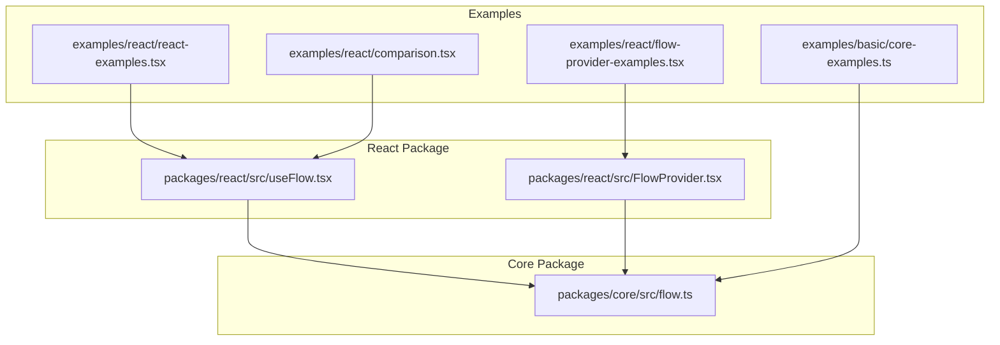

**Diagram sources**

- [react-examples.tsx](file://examples/react/react-examples.tsx#L1-L491)
- [comparison.tsx](file://examples/react/comparison.tsx#L1-L246)
- [flow-provider-examples.tsx](file://examples/react/flow-provider-examples.tsx#L1-L368)
- [useFlow.tsx](file://packages/react/src/useFlow.tsx#L1-L281)
- [FlowProvider.tsx](file://packages/react/src/FlowProvider.tsx#L1-L139)
- [flow.ts](file://packages/core/src/flow.ts#L1-L709)
- [core-examples.ts](file://examples/basic/core-examples.ts#L1-L221)

**Section sources**

- [README.md](file://README.md#L108-L117)
- [react-examples.tsx](file://examples/react/react-examples.tsx#L1-L491)
- [useFlow.tsx](file://packages/react/src/useFlow.tsx#L1-L281)
- [FlowProvider.tsx](file://packages/react/src/FlowProvider.tsx#L1-L139)
- [flow.ts](file://packages/core/src/flow.ts#L1-L709)

## Core Components

- useFlow hook: Orchestrates async actions, exposes state, and provides helpers for buttons and forms. It integrates with FlowProvider for global configuration and offers accessibility features.
- FlowProvider: Provides global defaults for retry, loading UX, error handling, and other options. Supports nested providers and override modes.
- Flow core: The framework-agnostic engine managing state, concurrency, retries, optimistic updates, and UX controls.

Key capabilities demonstrated in examples:

- Button props generation with disabled and aria-busy
- Form helpers with automatic FormData extraction, validation, and success reset
- Optimistic UI updates
- Defer and throttle execution
- Accessible live regions and error focus management
- Global configuration and nested providers

**Section sources**

- [useFlow.tsx](file://packages/react/src/useFlow.tsx#L77-L281)
- [FlowProvider.tsx](file://packages/react/src/FlowProvider.tsx#L50-L139)
- [flow.ts](file://packages/core/src/flow.ts#L174-L709)

## Architecture Overview

The React integration centers around useFlow, which wraps the Flow core engine and synchronizes its state with React. FlowProvider injects global options that are merged with local options.

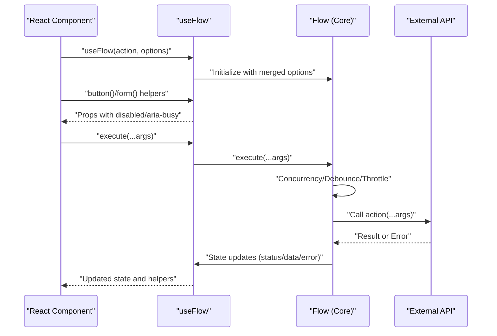

**Diagram sources**

- [useFlow.tsx](file://packages/react/src/useFlow.tsx#L77-L281)
- [flow.ts](file://packages/core/src/flow.ts#L400-L533)

## Detailed Component Analysis

### Login Form with Error Handling and Optimistic UI

- Implements a login flow with useFlow, handling loading, success, and error states.
- Demonstrates optimistic UI patterns via optimisticResult for immediate feedback.
- Uses button() helper to disable the submit button during loading and set aria-busy.
- Integrates with external APIs via fetch.

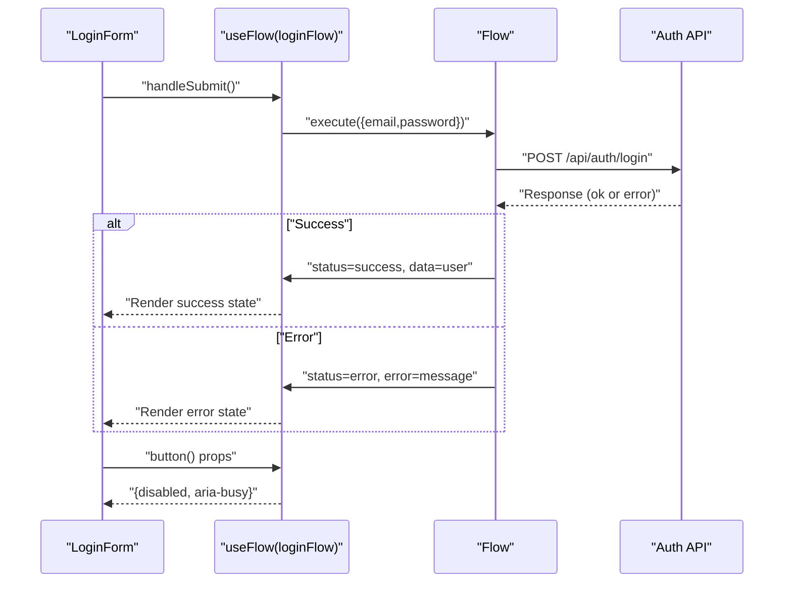

**Diagram sources**

- [react-examples.tsx](file://examples/react/react-examples.tsx#L14-L87)
- [useFlow.tsx](file://packages/react/src/useFlow.tsx#L174-L194)
- [flow.ts](file://packages/core/src/flow.ts#L482-L533)

**Section sources**

- [react-examples.tsx](file://examples/react/react-examples.tsx#L14-L87)
- [useFlow.tsx](file://packages/react/src/useFlow.tsx#L174-L194)

### Like Button with Optimistic UI

- Demonstrates optimistic UI updates by setting optimisticResult before execution.
- Renders currentPost based on flow.data or the original post prop.
- Uses button() helper to disable the button during loading.

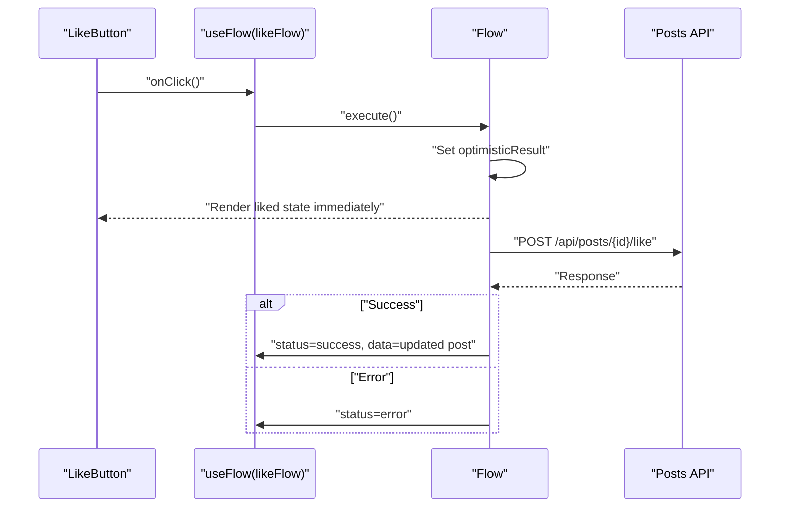

**Diagram sources**

- [react-examples.tsx](file://examples/react/react-examples.tsx#L100-L128)
- [flow.ts](file://packages/core/src/flow.ts#L445-L473)

**Section sources**

- [react-examples.tsx](file://examples/react/react-examples.tsx#L100-L128)
- [flow.ts](file://packages/core/src/flow.ts#L445-L473)

### Delete with Confirmation Workflow

- Uses a two-step confirmation pattern: show confirm dialog, then execute delete.
- Integrates with external API for DELETE requests.
- Uses button() helper and loading state to prevent double-clicks.

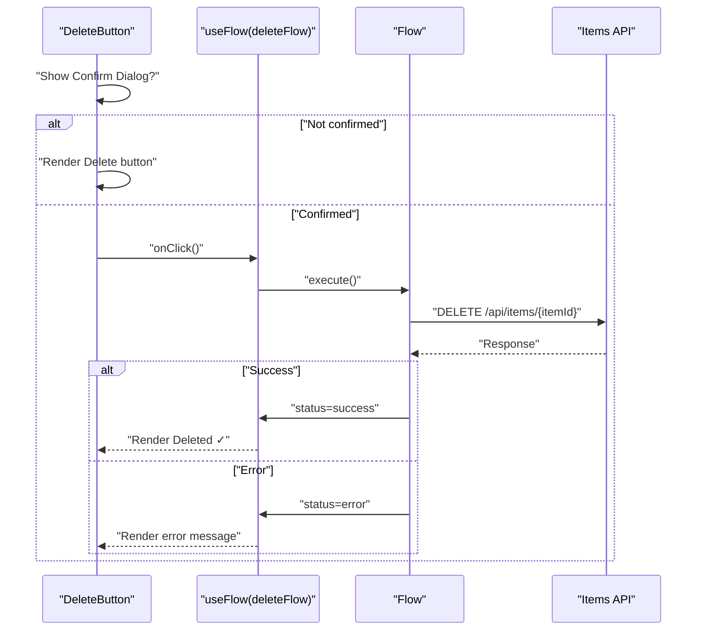

**Diagram sources**

- [react-examples.tsx](file://examples/react/react-examples.tsx#L134-L180)
- [flow.ts](file://packages/core/src/flow.ts#L482-L533)

**Section sources**

- [react-examples.tsx](file://examples/react/react-examples.tsx#L134-L180)

### Profile Form with Button Helpers

- Uses form() helper to bind form submission, extract FormData, and reset on success.
- Integrates with external API for PUT requests.
- Demonstrates autoReset behavior to clear success state after delay.

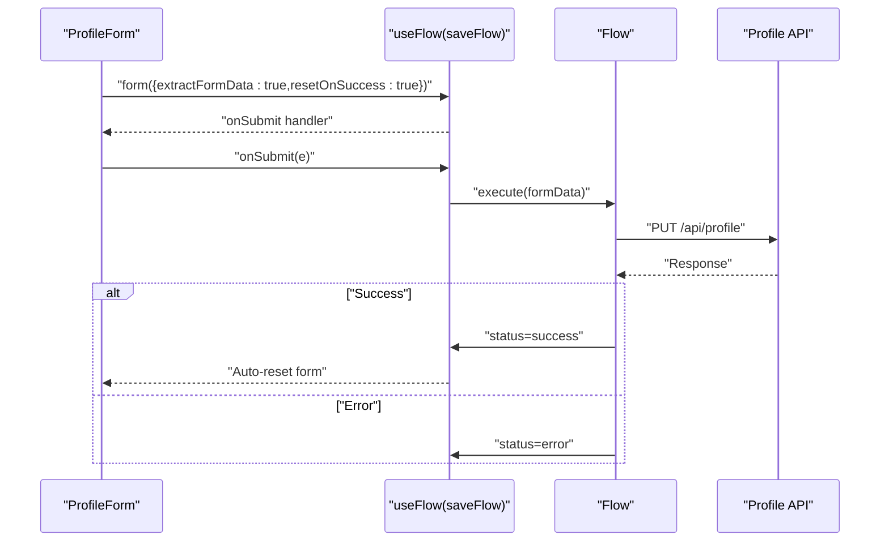

**Diagram sources**

- [react-examples.tsx](file://examples/react/react-examples.tsx#L186-L245)
- [useFlow.tsx](file://packages/react/src/useFlow.tsx#L200-L249)
- [flow.ts](file://packages/core/src/flow.ts#L482-L533)

**Section sources**

- [react-examples.tsx](file://examples/react/react-examples.tsx#L186-L245)
- [useFlow.tsx](file://packages/react/src/useFlow.tsx#L200-L249)

### Search with Debounced Input

- Implements debounced search using React effects and useFlow.
- Debounces user input to reduce API calls.
- Renders loading state and displays results.

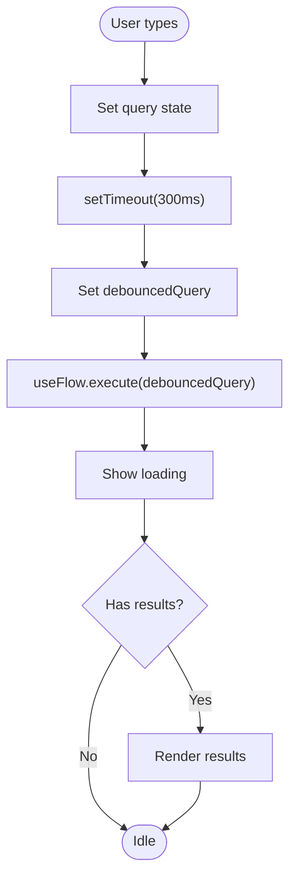

**Diagram sources**

- [react-examples.tsx](file://examples/react/react-examples.tsx#L251-L301)
- [flow.ts](file://packages/core/src/flow.ts#L537-L548)

**Section sources**

- [react-examples.tsx](file://examples/react/react-examples.tsx#L251-L301)
- [flow.ts](file://packages/core/src/flow.ts#L537-L548)

### File Upload with Progress

- Handles file selection and upload via FormData.
- Integrates with external API for POST uploads.
- Demonstrates success handling and clearing selected file.

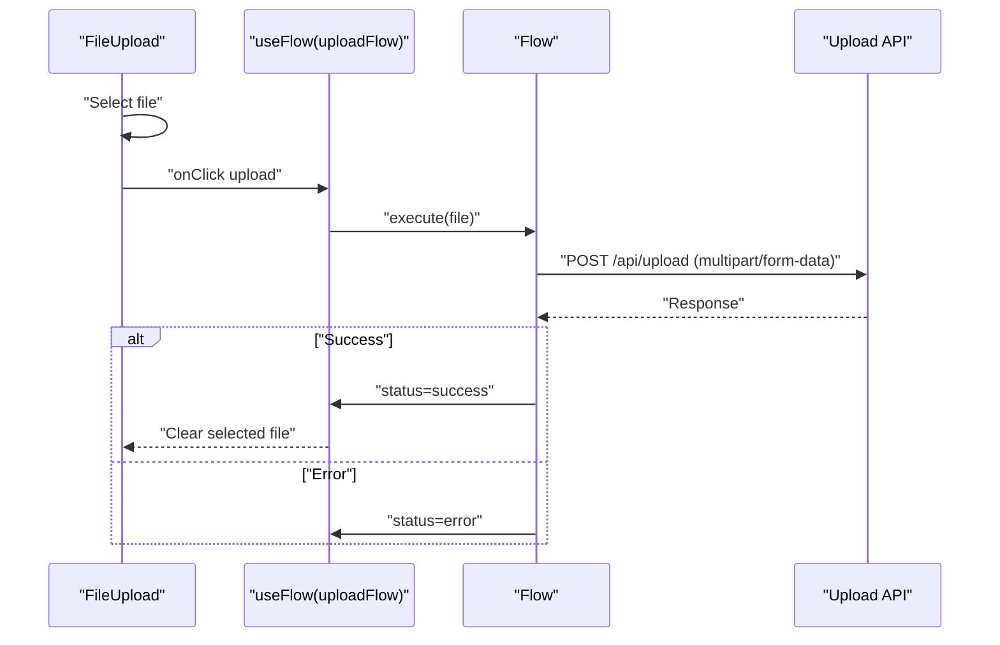

**Diagram sources**

- [react-examples.tsx](file://examples/react/react-examples.tsx#L307-L373)
- [flow.ts](file://packages/core/src/flow.ts#L482-L533)

**Section sources**

- [react-examples.tsx](file://examples/react/react-examples.tsx#L307-L373)

### Data Fetching with Retry Mechanisms

- Implements retry with user-controlled triggers.
- Uses retry configuration with exponential backoff.
- Renders loading, error, and success states.

```mermaid
sequenceDiagram
participant UI as "DataFetcher"
participant Hook as "useFlow(fetchFlow)"
participant Flow as "Flow"
participant API as "Data API"
UI->>Hook : "useEffect -> execute()"
Hook->>Flow : "execute()"
Flow->>API : "GET url"
API-->>Flow : "Response or Error"
alt "Success"
Flow->>Hook : "status=success"
else "Retry needed"
Flow->>Flow : "wait delay/backoff"
Flow->>API : "Retry GET url"
else "Max attempts reached"
Flow->>Hook : "status=error"
end
```

**Diagram sources**

- [react-examples.tsx](file://examples/react/react-examples.tsx#L379-L415)
- [flow.ts](file://packages/core/src/flow.ts#L596-L638)

**Section sources**

- [react-examples.tsx](file://examples/react/react-examples.tsx#L379-L415)
- [flow.ts](file://packages/core/src/flow.ts#L596-L638)

### Advanced Form with Validation and Accessibility

- Demonstrates form validation with field-level errors.
- Uses LiveRegion for screen reader announcements.
- Integrates a11y options for success and error messages.
- Uses loading minDuration for UX polish.

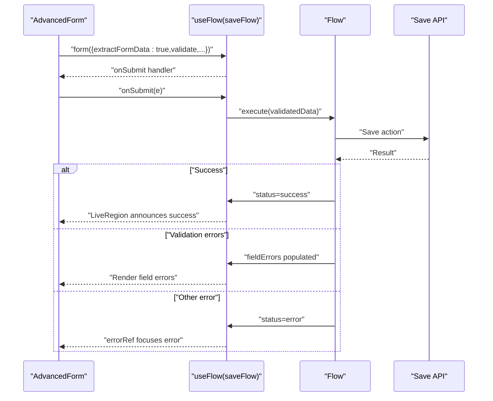

**Diagram sources**

- [react-examples.tsx](file://examples/react/react-examples.tsx#L421-L490)
- [useFlow.tsx](file://packages/react/src/useFlow.tsx#L147-L168)
- [flow.ts](file://packages/core/src/flow.ts#L482-L533)

**Section sources**

- [react-examples.tsx](file://examples/react/react-examples.tsx#L421-L490)
- [useFlow.tsx](file://packages/react/src/useFlow.tsx#L147-L168)

### Before/After Patterns and Best Practices

- Compares manual state management versus AsyncFlowState usage.
- Highlights reduced boilerplate, consistent UX, and prevention of double submissions.
- Demonstrates controlled loading duration to avoid UI flashes.

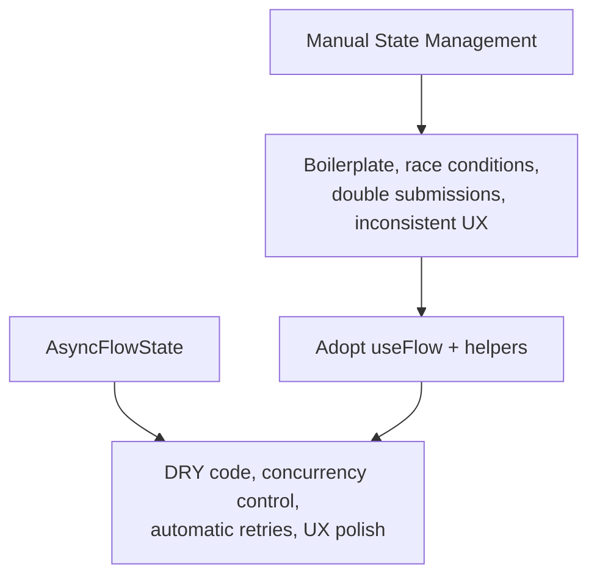

**Diagram sources**

- [comparison.tsx](file://examples/react/comparison.tsx#L15-L93)
- [comparison.tsx](file://examples/react/comparison.tsx#L105-L201)
- [comparison.tsx](file://examples/react/comparison.tsx#L213-L241)

**Section sources**

- [comparison.tsx](file://examples/react/comparison.tsx#L15-L93)
- [comparison.tsx](file://examples/react/comparison.tsx#L105-L201)
- [comparison.tsx](file://examples/react/comparison.tsx#L213-L241)

### Global Configuration with FlowProvider

- Demonstrates global error handling, retry policies, and UX settings.
- Shows nested providers for different sections with distinct configurations.
- Illustrates merging and overriding global/local options.

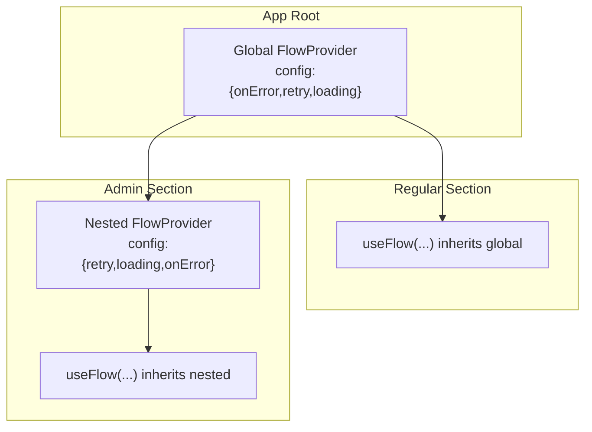

**Diagram sources**

- [flow-provider-examples.tsx](file://examples/react/flow-provider-examples.tsx#L59-L95)
- [flow-provider-examples.tsx](file://examples/react/flow-provider-examples.tsx#L101-L155)
- [flow-provider-examples.tsx](file://examples/react/flow-provider-examples.tsx#L161-L205)
- [flow-provider-examples.tsx](file://examples/react/flow-provider-examples.tsx#L211-L271)
- [flow-provider-examples.tsx](file://examples/react/flow-provider-examples.tsx#L277-L367)

**Section sources**

- [flow-provider-examples.tsx](file://examples/react/flow-provider-examples.tsx#L59-L95)
- [flow-provider-examples.tsx](file://examples/react/flow-provider-examples.tsx#L101-L155)
- [flow-provider-examples.tsx](file://examples/react/flow-provider-examples.tsx#L161-L205)
- [flow-provider-examples.tsx](file://examples/react/flow-provider-examples.tsx#L211-L271)
- [flow-provider-examples.tsx](file://examples/react/flow-provider-examples.tsx#L277-L367)

## Dependency Analysis

- useFlow depends on Flow core and FlowProvider context to merge global and local options.
- FlowProvider provides configuration via React context and merges options with deep merge semantics.
- Examples depend on useFlow and FlowProvider to demonstrate real-world patterns.

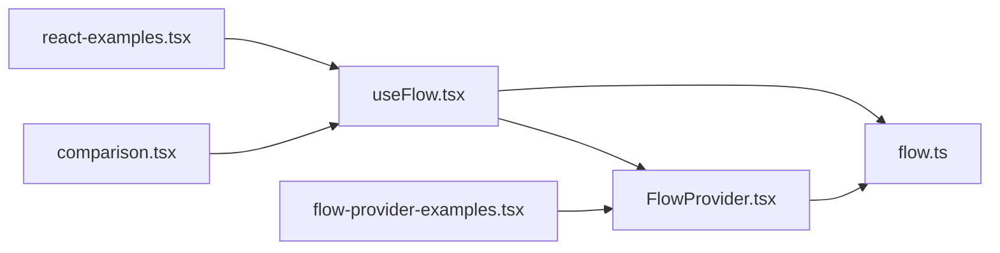

**Diagram sources**

- [useFlow.tsx](file://packages/react/src/useFlow.tsx#L1-L10)
- [FlowProvider.tsx](file://packages/react/src/FlowProvider.tsx#L1-L2)
- [flow.ts](file://packages/core/src/flow.ts#L1-L7)
- [react-examples.tsx](file://examples/react/react-examples.tsx#L1-L8)
- [comparison.tsx](file://examples/react/comparison.tsx#L1-L8)
- [flow-provider-examples.tsx](file://examples/react/flow-provider-examples.tsx#L1-L8)

**Section sources**

- [useFlow.tsx](file://packages/react/src/useFlow.tsx#L1-L10)
- [FlowProvider.tsx](file://packages/react/src/FlowProvider.tsx#L1-L2)
- [flow.ts](file://packages/core/src/flow.ts#L1-L7)
- [react-examples.tsx](file://examples/react/react-examples.tsx#L1-L8)
- [comparison.tsx](file://examples/react/comparison.tsx#L1-L8)
- [flow-provider-examples.tsx](file://examples/react/flow-provider-examples.tsx#L1-L8)

## Performance Considerations

- Concurrency control prevents double submissions and race conditions.
- Debounce/throttle options reduce unnecessary API calls for search and frequent actions.
- Loading perception controls (delay/minDuration) prevent UI flicker and improve perceived performance.
- Auto-reset reduces memory footprint by clearing success states after a delay.
- Optimistic UI improves perceived responsiveness by updating immediately and rolling back on error.

Practical tips:

- Use loading.minDuration and loading.delay to smooth UX for fast operations.
- Prefer restart concurrency for critical actions where latest state matters.
- Use enqueue for batch operations where order matters.
- Apply debounce for search inputs and throttle for rate-limited actions.

**Section sources**

- [flow.ts](file://packages/core/src/flow.ts#L425-L473)
- [flow.ts](file://packages/core/src/flow.ts#L537-L585)
- [flow.ts](file://packages/core/src/flow.ts#L646-L668)
- [useFlow.tsx](file://packages/react/src/useFlow.tsx#L174-L194)
- [useFlow.tsx](file://packages/react/src/useFlow.tsx#L200-L249)

## Troubleshooting Guide

Common issues and resolutions:

- Double submissions: Ensure concurrency is set appropriately; useFlow disables buttons automatically.
- Stuck loading states: Verify loading.delay and minDuration settings; check for unhandled exceptions.
- Form validation not working: Ensure validate returns null or an object of field errors; fieldErrors will be populated accordingly.
- Global config not applied: Confirm FlowProvider wraps components and options are merged correctly.
- Accessible error focus not working: Ensure errorRef is attached to an element and that the element is focusable.

Testing patterns:

- Use testing-library to assert button disabled state and aria-busy attributes.
- Validate form helper behavior with extractFormData and validation callbacks.
- Confirm LiveRegion announcements for success and error states.

**Section sources**

- [useFlow.test.tsx](file://packages/react/src/useFlow.test.tsx#L14-L46)
- [useFlow.test.tsx](file://packages/react/src/useFlow.test.tsx#L48-L66)
- [useFlow.test.tsx](file://packages/react/src/useFlow.test.tsx#L68-L96)
- [useFlow.test.tsx](file://packages/react/src/useFlow.test.tsx#L98-L117)
- [useFlow.test.tsx](file://packages/react/src/useFlow.test.tsx#L119-L140)
- [FlowProvider.test.tsx](file://packages/react/src/FlowProvider.test.tsx#L86-L112)
- [FlowProvider.test.tsx](file://packages/react/src/FlowProvider.test.tsx#L114-L147)

## Conclusion

AsyncFlowState provides a cohesive solution for managing async UI behavior in React. The examples demonstrate how to build reliable, accessible, and performant interactions with minimal boilerplate. By leveraging useFlow and FlowProvider, teams can standardize async behavior, reduce bugs, and deliver consistent user experiences across complex applications.

## Appendices

### API Reference Highlights

- useFlow(action, options?): Returns state, actions, and helpers.
  - State: status, data, error, loading, progress, fieldErrors
  - Actions: execute, reset, cancel, setProgress
  - Helpers: button(props), form(props), LiveRegion, errorRef
- FlowProvider(config): Provides global defaults merged with local options.
- Flow core: Manages state, concurrency, retries, optimistic updates, and UX controls.

**Section sources**

- [useFlow.tsx](file://packages/react/src/useFlow.tsx#L181-L207)
- [FlowProvider.tsx](file://packages/react/src/FlowProvider.tsx#L27-L32)
- [flow.ts](file://packages/core/src/flow.ts#L106-L127)

### Additional Core Examples

Explore the core Flow class usage for non-React environments and advanced patterns.

**Section sources**

- [core-examples.ts](file://examples/basic/core-examples.ts#L14-L38)
- [core-examples.ts](file://examples/basic/core-examples.ts#L44-L73)
- [core-examples.ts](file://examples/basic/core-examples.ts#L79-L111)
- [core-examples.ts](file://examples/basic/core-examples.ts#L117-L144)
- [core-examples.ts](file://examples/basic/core-examples.ts#L150-L177)
- [core-examples.ts](file://examples/basic/core-examples.ts#L183-L203)
