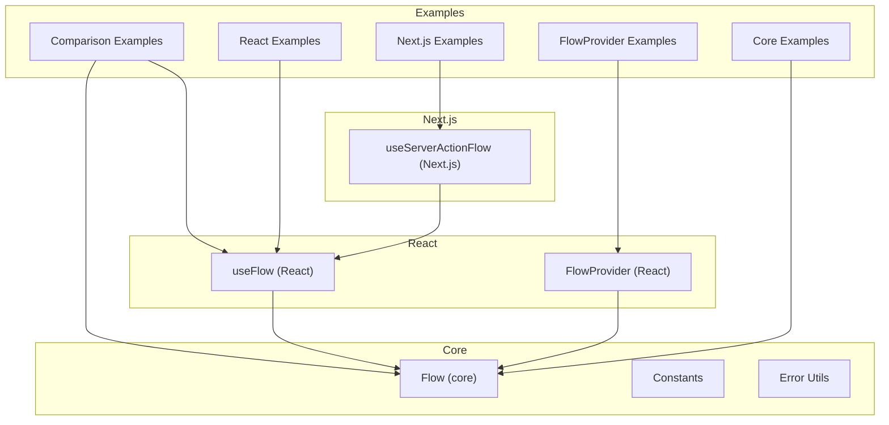
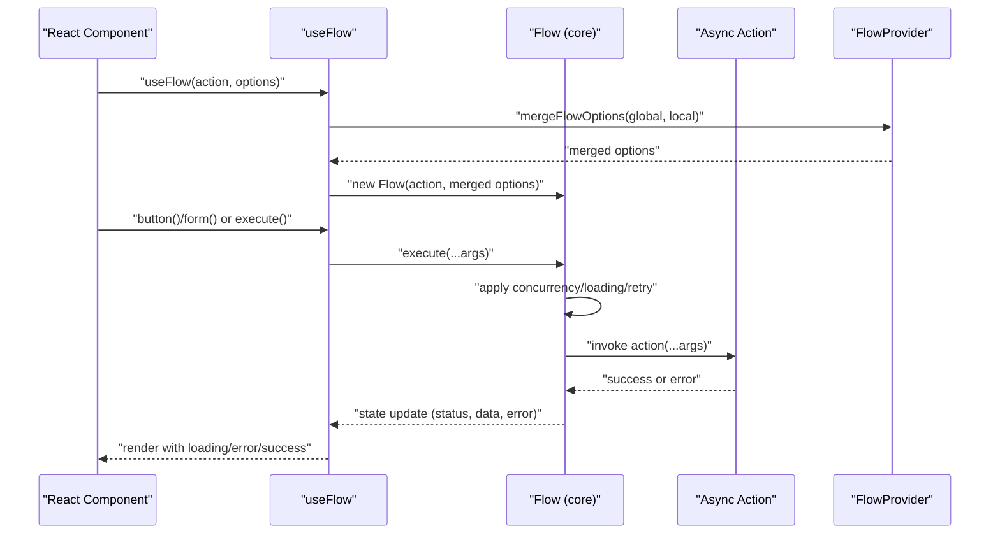
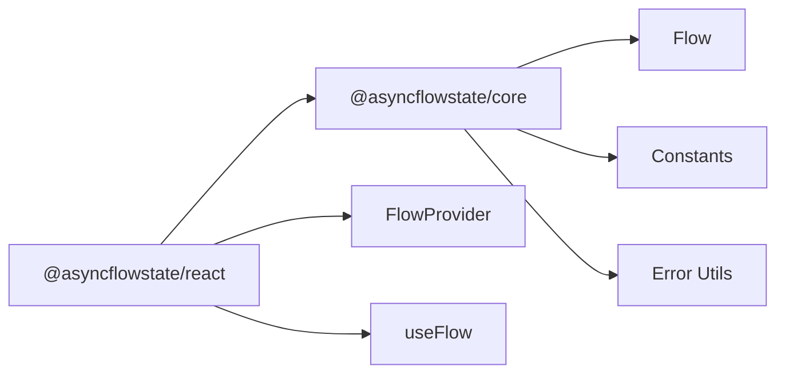

# Getting Started

<cite>
**Referenced Files in This Document**
- [README.md](file://README.md)
- [packages/core/src/flow.ts](file://packages/core/src/flow.ts)
- [packages/core/src/constants.ts](file://packages/core/src/constants.ts)
- [packages/core/src/error-utils.ts](file://packages/core/src/error-utils.ts)
- [packages/react/src/useFlow.tsx](file://packages/react/src/useFlow.tsx)
- [packages/react/src/FlowProvider.tsx](file://packages/react/src/FlowProvider.tsx)
- [packages/react/package.json](file://packages/react/package.json)
- [examples/react/comparison.tsx](file://examples/react/comparison.tsx)
- [examples/react/react-examples.tsx](file://examples/react/react-examples.tsx)
- [examples/react/flow-provider-examples.tsx](file://examples/react/flow-provider-examples.tsx)
- [examples/basic/core-examples.ts](file://examples/basic/core-examples.ts)
</cite>

## Table of Contents

1. [Introduction](#introduction)
2. [Project Structure](#project-structure)
3. [Core Components](#core-components)
4. [Architecture Overview](#architecture-overview)
5. [Detailed Component Analysis](#detailed-component-analysis)
6. [Dependency Analysis](#dependency-analysis)
7. [Performance Considerations](#performance-considerations)
8. [Troubleshooting Guide](#troubleshooting-guide)
9. [Conclusion](#conclusion)
10. [Appendices](#appendices)
11. [Next.js Integration](#nextjs-integration)

## Introduction

AsyncFlowState eliminates repetitive and error-prone async UI logic by providing a unified behavior engine. It prevents double submissions, ensures consistent loading UX, and simplifies error handling. Unlike data-fetching libraries or state managers, AsyncFlowState is a behavior orchestrator that focuses on the lifecycle of async actions: idle → loading → success → error → retry.

Common problems it solves:

- Double submissions caused by rapid clicks
- Inconsistent loading UX (spinners everywhere or nowhere)
- Error handling chaos (forgotten catch blocks, messy transitions)
- Boilerplate fatigue (repetitive setIsLoading, state management)

AsyncFlowState is not a replacement for React Query, SWR, Redux, or Zustand. Instead, it complements them by handling the behavior of async actions and their UI states consistently across your app.

**Section sources**

- [README.md](file://README.md#L12-L37)

## Project Structure

The repository is organized as a monorepo with multiple framework packages:

- @asyncflowstate/core: Framework-agnostic logic engine
- @asyncflowstate/react: React hooks and accessibility helpers
- @asyncflowstate/next: Next.js optimized integration for Server Actions and SSR
- @asyncflowstate/vue: Vue 3 `<script setup>` Composition API bindings
- @asyncflowstate/svelte: Svelte Store reactivity integrations
- @asyncflowstate/angular: Angular `BehaviorSubject` streaming logic
- @asyncflowstate/solid: SolidJS fine-grained primitive mapping
- @asyncflowstate/nuxt: Nuxt 3 native composables
- @asyncflowstate/remix: Remix action & navigation integration
- @asyncflowstate/astro: Astro server action adapters

Key directories and files:

- packages/core/src: Core Flow class, constants, and error utilities
- packages/react/src: useFlow hook and FlowProvider
- packages/next/src: Next.js specific hooks (useServerActionFlow)
- packages/{vue,svelte,angular,solid}/src: The Native framework APIs
- examples: React and Next.js usage patterns
- Root README: High-level overview, installation, and quick start

**Diagram sources**

- [packages/core/src/flow.ts](file://packages/core/src/flow.ts#L174-L709)
- [packages/react/src/useFlow.tsx](file://packages/react/src/useFlow.tsx#L77-L281)
- [packages/react/src/FlowProvider.tsx](file://packages/react/src/FlowProvider.tsx#L50-L139)
- [examples/react/comparison.tsx](file://examples/react/comparison.tsx#L1-L246)
- [examples/react/react-examples.tsx](file://examples/react/react-examples.tsx#L1-L491)
- [examples/react/flow-provider-examples.tsx](file://examples/react/flow-provider-examples.tsx#L1-L368)
- [examples/basic/core-examples.ts](file://examples/basic/core-examples.ts#L1-L221)

**Section sources**

- [README.md](file://README.md#L108-L117)
- [packages/react/package.json](file://packages/react/package.json#L1-L67)

## Core Components

- Flow (core): Orchestrates async actions, manages state, retries, concurrency, and UX polish.
- useFlow (React): React hook that wraps Flow, adds helpers (button, form), and accessibility features.
- FlowProvider (React): Provides global configuration merged with local options.

Key capabilities:

- Concurrency control (keep, restart, enqueue)
- Retry logic with fixed/linear/exponential backoff
- Optimistic UI updates
- Loading UX controls (minDuration, delay)
- Accessibility helpers (LiveRegion, error focus, ARIA busy)
- Form helpers (FormData extraction, validation, auto-reset)

**Section sources**

- [packages/core/src/flow.ts](file://packages/core/src/flow.ts#L174-L709)
- [packages/react/src/useFlow.tsx](file://packages/react/src/useFlow.tsx#L77-L281)
- [packages/react/src/FlowProvider.tsx](file://packages/react/src/FlowProvider.tsx#L50-L139)

## Architecture Overview

AsyncFlowState separates concerns:

- Core Flow manages the behavior and state machine
- React useFlow integrates Flow with React’s rendering model and provides helpers
- FlowProvider supplies global defaults and merges them with local options

**Diagram sources**

- [packages/react/src/useFlow.tsx](file://packages/react/src/useFlow.tsx#L77-L281)
- [packages/core/src/flow.ts](file://packages/core/src/flow.ts#L400-L533)
- [packages/react/src/FlowProvider.tsx](file://packages/react/src/FlowProvider.tsx#L76-L139)

## Detailed Component Analysis

### Installation and Prerequisites

- Install the React package in your React 18+ project
- TypeScript knowledge is recommended
- Basic understanding of async JavaScript is assumed

Installation steps:

- Add @asyncflowstate/react to your project
- Ensure peer dependencies match your React version

**Section sources**

- [README.md](file://README.md#L120-L129)
- [packages/react/package.json](file://packages/react/package.json#L53-L56)

### Basic Usage with useFlow

- Import useFlow from @asyncflowstate/react
- Wrap your async function with useFlow
- Use flow.button() or flow.form() helpers for buttons and forms
- Access flow.loading, flow.error, flow.status, flow.data

Quick start example:

- Save button with automatic loading and error handling
- Form with automatic submit handling and error display

**Section sources**

- [README.md](file://README.md#L130-L164)
- [packages/react/src/useFlow.tsx](file://packages/react/src/useFlow.tsx#L77-L281)

### Global Configuration with FlowProvider

- Wrap your app with FlowProvider to set global defaults
- Configure retry, loading UX, error handlers, and autoReset
- Local options override or merge with global settings depending on override mode

Examples:

- Global error handling and retry policies
- Nested providers for different sections
- Production-grade setup with custom retry logic and UX polish

**Section sources**

- [README.md](file://README.md#L166-L183)
- [packages/react/src/FlowProvider.tsx](file://packages/react/src/FlowProvider.tsx#L50-L139)
- [examples/react/flow-provider-examples.tsx](file://examples/react/flow-provider-examples.tsx#L59-L367)

### Before vs After: Manual State Management vs AsyncFlowState

- Manual state management leads to boilerplate, race conditions, and inconsistent UX
- AsyncFlowState centralizes behavior, prevents double submissions, and standardizes UX

Patterns demonstrated:

- Data fetching on mount
- Form submission with validation
- UX polish to prevent UI flashes

**Section sources**

- [README.md](file://README.md#L62-L104)
- [examples/react/comparison.tsx](file://examples/react/comparison.tsx#L1-L246)

### Quick Start Examples

#### Form Submissions

- Use flow.form() to bind form events, extract FormData, and validate
- Access fieldErrors for validation feedback
- Use flow.errorRef to focus on error messages

**Section sources**

- [README.md](file://README.md#L148-L164)
- [examples/react/react-examples.tsx](file://examples/react/react-examples.tsx#L186-L245)

#### Login Flows

- Use flow.button() for submit button with aria-busy and disabled states
- Handle success and error callbacks
- Focus on error messages using errorRef

**Section sources**

- [examples/react/react-examples.tsx](file://examples/react/react-examples.tsx#L14-L87)

#### File Uploads

- Use flow.execute(file) to upload files
- Handle success and error states
- Combine with progress tracking if needed

**Section sources**

- [examples/react/react-examples.tsx](file://examples/react/react-examples.tsx#L307-L373)

#### Retry with User Control

- Configure retry with maxAttempts, delay, and backoff
- Provide shouldRetry callback for fine-grained control
- Allow users to retry manually

**Section sources**

- [examples/react/react-examples.tsx](file://examples/react/react-examples.tsx#L379-L415)

### Advanced Patterns

#### Optimistic UI

- Provide optimisticResult to immediately reflect changes
- On success, UI updates with real data; on error, revert gracefully

**Section sources**

- [examples/react/react-examples.tsx](file://examples/react/react-examples.tsx#L100-L128)
- [examples/basic/core-examples.ts](file://examples/basic/core-examples.ts#L79-L111)

#### Search with Debounce

- Use external debouncing and call flow.execute(debouncedQuery)
- Manage loading and results efficiently

**Section sources**

- [examples/react/react-examples.tsx](file://examples/react/react-examples.tsx#L251-L301)

#### Accessibility and Live Regions

- Use LiveRegion to announce success/error to assistive technologies
- Focus error messages automatically when they appear

**Section sources**

- [packages/react/src/useFlow.tsx](file://packages/react/src/useFlow.tsx#L147-L168)
- [examples/react/react-examples.tsx](file://examples/react/react-examples.tsx#L421-L490)

## Dependency Analysis

- @asyncflowstate/react depends on @asyncflowstate/core
- useFlow consumes Flow and FlowProvider for configuration merging
- Constants and error utilities support Flow’s behavior

**Diagram sources**

- [packages/react/package.json](file://packages/react/package.json#L57-L59)
- [packages/react/src/useFlow.tsx](file://packages/react/src/useFlow.tsx#L9-L10)
- [packages/core/src/flow.ts](file://packages/core/src/flow.ts#L1-L7)
- [packages/core/src/constants.ts](file://packages/core/src/constants.ts#L1-L51)
- [packages/core/src/error-utils.ts](file://packages/core/src/error-utils.ts#L1-L7)

**Section sources**

- [packages/react/package.json](file://packages/react/package.json#L57-L59)

## Performance Considerations

- Concurrency control prevents wasted work and race conditions
- Loading UX controls minimize perceived flicker and improve perceived performance
- Retry backoff strategies reduce server load during transient failures
- Debounce/throttle options help manage frequent triggers (e.g., search)

[No sources needed since this section provides general guidance]

## Troubleshooting Guide

- Double submissions: Ensure concurrency is set appropriately; useFlow disables buttons automatically
- Error handling: Use onError globally via FlowProvider or locally; leverage createFlowError for typed errors
- Accessibility: Use LiveRegion and errorRef to ensure screen readers announce outcomes
- Global vs local options: Understand merge semantics; use overrideMode if you need local options to replace global ones

**Section sources**

- [packages/react/src/FlowProvider.tsx](file://packages/react/src/FlowProvider.tsx#L76-L139)
- [packages/core/src/error-utils.ts](file://packages/core/src/error-utils.ts#L26-L39)
- [packages/react/src/useFlow.tsx](file://packages/react/src/useFlow.tsx#L147-L168)

## Conclusion

AsyncFlowState streamlines async UI behavior so you can focus on building features. By preventing double submissions, standardizing loading UX, and simplifying error handling, it reduces boilerplate and improves consistency across your application. Start with useFlow for individual actions, then adopt FlowProvider for global defaults and advanced patterns like optimistic UI, retries, and accessibility.

[No sources needed since this section summarizes without analyzing specific files]

## Appendices

### Before vs After Comparison

- Manual state management: scattered logic, race conditions, inconsistent UX
- AsyncFlowState: centralized behavior, helpers, and consistent UX

**Section sources**

- [README.md](file://README.md#L62-L104)
- [examples/react/comparison.tsx](file://examples/react/comparison.tsx#L22-L93)

### Core Engine Reference

- Flow class manages state, retries, concurrency, and UX controls
- Constants define defaults for retry, loading, progress, and backoff
- Error utilities help categorize and handle errors consistently

**Section sources**

- [packages/core/src/flow.ts](file://packages/core/src/flow.ts#L174-L709)
- [packages/core/src/constants.ts](file://packages/core/src/constants.ts#L1-L51)
- [packages/core/src/error-utils.ts](file://packages/core/src/error-utils.ts#L1-L207)
