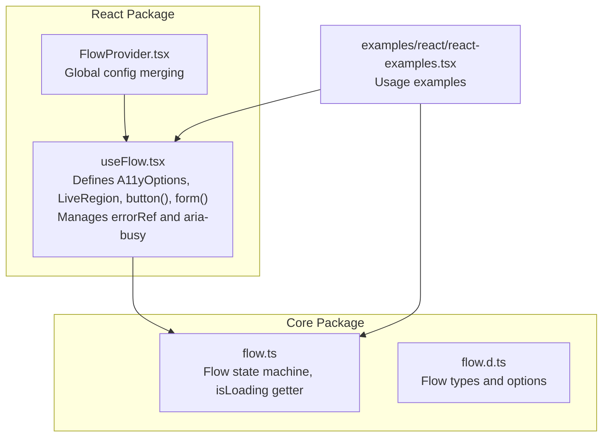
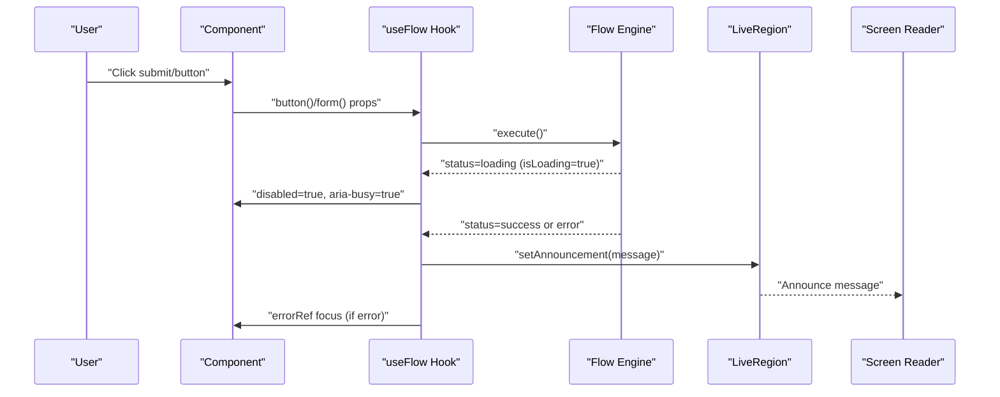
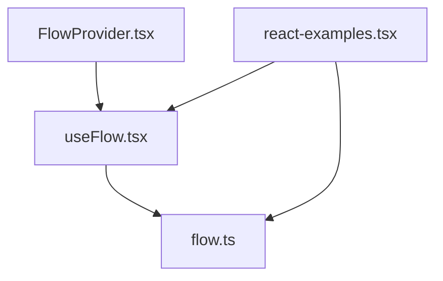

# Accessibility Features

<cite>
**Referenced Files in This Document**
- [useFlow.tsx](file://packages/react/src/useFlow.tsx)
- [FlowProvider.tsx](file://packages/react/src/FlowProvider.tsx)
- [flow.ts](file://packages/core/src/flow.ts)
- [flow.d.ts](file://packages/core/src/flow.d.ts)
- [react-examples.tsx](file://examples/react/react-examples.tsx)
- [README.md](file://README.md)
- [react-readme.md](file://packages/react/README.md)
</cite>

## Table of Contents

1. [Introduction](#introduction)
2. [Project Structure](#project-structure)
3. [Core Components](#core-components)
4. [Architecture Overview](#architecture-overview)
5. [Detailed Component Analysis](#detailed-component-analysis)
6. [Dependency Analysis](#dependency-analysis)
7. [Performance Considerations](#performance-considerations)
8. [Troubleshooting Guide](#troubleshooting-guide)
9. [Conclusion](#conclusion)
10. [Appendices](#appendices)

## Introduction

This document explains the comprehensive accessibility features built into useFlow, focusing on automatic screen reader announcements via ARIA live regions, error focus management, keyboard navigation support, and integration with assistive technologies. It covers the A11yOptions interface, the LiveRegion component generation, announcement timing, customization options, aria-busy attribute usage, disabled state management for accessibility, and practical examples and testing approaches aligned with WCAG guidelines.

## Project Structure

The accessibility features are implemented in the React package and leverage the core Flow engine:

- React-specific accessibility options and helpers are defined in the React hook.
- The core Flow engine manages state transitions and exposes isLoading for accessibility props.
- Global configuration via FlowProvider enables consistent defaults across an application.

**Diagram sources**

- [useFlow.tsx](file://packages/react/src/useFlow.tsx#L49-L168)
- [FlowProvider.tsx](file://packages/react/src/FlowProvider.tsx#L76-L138)
- [flow.ts](file://packages/core/src/flow.ts#L207-L322)
- [flow.d.ts](file://packages/core/src/flow.d.ts#L84-L176)
- [react-examples.tsx](file://examples/react/react-examples.tsx#L421-L464)

**Section sources**

- [useFlow.tsx](file://packages/react/src/useFlow.tsx#L49-L168)
- [FlowProvider.tsx](file://packages/react/src/FlowProvider.tsx#L76-L138)
- [flow.ts](file://packages/core/src/flow.ts#L207-L322)
- [react-readme.md](file://packages/react/README.md#L116-L148)

## Core Components

- A11yOptions interface: Provides automatic success and error announcements and live region relationship.
- LiveRegion component: A hidden ARIA live region that announces messages to screen readers.
- errorRef: A React ref attached to an error element to auto-focus on error states.
- button() helper: Injects disabled and aria-busy attributes based on isLoading.
- form() helper: Adds aria-busy and handles validation and form submission.

Key implementation references:

- A11yOptions definition and usage in options: [A11yOptions](file://packages/react/src/useFlow.tsx#L49-L67)
- LiveRegion component generation and aria-live relationship: [LiveRegion](file://packages/react/src/useFlow.tsx#L147-L168)
- Error focus management with errorRef: [errorRef effect](file://packages/react/src/useFlow.tsx#L117-L124)
- aria-busy and disabled injection via button(): [button helper](file://packages/react/src/useFlow.tsx#L174-L194)
- aria-busy injection via form(): [form helper](file://packages/react/src/useFlow.tsx#L200-L249)
- Core isLoading getter used for accessibility props: [isLoading](file://packages/core/src/flow.ts#L305-L307)

**Section sources**

- [useFlow.tsx](file://packages/react/src/useFlow.tsx#L49-L194)
- [flow.ts](file://packages/core/src/flow.ts#L305-L307)

## Architecture Overview

The accessibility pipeline ties together React helpers, core Flow state, and ARIA attributes to provide seamless screen reader announcements and keyboard-friendly interactions.

**Diagram sources**

- [useFlow.tsx](file://packages/react/src/useFlow.tsx#L117-L194)
- [flow.ts](file://packages/core/src/flow.ts#L305-L307)

## Detailed Component Analysis

### A11yOptions Interface

- announceSuccess: Accepts a string or a function that generates a message from success data.
- announceError: Accepts a string or a function that generates a message from the error object.
- liveRegionRel: Controls aria-live relationship ("polite" or "assertive"). Defaults to "polite".

Implementation references:

- [A11yOptions interface](file://packages/react/src/useFlow.tsx#L49-L56)
- [ReactFlowOptions with a11y](file://packages/react/src/useFlow.tsx#L61-L67)

Best practices:

- Provide concise, actionable messages for success and error states.
- Use dynamic messages that incorporate contextual data (e.g., resource names).
- Choose "assertive" for critical errors requiring immediate attention; otherwise use "polite".

**Section sources**

- [useFlow.tsx](file://packages/react/src/useFlow.tsx#L49-L67)

### LiveRegion Component Generation

- LiveRegion is a memoized component that renders a hidden div with aria-live and aria-atomic.
- The aria-live value is derived from options.a11y.liveRegionRel, defaulting to "polite".
- The component displays the current announcement text.

Implementation references:

- [LiveRegion component](file://packages/react/src/useFlow.tsx#L147-L168)

Announcement timing:

- Announcements are triggered when the flow status transitions to success or error and a11y announcement is configured.
- The effect compares snapshot.status and options.a11y to decide whether to set the announcement.

Implementation references:

- [Announcement effect](file://packages/react/src/useFlow.tsx#L126-L141)

Accessibility notes:

- The LiveRegion is visually hidden but remains accessible to assistive technologies.
- aria-atomic ensures the entire message is announced as a whole.

**Section sources**

- [useFlow.tsx](file://packages/react/src/useFlow.tsx#L126-L168)

### Error Focus Management with errorRef

- On error status, the hook focuses the element referenced by errorRef if present.
- This ensures screen reader users are directed to error messages immediately upon failure.

Implementation references:

- [errorRef ref and focus effect](file://packages/react/src/useFlow.tsx#L117-L124)

Example usage:

- Attaching errorRef to an error banner element and rendering it conditionally on error.

Implementation references:

- [errorRef usage in examples](file://examples/react/react-examples.tsx#L72-L76)

**Section sources**

- [useFlow.tsx](file://packages/react/src/useFlow.tsx#L117-L124)
- [react-examples.tsx](file://examples/react/react-examples.tsx#L72-L76)

### Keyboard Navigation Support

- Buttons and forms are keyboard operable by default when using the provided helpers.
- The button() helper disables the button during loading and sets aria-busy, improving keyboard UX by signaling busy states.
- The form() helper prevents default submission and handles validation, keeping focus management predictable.

Implementation references:

- [button helper keyboard-friendly props](file://packages/react/src/useFlow.tsx#L174-L194)
- [form helper keyboard-friendly handling](file://packages/react/src/useFlow.tsx#L200-L249)

**Section sources**

- [useFlow.tsx](file://packages/react/src/useFlow.tsx#L174-L249)

### aria-busy Attribute Usage and Disabled State Management

- aria-busy is set to true when the flow is loading, indicating to assistive technologies that the UI is busy.
- The button is disabled while loading, preventing repeated submissions and keyboard confusion.
- The core Flow engine exposes isLoading, which respects loading.delay to avoid UI flicker.

Implementation references:

- [aria-busy and disabled in button()](file://packages/react/src/useFlow.tsx#L178-L180)
- [aria-busy in form()](file://packages/react/src/useFlow.tsx#L214)
- [isLoading getter](file://packages/core/src/flow.ts#L305-L307)

**Section sources**

- [useFlow.tsx](file://packages/react/src/useFlow.tsx#L174-L194)
- [flow.ts](file://packages/core/src/flow.ts#L305-L307)

### Integration with Assistive Technologies

- Screen readers receive announcements via the LiveRegion component.
- Focus management ensures error messages are immediately announced and reachable via keyboard.
- aria-live semantics are controlled by liveRegionRel, allowing prioritization of urgent vs. background notifications.

Implementation references:

- [LiveRegion aria-live and aria-atomic](file://packages/react/src/useFlow.tsx#L149-L151)
- [Error focus management](file://packages/react/src/useFlow.tsx#L121-L123)

**Section sources**

- [useFlow.tsx](file://packages/react/src/useFlow.tsx#L147-L168)
- [useFlow.tsx](file://packages/react/src/useFlow.tsx#L121-L123)

### Practical Implementation Examples

- Advanced form with accessibility configuration and LiveRegion placement.
- Button and form helpers usage with aria-busy and disabled states.

Implementation references:

- [Advanced form example](file://examples/react/react-examples.tsx#L421-L464)
- [Button and form helper usage](file://examples/react/react-examples.tsx#L18-L87)

**Section sources**

- [react-examples.tsx](file://examples/react/react-examples.tsx#L421-L464)
- [react-examples.tsx](file://examples/react/react-examples.tsx#L18-L87)

## Dependency Analysis

The React hook depends on the core Flow engine for state and isLoading. Global configuration is merged via FlowProvider.

**Diagram sources**

- [useFlow.tsx](file://packages/react/src/useFlow.tsx#L80-L115)
- [FlowProvider.tsx](file://packages/react/src/FlowProvider.tsx#L76-L138)
- [flow.ts](file://packages/core/src/flow.ts#L207-L322)
- [react-examples.tsx](file://examples/react/react-examples.tsx#L421-L464)

**Section sources**

- [useFlow.tsx](file://packages/react/src/useFlow.tsx#L80-L115)
- [FlowProvider.tsx](file://packages/react/src/FlowProvider.tsx#L76-L138)
- [flow.ts](file://packages/core/src/flow.ts#L207-L322)

## Performance Considerations

- Using aria-live with "polite" avoids interrupting ongoing speech; reserve "assertive" for critical errors.
- Keep announcement messages concise to minimize screen reader processing time.
- Avoid excessive re-renders by memoizing LiveRegion and helper props.

[No sources needed since this section provides general guidance]

## Troubleshooting Guide

Common accessibility pitfalls and remedies:

- Not providing LiveRegion: Add LiveRegion to your component tree to ensure announcements reach screen readers.
- Incorrect aria-live relationship: Use "assertive" only for critical errors; otherwise use "polite".
- Missing error focus: Attach errorRef to an error banner and render it conditionally on error.
- Overlooking aria-busy and disabled states: Always rely on button() and form() helpers to manage these attributes.

Testing approaches:

- Screen reader testing: Use NVDA, VoiceOver, or Narrator to verify announcements and focus behavior.
- Keyboard testing: Verify tab order, focus management, and aria-busy states.
- Unit tests: Confirm aria-busy and disabled states via DOM attributes and LiveRegion content.

Implementation references:

- [LiveRegion announcement test](file://packages/react/src/useFlow.test.tsx#L119-L140)
- [aria-busy and disabled test](file://packages/react/src/useFlow.test.tsx#L48-L66)

**Section sources**

- [useFlow.test.tsx](file://packages/react/src/useFlow.test.tsx#L119-L140)
- [useFlow.test.tsx](file://packages/react/src/useFlow.test.tsx#L48-L66)

## Conclusion

useFlow’s accessibility features center on automatic screen reader announcements via ARIA live regions, robust error focus management, and keyboard-friendly interactions. By leveraging A11yOptions, LiveRegion, errorRef, and the button()/form() helpers, developers can build inclusive async UIs that meet WCAG guidelines and provide excellent experiences for assistive technology users.

[No sources needed since this section summarizes without analyzing specific files]

## Appendices

### WCAG Guidelines Alignment

- Sufficient contrast and focus indicators for keyboard navigation.
- Clear error messages and announcements for screen reader users.
- Proper use of aria-live and aria-busy to communicate state changes.

[No sources needed since this section provides general guidance]
