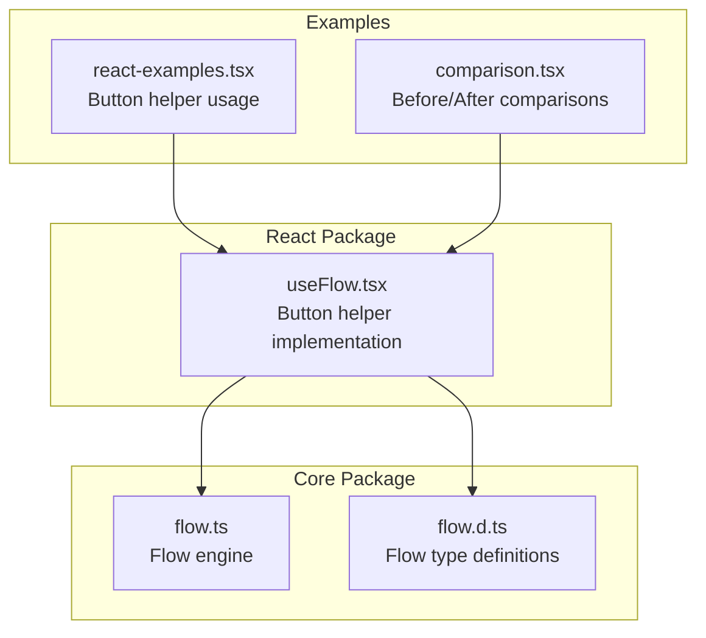
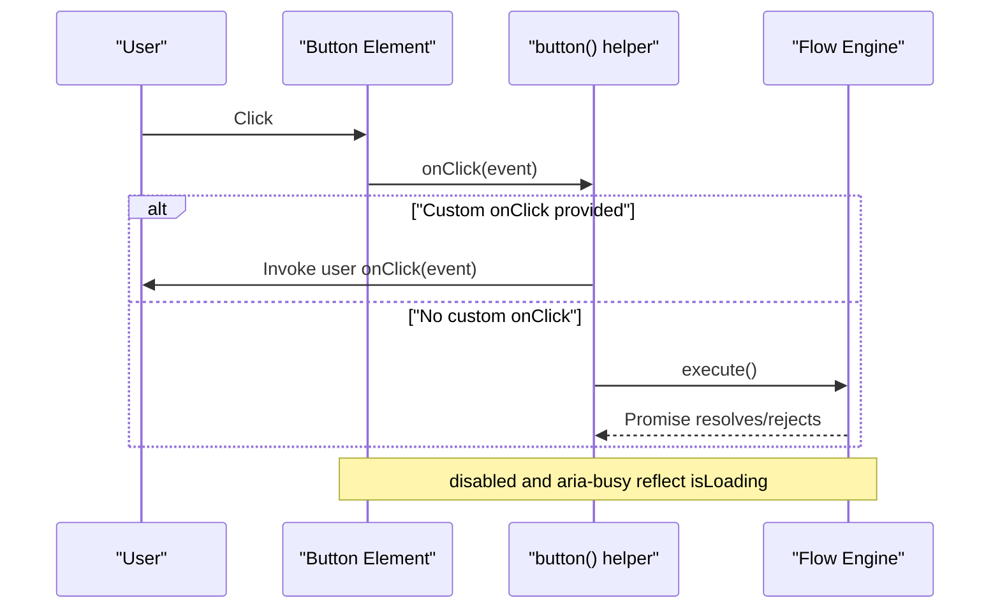
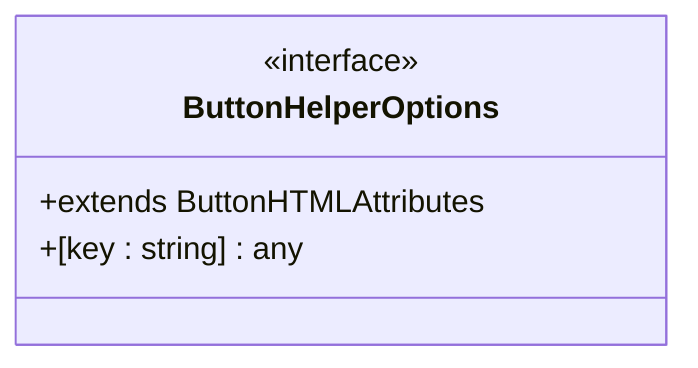
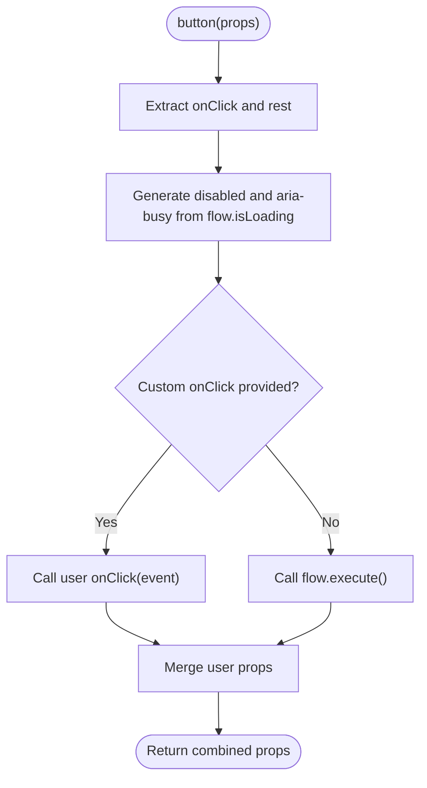
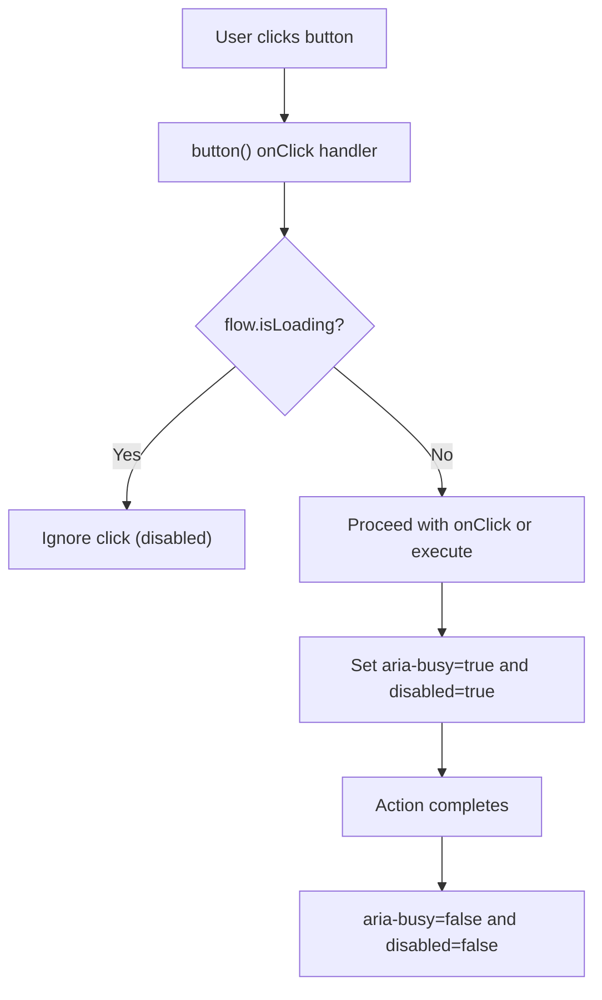
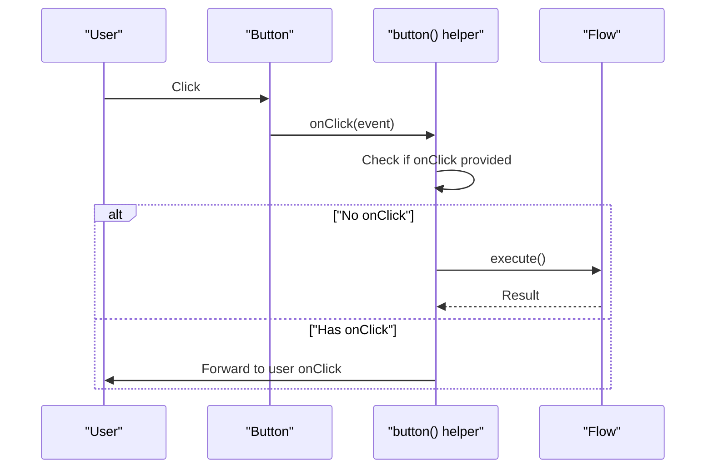
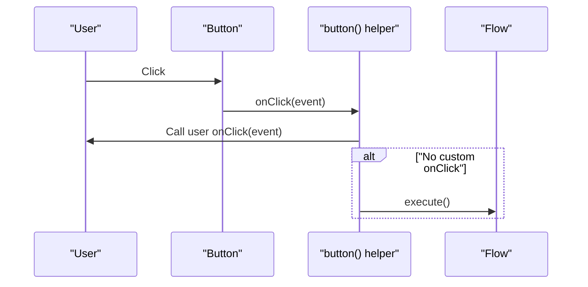
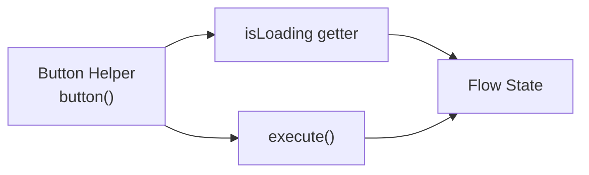

# Button Integration Helpers

<cite>
**Referenced Files in This Document**
- [useFlow.tsx](file://packages/react/src/useFlow.tsx)
- [flow.ts](file://packages/core/src/flow.ts)
- [flow.d.ts](file://packages/core/src/flow.d.ts)
- [react-examples.tsx](file://examples/react/react-examples.tsx)
- [comparison.tsx](file://examples/react/comparison.tsx)
- [useFlow.test.tsx](file://packages/react/src/useFlow.test.tsx)
</cite>

## Table of Contents

1. [Introduction](#introduction)
2. [Project Structure](#project-structure)
3. [Core Components](#core-components)
4. [Architecture Overview](#architecture-overview)
5. [Detailed Component Analysis](#detailed-component-analysis)
6. [Dependency Analysis](#dependency-analysis)
7. [Performance Considerations](#performance-considerations)
8. [Troubleshooting Guide](#troubleshooting-guide)
9. [Conclusion](#conclusion)

## Introduction

This document explains the button helper functionality in useFlow, focusing on the ButtonHelperOptions interface, automatic prop generation, disabled state management based on flow loading status, accessibility attributes (aria-busy), click event handling, automatic execution behavior, and integration patterns with UI libraries. It also covers conditional button states, accessibility considerations, and keyboard navigation support.

## Project Structure

The button helper lives in the React package and integrates with the core Flow engine. The examples demonstrate practical usage patterns across different scenarios.

**Diagram sources**

- [useFlow.tsx](file://packages/react/src/useFlow.tsx#L1-L281)
- [flow.ts](file://packages/core/src/flow.ts#L207-L770)
- [flow.d.ts](file://packages/core/src/flow.d.ts#L84-L177)
- [react-examples.tsx](file://examples/react/react-examples.tsx#L1-L491)
- [comparison.tsx](file://examples/react/comparison.tsx#L1-L246)

**Section sources**

- [useFlow.tsx](file://packages/react/src/useFlow.tsx#L1-L281)
- [flow.ts](file://packages/core/src/flow.ts#L207-L770)
- [react-examples.tsx](file://examples/react/react-examples.tsx#L1-L491)
- [comparison.tsx](file://examples/react/comparison.tsx#L1-L246)

## Core Components

- ButtonHelperOptions interface: Extends ButtonHTMLAttributes<HTMLButtonElement>, enabling full HTML button attribute support while allowing additional data-_ and aria-_ attributes.
- button helper: Generates button props including disabled and aria-busy based on flow.isLoading, and manages click events to either call a custom onClick or automatically execute the flow when no custom handler is provided.

Key behaviors:

- Disabled state mirrors isLoading from the Flow engine.
- aria-busy reflects isLoading for assistive technologies.
- Automatic execution occurs when no custom onClick is provided and the flow’s execute signature accepts zero arguments.

**Section sources**

- [useFlow.tsx](file://packages/react/src/useFlow.tsx#L41-L44)
- [useFlow.tsx](file://packages/react/src/useFlow.tsx#L174-L194)
- [flow.ts](file://packages/core/src/flow.ts#L305-L307)

## Architecture Overview

The button helper composes props from the underlying Flow state and merges them with user-provided props. It preserves any user-specified onClick handler while ensuring the button remains disabled and accessible during loading.

**Diagram sources**

- [useFlow.tsx](file://packages/react/src/useFlow.tsx#L174-L194)
- [flow.ts](file://packages/core/src/flow.ts#L305-L307)

## Detailed Component Analysis

### ButtonHelperOptions Interface

- Purpose: Provides a strongly-typed way to pass button attributes to the helper while preserving full HTML button semantics.
- Extends ButtonHTMLAttributes<HTMLButtonElement>: Ensures all native button attributes are supported.
- Allows arbitrary keys: Enables data-_ and aria-_ attributes for advanced customization.

**Diagram sources**

- [useFlow.tsx](file://packages/react/src/useFlow.tsx#L41-L44)

**Section sources**

- [useFlow.tsx](file://packages/react/src/useFlow.tsx#L41-L44)

### Button Helper Implementation

- Prop generation:
  - disabled: Mirrors flow.isLoading.
  - aria-busy: Mirrors flow.isLoading.
  - onClick: Wraps user-provided onClick or falls back to automatic flow execution.
- Automatic execution:
  - If no custom onClick is provided, clicking the button triggers flow.execute().
  - The helper assumes the flow’s execute signature can accept zero arguments; otherwise, provide a custom onClick or call execute manually.

**Diagram sources**

- [useFlow.tsx](file://packages/react/src/useFlow.tsx#L174-L194)

**Section sources**

- [useFlow.tsx](file://packages/react/src/useFlow.tsx#L174-L194)

### Loading State and Accessibility

- Disabled state: The button is disabled whenever flow.isLoading is true.
- aria-busy: Set to true when flow.isLoading is true, signaling assistive technologies that the button is busy.
- Live region: The hook exposes a LiveRegion component for automatic success/error announcements when configured.

**Diagram sources**

- [useFlow.tsx](file://packages/react/src/useFlow.tsx#L178-L180)
- [useFlow.tsx](file://packages/react/src/useFlow.tsx#L147-L168)
- [flow.ts](file://packages/core/src/flow.ts#L305-L307)

**Section sources**

- [useFlow.tsx](file://packages/react/src/useFlow.tsx#L178-L180)
- [useFlow.tsx](file://packages/react/src/useFlow.tsx#L147-L168)
- [flow.ts](file://packages/core/src/flow.ts#L305-L307)

### Automatic Execution Behavior

- When no custom onClick is provided, clicking the button triggers flow.execute().
- If the flow’s execute signature requires arguments, provide a custom onClick or call execute manually.

**Diagram sources**

- [useFlow.tsx](file://packages/react/src/useFlow.tsx#L181-L189)

**Section sources**

- [useFlow.tsx](file://packages/react/src/useFlow.tsx#L181-L189)

### Combining Custom Click Handlers with Flow Execution

- Provide a custom onClick to augment default behavior.
- The helper invokes your onClick first, then proceeds with automatic execution if no custom handler was provided.

**Diagram sources**

- [useFlow.tsx](file://packages/react/src/useFlow.tsx#L181-L189)

**Section sources**

- [useFlow.tsx](file://packages/react/src/useFlow.tsx#L181-L189)

### Button Types and Integration Patterns

- Submit buttons: Use type="submit" with the button helper to submit forms automatically.
- Button elements: Use type="button" for programmatic execution without form submission.
- Input elements: Not applicable for button helper; use standard input/button elements as needed.

Integration examples:

- Login form with submit button helper.
- Advanced form with submit button helper and validation.
- Manual button with explicit execute() call.

**Section sources**

- [react-examples.tsx](file://examples/react/react-examples.tsx#L82-L84)
- [react-examples.tsx](file://examples/react/react-examples.tsx#L483-L487)
- [comparison.tsx](file://examples/react/comparison.tsx#L187-L190)

### Integration with UI Libraries (Material-UI and Others)

- The button helper returns plain HTML button props; you can spread them onto any button-like component that accepts HTML attributes.
- For Material-UI Button, spread the helper props onto the component and ensure type and variant are set appropriately.
- For other UI libraries, ensure the component accepts HTML attributes (className, disabled, onClick, etc.).

Note: The examples demonstrate standard HTML button usage; Material-UI integration follows the same pattern by spreading helper props.

**Section sources**

- [react-examples.tsx](file://examples/react/react-examples.tsx#L82-L84)
- [react-examples.tsx](file://examples/react/react-examples.tsx#L483-L487)

### Conditional Button States

Common patterns:

- Disable button when loading: disabled={flow.loading}.
- Update button text conditionally: loading ? "Saving..." : "Save".
- Show success state after completion: status === "success".

These patterns apply whether using the button helper or manual button attributes.

**Section sources**

- [react-examples.tsx](file://examples/react/react-examples.tsx#L58-L60)
- [react-examples.tsx](file://examples/react/react-examples.tsx#L121-L122)
- [react-examples.tsx](file://examples/react/react-examples.tsx#L172-L173)
- [react-examples.tsx](file://examples/react/react-examples.tsx#L238-L242)

### Accessibility Considerations and Keyboard Navigation

- aria-busy: Reflects isLoading to inform assistive technologies that the button is busy.
- Disabled state: Prevents repeated submissions and ensures keyboard users cannot activate the button during loading.
- Live region: Announces success or error messages automatically when configured.
- Keyboard navigation: Standard HTML button behavior applies; disabled buttons are skipped by tab order.

**Section sources**

- [useFlow.tsx](file://packages/react/src/useFlow.tsx#L178-L180)
- [useFlow.tsx](file://packages/react/src/useFlow.tsx#L147-L168)
- [useFlow.tsx](file://packages/react/src/useFlow.tsx#L170-L173)

## Dependency Analysis

The button helper depends on the Flow engine for isLoading and execute. The Flow engine manages loading states, delays, and progress.

**Diagram sources**

- [useFlow.tsx](file://packages/react/src/useFlow.tsx#L174-L194)
- [flow.ts](file://packages/core/src/flow.ts#L305-L307)
- [flow.ts](file://packages/core/src/flow.ts#L436-L451)

**Section sources**

- [useFlow.tsx](file://packages/react/src/useFlow.tsx#L174-L194)
- [flow.ts](file://packages/core/src/flow.ts#L305-L307)
- [flow.ts](file://packages/core/src/flow.ts#L436-L451)

## Performance Considerations

- Loading delays and minimum durations: Configure loading options to avoid UI flashes for fast actions and ensure perceived loading stays visible long enough.
- Debounce/throttle: Consider using these options to reduce redundant executions when users trigger rapid clicks.

[No sources needed since this section provides general guidance]

## Troubleshooting Guide

- Button does not execute automatically:
  - Ensure no custom onClick is overriding the helper’s behavior.
  - Verify the flow’s execute signature accepts zero arguments; otherwise, provide a custom onClick or call execute manually.
- Button remains disabled after completion:
  - Confirm the flow’s loading state transitions correctly and that auto-reset is configured if needed.
- Accessibility issues:
  - Ensure aria-busy and disabled states align with isLoading.
  - Use the LiveRegion component for automatic announcements when appropriate.

**Section sources**

- [useFlow.tsx](file://packages/react/src/useFlow.tsx#L174-L194)
- [useFlow.test.tsx](file://packages/react/src/useFlow.test.tsx#L48-L66)
- [flow.ts](file://packages/core/src/flow.ts#L719-L729)

## Conclusion

The button helper simplifies button integration by automatically managing disabled and aria-busy states, providing seamless automatic execution when appropriate, and preserving user-defined click handlers. Combined with Flow’s loading controls and accessibility features, it enables robust, accessible, and user-friendly asynchronous interactions across various UI frameworks.
