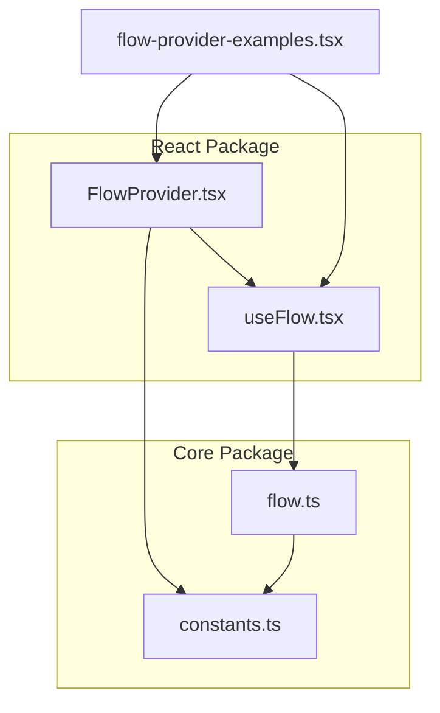
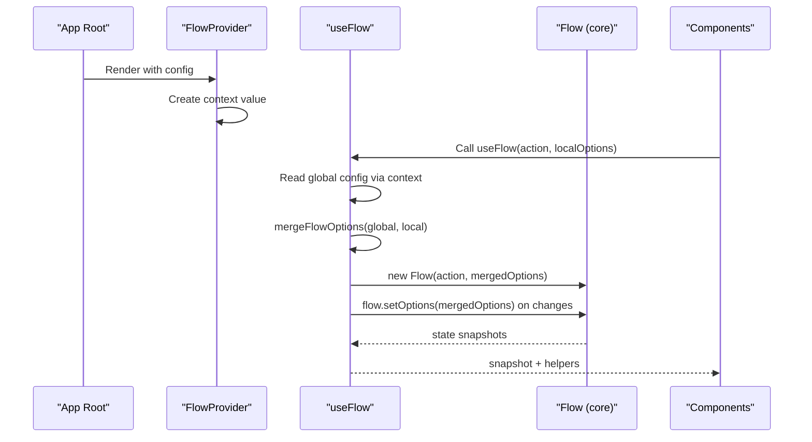
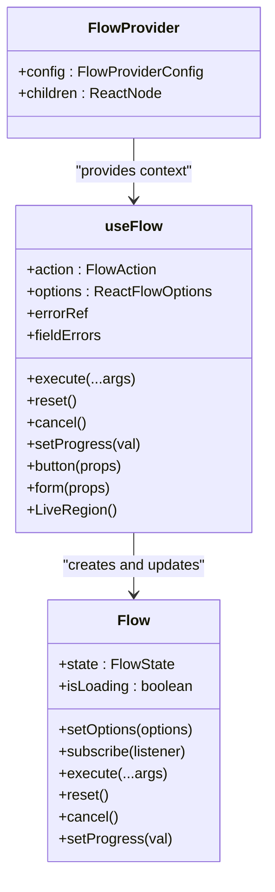
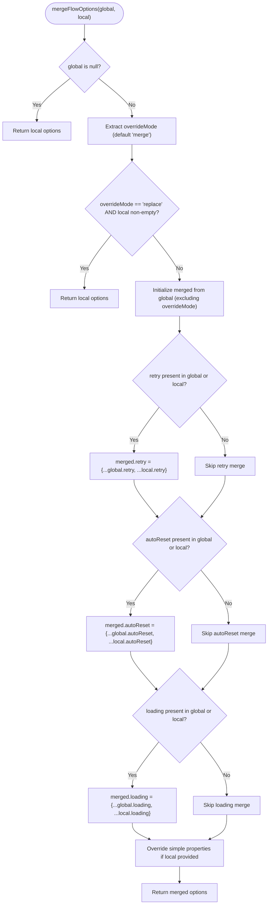
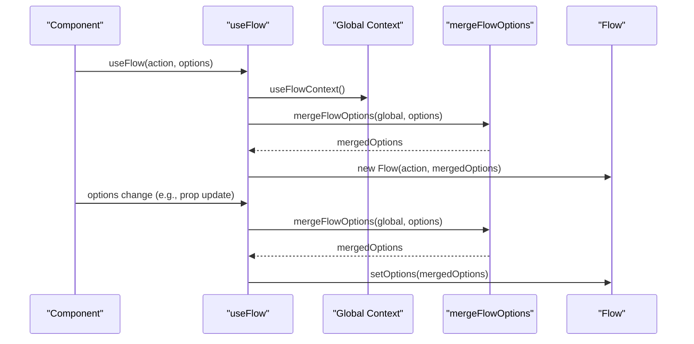
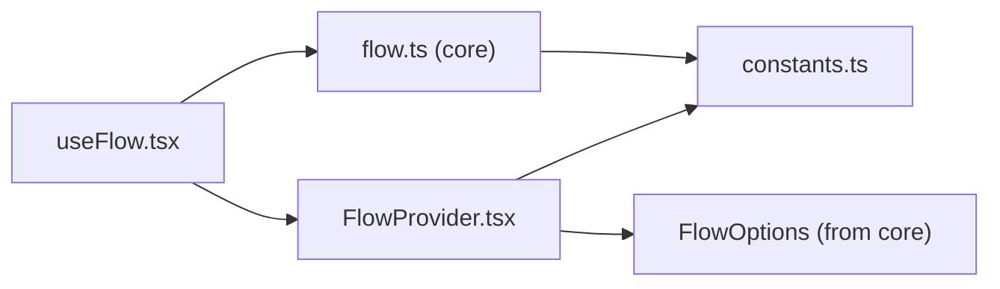

# FlowProvider Configuration

<cite>
**Referenced Files in This Document**
- [FlowProvider.tsx](file://packages/react/src/FlowProvider.tsx)
- [useFlow.tsx](file://packages/react/src/useFlow.tsx)
- [flow.ts](file://packages/core/src/flow.ts)
- [constants.ts](file://packages/core/src/constants.ts)
- [FlowProvider.test.tsx](file://packages/react/src/FlowProvider.test.tsx)
- [useFlow.test.tsx](file://packages/react/src/useFlow.test.tsx)
- [flow-provider-examples.tsx](file://examples/react/flow-provider-examples.tsx)
- [README.md](file://README.md)
- [react README.md](file://packages/react/README.md)
</cite>

## Table of Contents
1. [Introduction](#introduction)
2. [Project Structure](#project-structure)
3. [Core Components](#core-components)
4. [Architecture Overview](#architecture-overview)
5. [Detailed Component Analysis](#detailed-component-analysis)
6. [Dependency Analysis](#dependency-analysis)
7. [Performance Considerations](#performance-considerations)
8. [Troubleshooting Guide](#troubleshooting-guide)
9. [Conclusion](#conclusion)
10. [Appendices](#appendices)

## Introduction
This document explains the FlowProvider component and the global configuration system in AsyncFlowState. It covers how FlowProvider propagates configuration through React context, how useFlow consumes and merges options, and how hierarchical configuration works (global plus local overrides). It also documents the mergeFlowOptions function, override modes, dynamic updates, and best practices for setting up global defaults, component-level overrides, and handling configuration conflicts.

## Project Structure
The configuration system spans two packages:
- @asyncflowstate/react: React integration with FlowProvider, useFlow hook, and configuration merging.
- @asyncflowstate/core: Framework-agnostic Flow engine that applies the merged options.

**Diagram sources**
- [FlowProvider.tsx](file://packages/react/src/FlowProvider.tsx#L1-L139)
- [useFlow.tsx](file://packages/react/src/useFlow.tsx#L1-L281)
- [flow.ts](file://packages/core/src/flow.ts#L1-L796)
- [constants.ts](file://packages/core/src/constants.ts#L1-L51)
- [flow-provider-examples.tsx](file://examples/react/flow-provider-examples.tsx#L1-L368)

**Section sources**
- [README.md](file://README.md#L108-L118)
- [react README.md](file://packages/react/README.md#L33-L80)

## Core Components
- FlowProvider: A React component that exposes a global configuration via context. It accepts a config object that defines default behavior for all flows within its subtree.
- useFlow: A React hook that creates and manages a Flow instance. It reads the global config from context, merges it with local options, and keeps the Flow instance synchronized with any changes.
- mergeFlowOptions: A deterministic function that merges global and local FlowOptions, respecting overrideMode and deep-merging nested objects.

Key responsibilities:
- FlowProvider: Provide global defaults and propagate them to descendants.
- useFlow: Persist action and options, initialize Flow with merged options, and sync Flow options when either global or local options change.
- mergeFlowOptions: Implement merge semantics for nested retry/autoReset/loading options and simple overrides.

**Section sources**
- [FlowProvider.tsx](file://packages/react/src/FlowProvider.tsx#L22-L66)
- [useFlow.tsx](file://packages/react/src/useFlow.tsx#L77-L115)
- [FlowProvider.tsx](file://packages/react/src/FlowProvider.tsx#L76-L138)

## Architecture Overview
The configuration architecture is hierarchical and context-driven:

**Diagram sources**
- [FlowProvider.tsx](file://packages/react/src/FlowProvider.tsx#L50-L56)
- [useFlow.tsx](file://packages/react/src/useFlow.tsx#L81-L115)
- [flow.ts](file://packages/core/src/flow.ts#L269-L290)

## Detailed Component Analysis

### FlowProvider Component
- Purpose: Provide global defaults for all flows within its subtree.
- Context: Uses a React Context to share FlowProviderConfig with descendants.
- Props:
  - config?: FlowProviderConfig (global defaults)
  - children: ReactNode
- Behavior:
  - Renders a Provider with value equal to config or null.
  - useFlow reads this value via useFlowContext.

Override mode:
- overrideMode?: "merge" | "replace"
  - "merge" (default): Merge global and local options; local takes precedence for simple properties.
  - "replace": Use only local options when provided.

**Section sources**
- [FlowProvider.tsx](file://packages/react/src/FlowProvider.tsx#L27-L66)

### mergeFlowOptions Function
Purpose: Merge global and local FlowOptions deterministically.

Behavior:
- If no global config, return local options.
- Extract overrideMode from global config (defaults to "merge").
- If overrideMode is "replace" and local options exist, return local options.
- For nested objects (retry, autoReset, loading):
  - Deep merge global and local properties.
- For simple properties (onSuccess, onError, concurrency, optimisticResult):
  - If local is provided, use local.
  - If local is not provided but global exists, use global.

Complexity:
- Time: O(N) over the keys of options, with constant-time deep merges per nested object.
- Space: O(N) for the merged object.

Edge cases:
- Empty global config: Return local options.
- Empty local options: Return global options (except overrideMode "replace" with non-empty local).
- Nested objects absent in one side: Use the present side’s object.

**Section sources**
- [FlowProvider.tsx](file://packages/react/src/FlowProvider.tsx#L76-L138)

### useFlow Hook and Context Consumption
- Reads global config via useFlowContext.
- Persists action and options via refs to avoid recreating Flow unnecessarily.
- Initializes Flow with merged options computed once.
- Synchronizes Flow options whenever global or local options change.
- Subscribes to Flow state and exposes helpers (button, form, LiveRegion, errorRef, fieldErrors).

Dynamic updates:
- useEffect subscribes to [flow, options, globalConfig].
- On change, recomputes merged options and calls flow.setOptions.

Accessibility and helpers:
- Provides button() and form() helpers that inject disabled/aria-busy props and handle validation/form data extraction.
- LiveRegion component for screen reader announcements.
- errorRef for auto-focusing error messages.

**Section sources**
- [useFlow.tsx](file://packages/react/src/useFlow.tsx#L77-L115)
- [useFlow.tsx](file://packages/react/src/useFlow.tsx#L174-L249)
- [useFlow.tsx](file://packages/react/src/useFlow.tsx#L147-L168)

### Flow Engine Integration
- Flow.setOptions performs a shallow merge of the provided options with existing ones.
- This ensures runtime updates to options are additive and consistent with mergeFlowOptions behavior.

**Section sources**
- [flow.ts](file://packages/core/src/flow.ts#L288-L290)

### Configuration Inheritance Pattern and Override Modes
- Inheritance: Descendants inherit the nearest FlowProvider’s config in React context.
- Override modes:
  - "merge": Merge nested objects and override simple properties locally.
  - "replace": Use only local options when provided; ignore global.

Nested providers:
- Multiple FlowProviders can be nested. Inner providers override outer ones for their subtree.

**Section sources**
- [FlowProvider.tsx](file://packages/react/src/FlowProvider.tsx#L16-L16)
- [FlowProvider.test.tsx](file://packages/react/src/FlowProvider.test.tsx#L114-L147)

### Examples and Best Practices
- Global error handling: Configure onError once globally and rely on it in all flows.
- Global retry: Set retry policy globally and override only specific fields locally.
- UX polish: Configure loading and autoReset globally for consistent UX.
- Nested sections: Use nested FlowProviders to tailor behavior per section.
- Component-level overrides: Pass local options to useFlow to override global defaults selectively.

**Section sources**
- [flow-provider-examples.tsx](file://examples/react/flow-provider-examples.tsx#L59-L95)
- [flow-provider-examples.tsx](file://examples/react/flow-provider-examples.tsx#L101-L155)
- [flow-provider-examples.tsx](file://examples/react/flow-provider-examples.tsx#L161-L205)
- [flow-provider-examples.tsx](file://examples/react/flow-provider-examples.tsx#L211-L271)
- [flow-provider-examples.tsx](file://examples/react/flow-provider-examples.tsx#L277-L367)

## Architecture Overview

**Diagram sources**
- [FlowProvider.tsx](file://packages/react/src/FlowProvider.tsx#L50-L66)
- [useFlow.tsx](file://packages/react/src/useFlow.tsx#L77-L115)
- [flow.ts](file://packages/core/src/flow.ts#L220-L290)

## Detailed Component Analysis

### mergeFlowOptions Implementation Details

**Diagram sources**
- [FlowProvider.tsx](file://packages/react/src/FlowProvider.tsx#L76-L138)

**Section sources**
- [FlowProvider.tsx](file://packages/react/src/FlowProvider.tsx#L76-L138)

### Configuration Change Flow in useFlow

**Diagram sources**
- [useFlow.tsx](file://packages/react/src/useFlow.tsx#L81-L115)
- [FlowProvider.tsx](file://packages/react/src/FlowProvider.tsx#L76-L138)
- [flow.ts](file://packages/core/src/flow.ts#L288-L290)

**Section sources**
- [useFlow.tsx](file://packages/react/src/useFlow.tsx#L81-L115)
- [flow.ts](file://packages/core/src/flow.ts#L288-L290)

## Dependency Analysis
- FlowProvider depends on:
  - React Context API for configuration propagation.
  - FlowOptions type from @asyncflowstate/core.
- useFlow depends on:
  - FlowProvider’s context and mergeFlowOptions.
  - Flow engine from @asyncflowstate/core.
- Flow engine depends on:
  - Constants for defaults (DEFAULT_RETRY, DEFAULT_LOADING, DEFAULT_CONCURRENCY).

**Diagram sources**
- [FlowProvider.tsx](file://packages/react/src/FlowProvider.tsx#L1-L2)
- [useFlow.tsx](file://packages/react/src/useFlow.tsx#L9-L10)
- [flow.ts](file://packages/core/src/flow.ts#L1-L8)
- [constants.ts](file://packages/core/src/constants.ts#L1-L51)

**Section sources**
- [FlowProvider.tsx](file://packages/react/src/FlowProvider.tsx#L1-L2)
- [useFlow.tsx](file://packages/react/src/useFlow.tsx#L9-L10)
- [flow.ts](file://packages/core/src/flow.ts#L1-L8)

## Performance Considerations
- Context reads are O(1); merging is O(N) over option keys.
- mergeFlowOptions performs shallow merges for nested objects and simple overrides, minimizing overhead.
- useFlow persists action and options via refs to avoid recreating Flow instances unnecessarily.
- useEffect dependencies ensure Flow.setOptions is called only when global or local options change.
- Defaults from constants reduce runtime branching and memory footprint.

[No sources needed since this section provides general guidance]

## Troubleshooting Guide
Common issues and resolutions:
- Global config not applied:
  - Ensure FlowProvider wraps the component using useFlow.
  - Verify useFlowContext returns the expected config in tests or dev tools.
- Local overrides not taking effect:
  - Confirm overrideMode is "merge" (default) and local options are provided.
  - For "replace", ensure local options are non-empty.
- Nested providers conflict:
  - Inner FlowProvider overrides outer config for its subtree.
  - Use separate contexts to isolate sections.
- Dynamic updates not reflected:
  - Ensure options passed to useFlow change identity or values to trigger useEffect.
  - Remember Flow.setOptions merges shallowly; pass only changed fields.

Validation and behavior are covered by tests:
- Context propagation and null fallback.
- Deep merge of nested options.
- Override mode "replace".
- Nested providers with different configs.
- Empty global config handling.

**Section sources**
- [FlowProvider.test.tsx](file://packages/react/src/FlowProvider.test.tsx#L8-L26)
- [FlowProvider.test.tsx](file://packages/react/src/FlowProvider.test.tsx#L28-L49)
- [FlowProvider.test.tsx](file://packages/react/src/FlowProvider.test.tsx#L68-L84)
- [FlowProvider.test.tsx](file://packages/react/src/FlowProvider.test.tsx#L114-L147)
- [FlowProvider.test.tsx](file://packages/react/src/FlowProvider.test.tsx#L149-L157)
- [FlowProvider.test.tsx](file://packages/react/src/FlowProvider.test.tsx#L159-L182)

## Conclusion
FlowProvider enables a clean, hierarchical configuration model for AsyncFlowState. By combining React context with a deterministic merge function, it lets teams define global defaults once while retaining fine-grained control at the component level. The system supports nested providers, override modes, and dynamic updates, making it suitable for diverse UI behaviors across applications.

[No sources needed since this section summarizes without analyzing specific files]

## Appendices

### Configuration Scenarios and Patterns
- Global error handling with toast notifications.
- Global retry configuration with exponential backoff.
- UX polish with loading minDuration and delay.
- Nested providers for admin vs. regular sections.
- Production-grade setup with onSuccess, retry filtering, autoReset, and concurrency.

**Section sources**
- [flow-provider-examples.tsx](file://examples/react/flow-provider-examples.tsx#L11-L95)
- [flow-provider-examples.tsx](file://examples/react/flow-provider-examples.tsx#L98-L155)
- [flow-provider-examples.tsx](file://examples/react/flow-provider-examples.tsx#L158-L205)
- [flow-provider-examples.tsx](file://examples/react/flow-provider-examples.tsx#L208-L271)
- [flow-provider-examples.tsx](file://examples/react/flow-provider-examples.tsx#L274-L367)

### API and Types Overview
- FlowProviderConfig extends FlowOptions and adds overrideMode.
- ReactFlowOptions extends FlowOptions and adds a11y.
- FlowOptions includes onSuccess, onError, retry, autoReset, loading, concurrency, debounce, throttle, optimisticResult, rollbackOnError.

**Section sources**
- [FlowProvider.tsx](file://packages/react/src/FlowProvider.tsx#L7-L17)
- [useFlow.tsx](file://packages/react/src/useFlow.tsx#L61-L67)
- [flow.ts](file://packages/core/src/flow.ts#L99-L160)