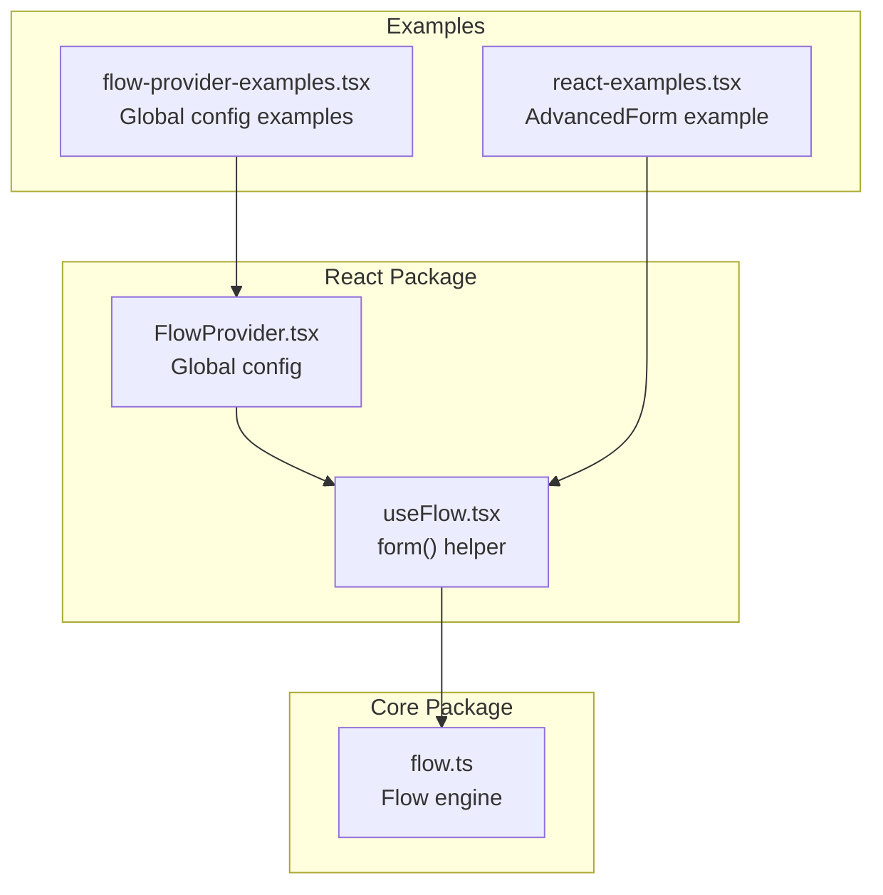
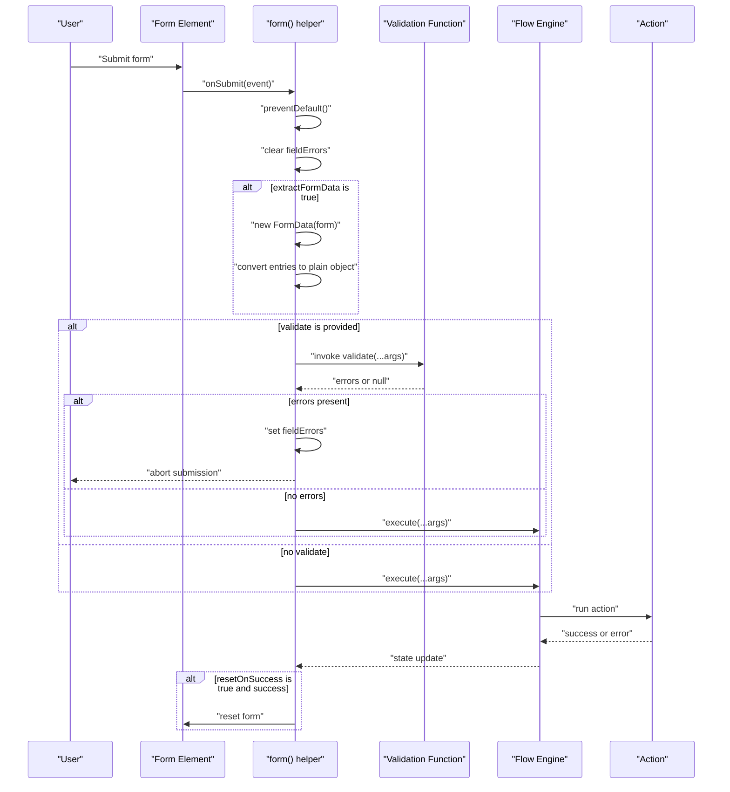
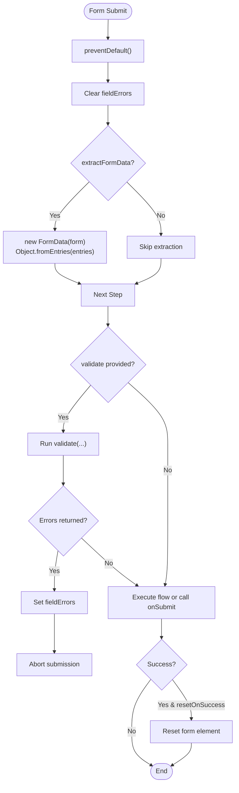
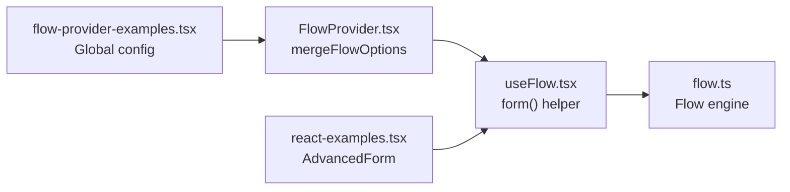

# Form Integration Helpers

<cite>
**Referenced Files in This Document**
- [useFlow.tsx](file://packages/react/src/useFlow.tsx)
- [FlowProvider.tsx](file://packages/react/src/FlowProvider.tsx)
- [flow.ts](file://packages/core/src/flow.ts)
- [react-examples.tsx](file://examples/react/react-examples.tsx)
- [flow-provider-examples.tsx](file://examples/react/flow-provider-examples.tsx)
- [README.md](file://packages/react/README.md)
</cite>

## Table of Contents
1. [Introduction](#introduction)
2. [Project Structure](#project-structure)
3. [Core Components](#core-components)
4. [Architecture Overview](#architecture-overview)
5. [Detailed Component Analysis](#detailed-component-analysis)
6. [Dependency Analysis](#dependency-analysis)
7. [Performance Considerations](#performance-considerations)
8. [Troubleshooting Guide](#troubleshooting-guide)
9. [Conclusion](#conclusion)
10. [Appendices](#appendices)

## Introduction
This document explains the form helper functionality within useFlow, focusing on the FormHelperOptions interface and the form() helper. It covers automatic FormData extraction, validation integration, field error management, and the complete form submission lifecycle. Practical examples demonstrate integration with HTML forms, controlled components, and popular form libraries. It also addresses common patterns such as conditional validation, async validation, and error boundary handling.

## Project Structure
The form helper lives in the React package and integrates with the core Flow engine. The key files are:
- React form helper and options: packages/react/src/useFlow.tsx
- Global configuration provider: packages/react/src/FlowProvider.tsx
- Core Flow engine: packages/core/src/flow.ts
- Examples demonstrating form usage: examples/react/react-examples.tsx and examples/react/flow-provider-examples.tsx
- React package documentation: packages/react/README.md

**Diagram sources**
- [useFlow.tsx](file://packages/react/src/useFlow.tsx#L15-L36)
- [FlowProvider.tsx](file://packages/react/src/FlowProvider.tsx#L1-L139)
- [flow.ts](file://packages/core/src/flow.ts#L174-L709)
- [react-examples.tsx](file://examples/react/react-examples.tsx#L421-L490)
- [flow-provider-examples.tsx](file://examples/react/flow-provider-examples.tsx#L1-L368)

**Section sources**
- [useFlow.tsx](file://packages/react/src/useFlow.tsx#L1-L281)
- [FlowProvider.tsx](file://packages/react/src/FlowProvider.tsx#L1-L139)
- [flow.ts](file://packages/core/src/flow.ts#L1-L709)
- [react-examples.tsx](file://examples/react/react-examples.tsx#L1-L491)
- [flow-provider-examples.tsx](file://examples/react/flow-provider-examples.tsx#L1-L368)
- [README.md](file://packages/react/README.md#L92-L114)

## Core Components
- FormHelperOptions interface defines the contract for the form() helper:
  - extractFormData: boolean — enables automatic FormData extraction and passes a plain object as the first argument to the action.
  - validate: function — optional validation function returning field-level errors or null/undefined; supports sync and async validation.
  - resetOnSuccess: boolean — resets the form element after successful action completion.
  - Additional HTML attributes are supported via spread props.
- The form() helper:
  - Prevents default form submission.
  - Clears previous field errors.
  - Optionally extracts form data using new FormData(form) and converts it to a plain object.
  - Executes validation if provided; displays field errors and aborts submission if validation fails.
  - Executes the flow action or calls an optional onSubmit handler.
  - Optionally resets the form on success.

**Section sources**
- [useFlow.tsx](file://packages/react/src/useFlow.tsx#L15-L36)
- [useFlow.tsx](file://packages/react/src/useFlow.tsx#L200-L249)

## Architecture Overview
The form helper orchestrates the submission lifecycle by coordinating React state, validation, and the Flow engine.

**Diagram sources**
- [useFlow.tsx](file://packages/react/src/useFlow.tsx#L200-L249)
- [flow.ts](file://packages/core/src/flow.ts#L400-L533)

## Detailed Component Analysis

### FormHelperOptions Interface
- Purpose: Configure the form() helper behavior.
- Properties:
  - extractFormData: When true, automatically creates a FormData instance from the form element and converts it to a plain object passed as the first argument to the action.
  - validate: Optional function receiving the same arguments as the action. It can return:
    - A record of field-level errors keyed by field names.
    - null or undefined to indicate success.
    - A Promise resolving to any of the above for async validation.
  - resetOnSuccess: When true, resets the form element after a successful action completion.
  - Spread HTML attributes: Other props are forwarded to the form element.

Implementation highlights:
- Automatic FormData extraction uses new FormData(form) and Object.fromEntries(entries).
- Validation runs before action execution; field errors are stored in fieldErrors state.
- Optional form reset occurs after successful completion when resetOnSuccess is true.

**Section sources**
- [useFlow.tsx](file://packages/react/src/useFlow.tsx#L15-L36)
- [useFlow.tsx](file://packages/react/src/useFlow.tsx#L200-L249)

### Form Submission Lifecycle
- Prevent default: The form’s onSubmit handler prevents the default submission behavior.
- Clear field errors: Resets fieldErrors to ensure stale errors are cleared.
- Extract form data: If extractFormData is true, collects values from the form and passes them as the first argument to the action.
- Validation: If a validate function is provided, it is awaited. If it returns errors, fieldErrors is set and submission is aborted.
- Execution:
  - If an onSubmit handler is provided, it is invoked with the event.
  - Otherwise, the flow executes with the prepared arguments.
- Reset on success: If resetOnSuccess is true and the action returns a value, the form element is reset.

**Diagram sources**
- [useFlow.tsx](file://packages/react/src/useFlow.tsx#L200-L249)

**Section sources**
- [useFlow.tsx](file://packages/react/src/useFlow.tsx#L200-L249)

### Validation Integration Patterns
- Synchronous validation: Return a record of errors or null.
- Asynchronous validation: Return a Promise resolving to a record of errors or null.
- Conditional validation: The validate function receives the same arguments as the action, enabling conditional checks based on the current form state or submitted data.

Practical example from the repository demonstrates synchronous validation with field-level errors and conditional checks.

**Section sources**
- [useFlow.tsx](file://packages/react/src/useFlow.tsx#L25-L31)
- [react-examples.tsx](file://examples/react/react-examples.tsx#L448-L453)

### Field Error Management
- The form helper maintains fieldErrors state and updates it when validation returns errors.
- Components can render field-level error messages using flow.fieldErrors.
- The helper does not mutate DOM nodes; it exposes fieldErrors for consumers to render.

**Section sources**
- [useFlow.tsx](file://packages/react/src/useFlow.tsx#L109-L110)
- [useFlow.tsx](file://packages/react/src/useFlow.tsx#L231-L232)
- [react-examples.tsx](file://examples/react/react-examples.tsx#L461-L476)

### Integration with HTML Forms and Controlled Components
- HTML forms: Apply {...flow.form({...})} to bind the form element and enable automatic submission handling.
- Controlled components: Manage form state with React state and pass the collected data to flow.execute or use extractFormData to auto-collect values.
- The form helper forwards additional props to the form element, allowing standard attributes and event handlers.

**Section sources**
- [useFlow.tsx](file://packages/react/src/useFlow.tsx#L200-L249)
- [react-examples.tsx](file://examples/react/react-examples.tsx#L421-L490)

### Integration with Popular Form Libraries
- React Hook Form:
  - Use extractFormData: true to capture values from the form element.
  - Use validate to integrate with React Hook Form’s resolver or manual validation.
  - Render field errors from flow.fieldErrors alongside RHF’s error messages.
- Formik:
  - Use extractFormData: true to collect values.
  - Use validate to integrate with Formik’s validation pipeline.
  - Render field errors from flow.fieldErrors for server-side or async validations.

Note: The repository does not include explicit RHF or Formik examples; the above describes recommended integration patterns based on the form helper’s capabilities.

**Section sources**
- [useFlow.tsx](file://packages/react/src/useFlow.tsx#L15-L36)
- [useFlow.tsx](file://packages/react/src/useFlow.tsx#L200-L249)

### Practical Examples
- AdvancedForm example:
  - Demonstrates extractFormData: true, resetOnSuccess: true, and validate returning field-level errors.
  - Renders fieldErrors for title and category.
  - Uses accessibility LiveRegion for announcements.
- ProfileForm example:
  - Shows the form helper used with manual execute and autoReset configuration.
- FlowProvider examples:
  - Demonstrates global configuration inheritance and overrides.

**Section sources**
- [react-examples.tsx](file://examples/react/react-examples.tsx#L421-L490)
- [react-examples.tsx](file://examples/react/react-examples.tsx#L186-L245)
- [flow-provider-examples.tsx](file://examples/react/flow-provider-examples.tsx#L1-L368)

## Dependency Analysis
The form helper depends on the Flow engine for execution and state management. Global configuration can be provided via FlowProvider, which merges global and local options.

**Diagram sources**
- [useFlow.tsx](file://packages/react/src/useFlow.tsx#L1-L281)
- [FlowProvider.tsx](file://packages/react/src/FlowProvider.tsx#L76-L138)
- [flow.ts](file://packages/core/src/flow.ts#L174-L709)
- [react-examples.tsx](file://examples/react/react-examples.tsx#L421-L490)
- [flow-provider-examples.tsx](file://examples/react/flow-provider-examples.tsx#L1-L368)

**Section sources**
- [useFlow.tsx](file://packages/react/src/useFlow.tsx#L1-L281)
- [FlowProvider.tsx](file://packages/react/src/FlowProvider.tsx#L76-L138)
- [flow.ts](file://packages/core/src/flow.ts#L174-L709)

## Performance Considerations
- Loading perception: Combine form() with Flow options like loading.minDuration and loading.delay to prevent UI flicker during fast submissions.
- Debounce/throttle: Use Flow options to debounce or throttle repeated submissions if needed.
- Concurrency: Choose a concurrency strategy to handle rapid submissions gracefully.

**Section sources**
- [flow.ts](file://packages/core/src/flow.ts#L89-L127)
- [flow.ts](file://packages/core/src/flow.ts#L400-L415)

## Troubleshooting Guide
- Validation not triggering:
  - Ensure validate is provided and returns either null/undefined (success) or a record of errors.
  - Confirm that extractFormData is set appropriately so the correct arguments are passed to validate.
- Field errors not displaying:
  - Verify that fieldErrors is rendered in the component tree using keys matching the field names returned by validate.
- Form not resetting:
  - Ensure resetOnSuccess is true and the action returns a value; the form element will be reset after successful completion.
- Global configuration conflicts:
  - Use FlowProvider.mergeFlowOptions to understand how global and local options are merged; confirm overrideMode behavior if needed.

**Section sources**
- [useFlow.tsx](file://packages/react/src/useFlow.tsx#L200-L249)
- [FlowProvider.tsx](file://packages/react/src/FlowProvider.tsx#L76-L138)

## Conclusion
The form helper in useFlow provides a robust, declarative way to manage form submissions with automatic FormData extraction, validation integration, and field error management. By leveraging the Flow engine and optional global configuration, developers can build accessible, resilient forms with minimal boilerplate. The helper supports both controlled components and integration with popular form libraries, enabling flexible patterns for modern React applications.

## Appendices
- API reference for the form helper is documented in the React package README under the “Core Helpers” section.
- Additional examples and patterns are available in the examples directory.

**Section sources**
- [README.md](file://packages/react/README.md#L92-L114)
- [react-examples.tsx](file://examples/react/react-examples.tsx#L1-L491)
- [flow-provider-examples.tsx](file://examples/react/flow-provider-examples.tsx#L1-L368)