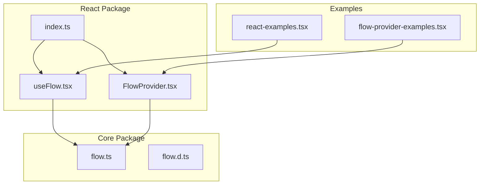
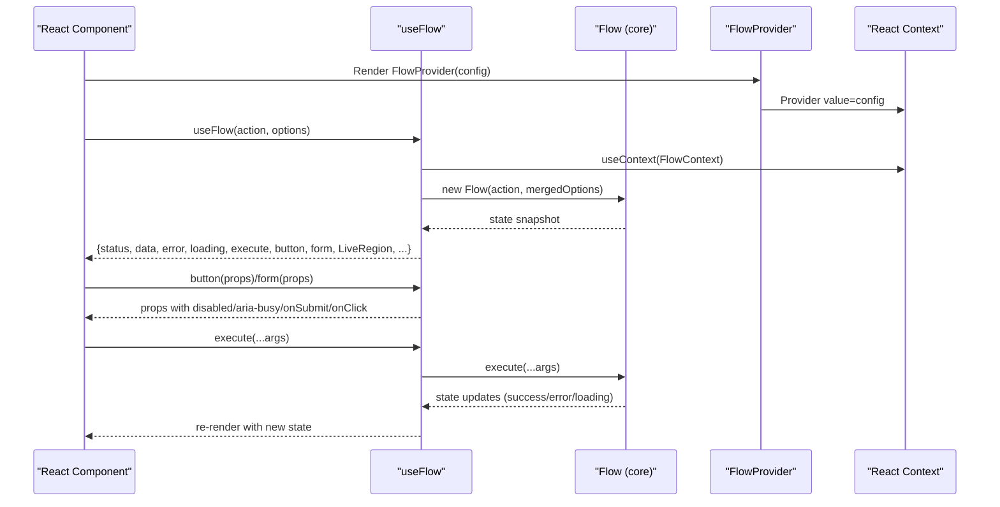
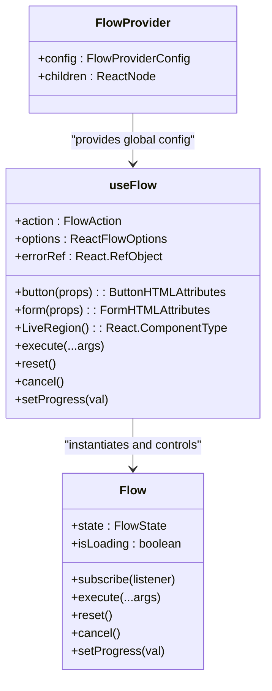
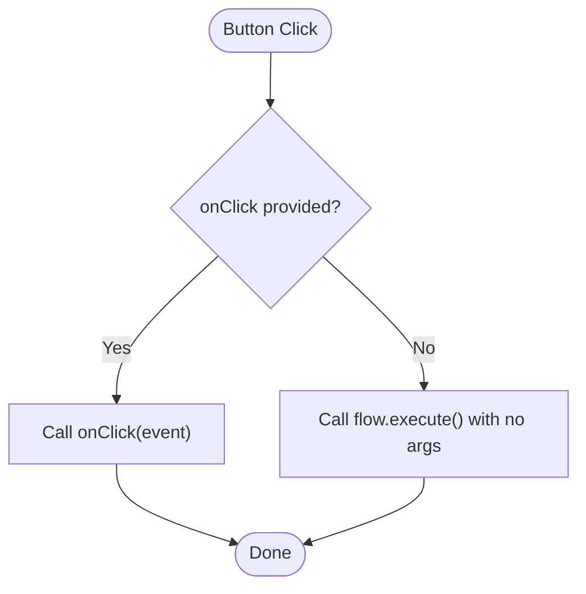
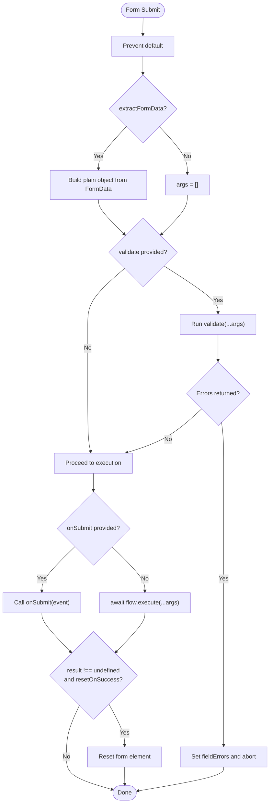
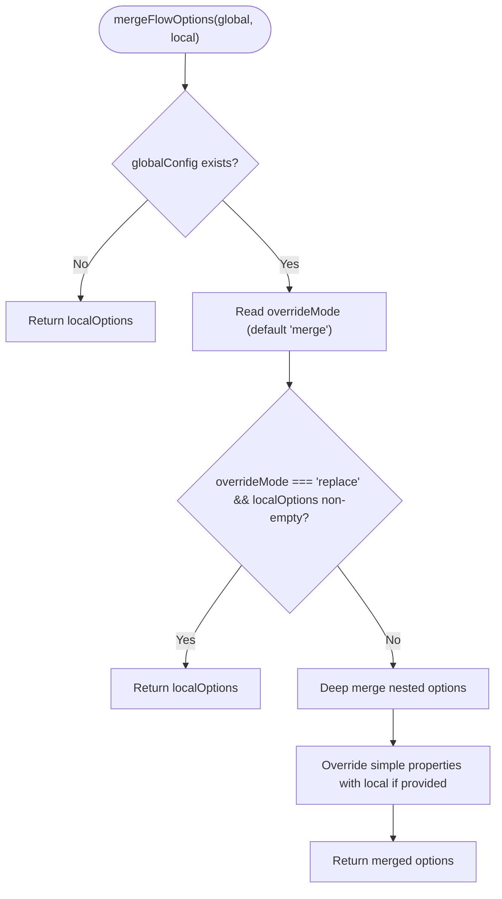
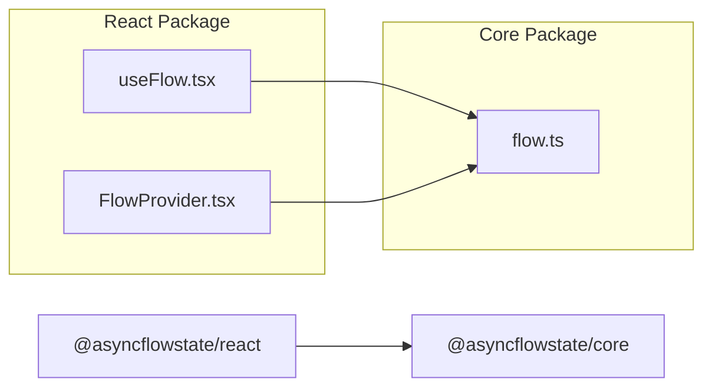

# React Integration

<cite>
**Referenced Files in This Document**
- [useFlow.tsx](file://packages/react/src/useFlow.tsx)
- [FlowProvider.tsx](file://packages/react/src/FlowProvider.tsx)
- [index.ts](file://packages/react/src/index.ts)
- [flow.ts](file://packages/core/src/flow.ts)
- [flow.d.ts](file://packages/core/src/flow.d.ts)
- [react-examples.tsx](file://examples/react/react-examples.tsx)
- [flow-provider-examples.tsx](file://examples/react/flow-provider-examples.tsx)
- [useFlow.test.tsx](file://packages/react/src/useFlow.test.tsx)
- [FlowProvider.test.tsx](file://packages/react/src/FlowProvider.test.tsx)
- [README.md](file://packages/react/README.md)
</cite>

## Table of Contents

1. [Introduction](#introduction)
2. [Project Structure](#project-structure)
3. [Core Components](#core-components)
4. [Architecture Overview](#architecture-overview)
5. [Detailed Component Analysis](#detailed-component-analysis)
6. [Dependency Analysis](#dependency-analysis)
7. [Performance Considerations](#performance-considerations)
8. [Troubleshooting Guide](#troubleshooting-guide)
9. [Conclusion](#conclusion)
10. [Appendices](#appendices)

## Introduction

This document explains how to integrate AsyncFlowState with React applications. It focuses on the useFlow hook API, including parameters, return values, form helpers, button props generation, and accessibility features. It also documents the FlowProvider component for global configuration, option merging strategies, and context propagation. Practical examples demonstrate common React patterns, component composition, and integration with popular React ecosystems.

## Project Structure

The React integration lives in the @asyncflowstate/react package and builds upon @asyncflowstate/core. The React package exports useFlow and FlowProvider, while the core package provides the Flow engine and its types.

**Diagram sources**

- [useFlow.tsx](file://packages/react/src/useFlow.tsx#L1-L281)
- [FlowProvider.tsx](file://packages/react/src/FlowProvider.tsx#L1-L139)
- [index.ts](file://packages/react/src/index.ts#L1-L3)
- [flow.ts](file://packages/core/src/flow.ts#L1-L709)
- [flow.d.ts](file://packages/core/src/flow.d.ts#L1-L177)
- [react-examples.tsx](file://examples/react/react-examples.tsx#L1-L491)
- [flow-provider-examples.tsx](file://examples/react/flow-provider-examples.tsx#L1-L368)

**Section sources**

- [index.ts](file://packages/react/src/index.ts#L1-L3)
- [README.md](file://packages/react/README.md#L1-L212)

## Core Components

- useFlow: A React hook that orchestrates asynchronous actions and exposes a reactive Flow state snapshot plus helpers for buttons and forms. It integrates with FlowProvider for global configuration and provides accessibility features like ARIA live regions and error focus management.
- useInfiniteFlow: A specialized hook for handling paginated data, maintaining a list of pages and providing `fetchNextPage` capabilities.
- FlowProvider: A React context provider that supplies global Flow options to descendant flows. It merges global and local options with configurable override modes.

Key responsibilities:

- useFlow: Initializes a Flow instance, subscribes to state changes, manages accessibility, and exposes helpers for buttons and forms.
- FlowProvider: Provides global configuration via React Context and merges options with local useFlow options.

**Section sources**

- [useFlow.tsx](file://packages/react/src/useFlow.tsx#L77-L281)
- [FlowProvider.tsx](file://packages/react/src/FlowProvider.tsx#L50-L139)

## Architecture Overview

The React integration composes Flow (core) with React hooks and context to deliver a declarative, accessible, and ergonomic API for async UI behavior.

**Diagram sources**

- [useFlow.tsx](file://packages/react/src/useFlow.tsx#L77-L281)
- [FlowProvider.tsx](file://packages/react/src/FlowProvider.tsx#L50-L139)
- [flow.ts](file://packages/core/src/flow.ts#L174-L415)

## Detailed Component Analysis

### useFlow Hook API

- Purpose: Manage async actions and expose a reactive Flow state snapshot plus helpers for buttons and forms.
- Parameters:
  - action: An async function to manage.
  - options: ReactFlowOptions extending FlowOptions with a11y configuration.
- Returns: An object combining Flow state, helpers, and accessibility utilities.

Key return values and helpers:

- State: status, data, error, loading, progress, fieldErrors.
- Actions: execute, reset, cancel, setProgress.
- Helpers: button(props), form(props), LiveRegion component, errorRef.

Accessibility features:

- LiveRegion component for screen reader announcements.
- Auto-focus error element when entering error state.
- ARIA busy states on buttons and forms.

Form integration:

- Automatic FormData extraction via extractFormData.
- Pre-execution validation via validate returning field-level errors.
- Auto-reset form on success via resetOnSuccess.

Keyboard and focus:

- errorRef enables focusing the error container when an error occurs.
- LiveRegion uses atomic ARIA live region with configurable politeness.

**Section sources**

- [useFlow.tsx](file://packages/react/src/useFlow.tsx#L77-L281)
- [flow.ts](file://packages/core/src/flow.ts#L174-L415)

#### useFlow Types and Options

- ReactFlowOptions<TData, TError> extends FlowOptions<TData, TError> and adds a11y.
- A11yOptions<TData, TError> configures success and error announcements and live region politeness.
- FormHelperOptions<TArgs> supports extractFormData, validate, resetOnSuccess, and passthrough attributes.
- ButtonHelperOptions extends ButtonHTMLAttributes for passthrough attributes.

**Section sources**

- [useFlow.tsx](file://packages/react/src/useFlow.tsx#L12-L67)

#### Automatic Revalidation

- `revalidateOnFocus`: Re-executes the flow with the last used arguments when the window regains focus.
- `revalidateOnReconnect`: Re-executes the flow when the browser network connectivity is restored.

#### Button Helper

- Generates props with disabled and aria-busy reflecting loading state.
- If no onClick is provided, clicking triggers flow.execute with no arguments.
- Pass-through attributes supported.

**Section sources**

- [useFlow.tsx](file://packages/react/src/useFlow.tsx#L174-L194)

#### Form Helper

- Handles onSubmit with e.preventDefault.
- Supports extractFormData to convert FormData to a plain object.
- Runs validate before execution; displays fieldErrors if validation fails.
- Optionally resets the form on success via resetOnSuccess.

**Section sources**

- [useFlow.tsx](file://packages/react/src/useFlow.tsx#L200-L249)

#### Accessibility Features

- LiveRegion component renders an ARIA live region with atomic updates and configurable politeness.
- Auto-focus error element when entering error state.
- Announcements for success and error states based on a11y configuration.

**Section sources**

- [useFlow.tsx](file://packages/react/src/useFlow.tsx#L147-L168)
- [useFlow.tsx](file://packages/react/src/useFlow.tsx#L117-L141)

#### Integration with Flow (Core)

- Initializes Flow with merged options and persists action/options via refs to avoid recreating effects.
- Subscribes to Flow state snapshots and syncs React state.
- Exposes Flow methods (execute, reset, cancel, setProgress) bound to the Flow instance.

**Section sources**

- [useFlow.tsx](file://packages/react/src/useFlow.tsx#L84-L115)
- [flow.ts](file://packages/core/src/flow.ts#L174-L415)

### FlowProvider Component

- Purpose: Provide global Flow configuration to descendant components via React Context.
- Props:
  - config?: FlowProviderConfig extending FlowOptions with overrideMode.
  - children: ReactNode.
- Behavior:
  - Uses React Context to share global config.
  - mergeFlowOptions merges global and local options with two strategies:
    - merge (default): Local options override global where provided; nested options are deep merged.
    - replace: If overrideMode is "replace" and local options exist, only local options are used.

**Section sources**

- [FlowProvider.tsx](file://packages/react/src/FlowProvider.tsx#L50-L139)

#### Option Merging Strategies

- Nested options (retry, autoReset, loading) are deep merged.
- Simple properties (onSuccess, onError, concurrency, optimisticResult) are overridden by local values if present.
- If overrideMode is "replace", local options completely replace global ones.

**Section sources**

- [FlowProvider.tsx](file://packages/react/src/FlowProvider.tsx#L76-L138)

### Practical Examples and Patterns

Common React patterns demonstrated in examples:

- Login form with manual execute and button helper.
- Optimistic UI updates with optimisticResult.
- Conditional rendering and confirmation dialogs.
- Profile form with autoReset and button helper.
- Search with debounced execution.
- File upload with progress tracking.
- Retry with user-triggered retry.
- Advanced form with validation, accessibility, and auto-reset.

Integration tips:

- Use FlowProvider for global error handling, retry policies, and UX settings.
- Compose useFlow with form and button helpers for consistent behavior.
- Leverage LiveRegion for screen reader announcements and errorRef for focus management.

**Section sources**

- [react-examples.tsx](file://examples/react/react-examples.tsx#L14-L491)
- [flow-provider-examples.tsx](file://examples/react/flow-provider-examples.tsx#L59-L368)

## Architecture Overview

**Diagram sources**

- [FlowProvider.tsx](file://packages/react/src/FlowProvider.tsx#L50-L139)
- [useFlow.tsx](file://packages/react/src/useFlow.tsx#L77-L281)
- [flow.ts](file://packages/core/src/flow.ts#L174-L415)

## Detailed Component Analysis

### useFlow Implementation Details

- Initialization:
  - Persists action and options via refs to avoid recreating Flow and effects.
  - Computes initial merged options and creates Flow once.
- State synchronization:
  - Subscribes to Flow state and mirrors it into React state.
  - Maintains fieldErrors and announcement state.
- Accessibility:
  - Auto-focuses error element when entering error state.
  - Generates LiveRegion component with atomic ARIA live region.
  - Announces success or error messages based on a11y configuration.
- Helpers:
  - button(props): injects disabled and aria-busy; optional onClick chaining; default click triggers flow.execute.
  - form(props): prevents default submit; validates; extracts FormData; resets on success; calls onSubmit if provided.

**Section sources**

- [useFlow.tsx](file://packages/react/src/useFlow.tsx#L84-L281)

#### Button Helper Flow

**Diagram sources**

- [useFlow.tsx](file://packages/react/src/useFlow.tsx#L174-L194)

#### Form Helper Flow

**Diagram sources**

- [useFlow.tsx](file://packages/react/src/useFlow.tsx#L200-L249)

### FlowProvider Implementation Details

- Context:
  - FlowContext stores global config or null.
  - useFlowContext reads the current config.
- Merging:
  - mergeFlowOptions handles overrideMode ("merge"|"replace").
  - Deep merges nested options (retry, autoReset, loading).
  - Overrides simple properties with local values when provided.

**Section sources**

- [FlowProvider.tsx](file://packages/react/src/FlowProvider.tsx#L50-L139)

#### Option Merging Strategy

**Diagram sources**

- [FlowProvider.tsx](file://packages/react/src/FlowProvider.tsx#L76-L138)

### Accessibility Features

- ARIA Live Region:
  - LiveRegion component renders a hidden, atomic ARIA live region.
  - Controlled by a11y.liveRegionRel ("polite"|"assertive").
- Screen Reader Announcements:
  - On success or error, generates message and updates announcement state.
  - Consumers place LiveRegion in the component tree to receive announcements.
- Error Focus Management:
  - errorRef enables focusing the error container when entering error state.
  - Consumers should attach ref to the error element and set tabIndex=-1.

**Section sources**

- [useFlow.tsx](file://packages/react/src/useFlow.tsx#L147-L168)
- [useFlow.tsx](file://packages/react/src/useFlow.tsx#L117-L141)

### React-Specific Patterns and Ecosystem Integration

- Composition:
  - Combine useFlow with form and button helpers for consistent UX.
  - Use LiveRegion alongside forms and modals for accessible feedback.
- Validation:
  - Use form.validate to return field-level errors; display via fieldErrors.
- Auto-reset:
  - Configure autoReset.enabled and delay to automatically clear success state.
- Nested Providers:
  - Use multiple FlowProvider instances for different sections with distinct configurations.
- Testing:
  - Tests cover loading states, button props, form validation, and LiveRegion announcements.

**Section sources**

- [react-examples.tsx](file://examples/react/react-examples.tsx#L14-L491)
- [flow-provider-examples.tsx](file://examples/react/flow-provider-examples.tsx#L59-L368)
- [useFlow.test.tsx](file://packages/react/src/useFlow.test.tsx#L1-L142)
- [FlowProvider.test.tsx](file://packages/react/src/FlowProvider.test.tsx#L1-L184)

## Dependency Analysis

- @asyncflowstate/react depends on @asyncflowstate/core.
- useFlow imports Flow, FlowAction, FlowOptions, and FlowState from core.
- FlowProvider uses React Context and mergeFlowOptions to propagate global configuration.

**Diagram sources**

- [useFlow.tsx](file://packages/react/src/useFlow.tsx#L9-L10)
- [FlowProvider.tsx](file://packages/react/src/FlowProvider.tsx#L2)
- [flow.ts](file://packages/core/src/flow.ts#L1-L709)

**Section sources**

- [useFlow.tsx](file://packages/react/src/useFlow.tsx#L9-L10)
- [FlowProvider.tsx](file://packages/react/src/FlowProvider.tsx#L2)
- [flow.ts](file://packages/core/src/flow.ts#L1-L709)

## Performance Considerations

- Memoization:
  - useFlow memoizes button and form helpers to prevent unnecessary re-renders.
- Timers and UX:
  - Flow uses minDuration and delay to prevent UI flicker for fast operations.
- Concurrency:
  - Concurrency strategies (keep, restart, enqueue) control overlapping executions.
- Debounce/Throttle:
  - Built-in debounce and throttle reduce redundant executions for search and streaming inputs.

[No sources needed since this section provides general guidance]

## Troubleshooting Guide

Common issues and resolutions:

- Buttons remain disabled after success:
  - Ensure autoReset is configured so success state clears after delay.
- Forms not resetting after success:
  - Enable resetOnSuccess in form(props).
- Validation not working:
  - Return null or an empty object when valid; return an object keyed by field names when invalid.
- LiveRegion not announcing:
  - Place LiveRegion component in the DOM and ensure a11y configuration is provided.
- Error focus not working:
  - Attach errorRef to the error element and set tabIndex=-1.

**Section sources**

- [useFlow.tsx](file://packages/react/src/useFlow.tsx#L117-L168)
- [useFlow.tsx](file://packages/react/src/useFlow.tsx#L200-L249)
- [useFlow.test.tsx](file://packages/react/src/useFlow.test.tsx#L119-L140)

## Conclusion

The @asyncflowstate/react integration provides a robust, accessible, and ergonomic API for managing async UI behavior in React. useFlow centralizes state, helpers, and accessibility, while FlowProvider enables global configuration with flexible merging strategies. Together, they support common patterns like optimistic updates, validation, auto-reset, and nested providers, enabling consistent and resilient async interactions across applications.

[No sources needed since this section summarizes without analyzing specific files]

## Appendices

### API Reference Summary

- useFlow(action, options?)
  - Returns: { status, data, error, loading, progress, fieldErrors, execute, reset, cancel, setProgress, button, form, LiveRegion, errorRef }
- FlowProvider({ config?, children })
  - Provides global Flow options to descendants.
- mergeFlowOptions(globalConfig, localOptions)
  - Returns merged FlowOptions with overrideMode support.

**Section sources**

- [useFlow.tsx](file://packages/react/src/useFlow.tsx#L77-L281)
- [FlowProvider.tsx](file://packages/react/src/FlowProvider.tsx#L50-L139)
- [README.md](file://packages/react/README.md#L179-L207)
