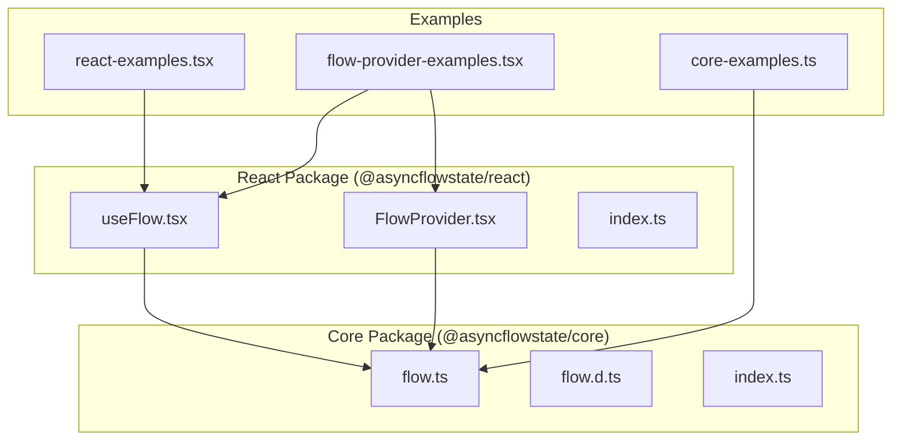
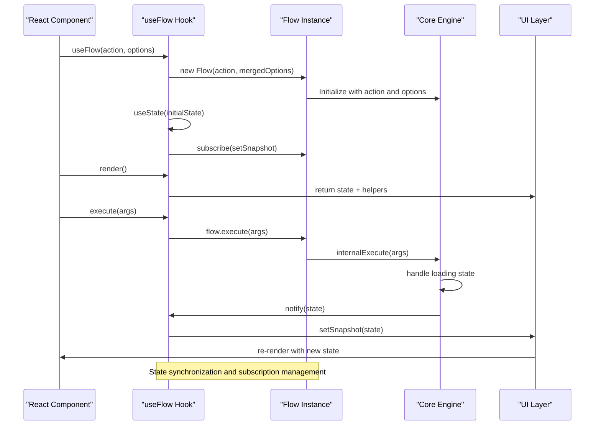
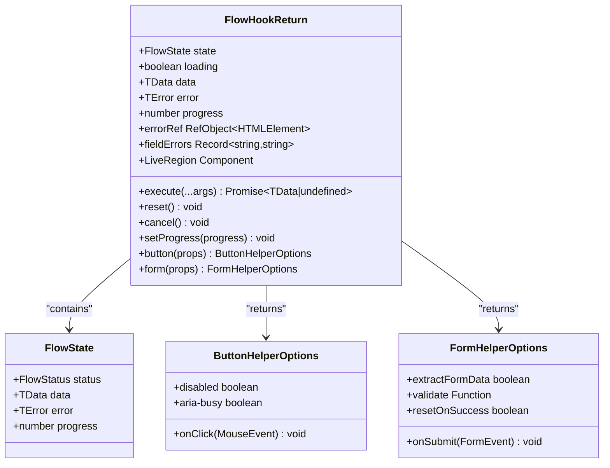

# useFlow Hook API

<cite>
**Referenced Files in This Document**
- [useFlow.tsx](file://packages/react/src/useFlow.tsx)
- [FlowProvider.tsx](file://packages/react/src/FlowProvider.tsx)
- [flow.ts](file://packages/core/src/flow.ts)
- [flow.d.ts](file://packages/core/src/flow.d.ts)
- [index.ts](file://packages/react/src/index.ts)
- [index.ts](file://packages/core/src/index.ts)
- [useFlow.test.tsx](file://packages/react/src/useFlow.test.tsx)
- [react-examples.tsx](file://examples/react/react-examples.tsx)
- [flow-provider-examples.tsx](file://examples/react/flow-provider-examples.tsx)
- [core-examples.ts](file://examples/basic/core-examples.ts)
- [package.json](file://packages/react/package.json)
- [package.json](file://packages/core/package.json)
</cite>

## Table of Contents
1. [Introduction](#introduction)
2. [Project Structure](#project-structure)
3. [Core Components](#core-components)
4. [Architecture Overview](#architecture-overview)
5. [Detailed Component Analysis](#detailed-component-analysis)
6. [Dependency Analysis](#dependency-analysis)
7. [Performance Considerations](#performance-considerations)
8. [Troubleshooting Guide](#troubleshooting-guide)
9. [Conclusion](#conclusion)

## Introduction

The `useFlow` React hook is a powerful abstraction for managing asynchronous actions and their UI states in React applications. It provides a comprehensive solution for handling loading states, error management, retry logic, optimistic UI updates, and user experience enhancements like accessibility announcements.

The hook orchestrates a Flow instance from the core package, synchronizing its state with React's component lifecycle while providing convenient helpers for buttons and forms. It's designed to eliminate boilerplate code for common async patterns and provide consistent behavior across your application.

## Project Structure

The useFlow API is part of a two-package architecture:



**Diagram sources**
- [useFlow.tsx](file://packages/react/src/useFlow.tsx#L1-L281)
- [FlowProvider.tsx](file://packages/react/src/FlowProvider.tsx#L1-L139)
- [flow.ts](file://packages/core/src/flow.ts#L1-L709)

**Section sources**
- [useFlow.tsx](file://packages/react/src/useFlow.tsx#L1-L281)
- [FlowProvider.tsx](file://packages/react/src/FlowProvider.tsx#L1-L139)
- [flow.ts](file://packages/core/src/flow.ts#L1-L709)

## Core Components

### useFlow Hook Signature

The `useFlow` hook follows this signature pattern:

```typescript
function useFlow<TData = any, TError = any, TArgs extends any[] = any[]>(
  action: FlowAction<TData, TArgs>,
  options: ReactFlowOptions<TData, TError> = {}
): FlowHookReturn<TData, TError>
```

Where:
- `TData`: Generic type for successful action return data
- `TError`: Generic type for error objects
- `TArgs`: Tuple type for action arguments
- `action`: Asynchronous function to manage
- `options`: React-specific configuration options

### ReactFlowOptions Interface

The React-specific options extend the core FlowOptions with accessibility features:

```typescript
interface ReactFlowOptions<TData = any, TError = any> extends FlowOptions<TData, TError> {
  a11y?: A11yOptions<TData, TError>;
}
```

Key accessibility features include automatic screen reader announcements and live region management.

**Section sources**
- [useFlow.tsx](file://packages/react/src/useFlow.tsx#L77-L80)
- [useFlow.tsx](file://packages/react/src/useFlow.tsx#L58-L67)

## Architecture Overview

The useFlow hook implements a sophisticated state management architecture that bridges the gap between the core Flow engine and React's component lifecycle:



**Diagram sources**
- [useFlow.tsx](file://packages/react/src/useFlow.tsx#L97-L103)
- [useFlow.tsx](file://packages/react/src/useFlow.tsx#L251-L253)
- [flow.ts](file://packages/core/src/flow.ts#L425-L473)

The architecture ensures that:
1. Flow instances are created once per hook invocation
2. React state stays synchronized with Flow state snapshots
3. Subscription management prevents memory leaks
4. Accessibility features are automatically handled

**Section sources**
- [useFlow.tsx](file://packages/react/src/useFlow.tsx#L96-L115)
- [flow.ts](file://packages/core/src/flow.ts#L325-L332)

## Detailed Component Analysis

### Hook Parameters

#### Action Function (`FlowAction<TData, TArgs>`)

The action function is the core asynchronous operation managed by the hook:

```typescript
type FlowAction<TData, TArgs extends any[]> = (...args: TArgs) => Promise<TData>;
```

Key characteristics:
- Must be a pure async function returning a Promise
- Arguments are strongly typed via the `TArgs` generic
- Can throw errors to trigger error state
- Supports any number of arguments through tuple typing

#### ReactFlowOptions Interface

The options interface extends core FlowOptions with React-specific features:

```typescript
interface ReactFlowOptions<TData = any, TError = any> extends FlowOptions<TData, TError> {
  a11y?: A11yOptions<TData, TError>;
}
```

Accessibility options include:
- Automatic success/error announcements for screen readers
- Configurable live region behavior (polite vs assertive)
- Dynamic message generation based on data or error

**Section sources**
- [useFlow.tsx](file://packages/react/src/useFlow.tsx#L77-L80)
- [useFlow.tsx](file://packages/react/src/useFlow.tsx#L58-L67)

### Return Value Structure

The useFlow hook returns a comprehensive object with state properties, helper methods, and convenience utilities:



**Diagram sources**
- [useFlow.tsx](file://packages/react/src/useFlow.tsx#L255-L279)
- [useFlow.tsx](file://packages/react/src/useFlow.tsx#L15-L36)
- [useFlow.tsx](file://packages/react/src/useFlow.tsx#L41-L44)

#### State Properties

The hook provides both individual state properties and a complete state snapshot:

- `status`: Current flow status (idle, loading, success, error)
- `data`: Last successful result or null
- `error`: Last error object or null
- `progress`: Current progress percentage (0-100)
- `loading`: Boolean indicating if flow is loading (respecting loading.delay)

#### Helper Methods

- `execute(...args)`: Manually triggers the action with provided arguments
- `reset()`: Resets flow state to idle
- `cancel()`: Cancels current execution and resets state
- `setProgress(progress)`: Manually sets progress during loading

#### Convenience Helpers

- `button(props)`: Returns button props with automatic loading state management
- `form(props)`: Returns form props with validation and FormData extraction
- `LiveRegion`: Component for automatic screen reader announcements

#### Additional Utilities

- `errorRef`: React ref for auto-focusing error elements
- `fieldErrors`: Form validation error tracking
- `LiveRegion`: Accessible announcement component

**Section sources**
- [useFlow.tsx](file://packages/react/src/useFlow.tsx#L255-L279)

### Generic Type Parameters

The hook supports three generic type parameters for strong typing:

```typescript
function useFlow<TData = any, TError = any, TArgs extends any[] = any[]>(
  action: FlowAction<TData, TArgs>,
  options: ReactFlowOptions<TData, TError>
)
```

Practical examples:

1. **Typed API Calls**: `useFlow<User, Error, [string]>` for fetching users by ID
2. **Form Submissions**: `useFlow<Response, ValidationError, [{username: string}]>`
3. **Multiple Arguments**: `useFlow<Result, Error, [number, string, boolean]>`

The `TArgs` parameter enables compile-time validation of argument passing to the action function.

**Section sources**
- [useFlow.tsx](file://packages/react/src/useFlow.tsx#L77-L79)

### Internal Behavior

#### Flow Instance Creation

The hook creates a Flow instance once using React's `useState` with a factory function:

```typescript
const [flow] = useState(
  () => new Flow<TData, TError, TArgs>(
    (...args: TArgs) => actionRef.current(...args),
    initialMergedOptions.current,
  )
);
```

This ensures:
- Single Flow instance per hook invocation
- Proper closure capture of the action function
- Consistent behavior across renders

#### State Synchronization

The hook maintains synchronization between Flow state and React state:

```typescript
const [snapshot, setSnapshot] = useState<FlowState<TData, TError>>(
  () => flow.state,
);

useEffect(() => {
  return flow.subscribe(setSnapshot);
}, [flow]);
```

This pattern ensures:
- Immediate UI updates when Flow state changes
- Automatic cleanup of subscriptions
- Consistent state representation

#### Subscription Management

The hook implements proper cleanup to prevent memory leaks:

```typescript
useEffect(() => {
  return flow.subscribe(setSnapshot);
}, [flow]);
```

The returned unsubscribe function is called when the component unmounts.

**Section sources**
- [useFlow.tsx](file://packages/react/src/useFlow.tsx#L97-L103)
- [useFlow.tsx](file://packages/react/src/useFlow.tsx#L105-L115)
- [useFlow.tsx](file://packages/react/src/useFlow.tsx#L251-L253)

### Button Helper

The button helper provides automatic loading state management:

```typescript
const button = useCallback(
  (props: ButtonHelperOptions = {}) => {
    const { onClick, ...rest } = props;
    return {
      disabled: flow.isLoading,
      "aria-busy": flow.isLoading,
      onClick: async (e: MouseEvent<HTMLButtonElement>) => {
        if (onClick) {
          onClick(e);
        } else {
          (flow.execute as any)();
        }
      },
      ...rest,
    };
  },
  [flow],
);
```

Features:
- Automatically disables during loading
- Sets `aria-busy` attribute for accessibility
- Supports custom click handlers
- Executes flow when no custom handler provided

**Section sources**
- [useFlow.tsx](file://packages/react/src/useFlow.tsx#L174-L194)

### Form Helper

The form helper provides comprehensive form handling:

```typescript
const form = useCallback(
  (formProps: FormHelperOptions<TArgs> & React.FormHTMLAttributes<HTMLFormElement>) => {
    const { onSubmit, extractFormData = false, validate, resetOnSuccess = false, ...rest } = formProps;
    
    return {
      "aria-busy": flow.isLoading,
      onSubmit: async (e: React.FormEvent<HTMLFormElement>) => {
        e.preventDefault();
        setFieldErrors({});
        
        let args = [] as unknown as TArgs;
        
        if (extractFormData) {
          const formData = new FormData(e.currentTarget);
          const data = Object.fromEntries(formData.entries());
          args = [data] as unknown as TArgs;
        }
        
        if (validate) {
          const errors = await validate(...args);
          if (errors && Object.keys(errors).length > 0) {
            setFieldErrors(errors);
            return;
          }
        }
        
        if (onSubmit) {
          onSubmit(e);
        } else {
          const result = await flow.execute(...args);
          if (result !== undefined && resetOnSuccess) {
            (e.currentTarget as HTMLFormElement).reset();
          }
        }
      },
      ...rest,
    };
  },
  [flow],
);
```

Key features:
- Automatic form data extraction using FormData
- Field-level validation support
- Error display management
- Optional automatic form reset on success
- Custom submit handler support

**Section sources**
- [useFlow.tsx](file://packages/react/src/useFlow.tsx#L200-L249)

### Accessibility Implementation

The hook includes comprehensive accessibility features:

```typescript
const LiveRegion = useCallback(
  () => (
    <div
      aria-live={options.a11y?.liveRegionRel || "polite"}
      aria-atomic="true"
      style={{
        position: "absolute",
        width: "1px",
        height: "1px",
        padding: "0",
        margin: "-1px",
        overflow: "hidden",
        clip: "rect(0, 0, 0, 0)",
        whiteSpace: "nowrap",
        borderWidth: "0",
      }}
    >
      {announcement}
    </div>
  ),
  [announcement, options.a11y?.liveRegionRel],
);

useEffect(() => {
  if (snapshot.status === "success" && options.a11y?.announceSuccess) {
    const msg = typeof options.a11y.announceSuccess === "function"
      ? options.a11y.announceSuccess(snapshot.data!)
      : options.a11y.announceSuccess;
    setAnnouncement(msg);
  } else if (snapshot.status === "error" && options.a11y?.announceError) {
    const msg = typeof options.a11y.announceError === "function"
      ? options.a11y.announceError(snapshot.error!)
      : options.a11y.announceError;
    setAnnouncement(msg);
  }
}, [snapshot.status, snapshot.data, snapshot.error, options.a11y]);
```

Accessibility features:
- Automatic screen reader announcements for success and error states
- Configurable live region behavior (polite vs assertive)
- Dynamic message generation based on data or error
- Auto-focus management for error elements

**Section sources**
- [useFlow.tsx](file://packages/react/src/useFlow.tsx#L147-L168)
- [useFlow.tsx](file://packages/react/src/useFlow.tsx#L127-L141)
- [useFlow.tsx](file://packages/react/src/useFlow.tsx#L117-L124)

## Dependency Analysis

The useFlow hook has a clean dependency structure with clear separation of concerns:

```mermaid
graph TB
subgraph "External Dependencies"
REACT[React]
CORE[@asyncflowstate/core]
end
subgraph "Internal Dependencies"
FLOW[Flow Class]
PROVIDER[FlowProvider]
CONTEXT[useFlowContext]
MERGE[mergeFlowOptions]
end
subgraph "useFlow Hook"
HOOK[useFlow Hook]
STATE[React State]
EFFECTS[React Effects]
HELPERS[Helper Functions]
end
HOOK --> REACT
HOOK --> CORE
HOOK --> PROVIDER
HOOK --> CONTEXT
HOOK --> MERGE
HOOK --> STATE
HOOK --> EFFECTS
HOOK --> HELPERS
HELPERS --> FLOW
```

**Diagram sources**
- [useFlow.tsx](file://packages/react/src/useFlow.tsx#L1-L10)
- [FlowProvider.tsx](file://packages/react/src/FlowProvider.tsx#L1-L66)

The dependency analysis reveals:
- **Low coupling**: Minimal external dependencies
- **Clear boundaries**: React-specific code separated from core logic
- **Type safety**: Full TypeScript integration maintained
- **Extensibility**: Easy to extend with additional helpers

**Section sources**
- [useFlow.tsx](file://packages/react/src/useFlow.tsx#L1-L10)
- [FlowProvider.tsx](file://packages/react/src/FlowProvider.tsx#L1-L66)

## Performance Considerations

### Memoization Strategy

The hook implements several memoization techniques to optimize performance:

1. **Action and Options Persistence**: Uses `useRef` to persist action and options across renders
2. **Callback Memoization**: Wraps helper functions with `useCallback` to prevent unnecessary re-renders
3. **State Object Memoization**: Returns a single object with memoized properties
4. **Subscription Cleanup**: Ensures proper cleanup to prevent memory leaks

### Performance Optimizations

```typescript
// Persist action and options to avoid recreating effects
const actionRef = useRef(action);
const optionsRef = useRef<ReactFlowOptions<TData, TError>>(options);

useEffect(() => {
  actionRef.current = action;
  optionsRef.current = options;
}, [action, options]);

// Memoize helper functions
const button = useCallback(/* implementation */, [flow]);
const form = useCallback(/* implementation */, [flow]);
const LiveRegion = useCallback(/* implementation */, [announcement, options.a11y?.liveRegionRel]);
```

### Best Practices for Performance

1. **Stable Option Objects**: Keep option objects stable across renders when possible
2. **Avoid Inline Function Definitions**: Define action and option objects outside component scope
3. **Use Callback Memoization**: Leverage the built-in memoization for helper functions
4. **Consider Provider Configuration**: Use FlowProvider for global configuration to reduce prop drilling

**Section sources**
- [useFlow.tsx](file://packages/react/src/useFlow.tsx#L84-L91)
- [useFlow.tsx](file://packages/react/src/useFlow.tsx#L174-L194)
- [useFlow.tsx](file://packages/react/src/useFlow.tsx#L200-L249)
- [useFlow.tsx](file://packages/react/src/useFlow.tsx#L147-L168)

## Troubleshooting Guide

### Common Issues and Solutions

#### Issue: Flow Not Updating State
**Symptoms**: UI not reflecting loading or success states
**Solution**: Ensure proper subscription management and check that the component is re-rendering when state changes

#### Issue: Memory Leaks with Long-lived Components
**Symptoms**: Performance degradation over time
**Solution**: Verify that the component properly cleans up subscriptions and that Flow instances are not being recreated unnecessarily

#### Issue: Button Helper Not Working
**Symptoms**: Buttons not disabling during loading
**Solution**: Check that the button helper is being called correctly and that the flow instance is properly initialized

#### Issue: Form Validation Not Working
**Symptoms**: Validation errors not displayed or action still executing despite validation failures
**Solution**: Ensure the validate function returns proper error objects and that the form helper is configured correctly

### Debugging Tips

1. **Enable Logging**: Use Flow's subscribe method to log state changes
2. **Check Dependencies**: Verify that action and options are stable across renders
3. **Inspect DOM**: Use browser dev tools to check for proper aria attributes
4. **Test Edge Cases**: Verify behavior with rapid successive calls and cancellation

**Section sources**
- [useFlow.test.tsx](file://packages/react/src/useFlow.test.tsx#L14-L46)
- [useFlow.test.tsx](file://packages/react/src/useFlow.test.tsx#L48-L66)
- [useFlow.test.tsx](file://packages/react/src/useFlow.test.tsx#L68-L96)

## Conclusion

The useFlow React hook provides a comprehensive solution for managing asynchronous actions in React applications. Its architecture balances simplicity with powerful features, offering:

- **Type Safety**: Full TypeScript integration with generic type parameters
- **Accessibility**: Built-in screen reader support and ARIA compliance
- **Flexibility**: Extensive configuration options for various use cases
- **Performance**: Optimized with memoization and efficient state management
- **Developer Experience**: Intuitive API with helpful helper functions

The hook successfully abstracts away the complexity of async state management while maintaining full control over behavior through its extensive configuration options. It serves as an excellent foundation for building robust, accessible React applications that handle asynchronous operations gracefully.